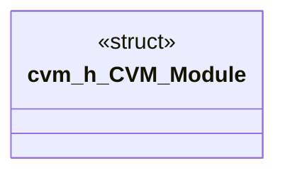

# Polyglot Codebase Knowledge Graph

> Generated offline by **readmenator**. Supports C, C++, Python, Go, Rust, JS/TS, Java, C#, Shell, PHP, Dart, GDScript, Nim, ASM, Ruby, Swift, Kotlin, Scala, Lua, Elixir.
> No LLMs. No tokens. Pure static analysis. See more [here](https://github.com/grisuno/ReadMenator)

**Total Files Parsed:** 18 | **Total Symbols Extracted:** 244 | **Total Imports:** 62

<!-- ranking_model: v1.0 | weights: {ppr:0.45,auth:0.2,test:0.15,doc:0.1,fresh:0.1} | alpha:0.85 | commit:75d209c | date:2026-07-18 -->


## Table of Contents

1. [Statistics Dashboard](#statistics-dashboard)
2. [Architectural Layers](#architectural-layers)
3. [Ranked Context](#ranked-context)
4. [God Nodes](#god-nodes)
5. [Community Analysis](#community-analysis)
6. [Suggested Questions](#suggested-questions)
7. [Hotspot Analysis](#hotspot-analysis)
8. [Change Impact Analysis](#change-impact-analysis)
9. [Suggested Linting Rules](#suggested-linting-rules)
10. [Orphans](#orphans)
11. [Query Recipes](#query-recipes)
12. [Structural Knowledge Map](#structural-knowledge-map)
13. [UML Class Diagram](#uml-class-diagram)
14. [Code Property Graph](#code-property-graph)
15. [Architecture Reference](#architecture-reference)
    - [C (10 files)](#c-10-files)
    - [H (5 files)](#h-5-files)
    - [SH (3 files)](#sh-3-files)

---

## Statistics Dashboard

| Metric | Value |
|--------|-------|
| Total Files | 18 |
| Total Symbols | 244 |
| Total Imports | 62 |
| Call Edges | 0 |
| Inheritance Edges | 0 |
| Languages | 3 |
| Avg Symbols/File | 13.6 |
| Avg Imports/File | 3.4 |

### Top Files by Import Count (Fan-Out)

| File | Imports | Symbols | Language |
|------|---------|---------|----------|
| `cvm.h` | 8 | 9 | h |
| `cvm_dbg_main.c` | 8 | 21 | c |
| `cvm.h` | 6 | 27 | h |
| `cvm.c` | 5 | 103 | c |
| `cvm_val_main.c` | 5 | 21 | c |
| `cvm_dis_main.c` | 4 | 2 | c |
| `gen_fib_cvm.c` | 4 | 10 | c |
| `gen_fib_cvm.c` | 4 | 2 | c |
| `cvm.c` | 3 | 20 | c |
| `cvm_dis.c` | 3 | 9 | c |

### Top Files by Imported-By Count (Fan-In)

| File | Imported By | Symbols | Language |
|------|-------------|---------|----------|
| `cvm.h` | 7 | 9 | h |

---

## Architectural Layers

Auto-detected from path patterns, naming conventions, and imported frameworks.

| Layer | Files |
|-------|-------|
| utility | 11 |
| infrastructure | 3 |
| presentation | 2 |
| testing | 2 |

### utility

- `cvm.c` (c, 20 symbols)
- `cvm.h` (h, 9 symbols)
- `cvm.c` (c, 103 symbols)
- `cvm.h` (h, 27 symbols)
- `cvm_dbg_main.c` (c, 21 symbols)
- `cvm_ops.c` (c, 7 symbols)
- `cvm_ops.h` (h, 1 symbols)
- `cvm_val_main.c` (c, 21 symbols)
- `deepseek_bash_20260808_653f26.sh` (sh, 0 symbols)
- `gen_fib_cvm.c` (c, 10 symbols)
- `gen_fib_cvm.c` (c, 2 symbols)

### infrastructure

- `cvm_dis.c` (c, 9 symbols)
- `cvm_dis.h` (h, 1 symbols)
- `cvm_dis_main.c` (c, 2 symbols)

### presentation

- `cvm_view.c` (c, 8 symbols)
- `cvm_view.h` (h, 1 symbols)

### testing

- `test.sh` (sh, 2 symbols)
- `test.sh` (sh, 0 symbols)

---

## Ranked Context

Files ranked by composite score for the current query context. The ranking combines Personalized PageRank (query relevance), global authority, test coverage, documentation coverage, and code freshness. Model: v1.0.

| Rank | File | Composite | PPR | Authority | Test | Doc |
|------|------|-----------|-----|-----------|------|-----|
| 1 | `cvm.h` | 0.3238 | 0.4982 | 0.4982 | 0.00 | 0.00 |
| 2 | `cvm.c` | 0.0966 | 0.0717 | 0.0717 | 0.00 | 0.50 |
| 3 | `cvm_ops.c` | 0.0609 | 0.0717 | 0.0717 | 0.00 | 0.14 |
| 4 | `cvm.c` | 0.0544 | 0.0717 | 0.0717 | 0.00 | 0.08 |
| 5 | `cvm_dis_main.c` | 0.0500 | 0.0000 | 0.0000 | 0.00 | 0.50 |
| 6 | `test.sh` | 0.0500 | 0.0000 | 0.0000 | 0.00 | 0.50 |
| 7 | `cvm_dbg_main.c` | 0.0466 | 0.0717 | 0.0717 | 0.00 | 0.00 |
| 8 | `cvm_view.h` | 0.0466 | 0.0717 | 0.0717 | 0.00 | 0.00 |
| 9 | `gen_fib_cvm.c` | 0.0466 | 0.0717 | 0.0717 | 0.00 | 0.00 |
| 10 | `gen_fib_cvm.c` | 0.0466 | 0.0717 | 0.0717 | 0.00 | 0.00 |

---

## God Nodes

Most architecturally central files ranked by combined import/export degree and symbol richness.

| File | Score | Connections | PageRank |
|------|-------|-------------|----------|
| `cvm.h` | 14.9 | | 0.4982 |
| `cvm.c` | 12.3 | | 0.0717 |
| `cvm_dbg_main.c` | 4.1 | | 0.0717 |
| `cvm.c` | 4.0 | | 0.0717 |
| `gen_fib_cvm.c` | 3.0 | | 0.0717 |
| `cvm.h` | 2.7 | | 0.0000 |
| `cvm_ops.c` | 2.7 | | 0.0717 |
| `gen_fib_cvm.c` | 2.2 | | 0.0717 |
| `cvm_val_main.c` | 2.1 | | 0.0000 |
| `cvm_view.h` | 2.1 | | 0.0717 |

---

## Community Analysis

Files grouped by import-based community detection. Cohesion measures how tightly connected each community is internally.

### cvm2 (Cohesion: 1.00)

**8 files** in this community:

- `cvm.c` (c, 20 symbols)
- `cvm.h` (h, 9 symbols)
- `cvm.c` (c, 103 symbols)
- `cvm_dbg_main.c` (c, 21 symbols)
- `cvm_ops.c` (c, 7 symbols)
- `cvm_view.h` (h, 1 symbols)
- `gen_fib_cvm.c` (c, 10 symbols)
- `gen_fib_cvm.c` (c, 2 symbols)

---

## Suggested Questions

Auto-generated exploration prompts based on graph structure:

- What does cvm.h depend on, and what depends on it? (7 connections)
- What does cvm.c depend on, and what depends on it? (1 connections)
- What does cvm_dbg_main.c depend on, and what depends on it? (1 connections)
- How are the 8 files in 'cvm2' related to each other?
- What is CVM_Module in cvm.h and how is it used?

---

## Hotspot Analysis

Files ranked by combined complexity (symbol count) and centrality (connection count). High-scoring files are architecturally critical and may need refactoring attention.

| File | Complexity | Centrality | Combined | Symbols | Connections |
|------|-----------|------------|----------|---------|-------------|
| `cvm.h` | 0.087 | 1.000 | 0.635 | 9 | 15 |
| `cvm.c` | 0.194 | 0.200 | 0.198 | 20 | 3 |
| `cvm_ops.c` | 0.068 | 0.133 | 0.107 | 7 | 2 |
| `cvm.c` | 1.000 | 0.333 | 0.600 | 103 | 5 |
| `cvm_dis_main.c` | 0.019 | 0.267 | 0.168 | 2 | 4 |
| `test.sh` | 0.019 | 0.000 | 0.008 | 2 | 0 |
| `cvm_dbg_main.c` | 0.204 | 0.533 | 0.402 | 21 | 8 |
| `cvm_view.h` | 0.010 | 0.200 | 0.124 | 1 | 3 |
| `gen_fib_cvm.c` | 0.097 | 0.267 | 0.199 | 10 | 4 |
| `gen_fib_cvm.c` | 0.019 | 0.267 | 0.168 | 2 | 4 |
| `cvm.h` | 0.262 | 0.400 | 0.345 | 27 | 6 |
| `cvm_val_main.c` | 0.204 | 0.333 | 0.282 | 21 | 5 |
| `cvm_dis.c` | 0.087 | 0.200 | 0.155 | 9 | 3 |
| `cvm_dis.h` | 0.010 | 0.200 | 0.124 | 1 | 3 |
| `cvm_view.c` | 0.078 | 0.133 | 0.111 | 8 | 2 |

---

## Change Impact Analysis

Files sorted by how many other files would be affected if they changed. High-impact files should be changed with caution.

| File | Direct Dependents | Transitive Dependents | Total Impact |
|------|------------------|----------------------|--------------|
| `cvm.c` | 0 | 0 | 0 |
| `cvm.h` | 0 | 0 | 0 |
| `cvm.c` | 0 | 0 | 0 |
| `cvm.h` | 0 | 0 | 0 |
| `cvm_dbg_main.c` | 0 | 0 | 0 |
| `cvm_dis.c` | 0 | 0 | 0 |
| `cvm_dis.h` | 0 | 0 | 0 |
| `cvm_dis_main.c` | 0 | 0 | 0 |
| `cvm_ops.c` | 0 | 0 | 0 |
| `cvm_ops.h` | 0 | 0 | 0 |
| `cvm_val_main.c` | 0 | 0 | 0 |
| `cvm_view.c` | 0 | 0 | 0 |
| `cvm_view.h` | 0 | 0 | 0 |
| `deepseek_bash_20260808_653f26.sh` | 0 | 0 | 0 |
| `gen_fib_cvm.c` | 0 | 0 | 0 |

---

## Suggested Linting Rules

Automatically suggested linting and security rules based on patterns detected in the codebase. These can be exported as Semgrep rules using the `--export-rules` flag.

| Rule ID | Severity | Description | Language | Matches |
|---------|----------|-------------|----------|---------|
| `RM001` | info | Large number of functions in c: 175 total | c | 175 |

---

## Orphans

Files with no documentation or low connectivity. These are candidates for documentation investment or cleanup.

- `cvm.h` (9 symbols, no doc)
- `cvm_dbg_main.c` (21 symbols, no doc)
- `cvm_view.h` (1 symbols, no doc)
- `gen_fib_cvm.c` (10 symbols, no doc)
- `gen_fib_cvm.c` (2 symbols, no doc)
- `cvm.h` (27 symbols, no doc)
- `cvm_dis.h` (1 symbols, no doc)
- `cvm_ops.h` (1 symbols, no doc)
- `deepseek_bash_20260808_653f26.sh` (0 symbols, no doc)
- `test.sh` (0 symbols, no doc)

---

## Query Recipes

Example queries you can run against this knowledge base using the ranking engine:

```
# Find files most relevant to a concept
readmenator query "Where is the import resolver implemented?"

# Rank files by relevance to a topic
readmenator query "How does documentation generation work?"

# Explain why a file ranks highly
readmenator query "explain readmenator/_documentation.py"

# Trace dependency paths with ranked context
readmenator query "path from CLI to exporter"
```

The ranking model uses the following signals:

- **Personalized PageRank** (45% weight): query-specific relevance via seed propagation
- **Global Authority** (20% weight): structural importance via standard PageRank
- **Test Coverage** (15% weight): fraction of symbols referenced in test files
- **Doc Coverage** (10% weight): presence of docstrings and file-level docs
- **Freshness** (10% weight): recent modification activity

Results include score decomposition and justification paths for each ranked item.

---

## Structural Knowledge Map

```mermaid
graph TD
    classDef mod fill:#1e1e1e,stroke:#ff6666,stroke-width:2px,color:#fff;
    classDef cls fill:#2d2d2d,stroke:#4ec9b0,stroke-width:2px,color:#fff;
    classDef fn fill:#333,stroke:#dcdcaa,stroke-width:1px,color:#dcdcaa;
    classDef ext fill:#111,stroke:#666,stroke-dasharray:5 5,color:#aaa;
    subgraph community_0 ["cvm2"]
    cvm2_cvm_dbg_main_c["cvm_dbg_main.c (c)"]
    class cvm2_cvm_dbg_main_c mod;
    cvm2_cvm_dbg_main_c_emit_stdout["emit_stdout"]
    class cvm2_cvm_dbg_main_c_emit_stdout fn;
    cvm2_cvm_dbg_main_c --> cvm2_cvm_dbg_main_c_emit_stdout
    cvm2_cvm_dbg_main_c_func_display["func_display"]
    class cvm2_cvm_dbg_main_c_func_display fn;
    cvm2_cvm_dbg_main_c --> cvm2_cvm_dbg_main_c_func_display
    cvm2_cvm_dbg_main_c_func_of_ip["func_of_ip"]
    class cvm2_cvm_dbg_main_c_func_of_ip fn;
    cvm2_cvm_dbg_main_c --> cvm2_cvm_dbg_main_c_func_of_ip
    cvm2_cvm_dbg_main_c_parse_u32["parse_u32"]
    class cvm2_cvm_dbg_main_c_parse_u32 fn;
    cvm2_cvm_dbg_main_c --> cvm2_cvm_dbg_main_c_parse_u32
    cvm2_cvm_dbg_main_c_report_run["report_run"]
    class cvm2_cvm_dbg_main_c_report_run fn;
    cvm2_cvm_dbg_main_c --> cvm2_cvm_dbg_main_c_report_run
    cvm_h["cvm.h (h)"]
    class cvm_h mod;
    cvm2_cvm_h["cvm.h (h)"]
    class cvm2_cvm_h mod;
    cvm2_cvm_c["cvm.c (c)"]
    class cvm2_cvm_c mod;
    cvm2_cvm_val_main_c["cvm_val_main.c (c)"]
    class cvm2_cvm_val_main_c mod;
    cvm2_gen_fib_cvm_c["gen_fib_cvm.c (c)"]
    class cvm2_gen_fib_cvm_c mod;
    cvm2_cvm_dis_main_c["cvm_dis_main.c (c)"]
    class cvm2_cvm_dis_main_c mod;
    gen_fib_cvm_c["gen_fib_cvm.c (c)"]
    class gen_fib_cvm_c mod;
    cvm_c["cvm.c (c)"]
    class cvm_c mod;
    cvm2_cvm_dis_c["cvm_dis.c (c)"]
    class cvm2_cvm_dis_c mod;
    cvm2_cvm_dis_h["cvm_dis.h (h)"]
    class cvm2_cvm_dis_h mod;
    cvm2_cvm_view_h["cvm_view.h (h)"]
    class cvm2_cvm_view_h mod;
    cvm2_cvm_view_c["cvm_view.c (c)"]
    class cvm2_cvm_view_c mod;
    cvm2_cvm_ops_c["cvm_ops.c (c)"]
    class cvm2_cvm_ops_c mod;
    cvm2_cvm_ops_h["cvm_ops.h (h)"]
    class cvm2_cvm_ops_h mod;
    cvm2_test_sh["test.sh (sh)"]
    class cvm2_test_sh mod;
    cvm2_deepseek_bash_20260808_653f26_sh["deepseek_bash_20260808_653f26.sh (sh)"]
    class cvm2_deepseek_bash_20260808_653f26_sh mod;
    test_sh["test.sh (sh)"]
    class test_sh mod;
    end
    ext_cvm_h["cvm.h"]
    class ext_cvm_h ext;
    cvm_c -.->|imports| ext_cvm_h
    ext_stdarg_h["stdarg.h"]
    class ext_stdarg_h ext;
    cvm_c -.->|imports| ext_stdarg_h
    ext_errno_h["errno.h"]
    class ext_errno_h ext;
    cvm_c -.->|imports| ext_errno_h
    ext_stdint_h["stdint.h"]
    class ext_stdint_h ext;
    cvm_h -.->|imports| ext_stdint_h
    ext_stddef_h["stddef.h"]
    class ext_stddef_h ext;
    cvm_h -.->|imports| ext_stddef_h
    ext_stdio_h["stdio.h"]
    class ext_stdio_h ext;
    cvm_h -.->|imports| ext_stdio_h
    ext_stdlib_h["stdlib.h"]
    class ext_stdlib_h ext;
    cvm_h -.->|imports| ext_stdlib_h
    ext_string_h["string.h"]
    class ext_string_h ext;
    cvm_h -.->|imports| ext_string_h
    ext_dlfcn_h["dlfcn.h"]
    class ext_dlfcn_h ext;
    cvm_h -.->|imports| ext_dlfcn_h
    ext_unistd_h["unistd.h"]
    class ext_unistd_h ext;
    cvm_h -.->|imports| ext_unistd_h
    ext_sys_mman_h["mman.h"]
    class ext_sys_mman_h ext;
    cvm_h -.->|imports| ext_sys_mman_h
    cvm2_cvm_c -.->|imports| ext_cvm_h
    cvm2_cvm_c -.->|imports| ext_stdio_h
    cvm2_cvm_c -.->|imports| ext_stdlib_h
    cvm2_cvm_c -.->|imports| ext_string_h
    cvm2_cvm_c -.->|imports| ext_unistd_h
    cvm2_cvm_h -.->|imports| ext_stdint_h
    cvm2_cvm_h -.->|imports| ext_stddef_h
    cvm2_cvm_h -.->|imports| ext_stdio_h
    cvm2_cvm_h -.->|imports| ext_stdlib_h
    cvm2_cvm_h -.->|imports| ext_string_h
    cvm2_cvm_h -.->|imports| ext_unistd_h
    cvm2_cvm_dbg_main_c -.->|imports| ext_cvm_h
    ext_cvm_view_h["cvm_view.h"]
    class ext_cvm_view_h ext;
    cvm2_cvm_dbg_main_c -.->|imports| ext_cvm_view_h
    ext_cvm_dis_h["cvm_dis.h"]
    class ext_cvm_dis_h ext;
    cvm2_cvm_dbg_main_c -.->|imports| ext_cvm_dis_h
    ext_cvm_ops_h["cvm_ops.h"]
    class ext_cvm_ops_h ext;
    cvm2_cvm_dbg_main_c -.->|imports| ext_cvm_ops_h
    cvm2_cvm_dbg_main_c -.->|imports| ext_stdio_h
    cvm2_cvm_dbg_main_c -.->|imports| ext_stdlib_h
    cvm2_cvm_dbg_main_c -.->|imports| ext_string_h
    cvm2_cvm_dbg_main_c -.->|imports| ext_unistd_h
    cvm2_cvm_dis_c -.->|imports| ext_cvm_dis_h
    cvm2_cvm_dis_c -.->|imports| ext_cvm_ops_h
    cvm2_cvm_dis_c -.->|imports| ext_string_h
    cvm2_cvm_dis_h -.->|imports| ext_stddef_h
    cvm2_cvm_dis_h -.->|imports| ext_stdint_h
    cvm2_cvm_dis_h -.->|imports| ext_cvm_view_h
    cvm2_cvm_dis_main_c -.->|imports| ext_cvm_view_h
    cvm2_cvm_dis_main_c -.->|imports| ext_cvm_dis_h
    cvm2_cvm_dis_main_c -.->|imports| ext_stdio_h
    cvm2_cvm_dis_main_c -.->|imports| ext_stdlib_h
    cvm2_cvm_ops_c -.->|imports| ext_cvm_ops_h
    cvm2_cvm_ops_c -.->|imports| ext_cvm_h
    cvm2_cvm_ops_h -.->|imports| ext_stdint_h
    cvm2_cvm_ops_h -.->|imports| ext_stddef_h
    cvm2_cvm_val_main_c -.->|imports| ext_cvm_view_h
    cvm2_cvm_val_main_c -.->|imports| ext_cvm_ops_h
    cvm2_cvm_val_main_c -.->|imports| ext_stdio_h
    cvm2_cvm_val_main_c -.->|imports| ext_stdlib_h
    cvm2_cvm_val_main_c -.->|imports| ext_string_h
    cvm2_cvm_view_c -.->|imports| ext_cvm_view_h
    cvm2_cvm_view_c -.->|imports| ext_string_h
    cvm2_cvm_view_h -.->|imports| ext_stdint_h
    cvm2_cvm_view_h -.->|imports| ext_stddef_h
    cvm2_cvm_view_h -.->|imports| ext_cvm_h
    cvm2_gen_fib_cvm_c -.->|imports| ext_cvm_h
    cvm2_gen_fib_cvm_c -.->|imports| ext_stdio_h
    cvm2_gen_fib_cvm_c -.->|imports| ext_stdlib_h
    cvm2_gen_fib_cvm_c -.->|imports| ext_string_h
    gen_fib_cvm_c -.->|imports| ext_cvm_h
    gen_fib_cvm_c -.->|imports| ext_stdio_h
    gen_fib_cvm_c -.->|imports| ext_stdlib_h
    gen_fib_cvm_c -.->|imports| ext_string_h
```



---

## UML Class Diagram

Auto-generated Mermaid class diagram from parsed class-level symbols. Shows classes, structs, interfaces, traits, and their methods with inheritance and dependency relationships.



---

## Code Property Graph

Machine-readable Code Property Graph (CPG) in JSON-LD format. This block allows AI agents to parse the full structural graph without additional file reads. Compatible with GraphRAG pipelines.

```json
{"@context": "https://schema.org", "analysis": {"communities": [{"cohesion": 1.0, "id": 0, "label": "cvm2", "size": 8}], "god_nodes": [{"node_id": "cvm.h", "score": 14.9}, {"node_id": "cvm2/cvm.c", "score": 12.3}, {"node_id": "cvm2/cvm_dbg_main.c", "score": 4.1}, {"node_id": "cvm.c", "score": 4.0}, {"node_id": "cvm2/gen_fib_cvm.c", "score": 3.0}, {"node_id": "cvm2/cvm.h", "score": 2.7}, {"node_id": "cvm2/cvm_ops.c", "score": 2.7}, {"node_id": "gen_fib_cvm.c", "score": 2.2}, {"node_id": "cvm2/cvm_val_main.c", "score": 2.1}, {"node_id": "cvm2/cvm_view.h", "score": 2.1}], "surprising_connections": []}, "edges": [{"confidence": "EXTRACTED", "relation": "imports", "source": "cvm.c", "target": "cvm.h"}, {"confidence": "EXTRACTED", "relation": "imports", "source": "cvm.c", "target": "stdarg.h"}, {"confidence": "EXTRACTED", "relation": "imports", "source": "cvm.c", "target": "errno.h"}, {"confidence": "EXTRACTED", "relation": "imports", "source": "cvm.h", "target": "stdint.h"}, {"confidence": "EXTRACTED", "relation": "imports", "source": "cvm.h", "target": "stddef.h"}, {"confidence": "EXTRACTED", "relation": "imports", "source": "cvm.h", "target": "stdio.h"}, {"confidence": "EXTRACTED", "relation": "imports", "source": "cvm.h", "target": "stdlib.h"}, {"confidence": "EXTRACTED", "relation": "imports", "source": "cvm.h", "target": "string.h"}, {"confidence": "EXTRACTED", "relation": "imports", "source": "cvm.h", "target": "dlfcn.h"}, {"confidence": "EXTRACTED", "relation": "imports", "source": "cvm.h", "target": "unistd.h"}, {"confidence": "EXTRACTED", "relation": "imports", "source": "cvm.h", "target": "sys/mman.h"}, {"confidence": "EXTRACTED", "relation": "imports", "source": "cvm2/cvm.c", "target": "cvm.h"}, {"confidence": "EXTRACTED", "relation": "imports", "source": "cvm2/cvm.c", "target": "stdio.h"}, {"confidence": "EXTRACTED", "relation": "imports", "source": "cvm2/cvm.c", "target": "stdlib.h"}, {"confidence": "EXTRACTED", "relation": "imports", "source": "cvm2/cvm.c", "target": "string.h"}, {"confidence": "EXTRACTED", "relation": "imports", "source": "cvm2/cvm.c", "target": "unistd.h"}, {"confidence": "EXTRACTED", "relation": "imports", "source": "cvm2/cvm.h", "target": "stdint.h"}, {"confidence": "EXTRACTED", "relation": "imports", "source": "cvm2/cvm.h", "target": "stddef.h"}, {"confidence": "EXTRACTED", "relation": "imports", "source": "cvm2/cvm.h", "target": "stdio.h"}, {"confidence": "EXTRACTED", "relation": "imports", "source": "cvm2/cvm.h", "target": "stdlib.h"}, {"confidence": "EXTRACTED", "relation": "imports", "source": "cvm2/cvm.h", "target": "string.h"}, {"confidence": "EXTRACTED", "relation": "imports", "source": "cvm2/cvm.h", "target": "unistd.h"}, {"confidence": "EXTRACTED", "relation": "imports", "source": "cvm2/cvm_dbg_main.c", "target": "cvm.h"}, {"confidence": "EXTRACTED", "relation": "imports", "source": "cvm2/cvm_dbg_main.c", "target": "cvm_view.h"}, {"confidence": "EXTRACTED", "relation": "imports", "source": "cvm2/cvm_dbg_main.c", "target": "cvm_dis.h"}, {"confidence": "EXTRACTED", "relation": "imports", "source": "cvm2/cvm_dbg_main.c", "target": "cvm_ops.h"}, {"confidence": "EXTRACTED", "relation": "imports", "source": "cvm2/cvm_dbg_main.c", "target": "stdio.h"}, {"confidence": "EXTRACTED", "relation": "imports", "source": "cvm2/cvm_dbg_main.c", "target": "stdlib.h"}, {"confidence": "EXTRACTED", "relation": "imports", "source": "cvm2/cvm_dbg_main.c", "target": "string.h"}, {"confidence": "EXTRACTED", "relation": "imports", "source": "cvm2/cvm_dbg_main.c", "target": "unistd.h"}, {"confidence": "EXTRACTED", "relation": "imports", "source": "cvm2/cvm_dis.c", "target": "cvm_dis.h"}, {"confidence": "EXTRACTED", "relation": "imports", "source": "cvm2/cvm_dis.c", "target": "cvm_ops.h"}, {"confidence": "EXTRACTED", "relation": "imports", "source": "cvm2/cvm_dis.c", "target": "string.h"}, {"confidence": "EXTRACTED", "relation": "imports", "source": "cvm2/cvm_dis.h", "target": "stddef.h"}, {"confidence": "EXTRACTED", "relation": "imports", "source": "cvm2/cvm_dis.h", "target": "stdint.h"}, {"confidence": "EXTRACTED", "relation": "imports", "source": "cvm2/cvm_dis.h", "target": "cvm_view.h"}, {"confidence": "EXTRACTED", "relation": "imports", "source": "cvm2/cvm_dis_main.c", "target": "cvm_view.h"}, {"confidence": "EXTRACTED", "relation": "imports", "source": "cvm2/cvm_dis_main.c", "target": "cvm_dis.h"}, {"confidence": "EXTRACTED", "relation": "imports", "source": "cvm2/cvm_dis_main.c", "target": "stdio.h"}, {"confidence": "EXTRACTED", "relation": "imports", "source": "cvm2/cvm_dis_main.c", "target": "stdlib.h"}, {"confidence": "EXTRACTED", "relation": "imports", "source": "cvm2/cvm_ops.c", "target": "cvm_ops.h"}, {"confidence": "EXTRACTED", "relation": "imports", "source": "cvm2/cvm_ops.c", "target": "cvm.h"}, {"confidence": "EXTRACTED", "relation": "imports", "source": "cvm2/cvm_ops.h", "target": "stdint.h"}, {"confidence": "EXTRACTED", "relation": "imports", "source": "cvm2/cvm_ops.h", "target": "stddef.h"}, {"confidence": "EXTRACTED", "relation": "imports", "source": "cvm2/cvm_val_main.c", "target": "cvm_view.h"}, {"confidence": "EXTRACTED", "relation": "imports", "source": "cvm2/cvm_val_main.c", "target": "cvm_ops.h"}, {"confidence": "EXTRACTED", "relation": "imports", "source": "cvm2/cvm_val_main.c", "target": "stdio.h"}, {"confidence": "EXTRACTED", "relation": "imports", "source": "cvm2/cvm_val_main.c", "target": "stdlib.h"}, {"confidence": "EXTRACTED", "relation": "imports", "source": "cvm2/cvm_val_main.c", "target": "string.h"}, {"confidence": "EXTRACTED", "relation": "imports", "source": "cvm2/cvm_view.c", "target": "cvm_view.h"}, {"confidence": "EXTRACTED", "relation": "imports", "source": "cvm2/cvm_view.c", "target": "string.h"}, {"confidence": "EXTRACTED", "relation": "imports", "source": "cvm2/cvm_view.h", "target": "stdint.h"}, {"confidence": "EXTRACTED", "relation": "imports", "source": "cvm2/cvm_view.h", "target": "stddef.h"}, {"confidence": "EXTRACTED", "relation": "imports", "source": "cvm2/cvm_view.h", "target": "cvm.h"}, {"confidence": "EXTRACTED", "relation": "imports", "source": "cvm2/gen_fib_cvm.c", "target": "cvm.h"}, {"confidence": "EXTRACTED", "relation": "imports", "source": "cvm2/gen_fib_cvm.c", "target": "stdio.h"}, {"confidence": "EXTRACTED", "relation": "imports", "source": "cvm2/gen_fib_cvm.c", "target": "stdlib.h"}, {"confidence": "EXTRACTED", "relation": "imports", "source": "cvm2/gen_fib_cvm.c", "target": "string.h"}, {"confidence": "EXTRACTED", "relation": "imports", "source": "gen_fib_cvm.c", "target": "cvm.h"}, {"confidence": "EXTRACTED", "relation": "imports", "source": "gen_fib_cvm.c", "target": "stdio.h"}, {"confidence": "EXTRACTED", "relation": "imports", "source": "gen_fib_cvm.c", "target": "stdlib.h"}, {"confidence": "EXTRACTED", "relation": "imports", "source": "gen_fib_cvm.c", "target": "string.h"}], "generator": "readmenator", "metadata": {"edge_count": 62, "file_count": 18, "language_count": 3, "symbol_count": 244}, "nodes": [{"id": "cvm.c", "kind": "module", "label": "cvm.c", "language": "c", "sha256": "bbb7b1cee9abacee", "symbol_count": 20, "symbols": [{"doc": "cvm.c — C Virtual Machine interpreter  #include \"cvm.h\" #include <stdarg.h> #include <errno.h> /* ------------------------------------------------------------------ /*  Debug helpers /* ------------------------------------------------------------------", "kind": "function", "line": 12, "name": "cvm_error", "signature": "static void cvm_error(CVM *vm, const char *fmt, ...)"}, {"kind": "function", "line": 21, "name": "op_name", "signature": "static const char *op_name(uint8_t op)"}, {"doc": "case OP_RET: return \"RET\"; case OP_RET_VOID: return \"RET_VOID\"; case OP_ALLOC: return \"ALLOC\"; case OP_FREE: return \"FREE\"; case OP_SYSCALL: return \"SYSCALL\"; case OP_PRINT_I64: return \"PRINT_I64\"; case OP_HALT: return \"HALT\"; default: return \"???\"; } } /* ------------------------------------------------------------------ /*  Stack helpers /* ------------------------------------------------------------------", "kind": "function", "line": 78, "name": "push", "signature": "static inline void push(CVM *vm, uint64_t v)"}, {"kind": "function", "line": 85, "name": "pop", "signature": "static inline uint64_t pop(CVM *vm)"}, {"kind": "function", "line": 93, "name": "peek", "signature": "static inline uint64_t peek(CVM *vm)"}, {"doc": "cvm_error(vm, \"operand stack underflow\"); return 0; } return vm->stack[--vm->sp]; } static inline uint64_t peek(CVM *vm) { if (vm->sp <= 0) return 0; return vm->stack[vm->sp - 1]; } /* ------------------------------------------------------------------ /*  Frame helpers /* ------------------------------------------------------------------", "kind": "function", "line": 102, "name": "push_frame", "signature": "static int push_frame(CVM *vm, CVM_Module *mod, uint16_t func_idx, int argc)"}, {"kind": "function", "line": 141, "name": "pop_frame", "signature": "static void pop_frame(CVM *vm, int has_retval)"}, {"doc": "if (has_retval) push(vm, ret); vm->running = 0; return; } /* restore previous module / code pointer if needed /* (for multi-module we would look up the previous frame's module) vm->ip = ret_ip; if (has_retval) push(vm, ret); } /* ------------------------------------------------------------------ /*  Native call (very limited – only a few for the tests) /* ------------------------------------------------------------------", "kind": "function", "line": 175, "name": "call_native", "signature": "static void call_native(CVM *vm, uint16_t idx, uint8_t argc)"}, {"doc": "(void)fd; (void)buf; (void)len; } push(vm, 0); return; } /* generic: just pop args and push 0 for (int i = 0; i < argc; i++) pop(vm); push(vm, 0); } /* ------------------------------------------------------------------ /*  Create / destroy /* ------------------------------------------------------------------", "kind": "function", "line": 227, "name": "cvm_create", "signature": "CVM *cvm_create(void)"}, {"kind": "function", "line": 243, "name": "cvm_destroy", "signature": "void cvm_destroy(CVM *vm)"}, {"doc": "free(m->natives); free(m->code); free(m->string_pool); free(m->global_mem); free(m); } free(vm->stack); free(vm->heap); free(vm); } /* ------------------------------------------------------------------ /*  Load module from memory /* ------------------------------------------------------------------", "kind": "function", "line": 267, "name": "cvm_load_module_mem", "signature": "int cvm_load_module_mem(CVM *vm, const uint8_t *data, size_t size, const char *name)"}, {"kind": "function", "line": 336, "name": "cvm_load_module", "signature": "int cvm_load_module(CVM *vm, const char *path)"}, {"doc": "if (!buf || fread(buf, 1, (size_t)sz, f) != (size_t)sz) { free(buf); fclose(f); return -1; } fclose(f); int r = cvm_load_module_mem(vm, buf, (size_t)sz, path); free(buf); return r; } /* ------------------------------------------------------------------ /*  Main interpreter loop /* ------------------------------------------------------------------", "kind": "function", "line": 361, "name": "interpret", "signature": "static int interpret(CVM *vm)"}, {"doc": "vm->running = 0; break; default: cvm_error(vm, \"unknown opcode 0x%02x at ip=%u\", op, vm->ip - 1); break; } } return 0; } /* ------------------------------------------------------------------ /*  Public run /* ------------------------------------------------------------------", "kind": "function", "line": 700, "name": "cvm_run", "signature": "int cvm_run(CVM *vm, const char *entry_name)"}, {"doc": "if (vm->trace) fprintf(stderr, \"Finished. instructions = %llu\\n\", (unsigned long long)vm->instr_count); /* if there is a return value left on the stack, return it as exit code if (vm->sp > 0) return (int)(int64_t)vm->stack[vm->sp - 1]; return 0; } /* ------------------------------------------------------------------ /*  Emitter helpers (used by the backend) /* ------------------------------------------------------------------", "kind": "function", "line": 743, "name": "cvm_emit_byte", "signature": "void cvm_emit_byte(uint8_t **buf, size_t *cap, size_t *len, uint8_t b)"}, {"kind": "function", "line": 750, "name": "cvm_emit_i16", "signature": "void cvm_emit_i16(uint8_t **buf, size_t *cap, size_t *len, int16_t v)"}, {"kind": "function", "line": 755, "name": "cvm_emit_u16", "signature": "void cvm_emit_u16(uint8_t **buf, size_t *cap, size_t *len, uint16_t v)"}, {"kind": "function", "line": 760, "name": "cvm_emit_i32", "signature": "void cvm_emit_i32(uint8_t **buf, size_t *cap, size_t *len, int32_t v)"}, {"kind": "function", "line": 765, "name": "cvm_emit_i64", "signature": "void cvm_emit_i64(uint8_t **buf, size_t *cap, size_t *len, int64_t v)"}, {"doc": "void cvm_emit_i32(uint8_t **buf, size_t *cap, size_t *len, int32_t v) { for (int i = 0; i < 4; i++) cvm_emit_byte(buf, cap, len, (uint8_t)((v >> (i * 8)) & 0xff)); } void cvm_emit_i64(uint8_t **buf, size_t *cap, size_t *len, int64_t v) { for (int i = 0; i < 8; i++) cvm_emit_byte(buf, cap, len, (uint8_t)((v >> (i * 8)) & 0xff)); } /* ------------------------------------------------------------------ /*  Main (standalone runner) /* ------------------------------------------------------------------ ifdef CVM_STANDALONE", "kind": "function", "line": 775, "name": "main", "signature": "int main(int argc, char **argv)"}]}, {"id": "cvm.h", "kind": "module", "label": "cvm.h", "language": "h", "sha256": "30ace9c777da7e5f", "symbol_count": 9, "symbols": [{"kind": "struct", "line": 169, "name": "CVM_Module"}, {"kind": "macro", "line": 8, "name": "CVM_H"}, {"kind": "macro", "line": 22, "name": "CVM_MAGIC"}, {"kind": "macro", "line": 23, "name": "CVM_VERSION"}, {"kind": "macro", "line": 155, "name": "CVM_STACK_SIZE"}, {"kind": "macro", "line": 156, "name": "CVM_FRAME_DEPTH"}, {"kind": "macro", "line": 157, "name": "CVM_HEAP_SIZE"}, {"kind": "macro", "line": 158, "name": "CVM_MAX_MODULES"}, {"kind": "macro", "line": 159, "name": "CVM_MAX_NATIVES"}]}, {"id": "cvm2/cvm.c", "kind": "module", "label": "cvm.c", "language": "c", "sha256": "e64c695d0a6a4713", "symbol_count": 103, "symbols": [{"doc": "define CVM_DEF_STACK       65536 define CVM_DEF_FRAMES      4096 define CVM_DEF_LOCALS      512 define CVM_DEF_HEAP        (16 * 1024 * 1024) define CVM_DEF_GLOBALS     65536 define CVM_DEF_FUNCS       8192 define CVM_DEF_NATIVES     512 define CVM_DEF_CODE        (64 * 1024 * 1024) define CVM_DEF_PROFILE     (4 * 1024 * 1024) define CVM_HEAP_ALIGN      16 define CVM_MAX_NARGS       16 define CVM_MAX_SARGS       6", "kind": "function", "line": 24, "name": "xmal", "signature": "static void *xmal(size_t s)"}, {"kind": "function", "line": 30, "name": "xcal", "signature": "static void *xcal(size_t n, size_t s)"}, {"kind": "function", "line": 36, "name": "cvm_config_default", "signature": "CvmConfig cvm_config_default(void)"}, {"kind": "function", "line": 51, "name": "cvm_create", "signature": "CvmState *cvm_create(const CvmConfig *config)"}, {"kind": "function", "line": 89, "name": "cvm_destroy", "signature": "void cvm_destroy(CvmState *vm)"}, {"kind": "function", "line": 105, "name": "cvm_strerror", "signature": "const char *cvm_strerror(int e)"}, {"kind": "function", "line": 129, "name": "vp", "signature": "static int vp(CvmState *vm, uint64_t v)"}, {"kind": "function", "line": 135, "name": "vo", "signature": "static int vo(CvmState *vm, uint64_t *v)"}, {"kind": "function", "line": 141, "name": "r8", "signature": "static int r8(CvmState *vm, uint8_t *o)"}, {"kind": "function", "line": 147, "name": "r32", "signature": "static int r32(CvmState *vm, uint32_t *o)"}, {"kind": "function", "line": 157, "name": "ri32", "signature": "static int ri32(CvmState *vm, int32_t *o)"}, {"kind": "function", "line": 165, "name": "r64", "signature": "static int r64(CvmState *vm, uint64_t *o)"}, {"kind": "function", "line": 175, "name": "push_frame", "signature": "static int push_frame(CvmState *vm, uint32_t num_locals, size_t return_ip,\n                      ..."}, {"kind": "function", "line": 188, "name": "pop_frame", "signature": "static void pop_frame(CvmState *vm)"}, {"kind": "function", "line": 195, "name": "cur_frame", "signature": "static CvmFrame *cur_frame(CvmState *vm)"}, {"kind": "function", "line": 199, "name": "range_valid", "signature": "static int range_valid(uint64_t a, size_t s, const uint8_t *base, size_t len)"}, {"kind": "function", "line": 207, "name": "mem_valid", "signature": "static int mem_valid(CvmState *vm, uint64_t a, size_t s)"}, {"kind": "function", "line": 219, "name": "heap_alloc", "signature": "static uint64_t heap_alloc(CvmState *vm, size_t s)"}, {"kind": "function", "line": 227, "name": "cvm_heap_alloc", "signature": "void *cvm_heap_alloc(CvmState *vm, size_t size)"}, {"kind": "function", "line": 231, "name": "data_w64", "signature": "static void data_w64(CvmState *vm, size_t off, uint64_t v)"}, {"kind": "function", "line": 236, "name": "data_r64", "signature": "static uint64_t data_r64(CvmState *vm, size_t off)"}, {"kind": "function", "line": 242, "name": "cvm_set_args", "signature": "int cvm_set_args(CvmState *vm, int argc, char **argv)"}, {"kind": "function", "line": 275, "name": "cvm_register_native", "signature": "int cvm_register_native(CvmState *vm, const char *name, CvmNativeFn fn)"}, {"kind": "function", "line": 286, "name": "find_native", "signature": "static int find_native(CvmState *vm, const char *name)"}, {"doc": "vm->num_natives++; return CVM_OK; } static int find_native(CvmState *vm, const char *name) { for (size_t i = 0; i < vm->num_natives; i++) if (strcmp(vm->natives[i].name, name) == 0) return (int)i; return -1; } /* ------------------------------------------------------------------ /*  Host natives (standalone builds) /* ------------------------------------------------------------------ ifdef CVM_STANDALONE", "kind": "function", "line": 297, "name": "native_write", "signature": "static int64_t native_write(void *vm, int ac, uint64_t *av)"}, {"kind": "function", "line": 303, "name": "native_read", "signature": "static int64_t native_read(void *vm, int ac, uint64_t *av)"}, {"kind": "function", "line": 309, "name": "native_exit", "signature": "static int64_t native_exit(void *vm, int ac, uint64_t *av)"}, {"kind": "function", "line": 316, "name": "native_abort", "signature": "static int64_t native_abort(void *vm, int ac, uint64_t *av)"}, {"kind": "function", "line": 321, "name": "native_putchar", "signature": "static int64_t native_putchar(void *vm, int ac, uint64_t *av)"}, {"kind": "function", "line": 328, "name": "native_puts", "signature": "static int64_t native_puts(void *vm, int ac, uint64_t *av)"}, {"kind": "function", "line": 342, "name": "native_strlen", "signature": "static int64_t native_strlen(void *vm, int ac, uint64_t *av)"}, {"kind": "function", "line": 348, "name": "native_strcmp", "signature": "static int64_t native_strcmp(void *vm, int ac, uint64_t *av)"}, {"kind": "function", "line": 354, "name": "native_strncmp", "signature": "static int64_t native_strncmp(void *vm, int ac, uint64_t *av)"}, {"kind": "function", "line": 361, "name": "native_strcpy", "signature": "static int64_t native_strcpy(void *vm, int ac, uint64_t *av)"}, {"kind": "function", "line": 367, "name": "native_strncpy", "signature": "static int64_t native_strncpy(void *vm, int ac, uint64_t *av)"}, {"kind": "function", "line": 374, "name": "native_strchr", "signature": "static int64_t native_strchr(void *vm, int ac, uint64_t *av)"}, {"kind": "function", "line": 380, "name": "native_strstr", "signature": "static int64_t native_strstr(void *vm, int ac, uint64_t *av)"}, {"kind": "function", "line": 387, "name": "native_memcpy", "signature": "static int64_t native_memcpy(void *vm, int ac, uint64_t *av)"}, {"kind": "function", "line": 394, "name": "native_memmove", "signature": "static int64_t native_memmove(void *vm, int ac, uint64_t *av)"}, {"kind": "function", "line": 401, "name": "native_memset", "signature": "static int64_t native_memset(void *vm, int ac, uint64_t *av)"}, {"kind": "function", "line": 407, "name": "native_memcmp", "signature": "static int64_t native_memcmp(void *vm, int ac, uint64_t *av)"}, {"kind": "function", "line": 414, "name": "native_malloc", "signature": "static int64_t native_malloc(void *vm, int ac, uint64_t *av)"}, {"kind": "function", "line": 420, "name": "native_free", "signature": "static int64_t native_free(void *vm, int ac, uint64_t *av)"}, {"kind": "function", "line": 425, "name": "native_calloc", "signature": "static int64_t native_calloc(void *vm, int ac, uint64_t *av)"}, {"kind": "function", "line": 434, "name": "native_realloc", "signature": "static int64_t native_realloc(void *vm, int ac, uint64_t *av)"}, {"kind": "function", "line": 443, "name": "native_atol", "signature": "static int64_t native_atol(void *vm, int ac, uint64_t *av)"}, {"kind": "function", "line": 449, "name": "native_strtol", "signature": "static int64_t native_strtol(void *vm, int ac, uint64_t *av)"}, {"kind": "function", "line": 464, "name": "vout_write", "signature": "static void vout_write(Vout *vo, const char *s, size_t n)"}, {"kind": "function", "line": 476, "name": "vout_char", "signature": "static void vout_char(Vout *vo, char c)"}, {"kind": "function", "line": 478, "name": "vout_uint", "signature": "static void vout_uint(Vout *vo, uint64_t v, int base, int upper)"}, {"kind": "function", "line": 491, "name": "vformat", "signature": "static void vformat(Vout *vo, const char *fmt, uint64_t *argv, int argc)"}, {"kind": "function", "line": 575, "name": "native_fprintf", "signature": "static int64_t native_fprintf(void *vm, int ac, uint64_t *av)"}, {"kind": "function", "line": 585, "name": "native_printf", "signature": "static int64_t native_printf(void *vm, int ac, uint64_t *av)"}, {"kind": "function", "line": 594, "name": "native_sprintf", "signature": "static int64_t native_sprintf(void *vm, int ac, uint64_t *av)"}, {"kind": "function", "line": 605, "name": "native_snprintf", "signature": "static int64_t native_snprintf(void *vm, int ac, uint64_t *av)"}, {"kind": "function", "line": 617, "name": "native_fopen", "signature": "static int64_t native_fopen(void *vm, int ac, uint64_t *av)"}, {"kind": "function", "line": 624, "name": "native_fclose", "signature": "static int64_t native_fclose(void *vm, int ac, uint64_t *av)"}, {"kind": "function", "line": 630, "name": "native_fread", "signature": "static int64_t native_fread(void *vm, int ac, uint64_t *av)"}, {"kind": "function", "line": 637, "name": "native_fwrite", "signature": "static int64_t native_fwrite(void *vm, int ac, uint64_t *av)"}, {"kind": "function", "line": 644, "name": "native_fseek", "signature": "static int64_t native_fseek(void *vm, int ac, uint64_t *av)"}, {"kind": "function", "line": 650, "name": "native_ftell", "signature": "static int64_t native_ftell(void *vm, int ac, uint64_t *av)"}, {"kind": "function", "line": 656, "name": "native_rewind", "signature": "static int64_t native_rewind(void *vm, int ac, uint64_t *av)"}, {"kind": "function", "line": 663, "name": "native_fputs", "signature": "static int64_t native_fputs(void *vm, int ac, uint64_t *av)"}, {"kind": "function", "line": 669, "name": "native_fputc", "signature": "static int64_t native_fputc(void *vm, int ac, uint64_t *av)"}, {"kind": "function", "line": 675, "name": "native_fgetc", "signature": "static int64_t native_fgetc(void *vm, int ac, uint64_t *av)"}, {"kind": "function", "line": 681, "name": "native_ungetc", "signature": "static int64_t native_ungetc(void *vm, int ac, uint64_t *av)"}, {"kind": "function", "line": 687, "name": "native_fflush", "signature": "static int64_t native_fflush(void *vm, int ac, uint64_t *av)"}, {"kind": "function", "line": 693, "name": "native_perror", "signature": "static int64_t native_perror(void *vm, int ac, uint64_t *av)"}, {"kind": "function", "line": 704, "name": "native_stderr_addr", "signature": "static int64_t native_stderr_addr(void *vm, int ac, uint64_t *av)"}, {"kind": "function", "line": 709, "name": "native_stdout_addr", "signature": "static int64_t native_stdout_addr(void *vm, int ac, uint64_t *av)"}, {"kind": "function", "line": 714, "name": "native_stdin_addr", "signature": "static int64_t native_stdin_addr(void *vm, int ac, uint64_t *av)"}, {"doc": "return (int64_t)(uintptr_t)stderr; } static int64_t native_stdout_addr(void *vm, int ac, uint64_t *av) { (void)vm; (void)ac; (void)av; return (int64_t)(uintptr_t)stdout; } static int64_t native_stdin_addr(void *vm, int ac, uint64_t *av) { (void)vm; (void)ac; (void)av; return (int64_t)(uintptr_t)stdin; } #endif /* CVM_STANDALONE", "kind": "function", "line": 721, "name": "native_exit_core", "signature": "static int64_t native_exit_core(void *vm, int ac, uint64_t *av)"}, {"kind": "function", "line": 728, "name": "register_defaults", "signature": "static void register_defaults(CvmState *vm)"}, {"doc": "cvm_register_native(vm, \"fputc\", native_fputc); cvm_register_native(vm, \"fgetc\", native_fgetc); cvm_register_native(vm, \"ungetc\", native_ungetc); cvm_register_native(vm, \"fflush\", native_fflush); cvm_register_native(vm, \"perror\", native_perror); cvm_register_native(vm, \"stderr_addr\", native_stderr_addr); cvm_register_native(vm, \"stdout_addr\", native_stdout_addr); cvm_register_native(vm, \"stdin_addr\", native_stdin_addr); #endif } /* ------------------------------------------------------------------ /*  Module loader /* ------------------------------------------------------------------", "kind": "function", "line": 781, "name": "rl32", "signature": "static uint32_t rl32(const uint8_t *p)"}, {"kind": "function", "line": 785, "name": "decompress_rle", "signature": "static int decompress_rle(uint8_t *dst, size_t dsz, const uint8_t *src, size_t ssz)"}, {"kind": "function", "line": 807, "name": "cvm_free_module", "signature": "static void cvm_free_module(CvmState *vm)"}, {"kind": "function", "line": 822, "name": "cvm_load_module", "signature": "int cvm_load_module(CvmState *vm, const uint8_t *d, size_t sz)"}, {"kind": "function", "line": 915, "name": "cvm_load_module_file", "signature": "int cvm_load_module_file(CvmState *vm, const char *path)"}, {"doc": "if (sz < 0) { fclose(f); return CVM_ERR_IO; } rewind(f); uint8_t *buf = (uint8_t *)xmal((size_t)sz); size_t rd = fread(buf, 1, (size_t)sz, f); fclose(f); if (rd != (size_t)sz) { free(buf); return CVM_ERR_IO; } int rc = cvm_load_module(vm, buf, (size_t)sz); free(buf); return rc; } /* ------------------------------------------------------------------ /*  Interpreter /* ------------------------------------------------------------------", "kind": "function", "line": 935, "name": "cvm_run_loop", "signature": "static int cvm_run_loop(CvmState *vm)"}, {"kind": "function", "line": 944, "name": "cvm_run", "signature": "int cvm_run(CvmState *vm)"}, {"doc": "rsp = top - 8; (uint64_t *)(uintptr_t)(top - 8) = 0; data_w64(vm, CVM_DATA_RSP, rsp); data_w64(vm, CVM_DATA_RBP, rsp); data_w64(vm, CVM_DATA_ARGC, 0); data_w64(vm, CVM_DATA_ARGV, 0); } } } return cvm_run_loop(vm); } /* Run after a breakpoint: same loop, no state reset.", "kind": "function", "line": 983, "name": "cvm_continue", "signature": "int cvm_continue(CvmState *vm)"}, {"kind": "function", "line": 986, "name": "cvm_break_set", "signature": "int cvm_break_set(CvmState *vm, size_t ip)"}, {"kind": "function", "line": 995, "name": "cvm_break_clear", "signature": "int cvm_break_clear(CvmState *vm, size_t ip)"}, {"kind": "function", "line": 1006, "name": "cvm_break_clear_all", "signature": "void cvm_break_clear_all(CvmState *vm)"}, {"kind": "function", "line": 1010, "name": "cvm_break_hit", "signature": "int cvm_break_hit(const CvmState *vm)"}, {"kind": "function", "line": 1016, "name": "cvm_profile_begin", "signature": "int cvm_profile_begin(CvmState *vm)"}, {"kind": "function", "line": 1026, "name": "cvm_profile_end", "signature": "void cvm_profile_end(CvmState *vm)"}, {"doc": "if (vm->code_size > vm->config.max_profile_code) return CVM_ERR_BOUNDS; if (!vm->ip_counts) vm->ip_counts = (uint32_t *)xcal(vm->code_size > 0 ? vm->code_size : 1, sizeof(uint32_t)); memset(vm->op_counts, 0, sizeof(vm->op_counts)); vm->profile_enabled = 1; return CVM_OK; } void cvm_profile_end(CvmState *vm) { vm->profile_enabled = 0; } /* Execute exactly one instruction at vm->ip.", "kind": "function", "line": 1032, "name": "cvm_step", "signature": "int cvm_step(CvmState *vm)"}, {"kind": "function", "line": 1319, "name": "cvm_exit_code", "signature": "int64_t cvm_exit_code(const CvmState *vm)"}, {"kind": "function", "line": 1321, "name": "cvm_instruction_count", "signature": "uint64_t cvm_instruction_count(const CvmState *vm)"}, {"doc": "if defined(CVM_STANDALONE) && !defined(CVM_NO_MAIN)", "kind": "function", "line": 1324, "name": "main", "signature": "int main(int argc, char *argv[])"}, {"kind": "macro", "line": 11, "name": "CVM_DEF_STACK"}, {"kind": "macro", "line": 13, "name": "CVM_DEF_FRAMES"}, {"kind": "macro", "line": 14, "name": "CVM_DEF_LOCALS"}, {"kind": "macro", "line": 15, "name": "CVM_DEF_HEAP"}, {"kind": "macro", "line": 16, "name": "CVM_DEF_GLOBALS"}, {"kind": "macro", "line": 17, "name": "CVM_DEF_FUNCS"}, {"kind": "macro", "line": 18, "name": "CVM_DEF_NATIVES"}, {"kind": "macro", "line": 19, "name": "CVM_DEF_CODE"}, {"kind": "macro", "line": 20, "name": "CVM_DEF_PROFILE"}, {"kind": "macro", "line": 21, "name": "CVM_HEAP_ALIGN"}, {"kind": "macro", "line": 22, "name": "CVM_MAX_NARGS"}, {"kind": "macro", "line": 23, "name": "CVM_MAX_SARGS"}]}, {"id": "cvm2/cvm.h", "kind": "module", "label": "cvm.h", "language": "h", "sha256": "fbba9b5344c3f4b1", "symbol_count": 27, "symbols": [{"kind": "macro", "line": 28, "name": "CVM_H"}, {"kind": "macro", "line": 40, "name": "CVM_MAGIC_0"}, {"kind": "macro", "line": 42, "name": "CVM_MAGIC_1"}, {"kind": "macro", "line": 43, "name": "CVM_MAGIC_2"}, {"kind": "macro", "line": 44, "name": "CVM_MAGIC_3"}, {"kind": "macro", "line": 45, "name": "CVM_VERSION_MAJOR"}, {"kind": "macro", "line": 46, "name": "CVM_VERSION_MINOR"}, {"kind": "macro", "line": 47, "name": "CVM_MODULE_HEADER_SIZE"}, {"kind": "macro", "line": 48, "name": "CVM_FUNC_ENTRY_SIZE"}, {"kind": "macro", "line": 49, "name": "CVM_GLOBAL_ENTRY_SIZE"}, {"kind": "macro", "line": 50, "name": "CVM_NATIVE_ENTRY_SIZE"}, {"kind": "macro", "line": 51, "name": "CVM_STRING_ENTRY_SIZE"}, {"kind": "macro", "line": 52, "name": "CVM_MAX_NARGS"}, {"kind": "macro", "line": 54, "name": "CVM_MAX_SARGS"}, {"kind": "macro", "line": 55, "name": "CVM_SHIFT_MASK"}, {"kind": "macro", "line": 56, "name": "CVM_SYS_READ"}, {"kind": "macro", "line": 57, "name": "CVM_SYS_WRITE"}, {"kind": "macro", "line": 58, "name": "CVM_SYS_EXIT"}, {"kind": "macro", "line": 59, "name": "CVM_DATA_ARGC"}, {"kind": "macro", "line": 61, "name": "CVM_DATA_ARGV"}, {"kind": "macro", "line": 62, "name": "CVM_DATA_RSP"}, {"kind": "macro", "line": 63, "name": "CVM_DATA_RBP"}, {"kind": "macro", "line": 64, "name": "CVM_DATA_ARGS"}, {"kind": "macro", "line": 65, "name": "CVM_DATA_RET"}, {"kind": "macro", "line": 66, "name": "CVM_DATA_STACK_SIZE"}, {"kind": "macro", "line": 70, "name": "CVM_DATA_STACK_BASE"}, {"kind": "macro", "line": 199, "name": "CVM_MAX_BREAKPOINTS"}]}, {"id": "cvm2/cvm_dbg_main.c", "kind": "module", "label": "cvm_dbg_main.c", "language": "c", "sha256": "a43e73d10794b460", "symbol_count": 21, "symbols": [{"kind": "function", "line": 28, "name": "emit_stdout", "signature": "static int emit_stdout(void *ctx, const char *line)"}, {"kind": "function", "line": 35, "name": "func_display", "signature": "static const char *func_display(uint32_t fi, char *fb, size_t cap)"}, {"kind": "function", "line": 39, "name": "func_of_ip", "signature": "static int func_of_ip(size_t ip)"}, {"kind": "function", "line": 50, "name": "parse_u32", "signature": "static int parse_u32(const char *s, uint32_t *out)"}, {"kind": "function", "line": 58, "name": "report_run", "signature": "static void report_run(int rc)"}, {"kind": "function", "line": 70, "name": "cmd_list", "signature": "static void cmd_list(char *arg)"}, {"kind": "function", "line": 97, "name": "cmd_break", "signature": "static void cmd_break(char *arg)"}, {"kind": "function", "line": 132, "name": "cmd_delete", "signature": "static void cmd_delete(char *arg)"}, {"kind": "function", "line": 151, "name": "cmd_step", "signature": "static void cmd_step(void)"}, {"kind": "function", "line": 165, "name": "cmd_next", "signature": "static void cmd_next(void)"}, {"kind": "function", "line": 183, "name": "cmd_run", "signature": "static void cmd_run(void)"}, {"kind": "function", "line": 193, "name": "cmd_bt", "signature": "static void cmd_bt(void)"}, {"kind": "function", "line": 205, "name": "cmd_stack", "signature": "static void cmd_stack(void)"}, {"kind": "function", "line": 212, "name": "cmd_locals", "signature": "static void cmd_locals(void)"}, {"kind": "function", "line": 224, "name": "cmd_info", "signature": "static void cmd_info(void)"}, {"kind": "function", "line": 240, "name": "cmd_profile", "signature": "static void cmd_profile(char *arg)"}, {"kind": "function", "line": 303, "name": "cmd_help", "signature": "static void cmd_help(void)"}, {"kind": "function", "line": 309, "name": "dispatch", "signature": "static void dispatch(char *line)"}, {"kind": "function", "line": 336, "name": "main", "signature": "int main(int argc, char **argv)"}, {"kind": "macro", "line": 17, "name": "DBG_LINE_MAX"}, {"kind": "macro", "line": 19, "name": "DBG_PROFILE_TOP"}]}, {"id": "cvm2/cvm_dis.c", "kind": "module", "label": "cvm_dis.c", "language": "c", "sha256": "d317d74051e38e11", "symbol_count": 9, "symbols": [{"doc": "define CVM_DIS_LINE_MAX 160", "kind": "function", "line": 12, "name": "putc_str", "signature": "static void putc_str(char *buf, size_t cap, size_t *n, char c)"}, {"kind": "function", "line": 16, "name": "puts_str", "signature": "static void puts_str(char *buf, size_t cap, size_t *n, const char *s)"}, {"kind": "function", "line": 20, "name": "put_hex", "signature": "static void put_hex(char *buf, size_t cap, size_t *n, uint64_t v, int digits)"}, {"kind": "function", "line": 34, "name": "put_dec", "signature": "static void put_dec(char *buf, size_t cap, size_t *n, int64_t v)"}, {"kind": "function", "line": 48, "name": "pad_name", "signature": "static void pad_name(char *buf, size_t cap, size_t *n, const char *name)"}, {"kind": "function", "line": 55, "name": "cvm_dis_line", "signature": "int cvm_dis_line(const CvmModuleView *v, size_t off, size_t end,\n                 char *buf, size..."}, {"kind": "function", "line": 152, "name": "cvm_dis_function", "signature": "int cvm_dis_function(const CvmModuleView *v, size_t begin, size_t end,\n                     CvmDi..."}, {"kind": "function", "line": 172, "name": "cvm_dis_module", "signature": "int cvm_dis_module(const CvmModuleView *v, CvmDisEmit emit, void *ctx)"}, {"kind": "macro", "line": 10, "name": "CVM_DIS_LINE_MAX"}]}, {"id": "cvm2/cvm_dis.h", "kind": "module", "label": "cvm_dis.h", "language": "h", "sha256": "d98a86f31117f7d4", "symbol_count": 1, "symbols": [{"kind": "macro", "line": 10, "name": "CVM_DIS_H"}]}, {"id": "cvm2/cvm_dis_main.c", "kind": "module", "label": "cvm_dis_main.c", "language": "c", "sha256": "81ec6c80b9c0e8d6", "symbol_count": 2, "symbols": [{"doc": "@file cvm_dis_main.c @brief Host front-end: cvm-dis <module.cvm> renders the module as text. @license GPL-2.0-or-later  include \"cvm_view.h\" include \"cvm_dis.h\" include <stdio.h> include <stdlib.h>", "kind": "function", "line": 10, "name": "print_line", "signature": "static int print_line(void *ctx, const char *line)"}, {"kind": "function", "line": 17, "name": "main", "signature": "int main(int argc, char **argv)"}]}, {"id": "cvm2/cvm_ops.c", "kind": "module", "label": "cvm_ops.c", "language": "c", "sha256": "3662da6d90befab0", "symbol_count": 7, "symbols": [{"doc": "define OP_INFOS_LEN (sizeof(op_infos) / sizeof(op_infos[0]))", "kind": "function", "line": 68, "name": "cvm_op_info", "signature": "const CvmOpInfo *cvm_op_info(uint8_t opcode)"}, {"kind": "function", "line": 74, "name": "cvm_op_name", "signature": "const char *cvm_op_name(uint8_t opcode)"}, {"kind": "function", "line": 79, "name": "cvm_ops_r8", "signature": "int cvm_ops_r8(const uint8_t *code, size_t size, size_t off, uint8_t *out)"}, {"kind": "function", "line": 85, "name": "cvm_ops_ru32", "signature": "uint32_t cvm_ops_ru32(const uint8_t *code, size_t size, size_t off)"}, {"kind": "function", "line": 93, "name": "cvm_ops_ri32", "signature": "int32_t cvm_ops_ri32(const uint8_t *code, size_t size, size_t off)"}, {"kind": "function", "line": 97, "name": "cvm_ops_ri64", "signature": "int64_t cvm_ops_ri64(const uint8_t *code, size_t size, size_t off)"}, {"kind": "macro", "line": 66, "name": "OP_INFOS_LEN"}]}, {"id": "cvm2/cvm_ops.h", "kind": "module", "label": "cvm_ops.h", "language": "h", "sha256": "5e7d6242c662d3d3", "symbol_count": 1, "symbols": [{"kind": "macro", "line": 10, "name": "CVM_OPS_H"}]}, {"id": "cvm2/cvm_val_main.c", "kind": "module", "label": "cvm_val_main.c", "language": "c", "sha256": "8078a70636876ccb", "symbol_count": 21, "symbols": [{"kind": "function", "line": 55, "name": "val_err", "signature": "static void val_err(ValCtx *ctx, const char *what)"}, {"kind": "function", "line": 60, "name": "val_fun_err", "signature": "static void val_fun_err(FuncCtx *fc, const char *what)"}, {"kind": "function", "line": 67, "name": "code_of", "signature": "static const uint8_t *code_of(const CvmModuleView *v)"}, {"kind": "function", "line": 71, "name": "q_push", "signature": "static void q_push(FuncCtx *fc, size_t off)"}, {"kind": "function", "line": 80, "name": "q_pop", "signature": "static size_t q_pop(FuncCtx *fc)"}, {"kind": "function", "line": 87, "name": "dr_merge", "signature": "static int dr_merge(DepthRange *d, int32_t lo2, int32_t hi2)"}, {"kind": "function", "line": 102, "name": "stack_effect", "signature": "static int stack_effect(const CvmModuleView *v, size_t off, uint8_t op,\n                        S..."}, {"kind": "function", "line": 176, "name": "check_static", "signature": "static int check_static(FuncCtx *fc, size_t off, uint8_t op,\n                        size_t next_ip)"}, {"doc": "Abstract-interpretation stack balance: each instruction start carries a [lo,hi] interval of possible stack depths; a required pop with lo==0 * is an underflow. Hi saturates at the stack capacity.", "kind": "function", "line": 354, "name": "analyze_stack", "signature": "static int analyze_stack(FuncCtx *fc)"}, {"kind": "function", "line": 427, "name": "check_function", "signature": "static int check_function(FuncCtx *fc, size_t *insn_count)"}, {"kind": "function", "line": 442, "name": "cmp_func", "signature": "static int cmp_func(const void *a, const void *b)"}, {"kind": "function", "line": 448, "name": "main", "signature": "int main(int argc, char **argv)"}, {"kind": "macro", "line": 14, "name": "CVM_VAL_MAX_FUNCS"}, {"kind": "macro", "line": 16, "name": "CVM_VAL_MAX_GLOBALS"}, {"kind": "macro", "line": 17, "name": "CVM_VAL_MAX_NATIVES"}, {"kind": "macro", "line": 18, "name": "CVM_VAL_MAX_CODE"}, {"kind": "macro", "line": 19, "name": "CVM_VAL_MAX_LOCALS"}, {"kind": "macro", "line": 20, "name": "CVM_VAL_MAX_ARGS"}, {"kind": "macro", "line": 25, "name": "CVM_VAL_STACK_CAP"}, {"kind": "macro", "line": 30, "name": "CVM_VAL_WIDEN_BOUND"}, {"kind": "macro", "line": 31, "name": "CVM_VAL_MAX_SARGS"}]}, {"id": "cvm2/cvm_view.c", "kind": "module", "label": "cvm_view.c", "language": "c", "sha256": "438d79c16515f8cb", "symbol_count": 8, "symbols": [{"doc": "@file cvm_view.c @brief Module view parsing with fail-closed extent validation. @license GPL-2.0-or-later  include \"cvm_view.h\" include <string.h>", "kind": "function", "line": 8, "name": "rl32", "signature": "static uint32_t rl32(const uint8_t *p)"}, {"kind": "function", "line": 13, "name": "rl16", "signature": "static uint32_t rl16(const uint8_t *p)"}, {"kind": "function", "line": 17, "name": "cvm_view_strerror", "signature": "const char *cvm_view_strerror(int error_code)"}, {"kind": "function", "line": 28, "name": "cvm_view_open", "signature": "int cvm_view_open(CvmModuleView *v, const uint8_t *data, size_t size)"}, {"kind": "function", "line": 71, "name": "cvm_view_func", "signature": "const CvmFuncEntry *cvm_view_func(const CvmModuleView *v, uint32_t i)"}, {"kind": "function", "line": 77, "name": "cvm_view_string", "signature": "const char *cvm_view_string(const CvmModuleView *v, uint32_t off)"}, {"kind": "function", "line": 86, "name": "cvm_view_func_name", "signature": "const char *cvm_view_func_name(const CvmModuleView *v, uint32_t fi,\n                             ..."}, {"kind": "function", "line": 107, "name": "cvm_view_func_region", "signature": "int cvm_view_func_region(const CvmModuleView *v, uint32_t fi,\n                         size_t *be..."}]}, {"id": "cvm2/cvm_view.h", "kind": "module", "label": "cvm_view.h", "language": "h", "sha256": "b57f2378bb26db17", "symbol_count": 1, "symbols": [{"kind": "macro", "line": 9, "name": "CVM_VIEW_H"}]}, {"id": "cvm2/deepseek_bash_20260808_653f26.sh", "kind": "module", "label": "deepseek_bash_20260808_653f26.sh", "language": "sh", "sha256": "9add9b001461e70a", "symbol_count": 0, "symbols": []}, {"id": "cvm2/gen_fib_cvm.c", "kind": "module", "label": "gen_fib_cvm.c", "language": "c", "sha256": "144b485593afdc33", "symbol_count": 10, "symbols": [{"kind": "function", "line": 19, "name": "emit_byte", "signature": "static void emit_byte(uint8_t b)"}, {"kind": "function", "line": 28, "name": "emit_u32", "signature": "static void emit_u32(uint32_t v)"}, {"kind": "function", "line": 35, "name": "emit_i32", "signature": "static void emit_i32(int32_t v)"}, {"kind": "function", "line": 37, "name": "patch_i32", "signature": "static void patch_i32(size_t pos, int32_t val)"}, {"kind": "function", "line": 44, "name": "write_le32", "signature": "static void write_le32(uint8_t *p, uint32_t v)"}, {"kind": "function", "line": 51, "name": "emit_global_inc", "signature": "static void emit_global_inc(void)"}, {"kind": "function", "line": 62, "name": "main", "signature": "int main(void)"}, {"kind": "macro", "line": 11, "name": "FIB_N"}, {"kind": "macro", "line": 13, "name": "EXPECTED_FIB10"}, {"kind": "macro", "line": 14, "name": "EXPECTED_CALLS"}]}, {"doc": "CVM v2 toolchain suite: interpreter, disassembler, validator (including corrupted-module rejections) and the scripted debugger. Every check is a hard failure: a rejected module that validates, or a corrupted module that passes, fails the suite.", "id": "cvm2/test.sh", "kind": "module", "label": "test.sh", "language": "sh", "sha256": "70b6ff5f24232650", "symbol_count": 2, "symbols": [{"kind": "function", "line": 13, "name": "check"}, {"kind": "function", "line": 24, "name": "reject"}]}, {"id": "gen_fib_cvm.c", "kind": "module", "label": "gen_fib_cvm.c", "language": "c", "sha256": "637eb15c14c2d206", "symbol_count": 2, "symbols": [{"kind": "function", "line": 23, "name": "add_string", "signature": "static uint32_t add_string(const char *s)"}, {"kind": "function", "line": 35, "name": "main", "signature": "int main(void)"}]}, {"id": "test.sh", "kind": "module", "label": "test.sh", "language": "sh", "sha256": "2a5a4539c1bfb714", "symbol_count": 0, "symbols": []}], "type": "CodePropertyGraph", "version": "1.0"}
```

---

## Architecture Reference

### C (10 files)

#### `cvm.c`
**Path:** `cvm.c`

**Functions:**
- `cvm_error` (line 12) `static void cvm_error(CVM *vm, const char *fmt, ...)` - *cvm.c — C Virtual Machine interpreter  #include "cvm.h" #include <stdarg.h> #include <errno.h> /* ------------------------------------------------------------------ /*  Debug helpers /* ------------------------------------------------------------------*
- `op_name` (line 21) `static const char *op_name(uint8_t op)`
- `push` (line 78) `static inline void push(CVM *vm, uint64_t v)` - *case OP_RET: return "RET"; case OP_RET_VOID: return "RET_VOID"; case OP_ALLOC: return "ALLOC"; case OP_FREE: return "FREE"; case OP_SYSCALL: return "SYSCALL"; case OP_PRINT_I64: return "PRINT_I64"; case OP_HALT: return "HALT"; default: return "???"; } } /* ------------------------------------------------------------------ /*  Stack helpers /* ------------------------------------------------------------------*
- `pop` (line 85) `static inline uint64_t pop(CVM *vm)`
- `peek` (line 93) `static inline uint64_t peek(CVM *vm)`
- `push_frame` (line 102) `static int push_frame(CVM *vm, CVM_Module *mod, uint16_t func_idx, int argc)` - *cvm_error(vm, "operand stack underflow"); return 0; } return vm->stack[--vm->sp]; } static inline uint64_t peek(CVM *vm) { if (vm->sp <= 0) return 0; return vm->stack[vm->sp - 1]; } /* ------------------------------------------------------------------ /*  Frame helpers /* ------------------------------------------------------------------*
- `pop_frame` (line 141) `static void pop_frame(CVM *vm, int has_retval)`
- `call_native` (line 175) `static void call_native(CVM *vm, uint16_t idx, uint8_t argc)` - *if (has_retval) push(vm, ret); vm->running = 0; return; } /* restore previous module / code pointer if needed /* (for multi-module we would look up the previous frame's module) vm->ip = ret_ip; if (has_retval) push(vm, ret); } /* ------------------------------------------------------------------ /*  Native call (very limited – only a few for the tests) /* ------------------------------------------------------------------*
- `cvm_create` (line 227) `CVM *cvm_create(void)` - *(void)fd; (void)buf; (void)len; } push(vm, 0); return; } /* generic: just pop args and push 0 for (int i = 0; i < argc; i++) pop(vm); push(vm, 0); } /* ------------------------------------------------------------------ /*  Create / destroy /* ------------------------------------------------------------------*
- `cvm_destroy` (line 243) `void cvm_destroy(CVM *vm)`
- `cvm_load_module_mem` (line 267) `int cvm_load_module_mem(CVM *vm, const uint8_t *data, size_t size, const char *name)` - *free(m->natives); free(m->code); free(m->string_pool); free(m->global_mem); free(m); } free(vm->stack); free(vm->heap); free(vm); } /* ------------------------------------------------------------------ /*  Load module from memory /* ------------------------------------------------------------------*
- `cvm_load_module` (line 336) `int cvm_load_module(CVM *vm, const char *path)`
- `interpret` (line 361) `static int interpret(CVM *vm)` - *if (!buf || fread(buf, 1, (size_t)sz, f) != (size_t)sz) { free(buf); fclose(f); return -1; } fclose(f); int r = cvm_load_module_mem(vm, buf, (size_t)sz, path); free(buf); return r; } /* ------------------------------------------------------------------ /*  Main interpreter loop /* ------------------------------------------------------------------*
- `cvm_run` (line 700) `int cvm_run(CVM *vm, const char *entry_name)` - *vm->running = 0; break; default: cvm_error(vm, "unknown opcode 0x%02x at ip=%u", op, vm->ip - 1); break; } } return 0; } /* ------------------------------------------------------------------ /*  Public run /* ------------------------------------------------------------------*
- `cvm_emit_byte` (line 743) `void cvm_emit_byte(uint8_t **buf, size_t *cap, size_t *len, uint8_t b)` - *if (vm->trace) fprintf(stderr, "Finished. instructions = %llu\n", (unsigned long long)vm->instr_count); /* if there is a return value left on the stack, return it as exit code if (vm->sp > 0) return (int)(int64_t)vm->stack[vm->sp - 1]; return 0; } /* ------------------------------------------------------------------ /*  Emitter helpers (used by the backend) /* ------------------------------------------------------------------*
- `cvm_emit_i16` (line 750) `void cvm_emit_i16(uint8_t **buf, size_t *cap, size_t *len, int16_t v)`
- `cvm_emit_u16` (line 755) `void cvm_emit_u16(uint8_t **buf, size_t *cap, size_t *len, uint16_t v)`
- `cvm_emit_i32` (line 760) `void cvm_emit_i32(uint8_t **buf, size_t *cap, size_t *len, int32_t v)`
- `cvm_emit_i64` (line 765) `void cvm_emit_i64(uint8_t **buf, size_t *cap, size_t *len, int64_t v)`
- `main` (line 775) `int main(int argc, char **argv)` - *void cvm_emit_i32(uint8_t **buf, size_t *cap, size_t *len, int32_t v) { for (int i = 0; i < 4; i++) cvm_emit_byte(buf, cap, len, (uint8_t)((v >> (i * 8)) & 0xff)); } void cvm_emit_i64(uint8_t **buf, size_t *cap, size_t *len, int64_t v) { for (int i = 0; i < 8; i++) cvm_emit_byte(buf, cap, len, (uint8_t)((v >> (i * 8)) & 0xff)); } /* ------------------------------------------------------------------ /*  Main (standalone runner) /* ------------------------------------------------------------------ ifdef CVM_STANDALONE*

#### `cvm.c`
**Path:** `cvm2/cvm.c`

**Functions:**
- `xmal` (line 24) `static void *xmal(size_t s)` - *define CVM_DEF_STACK       65536 define CVM_DEF_FRAMES      4096 define CVM_DEF_LOCALS      512 define CVM_DEF_HEAP        (16 * 1024 * 1024) define CVM_DEF_GLOBALS     65536 define CVM_DEF_FUNCS       8192 define CVM_DEF_NATIVES     512 define CVM_DEF_CODE        (64 * 1024 * 1024) define CVM_DEF_PROFILE     (4 * 1024 * 1024) define CVM_HEAP_ALIGN      16 define CVM_MAX_NARGS       16 define CVM_MAX_SARGS       6*
- `xcal` (line 30) `static void *xcal(size_t n, size_t s)`
- `cvm_config_default` (line 36) `CvmConfig cvm_config_default(void)`
- `cvm_create` (line 51) `CvmState *cvm_create(const CvmConfig *config)`
- `cvm_destroy` (line 89) `void cvm_destroy(CvmState *vm)`
- `cvm_strerror` (line 105) `const char *cvm_strerror(int e)`
- `vp` (line 129) `static int vp(CvmState *vm, uint64_t v)`
- `vo` (line 135) `static int vo(CvmState *vm, uint64_t *v)`
- `r8` (line 141) `static int r8(CvmState *vm, uint8_t *o)`
- `r32` (line 147) `static int r32(CvmState *vm, uint32_t *o)`
- `ri32` (line 157) `static int ri32(CvmState *vm, int32_t *o)`
- `r64` (line 165) `static int r64(CvmState *vm, uint64_t *o)`
- `push_frame` (line 175) `static int push_frame(CvmState *vm, uint32_t num_locals, size_t return_ip,
                      ...`
- `pop_frame` (line 188) `static void pop_frame(CvmState *vm)`
- `cur_frame` (line 195) `static CvmFrame *cur_frame(CvmState *vm)`
- `range_valid` (line 199) `static int range_valid(uint64_t a, size_t s, const uint8_t *base, size_t len)`
- `mem_valid` (line 207) `static int mem_valid(CvmState *vm, uint64_t a, size_t s)`
- `heap_alloc` (line 219) `static uint64_t heap_alloc(CvmState *vm, size_t s)`
- `cvm_heap_alloc` (line 227) `void *cvm_heap_alloc(CvmState *vm, size_t size)`
- `data_w64` (line 231) `static void data_w64(CvmState *vm, size_t off, uint64_t v)`
- `data_r64` (line 236) `static uint64_t data_r64(CvmState *vm, size_t off)`
- `cvm_set_args` (line 242) `int cvm_set_args(CvmState *vm, int argc, char **argv)`
- `cvm_register_native` (line 275) `int cvm_register_native(CvmState *vm, const char *name, CvmNativeFn fn)`
- `find_native` (line 286) `static int find_native(CvmState *vm, const char *name)`
- `native_write` (line 297) `static int64_t native_write(void *vm, int ac, uint64_t *av)` - *vm->num_natives++; return CVM_OK; } static int find_native(CvmState *vm, const char *name) { for (size_t i = 0; i < vm->num_natives; i++) if (strcmp(vm->natives[i].name, name) == 0) return (int)i; return -1; } /* ------------------------------------------------------------------ /*  Host natives (standalone builds) /* ------------------------------------------------------------------ ifdef CVM_STANDALONE*
- `native_read` (line 303) `static int64_t native_read(void *vm, int ac, uint64_t *av)`
- `native_exit` (line 309) `static int64_t native_exit(void *vm, int ac, uint64_t *av)`
- `native_abort` (line 316) `static int64_t native_abort(void *vm, int ac, uint64_t *av)`
- `native_putchar` (line 321) `static int64_t native_putchar(void *vm, int ac, uint64_t *av)`
- `native_puts` (line 328) `static int64_t native_puts(void *vm, int ac, uint64_t *av)`
- `native_strlen` (line 342) `static int64_t native_strlen(void *vm, int ac, uint64_t *av)`
- `native_strcmp` (line 348) `static int64_t native_strcmp(void *vm, int ac, uint64_t *av)`
- `native_strncmp` (line 354) `static int64_t native_strncmp(void *vm, int ac, uint64_t *av)`
- `native_strcpy` (line 361) `static int64_t native_strcpy(void *vm, int ac, uint64_t *av)`
- `native_strncpy` (line 367) `static int64_t native_strncpy(void *vm, int ac, uint64_t *av)`
- `native_strchr` (line 374) `static int64_t native_strchr(void *vm, int ac, uint64_t *av)`
- `native_strstr` (line 380) `static int64_t native_strstr(void *vm, int ac, uint64_t *av)`
- `native_memcpy` (line 387) `static int64_t native_memcpy(void *vm, int ac, uint64_t *av)`
- `native_memmove` (line 394) `static int64_t native_memmove(void *vm, int ac, uint64_t *av)`
- `native_memset` (line 401) `static int64_t native_memset(void *vm, int ac, uint64_t *av)`
- `native_memcmp` (line 407) `static int64_t native_memcmp(void *vm, int ac, uint64_t *av)`
- `native_malloc` (line 414) `static int64_t native_malloc(void *vm, int ac, uint64_t *av)`
- `native_free` (line 420) `static int64_t native_free(void *vm, int ac, uint64_t *av)`
- `native_calloc` (line 425) `static int64_t native_calloc(void *vm, int ac, uint64_t *av)`
- `native_realloc` (line 434) `static int64_t native_realloc(void *vm, int ac, uint64_t *av)`
- `native_atol` (line 443) `static int64_t native_atol(void *vm, int ac, uint64_t *av)`
- `native_strtol` (line 449) `static int64_t native_strtol(void *vm, int ac, uint64_t *av)`
- `vout_write` (line 464) `static void vout_write(Vout *vo, const char *s, size_t n)`
- `vout_char` (line 476) `static void vout_char(Vout *vo, char c)`
- `vout_uint` (line 478) `static void vout_uint(Vout *vo, uint64_t v, int base, int upper)`
- `vformat` (line 491) `static void vformat(Vout *vo, const char *fmt, uint64_t *argv, int argc)`
- `native_fprintf` (line 575) `static int64_t native_fprintf(void *vm, int ac, uint64_t *av)`
- `native_printf` (line 585) `static int64_t native_printf(void *vm, int ac, uint64_t *av)`
- `native_sprintf` (line 594) `static int64_t native_sprintf(void *vm, int ac, uint64_t *av)`
- `native_snprintf` (line 605) `static int64_t native_snprintf(void *vm, int ac, uint64_t *av)`
- `native_fopen` (line 617) `static int64_t native_fopen(void *vm, int ac, uint64_t *av)`
- `native_fclose` (line 624) `static int64_t native_fclose(void *vm, int ac, uint64_t *av)`
- `native_fread` (line 630) `static int64_t native_fread(void *vm, int ac, uint64_t *av)`
- `native_fwrite` (line 637) `static int64_t native_fwrite(void *vm, int ac, uint64_t *av)`
- `native_fseek` (line 644) `static int64_t native_fseek(void *vm, int ac, uint64_t *av)`
- `native_ftell` (line 650) `static int64_t native_ftell(void *vm, int ac, uint64_t *av)`
- `native_rewind` (line 656) `static int64_t native_rewind(void *vm, int ac, uint64_t *av)`
- `native_fputs` (line 663) `static int64_t native_fputs(void *vm, int ac, uint64_t *av)`
- `native_fputc` (line 669) `static int64_t native_fputc(void *vm, int ac, uint64_t *av)`
- `native_fgetc` (line 675) `static int64_t native_fgetc(void *vm, int ac, uint64_t *av)`
- `native_ungetc` (line 681) `static int64_t native_ungetc(void *vm, int ac, uint64_t *av)`
- `native_fflush` (line 687) `static int64_t native_fflush(void *vm, int ac, uint64_t *av)`
- `native_perror` (line 693) `static int64_t native_perror(void *vm, int ac, uint64_t *av)`
- `native_stderr_addr` (line 704) `static int64_t native_stderr_addr(void *vm, int ac, uint64_t *av)`
- `native_stdout_addr` (line 709) `static int64_t native_stdout_addr(void *vm, int ac, uint64_t *av)`
- `native_stdin_addr` (line 714) `static int64_t native_stdin_addr(void *vm, int ac, uint64_t *av)`
- `native_exit_core` (line 721) `static int64_t native_exit_core(void *vm, int ac, uint64_t *av)` - *return (int64_t)(uintptr_t)stderr; } static int64_t native_stdout_addr(void *vm, int ac, uint64_t *av) { (void)vm; (void)ac; (void)av; return (int64_t)(uintptr_t)stdout; } static int64_t native_stdin_addr(void *vm, int ac, uint64_t *av) { (void)vm; (void)ac; (void)av; return (int64_t)(uintptr_t)stdin; } #endif /* CVM_STANDALONE*
- `register_defaults` (line 728) `static void register_defaults(CvmState *vm)`
- `rl32` (line 781) `static uint32_t rl32(const uint8_t *p)` - *cvm_register_native(vm, "fputc", native_fputc); cvm_register_native(vm, "fgetc", native_fgetc); cvm_register_native(vm, "ungetc", native_ungetc); cvm_register_native(vm, "fflush", native_fflush); cvm_register_native(vm, "perror", native_perror); cvm_register_native(vm, "stderr_addr", native_stderr_addr); cvm_register_native(vm, "stdout_addr", native_stdout_addr); cvm_register_native(vm, "stdin_addr", native_stdin_addr); #endif } /* ------------------------------------------------------------------ /*  Module loader /* ------------------------------------------------------------------*
- `decompress_rle` (line 785) `static int decompress_rle(uint8_t *dst, size_t dsz, const uint8_t *src, size_t ssz)`
- `cvm_free_module` (line 807) `static void cvm_free_module(CvmState *vm)`
- `cvm_load_module` (line 822) `int cvm_load_module(CvmState *vm, const uint8_t *d, size_t sz)`
- `cvm_load_module_file` (line 915) `int cvm_load_module_file(CvmState *vm, const char *path)`
- `cvm_run_loop` (line 935) `static int cvm_run_loop(CvmState *vm)` - *if (sz < 0) { fclose(f); return CVM_ERR_IO; } rewind(f); uint8_t *buf = (uint8_t *)xmal((size_t)sz); size_t rd = fread(buf, 1, (size_t)sz, f); fclose(f); if (rd != (size_t)sz) { free(buf); return CVM_ERR_IO; } int rc = cvm_load_module(vm, buf, (size_t)sz); free(buf); return rc; } /* ------------------------------------------------------------------ /*  Interpreter /* ------------------------------------------------------------------*
- `cvm_run` (line 944) `int cvm_run(CvmState *vm)`
- `cvm_continue` (line 983) `int cvm_continue(CvmState *vm)` - *rsp = top - 8; (uint64_t *)(uintptr_t)(top - 8) = 0; data_w64(vm, CVM_DATA_RSP, rsp); data_w64(vm, CVM_DATA_RBP, rsp); data_w64(vm, CVM_DATA_ARGC, 0); data_w64(vm, CVM_DATA_ARGV, 0); } } } return cvm_run_loop(vm); } /* Run after a breakpoint: same loop, no state reset.*
- `cvm_break_set` (line 986) `int cvm_break_set(CvmState *vm, size_t ip)`
- `cvm_break_clear` (line 995) `int cvm_break_clear(CvmState *vm, size_t ip)`
- `cvm_break_clear_all` (line 1006) `void cvm_break_clear_all(CvmState *vm)`
- `cvm_break_hit` (line 1010) `int cvm_break_hit(const CvmState *vm)`
- `cvm_profile_begin` (line 1016) `int cvm_profile_begin(CvmState *vm)`
- `cvm_profile_end` (line 1026) `void cvm_profile_end(CvmState *vm)`
- `cvm_step` (line 1032) `int cvm_step(CvmState *vm)` - *if (vm->code_size > vm->config.max_profile_code) return CVM_ERR_BOUNDS; if (!vm->ip_counts) vm->ip_counts = (uint32_t *)xcal(vm->code_size > 0 ? vm->code_size : 1, sizeof(uint32_t)); memset(vm->op_counts, 0, sizeof(vm->op_counts)); vm->profile_enabled = 1; return CVM_OK; } void cvm_profile_end(CvmState *vm) { vm->profile_enabled = 0; } /* Execute exactly one instruction at vm->ip.*
- `cvm_exit_code` (line 1319) `int64_t cvm_exit_code(const CvmState *vm)`
- `cvm_instruction_count` (line 1321) `uint64_t cvm_instruction_count(const CvmState *vm)`
- `main` (line 1324) `int main(int argc, char *argv[])` - *if defined(CVM_STANDALONE) && !defined(CVM_NO_MAIN)*

**Macros:**
- `CVM_DEF_STACK` (line 11)
- `CVM_DEF_FRAMES` (line 13)
- `CVM_DEF_LOCALS` (line 14)
- `CVM_DEF_HEAP` (line 15)
- `CVM_DEF_GLOBALS` (line 16)
- `CVM_DEF_FUNCS` (line 17)
- `CVM_DEF_NATIVES` (line 18)
- `CVM_DEF_CODE` (line 19)
- `CVM_DEF_PROFILE` (line 20)
- `CVM_HEAP_ALIGN` (line 21)
- `CVM_MAX_NARGS` (line 22)
- `CVM_MAX_SARGS` (line 23)

#### `cvm_dbg_main.c`
**Path:** `cvm2/cvm_dbg_main.c`

**Functions:**
- `emit_stdout` (line 28) `static int emit_stdout(void *ctx, const char *line)`
- `func_display` (line 35) `static const char *func_display(uint32_t fi, char *fb, size_t cap)`
- `func_of_ip` (line 39) `static int func_of_ip(size_t ip)`
- `parse_u32` (line 50) `static int parse_u32(const char *s, uint32_t *out)`
- `report_run` (line 58) `static void report_run(int rc)`
- `cmd_list` (line 70) `static void cmd_list(char *arg)`
- `cmd_break` (line 97) `static void cmd_break(char *arg)`
- `cmd_delete` (line 132) `static void cmd_delete(char *arg)`
- `cmd_step` (line 151) `static void cmd_step(void)`
- `cmd_next` (line 165) `static void cmd_next(void)`
- `cmd_run` (line 183) `static void cmd_run(void)`
- `cmd_bt` (line 193) `static void cmd_bt(void)`
- `cmd_stack` (line 205) `static void cmd_stack(void)`
- `cmd_locals` (line 212) `static void cmd_locals(void)`
- `cmd_info` (line 224) `static void cmd_info(void)`
- `cmd_profile` (line 240) `static void cmd_profile(char *arg)`
- `cmd_help` (line 303) `static void cmd_help(void)`
- `dispatch` (line 309) `static void dispatch(char *line)`
- `main` (line 336) `int main(int argc, char **argv)`

**Macros:**
- `DBG_LINE_MAX` (line 17)
- `DBG_PROFILE_TOP` (line 19)

#### `cvm_dis.c`
**Path:** `cvm2/cvm_dis.c`

**Functions:**
- `putc_str` (line 12) `static void putc_str(char *buf, size_t cap, size_t *n, char c)` - *define CVM_DIS_LINE_MAX 160*
- `puts_str` (line 16) `static void puts_str(char *buf, size_t cap, size_t *n, const char *s)`
- `put_hex` (line 20) `static void put_hex(char *buf, size_t cap, size_t *n, uint64_t v, int digits)`
- `put_dec` (line 34) `static void put_dec(char *buf, size_t cap, size_t *n, int64_t v)`
- `pad_name` (line 48) `static void pad_name(char *buf, size_t cap, size_t *n, const char *name)`
- `cvm_dis_line` (line 55) `int cvm_dis_line(const CvmModuleView *v, size_t off, size_t end,
                 char *buf, size...`
- `cvm_dis_function` (line 152) `int cvm_dis_function(const CvmModuleView *v, size_t begin, size_t end,
                     CvmDi...`
- `cvm_dis_module` (line 172) `int cvm_dis_module(const CvmModuleView *v, CvmDisEmit emit, void *ctx)`

**Macros:**
- `CVM_DIS_LINE_MAX` (line 10)

#### `cvm_dis_main.c`
**Path:** `cvm2/cvm_dis_main.c`

**Functions:**
- `print_line` (line 10) `static int print_line(void *ctx, const char *line)` - *@file cvm_dis_main.c @brief Host front-end: cvm-dis <module.cvm> renders the module as text. @license GPL-2.0-or-later  include "cvm_view.h" include "cvm_dis.h" include <stdio.h> include <stdlib.h>*
- `main` (line 17) `int main(int argc, char **argv)`

#### `cvm_ops.c`
**Path:** `cvm2/cvm_ops.c`

**Functions:**
- `cvm_op_info` (line 68) `const CvmOpInfo *cvm_op_info(uint8_t opcode)` - *define OP_INFOS_LEN (sizeof(op_infos) / sizeof(op_infos[0]))*
- `cvm_op_name` (line 74) `const char *cvm_op_name(uint8_t opcode)`
- `cvm_ops_r8` (line 79) `int cvm_ops_r8(const uint8_t *code, size_t size, size_t off, uint8_t *out)`
- `cvm_ops_ru32` (line 85) `uint32_t cvm_ops_ru32(const uint8_t *code, size_t size, size_t off)`
- `cvm_ops_ri32` (line 93) `int32_t cvm_ops_ri32(const uint8_t *code, size_t size, size_t off)`
- `cvm_ops_ri64` (line 97) `int64_t cvm_ops_ri64(const uint8_t *code, size_t size, size_t off)`

**Macros:**
- `OP_INFOS_LEN` (line 66)

#### `cvm_val_main.c`
**Path:** `cvm2/cvm_val_main.c`

**Functions:**
- `val_err` (line 55) `static void val_err(ValCtx *ctx, const char *what)`
- `val_fun_err` (line 60) `static void val_fun_err(FuncCtx *fc, const char *what)`
- `code_of` (line 67) `static const uint8_t *code_of(const CvmModuleView *v)`
- `q_push` (line 71) `static void q_push(FuncCtx *fc, size_t off)`
- `q_pop` (line 80) `static size_t q_pop(FuncCtx *fc)`
- `dr_merge` (line 87) `static int dr_merge(DepthRange *d, int32_t lo2, int32_t hi2)`
- `stack_effect` (line 102) `static int stack_effect(const CvmModuleView *v, size_t off, uint8_t op,
                        S...`
- `check_static` (line 176) `static int check_static(FuncCtx *fc, size_t off, uint8_t op,
                        size_t next_ip)`
- `analyze_stack` (line 354) `static int analyze_stack(FuncCtx *fc)` - *Abstract-interpretation stack balance: each instruction start carries a [lo,hi] interval of possible stack depths; a required pop with lo==0 * is an underflow. Hi saturates at the stack capacity.*
- `check_function` (line 427) `static int check_function(FuncCtx *fc, size_t *insn_count)`
- `cmp_func` (line 442) `static int cmp_func(const void *a, const void *b)`
- `main` (line 448) `int main(int argc, char **argv)`

**Macros:**
- `CVM_VAL_MAX_FUNCS` (line 14)
- `CVM_VAL_MAX_GLOBALS` (line 16)
- `CVM_VAL_MAX_NATIVES` (line 17)
- `CVM_VAL_MAX_CODE` (line 18)
- `CVM_VAL_MAX_LOCALS` (line 19)
- `CVM_VAL_MAX_ARGS` (line 20)
- `CVM_VAL_STACK_CAP` (line 25)
- `CVM_VAL_WIDEN_BOUND` (line 30)
- `CVM_VAL_MAX_SARGS` (line 31)

#### `cvm_view.c`
**Path:** `cvm2/cvm_view.c`

**Functions:**
- `rl32` (line 8) `static uint32_t rl32(const uint8_t *p)` - *@file cvm_view.c @brief Module view parsing with fail-closed extent validation. @license GPL-2.0-or-later  include "cvm_view.h" include <string.h>*
- `rl16` (line 13) `static uint32_t rl16(const uint8_t *p)`
- `cvm_view_strerror` (line 17) `const char *cvm_view_strerror(int error_code)`
- `cvm_view_open` (line 28) `int cvm_view_open(CvmModuleView *v, const uint8_t *data, size_t size)`
- `cvm_view_func` (line 71) `const CvmFuncEntry *cvm_view_func(const CvmModuleView *v, uint32_t i)`
- `cvm_view_string` (line 77) `const char *cvm_view_string(const CvmModuleView *v, uint32_t off)`
- `cvm_view_func_name` (line 86) `const char *cvm_view_func_name(const CvmModuleView *v, uint32_t fi,
                             ...`
- `cvm_view_func_region` (line 107) `int cvm_view_func_region(const CvmModuleView *v, uint32_t fi,
                         size_t *be...`

#### `gen_fib_cvm.c`
**Path:** `cvm2/gen_fib_cvm.c`

**Functions:**
- `emit_byte` (line 19) `static void emit_byte(uint8_t b)`
- `emit_u32` (line 28) `static void emit_u32(uint32_t v)`
- `emit_i32` (line 35) `static void emit_i32(int32_t v)`
- `patch_i32` (line 37) `static void patch_i32(size_t pos, int32_t val)`
- `write_le32` (line 44) `static void write_le32(uint8_t *p, uint32_t v)`
- `emit_global_inc` (line 51) `static void emit_global_inc(void)`
- `main` (line 62) `int main(void)`

**Macros:**
- `FIB_N` (line 11)
- `EXPECTED_FIB10` (line 13)
- `EXPECTED_CALLS` (line 14)

#### `gen_fib_cvm.c`
**Path:** `gen_fib_cvm.c`

**Functions:**
- `add_string` (line 23) `static uint32_t add_string(const char *s)`
- `main` (line 35) `int main(void)`

### H (5 files)

#### `cvm.h`
**Path:** `cvm.h`

**Imported by:** `cvm.c`, `cvm_dbg_main.c`, `cvm_ops.c`, `cvm_view.h`

**Macros:**
- `CVM_H` (line 8)
- `CVM_MAGIC` (line 22)
- `CVM_VERSION` (line 23)
- `CVM_STACK_SIZE` (line 155)
- `CVM_FRAME_DEPTH` (line 156)
- `CVM_HEAP_SIZE` (line 157)
- `CVM_MAX_MODULES` (line 158)
- `CVM_MAX_NATIVES` (line 159)

**Structs:**
- `CVM_Module` (line 169)

#### `cvm.h`
**Path:** `cvm2/cvm.h`

**Macros:**
- `CVM_H` (line 28)
- `CVM_MAGIC_0` (line 40)
- `CVM_MAGIC_1` (line 42)
- `CVM_MAGIC_2` (line 43)
- `CVM_MAGIC_3` (line 44)
- `CVM_VERSION_MAJOR` (line 45)
- `CVM_VERSION_MINOR` (line 46)
- `CVM_MODULE_HEADER_SIZE` (line 47)
- `CVM_FUNC_ENTRY_SIZE` (line 48)
- `CVM_GLOBAL_ENTRY_SIZE` (line 49)
- `CVM_NATIVE_ENTRY_SIZE` (line 50)
- `CVM_STRING_ENTRY_SIZE` (line 51)
- `CVM_MAX_NARGS` (line 52)
- `CVM_MAX_SARGS` (line 54)
- `CVM_SHIFT_MASK` (line 55)
- `CVM_SYS_READ` (line 56)
- `CVM_SYS_WRITE` (line 57)
- `CVM_SYS_EXIT` (line 58)
- `CVM_DATA_ARGC` (line 59)
- `CVM_DATA_ARGV` (line 61)
- `CVM_DATA_RSP` (line 62)
- `CVM_DATA_RBP` (line 63)
- `CVM_DATA_ARGS` (line 64)
- `CVM_DATA_RET` (line 65)
- `CVM_DATA_STACK_SIZE` (line 66)
- `CVM_DATA_STACK_BASE` (line 70)
- `CVM_MAX_BREAKPOINTS` (line 199)

#### `cvm_dis.h`
**Path:** `cvm2/cvm_dis.h`

**Macros:**
- `CVM_DIS_H` (line 10)

#### `cvm_ops.h`
**Path:** `cvm2/cvm_ops.h`

**Macros:**
- `CVM_OPS_H` (line 10)

#### `cvm_view.h`
**Path:** `cvm2/cvm_view.h`

**Macros:**
- `CVM_VIEW_H` (line 9)

### SH (3 files)

#### `deepseek_bash_20260808_653f26.sh`
**Path:** `cvm2/deepseek_bash_20260808_653f26.sh`

*No symbols extracted*

#### `test.sh`
**Path:** `cvm2/test.sh`
**File Doc:** *CVM v2 toolchain suite: interpreter, disassembler, validator (including corrupted-module rejections) and the scripted debugger. Every check is a hard failure: a rejected module that validates, or a corrupted module that passes, fails the suite.*

**Functions:**
- `check` (line 13)
- `reject` (line 24)

#### `test.sh`
**Path:** `test.sh`

*No symbols extracted*
