# Polyglot Codebase Knowledge Graph

> Generated offline by **readmenator**. 26 files, 696 symbols, 91 imports. Supports C, C++, Python, Go, Rust, JS/TS, Java, C#, Shell, PHP, Dart, GDScript, Nim, ASM, Ruby, Swift, Kotlin, Scala, Lua, Elixir.
> No LLMs. No tokens. Pure static analysis. See more [here](https://github.com/grisuno/ReadMenator)

**Start here:** Statistics Dashboard for scope, God Nodes for blast radius, Architecture Reference for per-file API. Agents: prefer `readmenator-agent/INDEX.md` + `SYMBOLS.md`.

**Total Files Parsed:** 26 | **Total Symbols Extracted:** 696 | **Total Imports:** 91
 | **Resolved Imports:** 31

<!-- ranking_model: v1.0 | weights: {ppr:0.45,auth:0.2,test:0.15,doc:0.1,fresh:0.1} | alpha:0.85 | commit:7f16444 | date:2026-07-18 -->


## Table of Contents

1. [Statistics Dashboard](#statistics-dashboard)
2. [Architectural Layers](#architectural-layers)
3. [Ranked Context](#ranked-context)
4. [God Nodes](#god-nodes)
5. [Community Analysis](#community-analysis)
6. [Surprising Connections](#surprising-connections)
7. [Suggested Questions](#suggested-questions)
8. [Taint Propagation Map](#taint-propagation-map)
9. [Hotspot Analysis](#hotspot-analysis)
10. [Change Impact Analysis](#change-impact-analysis)
11. [Suggested Linting Rules](#suggested-linting-rules)
12. [Orphans](#orphans)
13. [Query Recipes](#query-recipes)
14. [Structural Knowledge Map](#structural-knowledge-map)
15. [UML Class Diagram](#uml-class-diagram)
16. [Code Property Graph](#code-property-graph)
17. [Architecture Reference](#architecture-reference)
    - [C (14 files)](#c-14-files)
    - [H (8 files)](#h-8-files)
    - [PY (1 files)](#py-1-files)
    - [SH (3 files)](#sh-3-files)

---

## Statistics Dashboard

| Metric | Value |
|--------|-------|
| Total Files | 26 |
| Total Symbols | 696 |
| Total Imports | 91 |
| Call Edges | 3 |
| Inheritance Edges | 0 |
| Languages | 4 |
| Avg Symbols/File | 26.8 |
| Avg Imports/File | 3.5 |
| Resolved Imports | 31 |

### Top Files by Import Count (Fan-Out)

| File | Imports | Symbols | Language |
|------|---------|---------|----------|
| `cvm.h` | 8 | 28 | h |
| `cvm_dbg_main.c` | 8 | 35 | c |
| `cvm.c` | 6 | 112 | c |
| `cvm.h` | 6 | 58 | h |
| `cvm_jit.c` | 5 | 91 | c |
| `cvm_jit_help.c` | 5 | 23 | c |
| `cvm_val_main.c` | 5 | 33 | c |
| `gen_fib_cvm.c` | 5 | 16 | c |
| `cvm_dis_main.c` | 4 | 9 | c |
| `cvm_jit_x86.c` | 4 | 74 | c |

### Top Files by Imported-By Count (Fan-In)

| File | Imported By | Symbols | Language |
|------|-------------|---------|----------|
| `cvm.h` | 10 | 28 | h |

---

## Architectural Layers

Auto-detected from path patterns, naming conventions, and imported frameworks.

| Layer | Files |
|-------|-------|
| utility | 18 |
| infrastructure | 3 |
| testing | 3 |
| presentation | 2 |

### utility

- `cvm.c` (c, 32 symbols)
- `cvm.h` (h, 28 symbols)
- `cvm.c` (c, 112 symbols)
- `cvm.h` (h, 58 symbols)
- `cvm_dbg_main.c` (c, 35 symbols)
- `cvm_jit.c` (c, 91 symbols)
- `cvm_jit.h` (h, 26 symbols)
- `cvm_jit_help.c` (c, 23 symbols)
- `cvm_jit_help.h` (h, 13 symbols)
- `cvm_jit_x86.c` (c, 74 symbols)
- `cvm_jit_x86.h` (h, 70 symbols)
- `cvm_ops.c` (c, 7 symbols)
- `cvm_ops.h` (h, 9 symbols)
- `cvm_val_main.c` (c, 33 symbols)
- `deepseek_bash_20260808_653f26.sh` (sh, 0 symbols)
- *... and 3 more*

### infrastructure

- `cvm_dis.c` (c, 10 symbols)
- `cvm_dis.h` (h, 5 symbols)
- `cvm_dis_main.c` (c, 9 symbols)

### presentation

- `cvm_view.c` (c, 9 symbols)
- `cvm_view.h` (h, 9 symbols)

### testing

- `gen_test.py` (py, 2 symbols)
- `test.sh` (sh, 2 symbols)
- `test.sh` (sh, 0 symbols)

---

## Ranked Context

Files ranked by composite score for the current query context. The ranking combines Personalized PageRank (query relevance), global authority, test coverage, documentation coverage, and code freshness. Model: v1.0.

| Rank | File | Composite | PPR | Authority | Test | Doc |
|------|------|-----------|-----|-----------|------|-----|
| 1 | `cvm_view.h` | 0.1357 | 0.1061 | 0.1061 | 0.00 | 0.67 |
| 2 | `cvm.h` | 0.1225 | 0.1720 | 0.1720 | 0.00 | 0.11 |
| 3 | `cvm_jit_x86.h` | 0.1198 | 0.0547 | 0.0547 | 0.00 | 0.84 |
| 4 | `cvm_dis.h` | 0.1104 | 0.0467 | 0.0467 | 0.00 | 0.80 |
| 5 | `cvm_jit_help.h` | 0.1061 | 0.0449 | 0.0449 | 0.00 | 0.77 |
| 6 | `cvm.h` | 0.0879 | 0.1326 | 0.1326 | 0.00 | 0.02 |
| 7 | `cvm_ops.h` | 0.0855 | 0.0631 | 0.0631 | 0.00 | 0.44 |
| 8 | `cvm_jit.h` | 0.0710 | 0.0559 | 0.0559 | 0.00 | 0.35 |
| 9 | `cvm_jit_help.c` | 0.0629 | 0.0231 | 0.0231 | 0.00 | 0.48 |
| 10 | `cvm_jit.c` | 0.0601 | 0.0231 | 0.0231 | 0.00 | 0.45 |

---

## God Nodes

Most architecturally central files ranked by combined import/export degree and symbol richness.

| File | Score | Connections | PageRank |
|------|-------|-------------|----------|
| `cvm.h` | 22.8 | | 0.1720 |
| `cvm.h` | 21.8 | | 0.1326 |
| `cvm_jit.h` | 18.6 | | 0.0559 |
| `cvm.c` | 17.2 | | 0.0000 |
| `cvm_view.h` | 14.9 | | 0.1061 |
| `cvm_dbg_main.c` | 13.5 | | 0.0000 |
| `cvm_jit.c` | 13.1 | | 0.0231 |
| `cvm_jit_x86.h` | 11.0 | | 0.0547 |
| `cvm_ops.h` | 10.9 | | 0.0631 |
| `cvm_jit_x86.c` | 9.4 | | 0.0000 |

---

## Community Analysis

Files grouped by import-based community detection. Cohesion measures how tightly connected each community is internally.

### cvm2 (Cohesion: 0.86)

**17 files** in this community:

- `cvm.c` (c, 32 symbols)
- `cvm.h` (h, 28 symbols)
- `cvm.c` (c, 112 symbols)
- `cvm.h` (h, 58 symbols)
- `cvm_dbg_main.c` (c, 35 symbols)
- `cvm_jit.c` (c, 91 symbols)
- `cvm_jit.h` (h, 26 symbols)
- `cvm_jit_help.c` (c, 23 symbols)
- `cvm_jit_help.h` (h, 13 symbols)
- `cvm_ops.c` (c, 7 symbols)
- `cvm_ops.h` (h, 9 symbols)
- `cvm_val_main.c` (c, 33 symbols)
- `cvm_view.c` (c, 9 symbols)
- `cvm_view.h` (h, 9 symbols)
- `gen_fib_cvm.c` (c, 16 symbols)
- `gen_minimal.c` (c, 10 symbols)
- `gen_fib_cvm.c` (c, 13 symbols)

### cvm2 (Cohesion: 0.33)

**3 files** in this community:

- `cvm_dis.c` (c, 10 symbols)
- `cvm_dis.h` (h, 5 symbols)
- `cvm_dis_main.c` (c, 9 symbols)

### cvm2 (Cohesion: 0.50)

**2 files** in this community:

- `cvm_jit_x86.c` (c, 74 symbols)
- `cvm_jit_x86.h` (h, 70 symbols)

---

## Surprising Connections

Files in different communities connected through 3+ indirect hops.

- `cvm_dis.c` <-> `cvm_jit_x86.c` (5 hops, across 3 communities)
- `cvm_dis.h` <-> `cvm_jit_x86.c` (5 hops, across 3 communities)
- `cvm_dis_main.c` <-> `cvm_jit_x86.c` (5 hops, across 3 communities)
- `cvm_jit_x86.c` <-> `cvm_val_main.c` (5 hops, across 2 communities)
- `cvm_jit_x86.c` <-> `cvm_view.c` (5 hops, across 2 communities)

---

## Suggested Questions

Auto-generated exploration prompts based on graph structure:

- What does cvm.h depend on, and what depends on it? (10 connections)
- What does cvm.h depend on, and what depends on it? (8 connections)
- What does cvm_jit.h depend on, and what depends on it? (8 connections)
- How are the 17 files in 'cvm2' related to each other?
- Why are cvm_dis.c and cvm_jit_x86.c connected through 5 hops across 3 communities?

---

## Taint Propagation Map

Taint analysis traces how dangerous imports propagate through the codebase via transitive dependencies. Source files import dangerous modules directly; sink files receive the danger indirectly.

**Taint Sources:** 1 | **Taint Sinks:** 1 | **Propagation Paths:** 1

- `gen_test.py` imports `subprocess` (0 hop to `gen_test.py`) [high]
  Path: gen_test.py

---

## Hotspot Analysis

Files ranked by combined complexity (symbol count) and centrality (connection count). High-scoring files are architecturally critical and may need refactoring attention.

| File | Complexity | Centrality | Combined | Symbols | Connections |
|------|-----------|------------|----------|---------|-------------|
| `cvm_view.h` | 0.080 | 0.450 | 0.302 | 9 | 9 |
| `cvm.h` | 0.250 | 1.000 | 0.700 | 28 | 20 |
| `cvm_jit_x86.h` | 0.625 | 0.200 | 0.370 | 70 | 4 |
| `cvm_dis.h` | 0.045 | 0.350 | 0.228 | 5 | 7 |
| `cvm_jit_help.h` | 0.116 | 0.200 | 0.166 | 13 | 4 |
| `cvm.h` | 0.518 | 0.700 | 0.627 | 58 | 14 |
| `cvm_ops.h` | 0.080 | 0.350 | 0.242 | 9 | 7 |
| `cvm_jit.h` | 0.232 | 0.500 | 0.393 | 26 | 10 |
| `cvm_jit_help.c` | 0.205 | 0.350 | 0.292 | 23 | 7 |
| `cvm_jit.c` | 0.812 | 0.350 | 0.535 | 91 | 7 |
| `cvm.c` | 1.000 | 0.400 | 0.640 | 112 | 8 |
| `cvm_dbg_main.c` | 0.312 | 0.600 | 0.485 | 35 | 12 |
| `cvm_jit_x86.c` | 0.661 | 0.250 | 0.414 | 74 | 5 |
| `cvm_val_main.c` | 0.295 | 0.350 | 0.328 | 33 | 7 |
| `gen_fib_cvm.c` | 0.143 | 0.350 | 0.267 | 16 | 7 |

---

## Change Impact Analysis

Files sorted by how many other files would be affected if they changed. High-impact files should be changed with caution.

| File | Direct Dependents | Transitive Dependents | Total Impact |
|------|------------------|----------------------|--------------|
| `cvm.h` | 8 | 7 | 15 |
| `cvm_jit_x86.h` | 2 | 4 | 6 |
| `cvm_view.h` | 5 | 1 | 6 |
| `cvm_jit_help.h` | 2 | 3 | 5 |
| `cvm_ops.h` | 5 | 0 | 5 |
| `cvm_jit.h` | 4 | 0 | 4 |
| `cvm_dis.h` | 3 | 0 | 3 |
| `cvm.h` | 2 | 0 | 2 |
| `cvm.c` | 0 | 0 | 0 |
| `cvm.c` | 0 | 0 | 0 |
| `cvm_dbg_main.c` | 0 | 0 | 0 |
| `cvm_dis.c` | 0 | 0 | 0 |
| `cvm_dis_main.c` | 0 | 0 | 0 |
| `cvm_jit.c` | 0 | 0 | 0 |
| `cvm_jit_help.c` | 0 | 0 | 0 |

---

## Suggested Linting Rules

Automatically suggested linting and security rules based on patterns detected in the codebase. These can be exported as Semgrep rules using the `--export-rules` flag.

| Rule ID | Severity | Description | Language | Matches |
|---------|----------|-------------|----------|---------|
| `RM001` | info | Large number of functions in c: 430 total | c | 430 |
| `RM002` | info | Large number of functions in h: 132 total | h | 132 |
| `RM003` | info | Print statement found (consider logging instead) | python | 4 |

---

## Orphans

Files with no documentation or low connectivity. These are candidates for documentation investment or cleanup.

- `cvm_dbg_main.c` (35 symbols, no doc)
- `deepseek_bash_20260808_653f26.sh` (0 symbols, no doc)
- `gen_fib_cvm.c` (16 symbols, no doc)
- `gen_minimal.c` (10 symbols, no doc)
- `gen_test.py` (2 symbols, no doc)
- `test.sh` (0 symbols, no doc)

---

## Query Recipes

Example queries you can run against this knowledge base using the ranking engine:

```
# Find files most relevant to a concept
readmenator query "Where is the import resolver implemented?"

# Rank files by relevance to a topic
readmenator query "How does documentation generation work?"

# Explain why a file ranks highly
readmenator query "explain readmenator/_documentation.py"

# Trace dependency paths with ranked context
readmenator query "path from CLI to exporter"
```

The ranking model uses the following signals:

- **Personalized PageRank** (45% weight): query-specific relevance via seed propagation
- **Global Authority** (20% weight): structural importance via standard PageRank
- **Test Coverage** (15% weight): fraction of symbols referenced in test files
- **Doc Coverage** (10% weight): presence of docstrings and file-level docs
- **Freshness** (10% weight): recent modification activity

Results include score decomposition and justification paths for each ranked item.

---

## Structural Knowledge Map

```mermaid
graph TD
    classDef mod fill:#1e1e1e,stroke:#ff6666,stroke-width:2px,color:#fff;
    classDef cls fill:#2d2d2d,stroke:#4ec9b0,stroke-width:2px,color:#fff;
    classDef fn fill:#333,stroke:#dcdcaa,stroke-width:1px,color:#dcdcaa;
    classDef ext fill:#111,stroke:#666,stroke-dasharray:5 5,color:#aaa;
    subgraph community_0 ["cvm2"]
    cvm2_cvm_dbg_main_c["cvm_dbg_main.c (c)"]
    class cvm2_cvm_dbg_main_c mod;
    cvm2_cvm_dbg_main_c_emit_stdout["emit_stdout"]
    class cvm2_cvm_dbg_main_c_emit_stdout fn;
    cvm2_cvm_dbg_main_c --> cvm2_cvm_dbg_main_c_emit_stdout
    cvm2_cvm_dbg_main_c_func_display["func_display"]
    class cvm2_cvm_dbg_main_c_func_display fn;
    cvm2_cvm_dbg_main_c --> cvm2_cvm_dbg_main_c_func_display
    cvm2_cvm_dbg_main_c_func_of_ip["func_of_ip"]
    class cvm2_cvm_dbg_main_c_func_of_ip fn;
    cvm2_cvm_dbg_main_c --> cvm2_cvm_dbg_main_c_func_of_ip
    cvm2_cvm_dbg_main_c_parse_u32["parse_u32"]
    class cvm2_cvm_dbg_main_c_parse_u32 fn;
    cvm2_cvm_dbg_main_c --> cvm2_cvm_dbg_main_c_parse_u32
    cvm2_cvm_dbg_main_c_report_run["report_run"]
    class cvm2_cvm_dbg_main_c_report_run fn;
    cvm2_cvm_dbg_main_c --> cvm2_cvm_dbg_main_c_report_run
    cvm2_cvm_c["cvm.c (c)"]
    class cvm2_cvm_c mod;
    cvm_h["cvm.h (h)"]
    class cvm_h mod;
    cvm2_cvm_jit_c["cvm_jit.c (c)"]
    class cvm2_cvm_jit_c mod;
    cvm2_cvm_val_main_c["cvm_val_main.c (c)"]
    class cvm2_cvm_val_main_c mod;
    cvm2_cvm_jit_help_c["cvm_jit_help.c (c)"]
    class cvm2_cvm_jit_help_c mod;
    cvm2_gen_fib_cvm_c["gen_fib_cvm.c (c)"]
    class cvm2_gen_fib_cvm_c mod;
    cvm2_cvm_h["cvm.h (h)"]
    class cvm2_cvm_h mod;
    cvm2_cvm_jit_h["cvm_jit.h (h)"]
    class cvm2_cvm_jit_h mod;
    end
    subgraph community_1 ["cvm2"]
    cvm2_cvm_dis_main_c["cvm_dis_main.c (c)"]
    class cvm2_cvm_dis_main_c mod;
    end
    subgraph community_2 ["cvm2"]
    cvm2_cvm_jit_x86_c["cvm_jit_x86.c (c)"]
    class cvm2_cvm_jit_x86_c mod;
    gen_fib_cvm_c["gen_fib_cvm.c (c)"]
    class gen_fib_cvm_c mod;
    cvm2_cvm_dis_c["cvm_dis.c (c)"]
    class cvm2_cvm_dis_c mod;
    cvm2_gen_minimal_c["gen_minimal.c (c)"]
    class cvm2_gen_minimal_c mod;
    cvm_c["cvm.c (c)"]
    class cvm_c mod;
    cvm2_cvm_view_h["cvm_view.h (h)"]
    class cvm2_cvm_view_h mod;
    cvm2_cvm_ops_c["cvm_ops.c (c)"]
    class cvm2_cvm_ops_c mod;
    cvm2_cvm_dis_h["cvm_dis.h (h)"]
    class cvm2_cvm_dis_h mod;
    cvm2_cvm_view_c["cvm_view.c (c)"]
    class cvm2_cvm_view_c mod;
    cvm2_gen_test_py["gen_test.py (py)"]
    class cvm2_gen_test_py mod;
    cvm2_cvm_jit_x86_h["cvm_jit_x86.h (h)"]
    class cvm2_cvm_jit_x86_h mod;
    cvm2_cvm_jit_help_h["cvm_jit_help.h (h)"]
    class cvm2_cvm_jit_help_h mod;
    cvm2_cvm_ops_h["cvm_ops.h (h)"]
    class cvm2_cvm_ops_h mod;
    cvm2_test_sh["test.sh (sh)"]
    class cvm2_test_sh mod;
    cvm2_deepseek_bash_20260808_653f26_sh["deepseek_bash_20260808_653f26.sh (sh)"]
    class cvm2_deepseek_bash_20260808_653f26_sh mod;
    test_sh["test.sh (sh)"]
    class test_sh mod;
    end
    cvm_c -- resolved_imports --> cvm_h
    cvm2_cvm_c -- resolved_imports --> cvm2_cvm_h
    cvm2_cvm_c -- resolved_imports --> cvm2_cvm_jit_h
    cvm2_cvm_dbg_main_c -- resolved_imports --> cvm2_cvm_h
    cvm2_cvm_dbg_main_c -- resolved_imports --> cvm2_cvm_view_h
    cvm2_cvm_dbg_main_c -- resolved_imports --> cvm2_cvm_dis_h
    cvm2_cvm_dbg_main_c -- resolved_imports --> cvm2_cvm_ops_h
    cvm2_cvm_dis_c -- resolved_imports --> cvm2_cvm_dis_h
    cvm2_cvm_dis_c -- resolved_imports --> cvm2_cvm_ops_h
    cvm2_cvm_dis_h -- resolved_imports --> cvm2_cvm_view_h
    cvm2_cvm_dis_main_c -- resolved_imports --> cvm2_cvm_view_h
    cvm2_cvm_dis_main_c -- resolved_imports --> cvm2_cvm_dis_h
    cvm2_cvm_jit_c -- resolved_imports --> cvm2_cvm_jit_h
    cvm2_cvm_jit_c -- resolved_imports --> cvm2_cvm_ops_h
    cvm2_cvm_jit_h -- resolved_imports --> cvm2_cvm_h
    cvm2_cvm_jit_h -- resolved_imports --> cvm2_cvm_jit_x86_h
    cvm2_cvm_jit_h -- resolved_imports --> cvm2_cvm_jit_help_h
    cvm2_cvm_jit_help_c -- resolved_imports --> cvm2_cvm_jit_help_h
    cvm2_cvm_jit_help_c -- resolved_imports --> cvm2_cvm_jit_h
    cvm2_cvm_jit_help_h -- resolved_imports --> cvm2_cvm_h
    cvm2_cvm_jit_x86_c -- resolved_imports --> cvm2_cvm_jit_x86_h
    cvm2_cvm_ops_c -- resolved_imports --> cvm2_cvm_ops_h
    cvm2_cvm_ops_c -- resolved_imports --> cvm2_cvm_h
    cvm2_cvm_val_main_c -- resolved_imports --> cvm2_cvm_view_h
    cvm2_cvm_val_main_c -- resolved_imports --> cvm2_cvm_ops_h
    cvm2_cvm_view_c -- resolved_imports --> cvm2_cvm_view_h
    cvm2_cvm_view_h -- resolved_imports --> cvm2_cvm_h
    cvm2_gen_fib_cvm_c -- resolved_imports --> cvm2_cvm_h
    cvm2_gen_fib_cvm_c -- resolved_imports --> cvm2_cvm_jit_h
    cvm2_gen_minimal_c -- resolved_imports --> cvm2_cvm_h
    gen_fib_cvm_c -- resolved_imports --> cvm_h
    ext_cvm_h["cvm.h"]
    class ext_cvm_h ext;
    cvm_c -.->|imports| ext_cvm_h
    ext_stdarg_h["stdarg.h"]
    class ext_stdarg_h ext;
    cvm_c -.->|imports| ext_stdarg_h
    ext_errno_h["errno.h"]
    class ext_errno_h ext;
    cvm_c -.->|imports| ext_errno_h
    ext_stdint_h["stdint.h"]
    class ext_stdint_h ext;
    cvm_h -.->|imports| ext_stdint_h
    ext_stddef_h["stddef.h"]
    class ext_stddef_h ext;
    cvm_h -.->|imports| ext_stddef_h
    ext_stdio_h["stdio.h"]
    class ext_stdio_h ext;
    cvm_h -.->|imports| ext_stdio_h
    ext_stdlib_h["stdlib.h"]
    class ext_stdlib_h ext;
    cvm_h -.->|imports| ext_stdlib_h
    ext_string_h["string.h"]
    class ext_string_h ext;
    cvm_h -.->|imports| ext_string_h
    ext_dlfcn_h["dlfcn.h"]
    class ext_dlfcn_h ext;
    cvm_h -.->|imports| ext_dlfcn_h
    ext_unistd_h["unistd.h"]
    class ext_unistd_h ext;
    cvm_h -.->|imports| ext_unistd_h
    ext_sys_mman_h["mman.h"]
    class ext_sys_mman_h ext;
    cvm_h -.->|imports| ext_sys_mman_h
    cvm2_cvm_c -.->|imports| ext_cvm_h
    ext_cvm_jit_h["cvm_jit.h"]
    class ext_cvm_jit_h ext;
    cvm2_cvm_c -.->|imports| ext_cvm_jit_h
    cvm2_cvm_c -.->|imports| ext_stdio_h
    cvm2_cvm_c -.->|imports| ext_stdlib_h
    cvm2_cvm_c -.->|imports| ext_string_h
    cvm2_cvm_c -.->|imports| ext_unistd_h
    cvm2_cvm_h -.->|imports| ext_stdint_h
    cvm2_cvm_h -.->|imports| ext_stddef_h
    cvm2_cvm_h -.->|imports| ext_stdio_h
    cvm2_cvm_h -.->|imports| ext_stdlib_h
    cvm2_cvm_h -.->|imports| ext_string_h
    cvm2_cvm_h -.->|imports| ext_unistd_h
    cvm2_cvm_dbg_main_c -.->|imports| ext_cvm_h
    ext_cvm_view_h["cvm_view.h"]
    class ext_cvm_view_h ext;
    cvm2_cvm_dbg_main_c -.->|imports| ext_cvm_view_h
    ext_cvm_dis_h["cvm_dis.h"]
    class ext_cvm_dis_h ext;
    cvm2_cvm_dbg_main_c -.->|imports| ext_cvm_dis_h
    ext_cvm_ops_h["cvm_ops.h"]
    class ext_cvm_ops_h ext;
    cvm2_cvm_dbg_main_c -.->|imports| ext_cvm_ops_h
    cvm2_cvm_dbg_main_c -.->|imports| ext_stdio_h
    cvm2_cvm_dbg_main_c -.->|imports| ext_stdlib_h
    cvm2_cvm_dbg_main_c -.->|imports| ext_string_h
    cvm2_cvm_dbg_main_c -.->|imports| ext_unistd_h
    cvm2_cvm_dis_c -.->|imports| ext_cvm_dis_h
    cvm2_cvm_dis_c -.->|imports| ext_cvm_ops_h
    cvm2_cvm_dis_c -.->|imports| ext_string_h
    cvm2_cvm_dis_h -.->|imports| ext_stddef_h
    cvm2_cvm_dis_h -.->|imports| ext_stdint_h
    cvm2_cvm_dis_h -.->|imports| ext_cvm_view_h
    cvm2_cvm_dis_main_c -.->|imports| ext_cvm_view_h
    cvm2_cvm_dis_main_c -.->|imports| ext_cvm_dis_h
    cvm2_cvm_dis_main_c -.->|imports| ext_stdio_h
    cvm2_cvm_dis_main_c -.->|imports| ext_stdlib_h
    cvm2_cvm_jit_c -.->|imports| ext_cvm_jit_h
    cvm2_cvm_jit_c -.->|imports| ext_cvm_ops_h
    cvm2_cvm_jit_c -.->|imports| ext_stdio_h
    cvm2_cvm_jit_c -.->|imports| ext_stdlib_h
    cvm2_cvm_jit_c -.->|imports| ext_string_h
    cvm2_cvm_jit_h -.->|imports| ext_cvm_h
    ext_cvm_jit_x86_h["cvm_jit_x86.h"]
    class ext_cvm_jit_x86_h ext;
    cvm2_cvm_jit_h -.->|imports| ext_cvm_jit_x86_h
    ext_cvm_jit_help_h["cvm_jit_help.h"]
    class ext_cvm_jit_help_h ext;
    cvm2_cvm_jit_h -.->|imports| ext_cvm_jit_help_h
    cvm2_cvm_jit_help_c -.->|imports| ext_cvm_jit_help_h
    cvm2_cvm_jit_help_c -.->|imports| ext_cvm_jit_h
    cvm2_cvm_jit_help_c -.->|imports| ext_stdlib_h
    cvm2_cvm_jit_help_c -.->|imports| ext_string_h
    cvm2_cvm_jit_help_c -.->|imports| ext_unistd_h
    cvm2_cvm_jit_help_h -.->|imports| ext_cvm_h
    cvm2_cvm_jit_x86_c -.->|imports| ext_cvm_jit_x86_h
    cvm2_cvm_jit_x86_c -.->|imports| ext_stdlib_h
    cvm2_cvm_jit_x86_c -.->|imports| ext_string_h
    cvm2_cvm_jit_x86_c -.->|imports| ext_sys_mman_h
    cvm2_cvm_jit_x86_h -.->|imports| ext_stdint_h
    cvm2_cvm_jit_x86_h -.->|imports| ext_stddef_h
    cvm2_cvm_ops_c -.->|imports| ext_cvm_ops_h
    cvm2_cvm_ops_c -.->|imports| ext_cvm_h
    cvm2_cvm_ops_h -.->|imports| ext_stdint_h
    cvm2_cvm_ops_h -.->|imports| ext_stddef_h
    cvm2_cvm_val_main_c -.->|imports| ext_cvm_view_h
    cvm2_cvm_val_main_c -.->|imports| ext_cvm_ops_h
    cvm2_cvm_val_main_c -.->|imports| ext_stdio_h
    cvm2_cvm_val_main_c -.->|imports| ext_stdlib_h
    cvm2_cvm_val_main_c -.->|imports| ext_string_h
    cvm2_cvm_view_c -.->|imports| ext_cvm_view_h
    cvm2_cvm_view_c -.->|imports| ext_string_h
    cvm2_cvm_view_h -.->|imports| ext_stdint_h
    cvm2_cvm_view_h -.->|imports| ext_stddef_h
    cvm2_cvm_view_h -.->|imports| ext_cvm_h
    cvm2_gen_fib_cvm_c -.->|imports| ext_cvm_h
    cvm2_gen_fib_cvm_c -.->|imports| ext_cvm_jit_h
    cvm2_gen_fib_cvm_c -.->|imports| ext_stdio_h
    cvm2_gen_fib_cvm_c -.->|imports| ext_stdlib_h
    cvm2_gen_fib_cvm_c -.->|imports| ext_string_h
    cvm2_gen_minimal_c -.->|imports| ext_cvm_h
    cvm2_gen_minimal_c -.->|imports| ext_stdio_h
    cvm2_gen_minimal_c -.->|imports| ext_stdlib_h
    cvm2_gen_minimal_c -.->|imports| ext_string_h
    ext_struct["struct"]
    class ext_struct ext;
    cvm2_gen_test_py -.->|imports| ext_struct
    ext_sys["sys"]
    class ext_sys ext;
    cvm2_gen_test_py -.->|imports| ext_sys
    ext_subprocess["subprocess"]
    class ext_subprocess ext;
    cvm2_gen_test_py -.->|imports| ext_subprocess
    gen_fib_cvm_c -.->|imports| ext_cvm_h
    gen_fib_cvm_c -.->|imports| ext_stdio_h
    gen_fib_cvm_c -.->|imports| ext_stdlib_h
    gen_fib_cvm_c -.->|imports| ext_string_h
```



---

## UML Class Diagram

Auto-generated Mermaid class diagram from parsed class-level symbols. Shows classes, structs, interfaces, traits, and their methods with inheritance and dependency relationships.

```mermaid
classDiagram
  class cvm_h_CVM_Module {
    <<struct>>
    +cvm_create(void);
    +cvm_destroy(CVM *vm);
    +cvm_load_module(CVM *vm, const char *path);
    +cvm_load_module_mem(CVM *vm, const uint8_t *data, size_t size, const char *name);
    +cvm_run(CVM *vm, const char *entry_name);
    +cvm_call(CVM *vm, int module_idx, int func_idx, int argc, uint64_t *args);
    +cvm_emit_byte(uint8_t **buf, size_t *cap, size_t *len, uint8_t b);
    +cvm_emit_i16(uint8_t **buf, size_t *cap, size_t *len, int16_t v);
    +cvm_emit_i32(uint8_t **buf, size_t *cap, size_t *len, int32_t v);
    +cvm_emit_i64(uint8_t **buf, size_t *cap, size_t *len, int64_t v);
  }
  class cvm_h_CVM_Header {
    <<struct>>
    +cvm_create(void);
    +cvm_destroy(CVM *vm);
    +cvm_load_module(CVM *vm, const char *path);
    +cvm_load_module_mem(CVM *vm, const uint8_t *data, size_t size, const char *name);
    +cvm_run(CVM *vm, const char *entry_name);
    +cvm_call(CVM *vm, int module_idx, int func_idx, int argc, uint64_t *args);
    +cvm_emit_byte(uint8_t **buf, size_t *cap, size_t *len, uint8_t b);
    +cvm_emit_i16(uint8_t **buf, size_t *cap, size_t *len, int16_t v);
    +cvm_emit_i32(uint8_t **buf, size_t *cap, size_t *len, int32_t v);
    +cvm_emit_i64(uint8_t **buf, size_t *cap, size_t *len, int64_t v);
  }
  class cvm_h_CVM_FuncEntry {
    <<struct>>
    +cvm_create(void);
    +cvm_destroy(CVM *vm);
    +cvm_load_module(CVM *vm, const char *path);
    +cvm_load_module_mem(CVM *vm, const uint8_t *data, size_t size, const char *name);
    +cvm_run(CVM *vm, const char *entry_name);
    +cvm_call(CVM *vm, int module_idx, int func_idx, int argc, uint64_t *args);
    +cvm_emit_byte(uint8_t **buf, size_t *cap, size_t *len, uint8_t b);
    +cvm_emit_i16(uint8_t **buf, size_t *cap, size_t *len, int16_t v);
    +cvm_emit_i32(uint8_t **buf, size_t *cap, size_t *len, int32_t v);
    +cvm_emit_i64(uint8_t **buf, size_t *cap, size_t *len, int64_t v);
  }
  class cvm_h_CVM_GlobalEntry {
    <<struct>>
    +cvm_create(void);
    +cvm_destroy(CVM *vm);
    +cvm_load_module(CVM *vm, const char *path);
    +cvm_load_module_mem(CVM *vm, const uint8_t *data, size_t size, const char *name);
    +cvm_run(CVM *vm, const char *entry_name);
    +cvm_call(CVM *vm, int module_idx, int func_idx, int argc, uint64_t *args);
    +cvm_emit_byte(uint8_t **buf, size_t *cap, size_t *len, uint8_t b);
    +cvm_emit_i16(uint8_t **buf, size_t *cap, size_t *len, int16_t v);
    +cvm_emit_i32(uint8_t **buf, size_t *cap, size_t *len, int32_t v);
    +cvm_emit_i64(uint8_t **buf, size_t *cap, size_t *len, int64_t v);
  }
  class cvm_h_CVM_StringEntry {
    <<struct>>
    +cvm_create(void);
    +cvm_destroy(CVM *vm);
    +cvm_load_module(CVM *vm, const char *path);
    +cvm_load_module_mem(CVM *vm, const uint8_t *data, size_t size, const char *name);
    +cvm_run(CVM *vm, const char *entry_name);
    +cvm_call(CVM *vm, int module_idx, int func_idx, int argc, uint64_t *args);
    +cvm_emit_byte(uint8_t **buf, size_t *cap, size_t *len, uint8_t b);
    +cvm_emit_i16(uint8_t **buf, size_t *cap, size_t *len, int16_t v);
    +cvm_emit_i32(uint8_t **buf, size_t *cap, size_t *len, int32_t v);
    +cvm_emit_i64(uint8_t **buf, size_t *cap, size_t *len, int64_t v);
  }
  class cvm_h_CVM_NativeEntry {
    <<struct>>
    +cvm_create(void);
    +cvm_destroy(CVM *vm);
    +cvm_load_module(CVM *vm, const char *path);
    +cvm_load_module_mem(CVM *vm, const uint8_t *data, size_t size, const char *name);
    +cvm_run(CVM *vm, const char *entry_name);
    +cvm_call(CVM *vm, int module_idx, int func_idx, int argc, uint64_t *args);
    +cvm_emit_byte(uint8_t **buf, size_t *cap, size_t *len, uint8_t b);
    +cvm_emit_i16(uint8_t **buf, size_t *cap, size_t *len, int16_t v);
    +cvm_emit_i32(uint8_t **buf, size_t *cap, size_t *len, int32_t v);
    +cvm_emit_i64(uint8_t **buf, size_t *cap, size_t *len, int64_t v);
  }
  class cvm_h_CVM_Frame {
    <<struct>>
    +cvm_create(void);
    +cvm_destroy(CVM *vm);
    +cvm_load_module(CVM *vm, const char *path);
    +cvm_load_module_mem(CVM *vm, const uint8_t *data, size_t size, const char *name);
    +cvm_run(CVM *vm, const char *entry_name);
    +cvm_call(CVM *vm, int module_idx, int func_idx, int argc, uint64_t *args);
    +cvm_emit_byte(uint8_t **buf, size_t *cap, size_t *len, uint8_t b);
    +cvm_emit_i16(uint8_t **buf, size_t *cap, size_t *len, int16_t v);
    +cvm_emit_i32(uint8_t **buf, size_t *cap, size_t *len, int32_t v);
    +cvm_emit_i64(uint8_t **buf, size_t *cap, size_t *len, int64_t v);
  }
  class cvm_h_CVM {
    <<struct>>
    +cvm_create(void);
    +cvm_destroy(CVM *vm);
    +cvm_load_module(CVM *vm, const char *path);
    +cvm_load_module_mem(CVM *vm, const uint8_t *data, size_t size, const char *name);
    +cvm_run(CVM *vm, const char *entry_name);
    +cvm_call(CVM *vm, int module_idx, int func_idx, int argc, uint64_t *args);
    +cvm_emit_byte(uint8_t **buf, size_t *cap, size_t *len, uint8_t b);
    +cvm_emit_i16(uint8_t **buf, size_t *cap, size_t *len, int16_t v);
    +cvm_emit_i32(uint8_t **buf, size_t *cap, size_t *len, int32_t v);
    +cvm_emit_i64(uint8_t **buf, size_t *cap, size_t *len, int64_t v);
  }
  class cvm_c_Vout {
    <<struct>>
    +xmal(size_t s)
    +xcal(size_t n, size_t s)
    +cvm_config_default(void)
    +cvm_create(const CvmConfig *config)
    +cvm_destroy(CvmState *vm)
    +cvm_strerror(int e)
    +vp(CvmState *vm, uint64_t v)
    +vo(CvmState *vm, uint64_t *v)
    +r8(CvmState *vm, uint8_t *o)
    +r32(CvmState *vm, uint32_t *o)
  }
  class cvm_h_CvmFuncEntry {
    <<struct>>
    +int64_t(*CvmNativeFn)(void *vm, int argc, uint64_t *argv);
    +cvm_config_default(void);
    +cvm_create(const CvmConfig *config);
    +cvm_destroy(CvmState *vm);
    +cvm_load_module(CvmState *vm, const uint8_t *data, size_t size);
    +cvm_load_module_file(CvmState *vm, const char *path);
    +cvm_run(CvmState *vm);
    +cvm_continue(CvmState *vm);
    +cvm_step(CvmState *vm);
    +cvm_exit_code(const CvmState *vm);
  }
  class cvm_h_CvmGlobalEntry {
    <<struct>>
    +int64_t(*CvmNativeFn)(void *vm, int argc, uint64_t *argv);
    +cvm_config_default(void);
    +cvm_create(const CvmConfig *config);
    +cvm_destroy(CvmState *vm);
    +cvm_load_module(CvmState *vm, const uint8_t *data, size_t size);
    +cvm_load_module_file(CvmState *vm, const char *path);
    +cvm_run(CvmState *vm);
    +cvm_continue(CvmState *vm);
    +cvm_step(CvmState *vm);
    +cvm_exit_code(const CvmState *vm);
  }
  class cvm_h_CvmNativeEntry {
    <<struct>>
    +int64_t(*CvmNativeFn)(void *vm, int argc, uint64_t *argv);
    +cvm_config_default(void);
    +cvm_create(const CvmConfig *config);
    +cvm_destroy(CvmState *vm);
    +cvm_load_module(CvmState *vm, const uint8_t *data, size_t size);
    +cvm_load_module_file(CvmState *vm, const char *path);
    +cvm_run(CvmState *vm);
    +cvm_continue(CvmState *vm);
    +cvm_step(CvmState *vm);
    +cvm_exit_code(const CvmState *vm);
  }
  class cvm_h_CvmStringEntry {
    <<struct>>
    +int64_t(*CvmNativeFn)(void *vm, int argc, uint64_t *argv);
    +cvm_config_default(void);
    +cvm_create(const CvmConfig *config);
    +cvm_destroy(CvmState *vm);
    +cvm_load_module(CvmState *vm, const uint8_t *data, size_t size);
    +cvm_load_module_file(CvmState *vm, const char *path);
    +cvm_run(CvmState *vm);
    +cvm_continue(CvmState *vm);
    +cvm_step(CvmState *vm);
    +cvm_exit_code(const CvmState *vm);
  }
  class cvm_h_CvmConfig {
    <<struct>>
    +int64_t(*CvmNativeFn)(void *vm, int argc, uint64_t *argv);
    +cvm_config_default(void);
    +cvm_create(const CvmConfig *config);
    +cvm_destroy(CvmState *vm);
    +cvm_load_module(CvmState *vm, const uint8_t *data, size_t size);
    +cvm_load_module_file(CvmState *vm, const char *path);
    +cvm_run(CvmState *vm);
    +cvm_continue(CvmState *vm);
    +cvm_step(CvmState *vm);
    +cvm_exit_code(const CvmState *vm);
  }
  class cvm_h_CvmFrame {
    <<struct>>
    +int64_t(*CvmNativeFn)(void *vm, int argc, uint64_t *argv);
    +cvm_config_default(void);
    +cvm_create(const CvmConfig *config);
    +cvm_destroy(CvmState *vm);
    +cvm_load_module(CvmState *vm, const uint8_t *data, size_t size);
    +cvm_load_module_file(CvmState *vm, const char *path);
    +cvm_run(CvmState *vm);
    +cvm_continue(CvmState *vm);
    +cvm_step(CvmState *vm);
    +cvm_exit_code(const CvmState *vm);
  }
  class cvm_h_CvmNative {
    <<struct>>
    +int64_t(*CvmNativeFn)(void *vm, int argc, uint64_t *argv);
    +cvm_config_default(void);
    +cvm_create(const CvmConfig *config);
    +cvm_destroy(CvmState *vm);
    +cvm_load_module(CvmState *vm, const uint8_t *data, size_t size);
    +cvm_load_module_file(CvmState *vm, const char *path);
    +cvm_run(CvmState *vm);
    +cvm_continue(CvmState *vm);
    +cvm_step(CvmState *vm);
    +cvm_exit_code(const CvmState *vm);
  }
  class cvm_h_CvmBreakpoint {
    <<struct>>
    +int64_t(*CvmNativeFn)(void *vm, int argc, uint64_t *argv);
    +cvm_config_default(void);
    +cvm_create(const CvmConfig *config);
    +cvm_destroy(CvmState *vm);
    +cvm_load_module(CvmState *vm, const uint8_t *data, size_t size);
    +cvm_load_module_file(CvmState *vm, const char *path);
    +cvm_run(CvmState *vm);
    +cvm_continue(CvmState *vm);
    +cvm_step(CvmState *vm);
    +cvm_exit_code(const CvmState *vm);
  }
  class cvm_h_CvmState {
    <<struct>>
    +int64_t(*CvmNativeFn)(void *vm, int argc, uint64_t *argv);
    +cvm_config_default(void);
    +cvm_create(const CvmConfig *config);
    +cvm_destroy(CvmState *vm);
    +cvm_load_module(CvmState *vm, const uint8_t *data, size_t size);
    +cvm_load_module_file(CvmState *vm, const char *path);
    +cvm_run(CvmState *vm);
    +cvm_continue(CvmState *vm);
    +cvm_step(CvmState *vm);
    +cvm_exit_code(const CvmState *vm);
  }
  class cvm_jit_c_JitCtx {
    <<struct>>
    +cvm_jit_create(void)
    +cvm_jit_destroy(CvmJitState *jit)
    +ip_map_clear(CvmJitState *jit)
    +ip_map_add(CvmJitState *jit, size_t bc_ip, size_t native_off)
    +ip_map_lookup(const CvmJitState *jit, size_t bc_ip)
    +func_cache_find(CvmJitState *jit, uint32_t func_idx)
    +func_cache_add(CvmJitState *jit, uint32_t func_idx,
                        ...
    +opcode_total_size(const uint8_t *code, size_t code_size, size_t ip)
    +emit_stack_push(JitBuf *b)
    +emit_stack_pop(JitBuf *b)
  }
  class cvm_jit_h_JitFuncEntry {
    <<struct>>
    +cvm_jit_create(void);
    +cvm_jit_destroy(CvmJitState *jit);
    +cvm_jit_compile_module(CvmState *vm);
    +cvm_jit_compile_func(CvmState *vm, uint32_t func_idx);
    +cvm_jit_lookup(CvmState *vm, uint32_t func_idx);
    +cvm_jit_run(CvmState *vm);
    +returns(via RET) or encounters an error. */ void cvm_jit_exec_one(CvmState *vm);
    +cvm_jit_stats(const CvmState *vm);
    +cvm_jit_dump(const CvmState *vm);
  }
  class cvm_jit_h_JitIpMap {
    <<struct>>
    +cvm_jit_create(void);
    +cvm_jit_destroy(CvmJitState *jit);
    +cvm_jit_compile_module(CvmState *vm);
    +cvm_jit_compile_func(CvmState *vm, uint32_t func_idx);
    +cvm_jit_lookup(CvmState *vm, uint32_t func_idx);
    +cvm_jit_run(CvmState *vm);
    +returns(via RET) or encounters an error. */ void cvm_jit_exec_one(CvmState *vm);
    +cvm_jit_stats(const CvmState *vm);
    +cvm_jit_dump(const CvmState *vm);
  }
  class cvm_jit_h_CvmJitState {
    <<struct>>
    +cvm_jit_create(void);
    +cvm_jit_destroy(CvmJitState *jit);
    +cvm_jit_compile_module(CvmState *vm);
    +cvm_jit_compile_func(CvmState *vm, uint32_t func_idx);
    +cvm_jit_lookup(CvmState *vm, uint32_t func_idx);
    +cvm_jit_run(CvmState *vm);
    +returns(via RET) or encounters an error. */ void cvm_jit_exec_one(CvmState *vm);
    +cvm_jit_stats(const CvmState *vm);
    +cvm_jit_dump(const CvmState *vm);
  }
  class cvm_jit_help_h_CvmJitOffsets {
    <<struct>>
    +cvm_jit_offsets_init(CvmJitOffsets *off);
    +cvm_jit_func_enter(CvmState *vm, uint32_t func_idx);
    +cvm_jit_func_leave(CvmState *vm);
    +cvm_jit_call(CvmState *vm, uint32_t func_idx, uint8_t argc);
    +to(vm->ip is set). * Returns 1 if this was the entry frame (vm->running = 0, done). */ int cvm_jit_ret(CvmState *vm, uint64_t retval);
    +cvm_jit_call_native(CvmState *vm, uint32_t native_idx, uint8_t argc);
    +region(heap, globals, string pool, or any frame's locals). * Returns 1 if valid, 0 if invalid. */ int cvm_jit_memcheck(const CvmState *vm, uint64_t addr, size_t size);
    +cvm_jit_alloc(CvmState *vm, size_t size);
    +cvm_jit_syscall(CvmState *vm, uint8_t syscall_nr, uint8_t argc);
    +cvm_jit_error(CvmState *vm, int error_code);
  }
  class cvm_jit_x86_h_JitBuf {
    <<struct>>
    +reg_needs_rex(int r)
    +reg_high3(int r)
    +jit_buf_init(JitBuf *b, size_t initial_cap);
    +jit_buf_free(JitBuf *b);
    +jit_buf_reset(JitBuf *b);
    +jit_buf_failed(const JitBuf *b);
    +emit8(JitBuf *b, uint8_t v);
    +emit16(JitBuf *b, uint16_t v);
    +emit32(JitBuf *b, uint32_t v);
    +emit64(JitBuf *b, uint64_t v);
  }
  class cvm_jit_x86_h_JitPatch {
    <<struct>>
    +reg_needs_rex(int r)
    +reg_high3(int r)
    +jit_buf_init(JitBuf *b, size_t initial_cap);
    +jit_buf_free(JitBuf *b);
    +jit_buf_reset(JitBuf *b);
    +jit_buf_failed(const JitBuf *b);
    +emit8(JitBuf *b, uint8_t v);
    +emit16(JitBuf *b, uint16_t v);
    +emit32(JitBuf *b, uint32_t v);
    +emit64(JitBuf *b, uint64_t v);
  }
  class cvm_jit_x86_h_JitPatches {
    <<struct>>
    +reg_needs_rex(int r)
    +reg_high3(int r)
    +jit_buf_init(JitBuf *b, size_t initial_cap);
    +jit_buf_free(JitBuf *b);
    +jit_buf_reset(JitBuf *b);
    +jit_buf_failed(const JitBuf *b);
    +emit8(JitBuf *b, uint8_t v);
    +emit16(JitBuf *b, uint16_t v);
    +emit32(JitBuf *b, uint32_t v);
    +emit64(JitBuf *b, uint64_t v);
  }
  class cvm_ops_h_CvmOpInfo {
    <<struct>>
    +cvm_op_info(uint8_t opcode);
    +cvm_op_name(uint8_t opcode);
    +cvm_ops_ri32(const uint8_t *code, size_t size, size_t off);
    +cvm_ops_ri64(const uint8_t *code, size_t size, size_t off);
    +cvm_ops_ru32(const uint8_t *code, size_t size, size_t off);
    +cvm_ops_r8(const uint8_t *code, size_t size, size_t off, uint8_t *out);
  }
  class cvm_val_main_c_DepthRange {
    <<struct>>
    +val_err(ValCtx *ctx, const char *what)
    +val_fun_err(FuncCtx *fc, const char *what)
    +code_of(const CvmModuleView *v)
    +q_push(FuncCtx *fc, size_t off)
    +q_pop(FuncCtx *fc)
    +dr_merge(DepthRange *d, int32_t lo2, int32_t hi2)
    +stack_effect(const CvmModuleView *v, size_t off, uint8_t op,
                        S...
    +check_static(FuncCtx *fc, size_t off, uint8_t op,
                        size_t next_ip)
    +analyze_stack(FuncCtx *fc)
    +check_function(FuncCtx *fc, size_t *insn_count)
  }
  class cvm_val_main_c_ValCtx {
    <<struct>>
    +val_err(ValCtx *ctx, const char *what)
    +val_fun_err(FuncCtx *fc, const char *what)
    +code_of(const CvmModuleView *v)
    +q_push(FuncCtx *fc, size_t off)
    +q_pop(FuncCtx *fc)
    +dr_merge(DepthRange *d, int32_t lo2, int32_t hi2)
    +stack_effect(const CvmModuleView *v, size_t off, uint8_t op,
                        S...
    +check_static(FuncCtx *fc, size_t off, uint8_t op,
                        size_t next_ip)
    +analyze_stack(FuncCtx *fc)
    +check_function(FuncCtx *fc, size_t *insn_count)
  }
  class cvm_val_main_c_FuncCtx {
    <<struct>>
    +val_err(ValCtx *ctx, const char *what)
    +val_fun_err(FuncCtx *fc, const char *what)
    +code_of(const CvmModuleView *v)
    +q_push(FuncCtx *fc, size_t off)
    +q_pop(FuncCtx *fc)
    +dr_merge(DepthRange *d, int32_t lo2, int32_t hi2)
    +stack_effect(const CvmModuleView *v, size_t off, uint8_t op,
                        S...
    +check_static(FuncCtx *fc, size_t off, uint8_t op,
                        size_t next_ip)
    +analyze_stack(FuncCtx *fc)
    +check_function(FuncCtx *fc, size_t *insn_count)
  }
  class cvm_val_main_c_StackEffect {
    <<struct>>
    +val_err(ValCtx *ctx, const char *what)
    +val_fun_err(FuncCtx *fc, const char *what)
    +code_of(const CvmModuleView *v)
    +q_push(FuncCtx *fc, size_t off)
    +q_pop(FuncCtx *fc)
    +dr_merge(DepthRange *d, int32_t lo2, int32_t hi2)
    +stack_effect(const CvmModuleView *v, size_t off, uint8_t op,
                        S...
    +check_static(FuncCtx *fc, size_t off, uint8_t op,
                        size_t next_ip)
    +analyze_stack(FuncCtx *fc)
    +check_function(FuncCtx *fc, size_t *insn_count)
  }
  class cvm_view_h_CvmModuleView {
    <<struct>>
    +cvm_view_open(CvmModuleView *v, const uint8_t *data, size_t size);
    +cvm_view_strerror(int error_code);
    +cvm_view_func(const CvmModuleView *v, uint32_t i);
    +cvm_view_string(const CvmModuleView *v, uint32_t off);
    +cvm_view_func_name(const CvmModuleView *v, uint32_t fi, char *fallback, size_t cap);
    +cvm_view_func_region(const CvmModuleView *v, uint32_t fi, size_t *begin, size_t *end);
  }
  cvm_c_Vout --> cvm_h_CVM : uses
  cvm_c_Vout --> cvm_h_CVM_Frame : uses
  cvm_c_Vout --> cvm_h_CVM_FuncEntry : uses
  cvm_c_Vout --> cvm_h_CVM_GlobalEntry : uses
  cvm_c_Vout --> cvm_h_CVM_Header : uses
  cvm_c_Vout --> cvm_h_CVM_Module : uses
  cvm_c_Vout --> cvm_h_CVM_NativeEntry : uses
  cvm_c_Vout --> cvm_h_CVM_StringEntry : uses
  cvm_jit_h_CvmJitState --> cvm_h_CVM : uses
  cvm_jit_h_CvmJitState --> cvm_h_CVM_Frame : uses
  cvm_jit_h_CvmJitState --> cvm_h_CVM_FuncEntry : uses
  cvm_jit_h_CvmJitState --> cvm_h_CVM_GlobalEntry : uses
  cvm_jit_h_CvmJitState --> cvm_h_CVM_Header : uses
  cvm_jit_h_CvmJitState --> cvm_h_CVM_Module : uses
  cvm_jit_h_CvmJitState --> cvm_h_CVM_NativeEntry : uses
  cvm_jit_h_CvmJitState --> cvm_h_CVM_StringEntry : uses
  cvm_jit_h_JitFuncEntry --> cvm_h_CVM : uses
  cvm_jit_h_JitFuncEntry --> cvm_h_CVM_Frame : uses
  cvm_jit_h_JitFuncEntry --> cvm_h_CVM_FuncEntry : uses
  cvm_jit_h_JitFuncEntry --> cvm_h_CVM_GlobalEntry : uses
  cvm_jit_h_JitFuncEntry --> cvm_h_CVM_Header : uses
  cvm_jit_h_JitFuncEntry --> cvm_h_CVM_Module : uses
  cvm_jit_h_JitFuncEntry --> cvm_h_CVM_NativeEntry : uses
  cvm_jit_h_JitFuncEntry --> cvm_h_CVM_StringEntry : uses
  cvm_jit_h_JitIpMap --> cvm_h_CVM : uses
  cvm_jit_h_JitIpMap --> cvm_h_CVM_Frame : uses
  cvm_jit_h_JitIpMap --> cvm_h_CVM_FuncEntry : uses
  cvm_jit_h_JitIpMap --> cvm_h_CVM_GlobalEntry : uses
  cvm_jit_h_JitIpMap --> cvm_h_CVM_Header : uses
  cvm_jit_h_JitIpMap --> cvm_h_CVM_Module : uses
  cvm_jit_h_JitIpMap --> cvm_h_CVM_NativeEntry : uses
  cvm_jit_h_JitIpMap --> cvm_h_CVM_StringEntry : uses
  cvm_jit_help_h_CvmJitOffsets --> cvm_h_CVM : uses
  cvm_jit_help_h_CvmJitOffsets --> cvm_h_CVM_Frame : uses
  cvm_jit_help_h_CvmJitOffsets --> cvm_h_CVM_FuncEntry : uses
  cvm_jit_help_h_CvmJitOffsets --> cvm_h_CVM_GlobalEntry : uses
  cvm_jit_help_h_CvmJitOffsets --> cvm_h_CVM_Header : uses
  cvm_jit_help_h_CvmJitOffsets --> cvm_h_CVM_Module : uses
  cvm_jit_help_h_CvmJitOffsets --> cvm_h_CVM_NativeEntry : uses
  cvm_jit_help_h_CvmJitOffsets --> cvm_h_CVM_StringEntry : uses
  cvm_view_h_CvmModuleView --> cvm_h_CVM : uses
  cvm_view_h_CvmModuleView --> cvm_h_CVM_Frame : uses
  cvm_view_h_CvmModuleView --> cvm_h_CVM_FuncEntry : uses
  cvm_view_h_CvmModuleView --> cvm_h_CVM_GlobalEntry : uses
  cvm_view_h_CvmModuleView --> cvm_h_CVM_Header : uses
  cvm_view_h_CvmModuleView --> cvm_h_CVM_Module : uses
  cvm_view_h_CvmModuleView --> cvm_h_CVM_NativeEntry : uses
  cvm_view_h_CvmModuleView --> cvm_h_CVM_StringEntry : uses
```

---

## Code Property Graph

Machine-readable Code Property Graph (CPG) in JSON-LD format. This block allows AI agents to parse the full structural graph without additional file reads. Compatible with GraphRAG pipelines.

```json
{"@context": "https://schema.org", "analysis": {"communities": [{"cohesion": 0.861, "id": 0, "label": "cvm2", "size": 17}, {"cohesion": 0.333, "id": 1, "label": "cvm2", "size": 3}, {"cohesion": 0.5, "id": 2, "label": "cvm2", "size": 2}], "god_nodes": [{"node_id": "cvm.h", "score": 22.8}, {"node_id": "cvm2/cvm.h", "score": 21.8}, {"node_id": "cvm2/cvm_jit.h", "score": 18.6}, {"node_id": "cvm2/cvm.c", "score": 17.2}, {"node_id": "cvm2/cvm_view.h", "score": 14.9}, {"node_id": "cvm2/cvm_dbg_main.c", "score": 13.5}, {"node_id": "cvm2/cvm_jit.c", "score": 13.1}, {"node_id": "cvm2/cvm_jit_x86.h", "score": 11.0}, {"node_id": "cvm2/cvm_ops.h", "score": 10.9}, {"node_id": "cvm2/cvm_jit_x86.c", "score": 9.4}], "surprising_connections": [{"hops": 5, "source": "cvm2/cvm_dis.c", "target": "cvm2/cvm_jit_x86.c"}, {"hops": 5, "source": "cvm2/cvm_dis.h", "target": "cvm2/cvm_jit_x86.c"}, {"hops": 5, "source": "cvm2/cvm_dis_main.c", "target": "cvm2/cvm_jit_x86.c"}, {"hops": 5, "source": "cvm2/cvm_jit_x86.c", "target": "cvm2/cvm_val_main.c"}, {"hops": 5, "source": "cvm2/cvm_jit_x86.c", "target": "cvm2/cvm_view.c"}]}, "edges": [{"confidence": "EXTRACTED", "relation": "imports", "source": "cvm.c", "target": "cvm.h"}, {"confidence": "EXTRACTED", "relation": "imports", "source": "cvm.c", "target": "stdarg.h"}, {"confidence": "EXTRACTED", "relation": "imports", "source": "cvm.c", "target": "errno.h"}, {"confidence": "EXTRACTED", "relation": "imports", "source": "cvm.h", "target": "stdint.h"}, {"confidence": "EXTRACTED", "relation": "imports", "source": "cvm.h", "target": "stddef.h"}, {"confidence": "EXTRACTED", "relation": "imports", "source": "cvm.h", "target": "stdio.h"}, {"confidence": "EXTRACTED", "relation": "imports", "source": "cvm.h", "target": "stdlib.h"}, {"confidence": "EXTRACTED", "relation": "imports", "source": "cvm.h", "target": "string.h"}, {"confidence": "EXTRACTED", "relation": "imports", "source": "cvm.h", "target": "dlfcn.h"}, {"confidence": "EXTRACTED", "relation": "imports", "source": "cvm.h", "target": "unistd.h"}, {"confidence": "EXTRACTED", "relation": "imports", "source": "cvm.h", "target": "sys/mman.h"}, {"confidence": "EXTRACTED", "relation": "imports", "source": "cvm2/cvm.c", "target": "cvm.h"}, {"confidence": "EXTRACTED", "relation": "imports", "source": "cvm2/cvm.c", "target": "cvm_jit.h"}, {"confidence": "EXTRACTED", "relation": "imports", "source": "cvm2/cvm.c", "target": "stdio.h"}, {"confidence": "EXTRACTED", "relation": "imports", "source": "cvm2/cvm.c", "target": "stdlib.h"}, {"confidence": "EXTRACTED", "relation": "imports", "source": "cvm2/cvm.c", "target": "string.h"}, {"confidence": "EXTRACTED", "relation": "imports", "source": "cvm2/cvm.c", "target": "unistd.h"}, {"confidence": "EXTRACTED", "relation": "imports", "source": "cvm2/cvm.h", "target": "stdint.h"}, {"confidence": "EXTRACTED", "relation": "imports", "source": "cvm2/cvm.h", "target": "stddef.h"}, {"confidence": "EXTRACTED", "relation": "imports", "source": "cvm2/cvm.h", "target": "stdio.h"}, {"confidence": "EXTRACTED", "relation": "imports", "source": "cvm2/cvm.h", "target": "stdlib.h"}, {"confidence": "EXTRACTED", "relation": "imports", "source": "cvm2/cvm.h", "target": "string.h"}, {"confidence": "EXTRACTED", "relation": "imports", "source": "cvm2/cvm.h", "target": "unistd.h"}, {"confidence": "EXTRACTED", "relation": "imports", "source": "cvm2/cvm_dbg_main.c", "target": "cvm.h"}, {"confidence": "EXTRACTED", "relation": "imports", "source": "cvm2/cvm_dbg_main.c", "target": "cvm_view.h"}, {"confidence": "EXTRACTED", "relation": "imports", "source": "cvm2/cvm_dbg_main.c", "target": "cvm_dis.h"}, {"confidence": "EXTRACTED", "relation": "imports", "source": "cvm2/cvm_dbg_main.c", "target": "cvm_ops.h"}, {"confidence": "EXTRACTED", "relation": "imports", "source": "cvm2/cvm_dbg_main.c", "target": "stdio.h"}, {"confidence": "EXTRACTED", "relation": "imports", "source": "cvm2/cvm_dbg_main.c", "target": "stdlib.h"}, {"confidence": "EXTRACTED", "relation": "imports", "source": "cvm2/cvm_dbg_main.c", "target": "string.h"}, {"confidence": "EXTRACTED", "relation": "imports", "source": "cvm2/cvm_dbg_main.c", "target": "unistd.h"}, {"confidence": "EXTRACTED", "relation": "imports", "source": "cvm2/cvm_dis.c", "target": "cvm_dis.h"}, {"confidence": "EXTRACTED", "relation": "imports", "source": "cvm2/cvm_dis.c", "target": "cvm_ops.h"}, {"confidence": "EXTRACTED", "relation": "imports", "source": "cvm2/cvm_dis.c", "target": "string.h"}, {"confidence": "EXTRACTED", "relation": "imports", "source": "cvm2/cvm_dis.h", "target": "stddef.h"}, {"confidence": "EXTRACTED", "relation": "imports", "source": "cvm2/cvm_dis.h", "target": "stdint.h"}, {"confidence": "EXTRACTED", "relation": "imports", "source": "cvm2/cvm_dis.h", "target": "cvm_view.h"}, {"confidence": "EXTRACTED", "relation": "imports", "source": "cvm2/cvm_dis_main.c", "target": "cvm_view.h"}, {"confidence": "EXTRACTED", "relation": "imports", "source": "cvm2/cvm_dis_main.c", "target": "cvm_dis.h"}, {"confidence": "EXTRACTED", "relation": "imports", "source": "cvm2/cvm_dis_main.c", "target": "stdio.h"}, {"confidence": "EXTRACTED", "relation": "imports", "source": "cvm2/cvm_dis_main.c", "target": "stdlib.h"}, {"confidence": "EXTRACTED", "relation": "imports", "source": "cvm2/cvm_jit.c", "target": "cvm_jit.h"}, {"confidence": "EXTRACTED", "relation": "imports", "source": "cvm2/cvm_jit.c", "target": "cvm_ops.h"}, {"confidence": "EXTRACTED", "relation": "imports", "source": "cvm2/cvm_jit.c", "target": "stdio.h"}, {"confidence": "EXTRACTED", "relation": "imports", "source": "cvm2/cvm_jit.c", "target": "stdlib.h"}, {"confidence": "EXTRACTED", "relation": "imports", "source": "cvm2/cvm_jit.c", "target": "string.h"}, {"confidence": "EXTRACTED", "relation": "imports", "source": "cvm2/cvm_jit.h", "target": "cvm.h"}, {"confidence": "EXTRACTED", "relation": "imports", "source": "cvm2/cvm_jit.h", "target": "cvm_jit_x86.h"}, {"confidence": "EXTRACTED", "relation": "imports", "source": "cvm2/cvm_jit.h", "target": "cvm_jit_help.h"}, {"confidence": "EXTRACTED", "relation": "imports", "source": "cvm2/cvm_jit_help.c", "target": "cvm_jit_help.h"}, {"confidence": "EXTRACTED", "relation": "imports", "source": "cvm2/cvm_jit_help.c", "target": "cvm_jit.h"}, {"confidence": "EXTRACTED", "relation": "imports", "source": "cvm2/cvm_jit_help.c", "target": "stdlib.h"}, {"confidence": "EXTRACTED", "relation": "imports", "source": "cvm2/cvm_jit_help.c", "target": "string.h"}, {"confidence": "EXTRACTED", "relation": "imports", "source": "cvm2/cvm_jit_help.c", "target": "unistd.h"}, {"confidence": "EXTRACTED", "relation": "imports", "source": "cvm2/cvm_jit_help.h", "target": "cvm.h"}, {"confidence": "EXTRACTED", "relation": "imports", "source": "cvm2/cvm_jit_x86.c", "target": "cvm_jit_x86.h"}, {"confidence": "EXTRACTED", "relation": "imports", "source": "cvm2/cvm_jit_x86.c", "target": "stdlib.h"}, {"confidence": "EXTRACTED", "relation": "imports", "source": "cvm2/cvm_jit_x86.c", "target": "string.h"}, {"confidence": "EXTRACTED", "relation": "imports", "source": "cvm2/cvm_jit_x86.c", "target": "sys/mman.h"}, {"confidence": "EXTRACTED", "relation": "imports", "source": "cvm2/cvm_jit_x86.h", "target": "stdint.h"}, {"confidence": "EXTRACTED", "relation": "imports", "source": "cvm2/cvm_jit_x86.h", "target": "stddef.h"}, {"confidence": "EXTRACTED", "relation": "imports", "source": "cvm2/cvm_ops.c", "target": "cvm_ops.h"}, {"confidence": "EXTRACTED", "relation": "imports", "source": "cvm2/cvm_ops.c", "target": "cvm.h"}, {"confidence": "EXTRACTED", "relation": "imports", "source": "cvm2/cvm_ops.h", "target": "stdint.h"}, {"confidence": "EXTRACTED", "relation": "imports", "source": "cvm2/cvm_ops.h", "target": "stddef.h"}, {"confidence": "EXTRACTED", "relation": "imports", "source": "cvm2/cvm_val_main.c", "target": "cvm_view.h"}, {"confidence": "EXTRACTED", "relation": "imports", "source": "cvm2/cvm_val_main.c", "target": "cvm_ops.h"}, {"confidence": "EXTRACTED", "relation": "imports", "source": "cvm2/cvm_val_main.c", "target": "stdio.h"}, {"confidence": "EXTRACTED", "relation": "imports", "source": "cvm2/cvm_val_main.c", "target": "stdlib.h"}, {"confidence": "EXTRACTED", "relation": "imports", "source": "cvm2/cvm_val_main.c", "target": "string.h"}, {"confidence": "EXTRACTED", "relation": "imports", "source": "cvm2/cvm_view.c", "target": "cvm_view.h"}, {"confidence": "EXTRACTED", "relation": "imports", "source": "cvm2/cvm_view.c", "target": "string.h"}, {"confidence": "EXTRACTED", "relation": "imports", "source": "cvm2/cvm_view.h", "target": "stdint.h"}, {"confidence": "EXTRACTED", "relation": "imports", "source": "cvm2/cvm_view.h", "target": "stddef.h"}, {"confidence": "EXTRACTED", "relation": "imports", "source": "cvm2/cvm_view.h", "target": "cvm.h"}, {"confidence": "EXTRACTED", "relation": "imports", "source": "cvm2/gen_fib_cvm.c", "target": "cvm.h"}, {"confidence": "EXTRACTED", "relation": "imports", "source": "cvm2/gen_fib_cvm.c", "target": "cvm_jit.h"}, {"confidence": "EXTRACTED", "relation": "imports", "source": "cvm2/gen_fib_cvm.c", "target": "stdio.h"}, {"confidence": "EXTRACTED", "relation": "imports", "source": "cvm2/gen_fib_cvm.c", "target": "stdlib.h"}, {"confidence": "EXTRACTED", "relation": "imports", "source": "cvm2/gen_fib_cvm.c", "target": "string.h"}, {"confidence": "EXTRACTED", "relation": "imports", "source": "cvm2/gen_minimal.c", "target": "cvm.h"}, {"confidence": "EXTRACTED", "relation": "imports", "source": "cvm2/gen_minimal.c", "target": "stdio.h"}, {"confidence": "EXTRACTED", "relation": "imports", "source": "cvm2/gen_minimal.c", "target": "stdlib.h"}, {"confidence": "EXTRACTED", "relation": "imports", "source": "cvm2/gen_minimal.c", "target": "string.h"}, {"confidence": "EXTRACTED", "relation": "imports", "source": "cvm2/gen_test.py", "target": "struct"}, {"confidence": "EXTRACTED", "relation": "imports", "source": "cvm2/gen_test.py", "target": "sys"}, {"confidence": "EXTRACTED", "relation": "imports", "source": "cvm2/gen_test.py", "target": "subprocess"}, {"confidence": "EXTRACTED", "relation": "imports", "source": "gen_fib_cvm.c", "target": "cvm.h"}, {"confidence": "EXTRACTED", "relation": "imports", "source": "gen_fib_cvm.c", "target": "stdio.h"}, {"confidence": "EXTRACTED", "relation": "imports", "source": "gen_fib_cvm.c", "target": "stdlib.h"}, {"confidence": "EXTRACTED", "relation": "imports", "source": "gen_fib_cvm.c", "target": "string.h"}, {"confidence": "EXTRACTED", "relation": "resolved_imports", "source": "cvm.c", "target": "cvm.h"}, {"confidence": "EXTRACTED", "relation": "resolved_imports", "source": "cvm2/cvm.c", "target": "cvm2/cvm.h"}, {"confidence": "EXTRACTED", "relation": "resolved_imports", "source": "cvm2/cvm.c", "target": "cvm2/cvm_jit.h"}, {"confidence": "EXTRACTED", "relation": "resolved_imports", "source": "cvm2/cvm_dbg_main.c", "target": "cvm2/cvm.h"}, {"confidence": "EXTRACTED", "relation": "resolved_imports", "source": "cvm2/cvm_dbg_main.c", "target": "cvm2/cvm_view.h"}, {"confidence": "EXTRACTED", "relation": "resolved_imports", "source": "cvm2/cvm_dbg_main.c", "target": "cvm2/cvm_dis.h"}, {"confidence": "EXTRACTED", "relation": "resolved_imports", "source": "cvm2/cvm_dbg_main.c", "target": "cvm2/cvm_ops.h"}, {"confidence": "EXTRACTED", "relation": "resolved_imports", "source": "cvm2/cvm_dis.c", "target": "cvm2/cvm_dis.h"}, {"confidence": "EXTRACTED", "relation": "resolved_imports", "source": "cvm2/cvm_dis.c", "target": "cvm2/cvm_ops.h"}, {"confidence": "EXTRACTED", "relation": "resolved_imports", "source": "cvm2/cvm_dis.h", "target": "cvm2/cvm_view.h"}, {"confidence": "EXTRACTED", "relation": "resolved_imports", "source": "cvm2/cvm_dis_main.c", "target": "cvm2/cvm_view.h"}, {"confidence": "EXTRACTED", "relation": "resolved_imports", "source": "cvm2/cvm_dis_main.c", "target": "cvm2/cvm_dis.h"}, {"confidence": "EXTRACTED", "relation": "resolved_imports", "source": "cvm2/cvm_jit.c", "target": "cvm2/cvm_jit.h"}, {"confidence": "EXTRACTED", "relation": "resolved_imports", "source": "cvm2/cvm_jit.c", "target": "cvm2/cvm_ops.h"}, {"confidence": "EXTRACTED", "relation": "resolved_imports", "source": "cvm2/cvm_jit.h", "target": "cvm2/cvm.h"}, {"confidence": "EXTRACTED", "relation": "resolved_imports", "source": "cvm2/cvm_jit.h", "target": "cvm2/cvm_jit_x86.h"}, {"confidence": "EXTRACTED", "relation": "resolved_imports", "source": "cvm2/cvm_jit.h", "target": "cvm2/cvm_jit_help.h"}, {"confidence": "EXTRACTED", "relation": "resolved_imports", "source": "cvm2/cvm_jit_help.c", "target": "cvm2/cvm_jit_help.h"}, {"confidence": "EXTRACTED", "relation": "resolved_imports", "source": "cvm2/cvm_jit_help.c", "target": "cvm2/cvm_jit.h"}, {"confidence": "EXTRACTED", "relation": "resolved_imports", "source": "cvm2/cvm_jit_help.h", "target": "cvm2/cvm.h"}, {"confidence": "EXTRACTED", "relation": "resolved_imports", "source": "cvm2/cvm_jit_x86.c", "target": "cvm2/cvm_jit_x86.h"}, {"confidence": "EXTRACTED", "relation": "resolved_imports", "source": "cvm2/cvm_ops.c", "target": "cvm2/cvm_ops.h"}, {"confidence": "EXTRACTED", "relation": "resolved_imports", "source": "cvm2/cvm_ops.c", "target": "cvm2/cvm.h"}, {"confidence": "EXTRACTED", "relation": "resolved_imports", "source": "cvm2/cvm_val_main.c", "target": "cvm2/cvm_view.h"}, {"confidence": "EXTRACTED", "relation": "resolved_imports", "source": "cvm2/cvm_val_main.c", "target": "cvm2/cvm_ops.h"}, {"confidence": "EXTRACTED", "relation": "resolved_imports", "source": "cvm2/cvm_view.c", "target": "cvm2/cvm_view.h"}, {"confidence": "EXTRACTED", "relation": "resolved_imports", "source": "cvm2/cvm_view.h", "target": "cvm2/cvm.h"}, {"confidence": "EXTRACTED", "relation": "resolved_imports", "source": "cvm2/gen_fib_cvm.c", "target": "cvm2/cvm.h"}, {"confidence": "EXTRACTED", "relation": "resolved_imports", "source": "cvm2/gen_fib_cvm.c", "target": "cvm2/cvm_jit.h"}, {"confidence": "EXTRACTED", "relation": "resolved_imports", "source": "cvm2/gen_minimal.c", "target": "cvm2/cvm.h"}, {"confidence": "EXTRACTED", "relation": "resolved_imports", "source": "gen_fib_cvm.c", "target": "cvm.h"}], "generator": "readmenator", "metadata": {"edge_count": 125, "file_count": 26, "language_count": 4, "symbol_count": 696}, "nodes": [{"id": "cvm.c", "kind": "module", "label": "cvm.c", "language": "c", "sha256": "1f1b39ed266f5e81", "symbol_count": 32, "symbols": [{"doc": "cvm.c — C Virtual Machine interpreter  #include \"cvm.h\" #include <stdarg.h> #include <errno.h> /* ------------------------------------------------------------------ /*  Debug helpers /* ------------------------------------------------------------------", "kind": "function", "line": 12, "name": "cvm_error", "signature": "static void cvm_error(CVM *vm, const char *fmt, ...)"}, {"kind": "function", "line": 21, "name": "op_name", "signature": "static const char *op_name(uint8_t op)"}, {"doc": "case OP_RET: return \"RET\"; case OP_RET_VOID: return \"RET_VOID\"; case OP_ALLOC: return \"ALLOC\"; case OP_FREE: return \"FREE\"; case OP_SYSCALL: return \"SYSCALL\"; case OP_PRINT_I64: return \"PRINT_I64\"; case OP_HALT: return \"HALT\"; default: return \"???\"; } } /* ------------------------------------------------------------------ /*  Stack helpers /* ------------------------------------------------------------------", "kind": "function", "line": 78, "name": "push", "signature": "static inline void push(CVM *vm, uint64_t v)"}, {"kind": "function", "line": 85, "name": "pop", "signature": "static inline uint64_t pop(CVM *vm)"}, {"kind": "function", "line": 93, "name": "peek", "signature": "static inline uint64_t peek(CVM *vm)"}, {"doc": "cvm_error(vm, \"operand stack underflow\"); return 0; } return vm->stack[--vm->sp]; } static inline uint64_t peek(CVM *vm) { if (vm->sp <= 0) return 0; return vm->stack[vm->sp - 1]; } /* ------------------------------------------------------------------ /*  Frame helpers /* ------------------------------------------------------------------", "kind": "function", "line": 102, "name": "push_frame", "signature": "static int push_frame(CVM *vm, CVM_Module *mod, uint16_t func_idx, int argc)"}, {"kind": "function", "line": 141, "name": "pop_frame", "signature": "static void pop_frame(CVM *vm, int has_retval)"}, {"doc": "if (has_retval) push(vm, ret); vm->running = 0; return; } /* restore previous module / code pointer if needed /* (for multi-module we would look up the previous frame's module) vm->ip = ret_ip; if (has_retval) push(vm, ret); } /* ------------------------------------------------------------------ /*  Native call (very limited – only a few for the tests) /* ------------------------------------------------------------------", "kind": "function", "line": 175, "name": "call_native", "signature": "static void call_native(CVM *vm, uint16_t idx, uint8_t argc)"}, {"doc": "(void)fd; (void)buf; (void)len; } push(vm, 0); return; } /* generic: just pop args and push 0 for (int i = 0; i < argc; i++) pop(vm); push(vm, 0); } /* ------------------------------------------------------------------ /*  Create / destroy /* ------------------------------------------------------------------", "kind": "function", "line": 227, "name": "cvm_create", "signature": "CVM *cvm_create(void)"}, {"kind": "function", "line": 243, "name": "cvm_destroy", "signature": "void cvm_destroy(CVM *vm)"}, {"doc": "free(m->natives); free(m->code); free(m->string_pool); free(m->global_mem); free(m); } free(vm->stack); free(vm->heap); free(vm); } /* ------------------------------------------------------------------ /*  Load module from memory /* ------------------------------------------------------------------", "kind": "function", "line": 267, "name": "cvm_load_module_mem", "signature": "int cvm_load_module_mem(CVM *vm, const uint8_t *data, size_t size, const char *name)"}, {"kind": "function", "line": 336, "name": "cvm_load_module", "signature": "int cvm_load_module(CVM *vm, const char *path)"}, {"doc": "if (!buf || fread(buf, 1, (size_t)sz, f) != (size_t)sz) { free(buf); fclose(f); return -1; } fclose(f); int r = cvm_load_module_mem(vm, buf, (size_t)sz, path); free(buf); return r; } /* ------------------------------------------------------------------ /*  Main interpreter loop /* ------------------------------------------------------------------", "kind": "function", "line": 361, "name": "interpret", "signature": "static int interpret(CVM *vm)"}, {"doc": "vm->running = 0; break; default: cvm_error(vm, \"unknown opcode 0x%02x at ip=%u\", op, vm->ip - 1); break; } } return 0; } /* ------------------------------------------------------------------ /*  Public run /* ------------------------------------------------------------------", "kind": "function", "line": 700, "name": "cvm_run", "signature": "int cvm_run(CVM *vm, const char *entry_name)"}, {"doc": "if (vm->trace) fprintf(stderr, \"Finished. instructions = %llu\\n\", (unsigned long long)vm->instr_count); /* if there is a return value left on the stack, return it as exit code if (vm->sp > 0) return (int)(int64_t)vm->stack[vm->sp - 1]; return 0; } /* ------------------------------------------------------------------ /*  Emitter helpers (used by the backend) /* ------------------------------------------------------------------", "kind": "function", "line": 743, "name": "cvm_emit_byte", "signature": "void cvm_emit_byte(uint8_t **buf, size_t *cap, size_t *len, uint8_t b)"}, {"kind": "function", "line": 750, "name": "cvm_emit_i16", "signature": "void cvm_emit_i16(uint8_t **buf, size_t *cap, size_t *len, int16_t v)"}, {"kind": "function", "line": 755, "name": "cvm_emit_u16", "signature": "void cvm_emit_u16(uint8_t **buf, size_t *cap, size_t *len, uint16_t v)"}, {"kind": "function", "line": 760, "name": "cvm_emit_i32", "signature": "void cvm_emit_i32(uint8_t **buf, size_t *cap, size_t *len, int32_t v)"}, {"kind": "function", "line": 765, "name": "cvm_emit_i64", "signature": "void cvm_emit_i64(uint8_t **buf, size_t *cap, size_t *len, int64_t v)"}, {"doc": "void cvm_emit_i32(uint8_t **buf, size_t *cap, size_t *len, int32_t v) { for (int i = 0; i < 4; i++) cvm_emit_byte(buf, cap, len, (uint8_t)((v >> (i * 8)) & 0xff)); } void cvm_emit_i64(uint8_t **buf, size_t *cap, size_t *len, int64_t v) { for (int i = 0; i < 8; i++) cvm_emit_byte(buf, cap, len, (uint8_t)((v >> (i * 8)) & 0xff)); } /* ------------------------------------------------------------------ /*  Main (standalone runner) /* ------------------------------------------------------------------ ifdef CVM_STANDALONE", "kind": "function", "line": 775, "name": "main", "signature": "int main(int argc, char **argv)"}, {"kind": "function", "line": 14, "name": "va_start", "signature": "va_start(ap, fmt);"}, {"kind": "function", "line": 15, "name": "fprintf", "signature": "fprintf(stderr, \"[CVM ERROR] \");"}, {"kind": "function", "line": 16, "name": "vfprintf", "signature": "vfprintf(stderr, fmt, ap);"}, {"kind": "function", "line": 18, "name": "va_end", "signature": "va_end(ap);"}, {"kind": "function", "line": 152, "name": "free", "signature": "free(fr->locals);"}, {"doc": "if (!fn) { cvm_error(vm, \"cannot resolve native '%s'\", name); return; } } /* Extremely simplified: we only support a few signatures for demos const char *name = mod->string_pool + mod->natives[idx].name_off; if (strcmp(name, \"printf\") == 0 || strcmp(name, \"puts\") == 0) { /* expect format + args on stack; for demo just print the last integer if (argc >= 1) { uint64_t v = pop(vm); for (int i = 1; i < argc; i++) pop(vm); /* discard rest", "kind": "function", "line": 201, "name": "printf", "signature": "printf(\"%lld\\n\", (long long)(int64_t)v);"}, {"kind": "function", "line": 293, "name": "strncpy", "signature": "strncpy(mod->name, name ? name : \"anon\", sizeof(mod->name) - 1);"}, {"kind": "function", "line": 297, "name": "memcpy", "signature": "memcpy(mod->funcs, data + off, hdr->num_functions * sizeof(CVM_FuncEntry));"}, {"doc": "off += hdr->code_size; mod->string_pool = malloc(hdr->string_pool_size + 1); memcpy(mod->string_pool, data + off, hdr->string_pool_size); mod->string_pool[hdr->string_pool_size] = '\\0'; /* allocate runtime globals if (hdr->num_globals) { mod->global_mem = calloc(hdr->num_globals, sizeof(uint64_t)); for (uint32_t i = 0; i < hdr->num_globals; i++) mod->global_mem[i] = mod->globals[i].init_value; } /* resolve natives lazily later", "kind": "function", "line": 331, "name": "memset", "signature": "memset(mod->native_ptrs, 0, sizeof(mod->native_ptrs));"}, {"kind": "function", "line": 340, "name": "perror", "signature": "perror(path);"}, {"kind": "function", "line": 343, "name": "fseek", "signature": "fseek(f, 0, SEEK_END);"}, {"kind": "function", "line": 349, "name": "fclose", "signature": "fclose(f);"}]}, {"id": "cvm.h", "kind": "module", "label": "cvm.h", "language": "h", "sha256": "a1457356fd067b9a", "symbol_count": 28, "symbols": [{"kind": "struct", "line": 169, "name": "CVM_Module"}, {"doc": "/* Heap OP_ALLOC        = 0x80,   /* size on stack → ptr OP_FREE         = 0x81, /* Syscalls / misc OP_SYSCALL      = 0x90,   /* nr, arg0..arg5 on stack (Linux x86-64 style) OP_PRINT_I64    = 0x91,   /* debug helper OP_HALT         = 0xFF }; /* ------------------------------------------------------------------ /*  Module format (on disk / in memory) /* ------------------------------------------------------------------ pragma pack(push, 1)", "kind": "struct", "line": 107, "name": "CVM_Header"}, {"kind": "struct", "line": 126, "name": "CVM_FuncEntry"}, {"kind": "struct", "line": 136, "name": "CVM_GlobalEntry"}, {"kind": "struct", "line": 142, "name": "CVM_StringEntry"}, {"kind": "struct", "line": 147, "name": "CVM_NativeEntry"}, {"kind": "struct", "line": 161, "name": "CVM_Frame"}, {"kind": "struct", "line": 182, "name": "CVM"}, {"kind": "type_alias", "line": 168, "name": "hdr", "signature": "typedef struct CVM_Module { CVM_Header hdr;"}, {"doc": "/* Heap (bump allocator for simplicity) uint8_t    *heap; size_t      heap_used; size_t      heap_size; /* Stats / debug uint64_t    instr_count; int         running; int         trace; } CVM; /* ------------------------------------------------------------------ /*  Public API /* ------------------------------------------------------------------", "kind": "function", "line": 215, "name": "cvm_create", "signature": "CVM *cvm_create(void);"}, {"kind": "function", "line": 216, "name": "cvm_destroy", "signature": "void cvm_destroy(CVM *vm);"}, {"kind": "function", "line": 217, "name": "cvm_load_module", "signature": "int cvm_load_module(CVM *vm, const char *path);"}, {"kind": "function", "line": 218, "name": "cvm_load_module_mem", "signature": "int cvm_load_module_mem(CVM *vm, const uint8_t *data, size_t size, const char *name);"}, {"kind": "function", "line": 219, "name": "cvm_run", "signature": "int cvm_run(CVM *vm, const char *entry_name);"}, {"kind": "function", "line": 220, "name": "cvm_call", "signature": "int cvm_call(CVM *vm, int module_idx, int func_idx, int argc, uint64_t *args);"}, {"doc": "int         trace; } CVM; /* ------------------------------------------------------------------ /*  Public API /* ------------------------------------------------------------------ CVM        *cvm_create(void); void        cvm_destroy(CVM *vm); int         cvm_load_module(CVM *vm, const char *path); int         cvm_load_module_mem(CVM *vm, const uint8_t *data, size_t size, const char *name); int         cvm_run(CVM *vm, const char *entry_name); int         cvm_call(CVM *vm, int module_idx, int func_idx, int argc, uint64_t *args); /* Helpers used by the backend emitter", "kind": "function", "line": 223, "name": "cvm_emit_byte", "signature": "void cvm_emit_byte(uint8_t **buf, size_t *cap, size_t *len, uint8_t b);"}, {"kind": "function", "line": 224, "name": "cvm_emit_i16", "signature": "void cvm_emit_i16 (uint8_t **buf, size_t *cap, size_t *len, int16_t v);"}, {"kind": "function", "line": 225, "name": "cvm_emit_i32", "signature": "void cvm_emit_i32 (uint8_t **buf, size_t *cap, size_t *len, int32_t v);"}, {"kind": "function", "line": 226, "name": "cvm_emit_i64", "signature": "void cvm_emit_i64 (uint8_t **buf, size_t *cap, size_t *len, int64_t v);"}, {"kind": "function", "line": 227, "name": "cvm_emit_u16", "signature": "void cvm_emit_u16 (uint8_t **buf, size_t *cap, size_t *len, uint16_t v);"}, {"kind": "macro", "line": 8, "name": "CVM_H", "signature": "#define CVM_H"}, {"kind": "macro", "line": 22, "name": "CVM_MAGIC", "signature": "#define CVM_MAGIC"}, {"kind": "macro", "line": 23, "name": "CVM_VERSION", "signature": "#define CVM_VERSION"}, {"kind": "macro", "line": 155, "name": "CVM_STACK_SIZE", "signature": "#define CVM_STACK_SIZE"}, {"kind": "macro", "line": 156, "name": "CVM_FRAME_DEPTH", "signature": "#define CVM_FRAME_DEPTH"}, {"kind": "macro", "line": 157, "name": "CVM_HEAP_SIZE", "signature": "#define CVM_HEAP_SIZE"}, {"kind": "macro", "line": 158, "name": "CVM_MAX_MODULES", "signature": "#define CVM_MAX_MODULES"}, {"kind": "macro", "line": 159, "name": "CVM_MAX_NATIVES", "signature": "#define CVM_MAX_NATIVES"}]}, {"id": "cvm2/cvm.c", "kind": "module", "label": "cvm.c", "language": "c", "sha256": "b211d8a6763a829e", "symbol_count": 112, "symbols": [{"doc": "static int64_t native_atol(void *vm, int ac, uint64_t *av) { (void)vm; if (ac < 1) return 0; return (int64_t)strtol((const char *)(uintptr_t)av[0], NULL, 10); } static int64_t native_strtol(void *vm, int ac, uint64_t *av) { (void)vm; if (ac < 1) return 0; int base = ac > 1 ? (int)av[1] : 10; return (int64_t)strtol((const char *)(uintptr_t)av[0], NULL, base); } /* ---- mini printf engine ----", "kind": "struct", "line": 465, "name": "Vout"}, {"doc": "define CVM_DEF_STACK       65536 define CVM_DEF_FRAMES      4096 define CVM_DEF_LOCALS      512 define CVM_DEF_HEAP        (16 * 1024 * 1024) define CVM_DEF_GLOBALS     65536 define CVM_DEF_FUNCS       8192 define CVM_DEF_NATIVES     512 define CVM_DEF_CODE        (64 * 1024 * 1024) define CVM_DEF_PROFILE     (4 * 1024 * 1024) define CVM_HEAP_ALIGN      16 define CVM_MAX_NARGS       16 define CVM_MAX_SARGS       6", "kind": "function", "line": 27, "name": "xmal", "signature": "static void *xmal(size_t s)"}, {"kind": "function", "line": 33, "name": "xcal", "signature": "static void *xcal(size_t n, size_t s)"}, {"kind": "function", "line": 39, "name": "cvm_config_default", "signature": "CvmConfig cvm_config_default(void)"}, {"kind": "function", "line": 54, "name": "cvm_create", "signature": "CvmState *cvm_create(const CvmConfig *config)"}, {"kind": "function", "line": 93, "name": "cvm_destroy", "signature": "void cvm_destroy(CvmState *vm)"}, {"kind": "function", "line": 112, "name": "cvm_strerror", "signature": "const char *cvm_strerror(int e)"}, {"kind": "function", "line": 136, "name": "vp", "signature": "static int vp(CvmState *vm, uint64_t v)"}, {"kind": "function", "line": 142, "name": "vo", "signature": "static int vo(CvmState *vm, uint64_t *v)"}, {"kind": "function", "line": 148, "name": "r8", "signature": "static int r8(CvmState *vm, uint8_t *o)"}, {"kind": "function", "line": 154, "name": "r32", "signature": "static int r32(CvmState *vm, uint32_t *o)"}, {"kind": "function", "line": 164, "name": "ri32", "signature": "static int ri32(CvmState *vm, int32_t *o)"}, {"kind": "function", "line": 172, "name": "r64", "signature": "static int r64(CvmState *vm, uint64_t *o)"}, {"kind": "function", "line": 182, "name": "push_frame", "signature": "static int push_frame(CvmState *vm, uint32_t num_locals, size_t return_ip,\n                      ..."}, {"kind": "function", "line": 195, "name": "pop_frame", "signature": "static void pop_frame(CvmState *vm)"}, {"kind": "function", "line": 202, "name": "cur_frame", "signature": "static CvmFrame *cur_frame(CvmState *vm)"}, {"kind": "function", "line": 206, "name": "range_valid", "signature": "static int range_valid(uint64_t a, size_t s, const uint8_t *base, size_t len)"}, {"kind": "function", "line": 214, "name": "mem_valid", "signature": "static int mem_valid(CvmState *vm, uint64_t a, size_t s)"}, {"kind": "function", "line": 226, "name": "heap_alloc", "signature": "static uint64_t heap_alloc(CvmState *vm, size_t s)"}, {"kind": "function", "line": 234, "name": "cvm_heap_alloc", "signature": "void *cvm_heap_alloc(CvmState *vm, size_t size)"}, {"kind": "function", "line": 238, "name": "data_w64", "signature": "static void data_w64(CvmState *vm, size_t off, uint64_t v)"}, {"kind": "function", "line": 243, "name": "data_r64", "signature": "static uint64_t data_r64(CvmState *vm, size_t off)"}, {"kind": "function", "line": 249, "name": "cvm_set_args", "signature": "int cvm_set_args(CvmState *vm, int argc, char **argv)"}, {"kind": "function", "line": 282, "name": "cvm_register_native", "signature": "int cvm_register_native(CvmState *vm, const char *name, CvmNativeFn fn)"}, {"kind": "function", "line": 293, "name": "find_native", "signature": "static int find_native(CvmState *vm, const char *name)"}, {"doc": "vm->num_natives++; return CVM_OK; } static int find_native(CvmState *vm, const char *name) { for (size_t i = 0; i < vm->num_natives; i++) if (strcmp(vm->natives[i].name, name) == 0) return (int)i; return -1; } /* ------------------------------------------------------------------ /*  Host natives (standalone builds) /* ------------------------------------------------------------------ ifdef CVM_STANDALONE", "kind": "function", "line": 304, "name": "native_write", "signature": "static int64_t native_write(void *vm, int ac, uint64_t *av)"}, {"kind": "function", "line": 310, "name": "native_read", "signature": "static int64_t native_read(void *vm, int ac, uint64_t *av)"}, {"kind": "function", "line": 316, "name": "native_exit", "signature": "static int64_t native_exit(void *vm, int ac, uint64_t *av)"}, {"kind": "function", "line": 323, "name": "native_abort", "signature": "static int64_t native_abort(void *vm, int ac, uint64_t *av)"}, {"kind": "function", "line": 328, "name": "native_putchar", "signature": "static int64_t native_putchar(void *vm, int ac, uint64_t *av)"}, {"kind": "function", "line": 335, "name": "native_puts", "signature": "static int64_t native_puts(void *vm, int ac, uint64_t *av)"}, {"kind": "function", "line": 349, "name": "native_strlen", "signature": "static int64_t native_strlen(void *vm, int ac, uint64_t *av)"}, {"kind": "function", "line": 355, "name": "native_strcmp", "signature": "static int64_t native_strcmp(void *vm, int ac, uint64_t *av)"}, {"kind": "function", "line": 361, "name": "native_strncmp", "signature": "static int64_t native_strncmp(void *vm, int ac, uint64_t *av)"}, {"kind": "function", "line": 368, "name": "native_strcpy", "signature": "static int64_t native_strcpy(void *vm, int ac, uint64_t *av)"}, {"kind": "function", "line": 374, "name": "native_strncpy", "signature": "static int64_t native_strncpy(void *vm, int ac, uint64_t *av)"}, {"kind": "function", "line": 381, "name": "native_strchr", "signature": "static int64_t native_strchr(void *vm, int ac, uint64_t *av)"}, {"kind": "function", "line": 387, "name": "native_strstr", "signature": "static int64_t native_strstr(void *vm, int ac, uint64_t *av)"}, {"kind": "function", "line": 394, "name": "native_memcpy", "signature": "static int64_t native_memcpy(void *vm, int ac, uint64_t *av)"}, {"kind": "function", "line": 401, "name": "native_memmove", "signature": "static int64_t native_memmove(void *vm, int ac, uint64_t *av)"}, {"kind": "function", "line": 408, "name": "native_memset", "signature": "static int64_t native_memset(void *vm, int ac, uint64_t *av)"}, {"kind": "function", "line": 414, "name": "native_memcmp", "signature": "static int64_t native_memcmp(void *vm, int ac, uint64_t *av)"}, {"kind": "function", "line": 421, "name": "native_malloc", "signature": "static int64_t native_malloc(void *vm, int ac, uint64_t *av)"}, {"kind": "function", "line": 427, "name": "native_free", "signature": "static int64_t native_free(void *vm, int ac, uint64_t *av)"}, {"kind": "function", "line": 432, "name": "native_calloc", "signature": "static int64_t native_calloc(void *vm, int ac, uint64_t *av)"}, {"kind": "function", "line": 441, "name": "native_realloc", "signature": "static int64_t native_realloc(void *vm, int ac, uint64_t *av)"}, {"kind": "function", "line": 450, "name": "native_atol", "signature": "static int64_t native_atol(void *vm, int ac, uint64_t *av)"}, {"kind": "function", "line": 456, "name": "native_strtol", "signature": "static int64_t native_strtol(void *vm, int ac, uint64_t *av)"}, {"kind": "function", "line": 471, "name": "vout_write", "signature": "static void vout_write(Vout *vo, const char *s, size_t n)"}, {"kind": "function", "line": 483, "name": "vout_char", "signature": "static void vout_char(Vout *vo, char c)"}, {"kind": "function", "line": 485, "name": "vout_uint", "signature": "static void vout_uint(Vout *vo, uint64_t v, int base, int upper)"}, {"kind": "function", "line": 498, "name": "vformat", "signature": "static void vformat(Vout *vo, const char *fmt, uint64_t *argv, int argc)"}, {"kind": "function", "line": 582, "name": "native_fprintf", "signature": "static int64_t native_fprintf(void *vm, int ac, uint64_t *av)"}, {"kind": "function", "line": 592, "name": "native_printf", "signature": "static int64_t native_printf(void *vm, int ac, uint64_t *av)"}, {"kind": "function", "line": 601, "name": "native_sprintf", "signature": "static int64_t native_sprintf(void *vm, int ac, uint64_t *av)"}, {"kind": "function", "line": 612, "name": "native_snprintf", "signature": "static int64_t native_snprintf(void *vm, int ac, uint64_t *av)"}, {"kind": "function", "line": 624, "name": "native_fopen", "signature": "static int64_t native_fopen(void *vm, int ac, uint64_t *av)"}, {"kind": "function", "line": 631, "name": "native_fclose", "signature": "static int64_t native_fclose(void *vm, int ac, uint64_t *av)"}, {"kind": "function", "line": 637, "name": "native_fread", "signature": "static int64_t native_fread(void *vm, int ac, uint64_t *av)"}, {"kind": "function", "line": 644, "name": "native_fwrite", "signature": "static int64_t native_fwrite(void *vm, int ac, uint64_t *av)"}, {"kind": "function", "line": 651, "name": "native_fseek", "signature": "static int64_t native_fseek(void *vm, int ac, uint64_t *av)"}, {"kind": "function", "line": 657, "name": "native_ftell", "signature": "static int64_t native_ftell(void *vm, int ac, uint64_t *av)"}, {"kind": "function", "line": 663, "name": "native_rewind", "signature": "static int64_t native_rewind(void *vm, int ac, uint64_t *av)"}, {"kind": "function", "line": 670, "name": "native_fputs", "signature": "static int64_t native_fputs(void *vm, int ac, uint64_t *av)"}, {"kind": "function", "line": 676, "name": "native_fputc", "signature": "static int64_t native_fputc(void *vm, int ac, uint64_t *av)"}, {"kind": "function", "line": 682, "name": "native_fgetc", "signature": "static int64_t native_fgetc(void *vm, int ac, uint64_t *av)"}, {"kind": "function", "line": 688, "name": "native_ungetc", "signature": "static int64_t native_ungetc(void *vm, int ac, uint64_t *av)"}, {"kind": "function", "line": 694, "name": "native_fflush", "signature": "static int64_t native_fflush(void *vm, int ac, uint64_t *av)"}, {"kind": "function", "line": 700, "name": "native_perror", "signature": "static int64_t native_perror(void *vm, int ac, uint64_t *av)"}, {"kind": "function", "line": 711, "name": "native_stderr_addr", "signature": "static int64_t native_stderr_addr(void *vm, int ac, uint64_t *av)"}, {"kind": "function", "line": 716, "name": "native_stdout_addr", "signature": "static int64_t native_stdout_addr(void *vm, int ac, uint64_t *av)"}, {"kind": "function", "line": 721, "name": "native_stdin_addr", "signature": "static int64_t native_stdin_addr(void *vm, int ac, uint64_t *av)"}, {"doc": "return (int64_t)(uintptr_t)stderr; } static int64_t native_stdout_addr(void *vm, int ac, uint64_t *av) { (void)vm; (void)ac; (void)av; return (int64_t)(uintptr_t)stdout; } static int64_t native_stdin_addr(void *vm, int ac, uint64_t *av) { (void)vm; (void)ac; (void)av; return (int64_t)(uintptr_t)stdin; } #endif /* CVM_STANDALONE", "kind": "function", "line": 728, "name": "native_exit_core", "signature": "static int64_t native_exit_core(void *vm, int ac, uint64_t *av)"}, {"kind": "function", "line": 735, "name": "register_defaults", "signature": "static void register_defaults(CvmState *vm)"}, {"doc": "cvm_register_native(vm, \"fputc\", native_fputc); cvm_register_native(vm, \"fgetc\", native_fgetc); cvm_register_native(vm, \"ungetc\", native_ungetc); cvm_register_native(vm, \"fflush\", native_fflush); cvm_register_native(vm, \"perror\", native_perror); cvm_register_native(vm, \"stderr_addr\", native_stderr_addr); cvm_register_native(vm, \"stdout_addr\", native_stdout_addr); cvm_register_native(vm, \"stdin_addr\", native_stdin_addr); #endif } /* ------------------------------------------------------------------ /*  Module loader /* ------------------------------------------------------------------", "kind": "function", "line": 788, "name": "rl32", "signature": "static uint32_t rl32(const uint8_t *p)"}, {"kind": "function", "line": 792, "name": "decompress_rle", "signature": "static int decompress_rle(uint8_t *dst, size_t dsz, const uint8_t *src, size_t ssz)"}, {"kind": "function", "line": 814, "name": "cvm_free_module", "signature": "static void cvm_free_module(CvmState *vm)"}, {"kind": "function", "line": 829, "name": "cvm_load_module", "signature": "int cvm_load_module(CvmState *vm, const uint8_t *d, size_t sz)"}, {"kind": "function", "line": 922, "name": "cvm_load_module_file", "signature": "int cvm_load_module_file(CvmState *vm, const char *path)"}, {"doc": "if (sz < 0) { fclose(f); return CVM_ERR_IO; } rewind(f); uint8_t *buf = (uint8_t *)xmal((size_t)sz); size_t rd = fread(buf, 1, (size_t)sz, f); fclose(f); if (rd != (size_t)sz) { free(buf); return CVM_ERR_IO; } int rc = cvm_load_module(vm, buf, (size_t)sz); free(buf); return rc; } /* ------------------------------------------------------------------ /*  Interpreter /* ------------------------------------------------------------------", "kind": "function", "line": 942, "name": "cvm_run_loop", "signature": "static int cvm_run_loop(CvmState *vm)"}, {"kind": "function", "line": 951, "name": "cvm_run", "signature": "int cvm_run(CvmState *vm)"}, {"doc": "rsp = top - 8; (uint64_t *)(uintptr_t)(top - 8) = 0; data_w64(vm, CVM_DATA_RSP, rsp); data_w64(vm, CVM_DATA_RBP, rsp); data_w64(vm, CVM_DATA_ARGC, 0); data_w64(vm, CVM_DATA_ARGV, 0); } } } return cvm_run_loop(vm); } /* Run after a breakpoint: same loop, no state reset.", "kind": "function", "line": 990, "name": "cvm_continue", "signature": "int cvm_continue(CvmState *vm)"}, {"kind": "function", "line": 993, "name": "cvm_break_set", "signature": "int cvm_break_set(CvmState *vm, size_t ip)"}, {"kind": "function", "line": 1002, "name": "cvm_break_clear", "signature": "int cvm_break_clear(CvmState *vm, size_t ip)"}, {"kind": "function", "line": 1013, "name": "cvm_break_clear_all", "signature": "void cvm_break_clear_all(CvmState *vm)"}, {"kind": "function", "line": 1017, "name": "cvm_break_hit", "signature": "int cvm_break_hit(const CvmState *vm)"}, {"kind": "function", "line": 1023, "name": "cvm_profile_begin", "signature": "int cvm_profile_begin(CvmState *vm)"}, {"kind": "function", "line": 1033, "name": "cvm_profile_end", "signature": "void cvm_profile_end(CvmState *vm)"}, {"doc": "if (vm->code_size > vm->config.max_profile_code) return CVM_ERR_BOUNDS; if (!vm->ip_counts) vm->ip_counts = (uint32_t *)xcal(vm->code_size > 0 ? vm->code_size : 1, sizeof(uint32_t)); memset(vm->op_counts, 0, sizeof(vm->op_counts)); vm->profile_enabled = 1; return CVM_OK; } void cvm_profile_end(CvmState *vm) { vm->profile_enabled = 0; } /* Execute exactly one instruction at vm->ip.", "kind": "function", "line": 1039, "name": "cvm_step", "signature": "int cvm_step(CvmState *vm)"}, {"kind": "function", "line": 1326, "name": "cvm_exit_code", "signature": "int64_t cvm_exit_code(const CvmState *vm)"}, {"kind": "function", "line": 1328, "name": "cvm_instruction_count", "signature": "uint64_t cvm_instruction_count(const CvmState *vm)"}, {"doc": "if defined(CVM_STANDALONE) && !defined(CVM_NO_MAIN)", "kind": "function", "line": 1331, "name": "main", "signature": "int main(int argc, char *argv[])"}, {"kind": "function", "line": 88, "name": "memset", "signature": "memset(vm->op_counts, 0, sizeof(vm->op_counts));"}, {"doc": "endif", "kind": "function", "line": 99, "name": "free", "signature": "free(vm->slots);"}, {"kind": "function", "line": 241, "name": "memcpy", "signature": "memcpy(vm->globals + off, &v, 8);"}, {"kind": "function", "line": 344, "name": "write", "signature": "write(1, &nl, 1);"}, {"kind": "function", "line": 667, "name": "rewind", "signature": "rewind((FILE *)(uintptr_t)av[0]);"}, {"kind": "function", "line": 926, "name": "fseek", "signature": "fseek(f, 0, SEEK_END);"}, {"kind": "function", "line": 932, "name": "fclose", "signature": "fclose(f);"}, {"kind": "function", "line": 1046, "name": "fprintf", "signature": "fprintf(stderr, \"[%08lu] ip=%zu op=0x%02X sp=%zu fr=%zu\\n\", (unsigned long)vm->instr_count, ip_start, op, vm->sp, vm->frame_count);"}, {"kind": "macro", "line": 14, "name": "CVM_DEF_STACK", "signature": "#define CVM_DEF_STACK"}, {"kind": "macro", "line": 16, "name": "CVM_DEF_FRAMES", "signature": "#define CVM_DEF_FRAMES"}, {"kind": "macro", "line": 17, "name": "CVM_DEF_LOCALS", "signature": "#define CVM_DEF_LOCALS"}, {"kind": "macro", "line": 18, "name": "CVM_DEF_HEAP", "signature": "#define CVM_DEF_HEAP"}, {"kind": "macro", "line": 19, "name": "CVM_DEF_GLOBALS", "signature": "#define CVM_DEF_GLOBALS"}, {"kind": "macro", "line": 20, "name": "CVM_DEF_FUNCS", "signature": "#define CVM_DEF_FUNCS"}, {"kind": "macro", "line": 21, "name": "CVM_DEF_NATIVES", "signature": "#define CVM_DEF_NATIVES"}, {"kind": "macro", "line": 22, "name": "CVM_DEF_CODE", "signature": "#define CVM_DEF_CODE"}, {"kind": "macro", "line": 23, "name": "CVM_DEF_PROFILE", "signature": "#define CVM_DEF_PROFILE"}, {"kind": "macro", "line": 24, "name": "CVM_HEAP_ALIGN", "signature": "#define CVM_HEAP_ALIGN"}, {"kind": "macro", "line": 25, "name": "CVM_MAX_NARGS", "signature": "#define CVM_MAX_NARGS"}, {"kind": "macro", "line": 26, "name": "CVM_MAX_SARGS", "signature": "#define CVM_MAX_SARGS"}]}, {"id": "cvm2/cvm.h", "kind": "module", "label": "cvm.h", "language": "h", "sha256": "4355517357a0058e", "symbol_count": 58, "symbols": [{"kind": "struct", "line": 151, "name": "CvmFuncEntry"}, {"kind": "struct", "line": 159, "name": "CvmGlobalEntry"}, {"kind": "struct", "line": 164, "name": "CvmNativeEntry"}, {"kind": "struct", "line": 168, "name": "CvmStringEntry"}, {"kind": "struct", "line": 173, "name": "CvmConfig"}, {"kind": "struct", "line": 186, "name": "CvmFrame"}, {"kind": "struct", "line": 195, "name": "CvmNative"}, {"kind": "struct", "line": 202, "name": "CvmBreakpoint"}, {"kind": "struct", "line": 206, "name": "CvmState"}, {"kind": "function", "line": 192, "name": "int64_t", "signature": "typedef int64_t (*CvmNativeFn)(void *vm, int argc, uint64_t *argv);"}, {"kind": "function", "line": 242, "name": "cvm_config_default", "signature": "CvmConfig cvm_config_default(void);"}, {"kind": "function", "line": 244, "name": "cvm_create", "signature": "CvmState *cvm_create(const CvmConfig *config);"}, {"kind": "function", "line": 245, "name": "cvm_destroy", "signature": "void cvm_destroy(CvmState *vm);"}, {"kind": "function", "line": 246, "name": "cvm_load_module", "signature": "int cvm_load_module(CvmState *vm, const uint8_t *data, size_t size);"}, {"kind": "function", "line": 247, "name": "cvm_load_module_file", "signature": "int cvm_load_module_file(CvmState *vm, const char *path);"}, {"kind": "function", "line": 248, "name": "cvm_run", "signature": "int cvm_run(CvmState *vm);"}, {"kind": "function", "line": 249, "name": "cvm_continue", "signature": "int cvm_continue(CvmState *vm);"}, {"kind": "function", "line": 250, "name": "cvm_step", "signature": "int cvm_step(CvmState *vm);"}, {"kind": "function", "line": 251, "name": "cvm_exit_code", "signature": "int64_t cvm_exit_code(const CvmState *vm);"}, {"kind": "function", "line": 252, "name": "cvm_instruction_count", "signature": "uint64_t cvm_instruction_count(const CvmState *vm);"}, {"kind": "function", "line": 253, "name": "cvm_strerror", "signature": "const char *cvm_strerror(int error_code);"}, {"kind": "function", "line": 254, "name": "cvm_register_native", "signature": "int cvm_register_native(CvmState *vm, const char *name, CvmNativeFn fn);"}, {"kind": "function", "line": 256, "name": "cvm_set_args", "signature": "int cvm_set_args(CvmState *vm, int argc, char **argv);"}, {"kind": "function", "line": 257, "name": "cvm_heap_alloc", "signature": "void *cvm_heap_alloc(CvmState *vm, size_t size);"}, {"kind": "function", "line": 258, "name": "cvm_break_set", "signature": "int cvm_break_set(CvmState *vm, size_t ip);"}, {"kind": "function", "line": 260, "name": "cvm_break_clear", "signature": "int cvm_break_clear(CvmState *vm, size_t ip);"}, {"kind": "function", "line": 261, "name": "cvm_break_clear_all", "signature": "void cvm_break_clear_all(CvmState *vm);"}, {"kind": "function", "line": 262, "name": "cvm_break_hit", "signature": "int cvm_break_hit(const CvmState *vm);"}, {"kind": "function", "line": 263, "name": "cvm_profile_begin", "signature": "int cvm_profile_begin(CvmState *vm);"}, {"kind": "function", "line": 264, "name": "cvm_profile_end", "signature": "void cvm_profile_end(CvmState *vm);"}, {"doc": "ifdef __cplusplus", "kind": "variable", "line": 38, "name": "CvmOpcode", "signature": "extern \"C\" { #endif #define CVM_MAGIC_0 0x43 #define CVM_MAGIC_1 0x56 #define CVM_MAGIC_2 0x4D #define CVM_MAGIC_3 0x04 #define CVM_VERSION_MAJOR 1 #define CVM_VERSION_MINOR 0 #define CVM_MODULE_HEADE"}, {"kind": "macro", "line": 28, "name": "CVM_H", "signature": "#define CVM_H"}, {"kind": "macro", "line": 40, "name": "CVM_MAGIC_0", "signature": "#define CVM_MAGIC_0"}, {"kind": "macro", "line": 42, "name": "CVM_MAGIC_1", "signature": "#define CVM_MAGIC_1"}, {"kind": "macro", "line": 43, "name": "CVM_MAGIC_2", "signature": "#define CVM_MAGIC_2"}, {"kind": "macro", "line": 44, "name": "CVM_MAGIC_3", "signature": "#define CVM_MAGIC_3"}, {"kind": "macro", "line": 45, "name": "CVM_VERSION_MAJOR", "signature": "#define CVM_VERSION_MAJOR"}, {"kind": "macro", "line": 46, "name": "CVM_VERSION_MINOR", "signature": "#define CVM_VERSION_MINOR"}, {"kind": "macro", "line": 47, "name": "CVM_MODULE_HEADER_SIZE", "signature": "#define CVM_MODULE_HEADER_SIZE"}, {"kind": "macro", "line": 48, "name": "CVM_FUNC_ENTRY_SIZE", "signature": "#define CVM_FUNC_ENTRY_SIZE"}, {"kind": "macro", "line": 49, "name": "CVM_GLOBAL_ENTRY_SIZE", "signature": "#define CVM_GLOBAL_ENTRY_SIZE"}, {"kind": "macro", "line": 50, "name": "CVM_NATIVE_ENTRY_SIZE", "signature": "#define CVM_NATIVE_ENTRY_SIZE"}, {"kind": "macro", "line": 51, "name": "CVM_STRING_ENTRY_SIZE", "signature": "#define CVM_STRING_ENTRY_SIZE"}, {"kind": "macro", "line": 52, "name": "CVM_MAX_NARGS", "signature": "#define CVM_MAX_NARGS"}, {"kind": "macro", "line": 54, "name": "CVM_MAX_SARGS", "signature": "#define CVM_MAX_SARGS"}, {"kind": "macro", "line": 55, "name": "CVM_SHIFT_MASK", "signature": "#define CVM_SHIFT_MASK"}, {"kind": "macro", "line": 56, "name": "CVM_SYS_READ", "signature": "#define CVM_SYS_READ"}, {"kind": "macro", "line": 57, "name": "CVM_SYS_WRITE", "signature": "#define CVM_SYS_WRITE"}, {"kind": "macro", "line": 58, "name": "CVM_SYS_EXIT", "signature": "#define CVM_SYS_EXIT"}, {"kind": "macro", "line": 59, "name": "CVM_DATA_ARGC", "signature": "#define CVM_DATA_ARGC"}, {"kind": "macro", "line": 61, "name": "CVM_DATA_ARGV", "signature": "#define CVM_DATA_ARGV"}, {"kind": "macro", "line": 62, "name": "CVM_DATA_RSP", "signature": "#define CVM_DATA_RSP"}, {"kind": "macro", "line": 63, "name": "CVM_DATA_RBP", "signature": "#define CVM_DATA_RBP"}, {"kind": "macro", "line": 64, "name": "CVM_DATA_ARGS", "signature": "#define CVM_DATA_ARGS"}, {"kind": "macro", "line": 65, "name": "CVM_DATA_RET", "signature": "#define CVM_DATA_RET"}, {"kind": "macro", "line": 66, "name": "CVM_DATA_STACK_SIZE", "signature": "#define CVM_DATA_STACK_SIZE"}, {"kind": "macro", "line": 70, "name": "CVM_DATA_STACK_BASE", "signature": "#define CVM_DATA_STACK_BASE"}, {"kind": "macro", "line": 199, "name": "CVM_MAX_BREAKPOINTS", "signature": "#define CVM_MAX_BREAKPOINTS"}]}, {"id": "cvm2/cvm_dbg_main.c", "kind": "module", "label": "cvm_dbg_main.c", "language": "c", "sha256": "52e2d81fa113c17e", "symbol_count": 35, "symbols": [{"kind": "function", "line": 28, "name": "emit_stdout", "signature": "static int emit_stdout(void *ctx, const char *line)"}, {"kind": "function", "line": 35, "name": "func_display", "signature": "static const char *func_display(uint32_t fi, char *fb, size_t cap)"}, {"kind": "function", "line": 39, "name": "func_of_ip", "signature": "static int func_of_ip(size_t ip)"}, {"kind": "function", "line": 50, "name": "parse_u32", "signature": "static int parse_u32(const char *s, uint32_t *out)"}, {"kind": "function", "line": 58, "name": "report_run", "signature": "static void report_run(int rc)"}, {"kind": "function", "line": 70, "name": "cmd_list", "signature": "static void cmd_list(char *arg)"}, {"kind": "function", "line": 97, "name": "cmd_break", "signature": "static void cmd_break(char *arg)"}, {"kind": "function", "line": 132, "name": "cmd_delete", "signature": "static void cmd_delete(char *arg)"}, {"kind": "function", "line": 151, "name": "cmd_step", "signature": "static void cmd_step(void)"}, {"kind": "function", "line": 165, "name": "cmd_next", "signature": "static void cmd_next(void)"}, {"kind": "function", "line": 183, "name": "cmd_run", "signature": "static void cmd_run(void)"}, {"kind": "function", "line": 193, "name": "cmd_bt", "signature": "static void cmd_bt(void)"}, {"kind": "function", "line": 205, "name": "cmd_stack", "signature": "static void cmd_stack(void)"}, {"kind": "function", "line": 212, "name": "cmd_locals", "signature": "static void cmd_locals(void)"}, {"kind": "function", "line": 224, "name": "cmd_info", "signature": "static void cmd_info(void)"}, {"kind": "function", "line": 240, "name": "cmd_profile", "signature": "static void cmd_profile(char *arg)"}, {"kind": "function", "line": 303, "name": "cmd_help", "signature": "static void cmd_help(void)"}, {"kind": "function", "line": 309, "name": "dispatch", "signature": "static void dispatch(char *line)"}, {"kind": "function", "line": 336, "name": "main", "signature": "int main(int argc, char **argv)"}, {"kind": "function", "line": 31, "name": "fputs", "signature": "fputs(line, f);"}, {"kind": "function", "line": 32, "name": "fputc", "signature": "fputc('\\n', f);"}, {"kind": "function", "line": 37, "name": "cvm_view_func_name", "signature": "return cvm_view_func_name(&g_view, fi, fb, cap);"}, {"kind": "function", "line": 61, "name": "printf", "signature": "printf(\"breakpoint at 0x%04zx\\n\", g_vm->ip);"}, {"kind": "function", "line": 95, "name": "cvm_dis_function", "signature": "cvm_dis_function(&g_view, begin, end, emit_stdout, stdout);"}, {"kind": "function", "line": 135, "name": "cvm_break_clear_all", "signature": "cvm_break_clear_all(g_vm);"}, {"kind": "function", "line": 297, "name": "cvm_profile_end", "signature": "cvm_profile_end(g_vm);"}, {"kind": "function", "line": 339, "name": "fprintf", "signature": "fprintf(stderr, \"Usage: %s <module.cvm>\\n\", argv[0]);"}, {"kind": "function", "line": 347, "name": "fseek", "signature": "fseek(f, 0, SEEK_END);"}, {"kind": "function", "line": 349, "name": "rewind", "signature": "rewind(f);"}, {"kind": "function", "line": 352, "name": "fclose", "signature": "fclose(f);"}, {"kind": "function", "line": 364, "name": "free", "signature": "free(g_buf);"}, {"kind": "function", "line": 381, "name": "cvm_destroy", "signature": "cvm_destroy(g_vm);"}, {"kind": "function", "line": 395, "name": "fflush", "signature": "fflush(stdout);"}, {"kind": "macro", "line": 17, "name": "DBG_LINE_MAX", "signature": "#define DBG_LINE_MAX"}, {"kind": "macro", "line": 19, "name": "DBG_PROFILE_TOP", "signature": "#define DBG_PROFILE_TOP"}]}, {"id": "cvm2/cvm_dis.c", "kind": "module", "label": "cvm_dis.c", "language": "c", "sha256": "90ccd1638f85c568", "symbol_count": 10, "symbols": [{"doc": "define CVM_DIS_LINE_MAX 160", "kind": "function", "line": 12, "name": "putc_str", "signature": "static void putc_str(char *buf, size_t cap, size_t *n, char c)"}, {"kind": "function", "line": 16, "name": "puts_str", "signature": "static void puts_str(char *buf, size_t cap, size_t *n, const char *s)"}, {"kind": "function", "line": 20, "name": "put_hex", "signature": "static void put_hex(char *buf, size_t cap, size_t *n, uint64_t v, int digits)"}, {"kind": "function", "line": 34, "name": "put_dec", "signature": "static void put_dec(char *buf, size_t cap, size_t *n, int64_t v)"}, {"kind": "function", "line": 48, "name": "pad_name", "signature": "static void pad_name(char *buf, size_t cap, size_t *n, const char *name)"}, {"kind": "function", "line": 55, "name": "cvm_dis_line", "signature": "int cvm_dis_line(const CvmModuleView *v, size_t off, size_t end,\n                 char *buf, size..."}, {"kind": "function", "line": 152, "name": "cvm_dis_function", "signature": "int cvm_dis_function(const CvmModuleView *v, size_t begin, size_t end,\n                     CvmDi..."}, {"kind": "function", "line": 172, "name": "cvm_dis_module", "signature": "int cvm_dis_module(const CvmModuleView *v, CvmDisEmit emit, void *ctx)"}, {"kind": "function", "line": 164, "name": "emit", "signature": "emit(ctx, line);"}, {"kind": "macro", "line": 10, "name": "CVM_DIS_LINE_MAX", "signature": "#define CVM_DIS_LINE_MAX"}]}, {"id": "cvm2/cvm_dis.h", "kind": "module", "label": "cvm_dis.h", "language": "h", "sha256": "6862c0108bfea989", "symbol_count": 5, "symbols": [{"doc": "endif", "kind": "function", "line": 19, "name": "int", "signature": "typedef int (*CvmDisEmit)(void *ctx, const char *line);"}, {"doc": "#ifndef CVM_DIS_H #define CVM_DIS_H #include <stddef.h> #include <stdint.h> #include \"cvm_view.h\" #ifdef __cplusplus extern \"C\" { #endif typedef int (*CvmDisEmit)(void *ctx, const char *line); /* Whole module: header summary plus every function region.", "kind": "function", "line": 23, "name": "cvm_dis_module", "signature": "int cvm_dis_module(const CvmModuleView *v, CvmDisEmit emit, void *ctx);"}, {"doc": "#include <stddef.h> #include <stdint.h> #include \"cvm_view.h\" #ifdef __cplusplus extern \"C\" { #endif typedef int (*CvmDisEmit)(void *ctx, const char *line); /* Whole module: header summary plus every function region. int cvm_dis_module(const CvmModuleView *v, CvmDisEmit emit, void *ctx); /* One function region from begin up to end.", "kind": "function", "line": 26, "name": "cvm_dis_function", "signature": "int cvm_dis_function(const CvmModuleView *v, size_t begin, size_t end, CvmDisEmit emit, void *ctx);"}, {"doc": "One instruction at code offset off (within [begin,end)). Returns the * instruction size, or -1 when it does not decode inside the region.", "kind": "function", "line": 31, "name": "cvm_dis_line", "signature": "int cvm_dis_line(const CvmModuleView *v, size_t off, size_t end, char *buf, size_t cap);"}, {"kind": "macro", "line": 10, "name": "CVM_DIS_H", "signature": "#define CVM_DIS_H"}]}, {"id": "cvm2/cvm_dis_main.c", "kind": "module", "label": "cvm_dis_main.c", "language": "c", "sha256": "e4a3bdb46267b6e7", "symbol_count": 9, "symbols": [{"doc": "@file cvm_dis_main.c @brief Host front-end: cvm-dis <module.cvm> renders the module as text. @license GPL-2.0-or-later  include \"cvm_view.h\" include \"cvm_dis.h\" include <stdio.h> include <stdlib.h>", "kind": "function", "line": 10, "name": "print_line", "signature": "static int print_line(void *ctx, const char *line)"}, {"kind": "function", "line": 17, "name": "main", "signature": "int main(int argc, char **argv)"}, {"kind": "function", "line": 13, "name": "fputs", "signature": "fputs(line, f);"}, {"kind": "function", "line": 14, "name": "fputc", "signature": "fputc('\\n', f);"}, {"kind": "function", "line": 20, "name": "fprintf", "signature": "fprintf(stderr, \"Usage: %s <module.cvm>\\n\", argv[0]);"}, {"kind": "function", "line": 28, "name": "fseek", "signature": "fseek(f, 0, SEEK_END);"}, {"kind": "function", "line": 30, "name": "rewind", "signature": "rewind(f);"}, {"kind": "function", "line": 33, "name": "fclose", "signature": "fclose(f);"}, {"kind": "function", "line": 44, "name": "free", "signature": "free(buf);"}]}, {"id": "cvm2/cvm_jit.c", "kind": "module", "label": "cvm_jit.c", "language": "c", "sha256": "e29812d4a7c4d3ea", "symbol_count": 91, "symbols": [{"kind": "struct", "line": 288, "name": "JitCtx"}, {"doc": "Callee-saved: rbx, r12-r15, rbp  #include \"cvm_jit.h\" #include \"cvm_ops.h\" #include <stdio.h> #include <stdlib.h> #include <string.h> /* vm->jit is void* in cvm.h; cast to the concrete type here #define JIT_STATE(vm) ((CvmJitState *)(vm)->jit) /* ------------------------------------------------------------------ /*  JIT lifecycle /* ------------------------------------------------------------------", "kind": "function", "line": 35, "name": "cvm_jit_create", "signature": "CvmJitState *cvm_jit_create(void)"}, {"kind": "function", "line": 47, "name": "cvm_jit_destroy", "signature": "void cvm_jit_destroy(CvmJitState *jit)"}, {"doc": "jit->warm_threshold = 1; jit->hot_threshold = 1000; return jit; } void cvm_jit_destroy(CvmJitState *jit) { if (!jit) return; jit_buf_free(&jit->buf); free(jit); } /* ------------------------------------------------------------------ /*  IP mapping helpers /* ------------------------------------------------------------------", "kind": "function", "line": 57, "name": "ip_map_clear", "signature": "static void ip_map_clear(CvmJitState *jit)"}, {"kind": "function", "line": 61, "name": "ip_map_add", "signature": "static void ip_map_add(CvmJitState *jit, size_t bc_ip, size_t native_off)"}, {"kind": "function", "line": 68, "name": "ip_map_lookup", "signature": "static size_t ip_map_lookup(const CvmJitState *jit, size_t bc_ip)"}, {"doc": "jit->ip_map_count++; } static size_t ip_map_lookup(const CvmJitState *jit, size_t bc_ip) { for (size_t i = 0; i < jit->ip_map_count; i++) { if (jit->ip_map[i].bytecode_ip == bc_ip) return jit->ip_map[i].native_offset; } return (size_t)-1; } /* ------------------------------------------------------------------ /*  Function cache helpers /* ------------------------------------------------------------------", "kind": "function", "line": 80, "name": "func_cache_find", "signature": "static JitFuncEntry *func_cache_find(CvmJitState *jit, uint32_t func_idx)"}, {"kind": "function", "line": 87, "name": "func_cache_add", "signature": "static JitFuncEntry *func_cache_add(CvmJitState *jit, uint32_t func_idx,\n                        ..."}, {"doc": "JitTier tier) { if (jit->num_funcs_compiled >= JIT_MAX_FUNCS) return NULL; JitFuncEntry *e = &jit->func_cache[jit->num_funcs_compiled++]; e->func_idx = func_idx; e->native_offset = native_off; e->native_size = native_sz; e->tier = tier; e->exec_count = 0; return e; } /* ------------------------------------------------------------------ /*  Instruction size lookup (for scanning) /* ------------------------------------------------------------------", "kind": "function", "line": 104, "name": "opcode_total_size", "signature": "static size_t opcode_total_size(const uint8_t *code, size_t code_size, size_t ip)"}, {"doc": "/* ------------------------------------------------------------------ static size_t opcode_total_size(const uint8_t *code, size_t code_size, size_t ip) { if (ip >= code_size) return 0; const CvmOpInfo *info = cvm_op_info(code[ip]); if (!info) return 1; return info->size; } /* ------------------------------------------------------------------ /*  Emit helpers: operand stack operations /* ------------------------------------------------------------------ /* Push rax onto the operand stack: slots[sp] = rax; sp++", "kind": "function", "line": 117, "name": "emit_stack_push", "signature": "static void emit_stack_push(JitBuf *b)"}, {"doc": "} /* ------------------------------------------------------------------ /*  Emit helpers: operand stack operations /* ------------------------------------------------------------------ /* Push rax onto the operand stack: slots[sp] = rax; sp++ static void emit_stack_push(JitBuf *b) { /* mov [r12 + r13*8], rax; inc r13 emit_mov_sib_reg(b, JIT_REG_SLOTS, JIT_REG_SP, 3, JIT_SCRATCH1); emit_inc_reg(b, JIT_REG_SP); } /* Pop from operand stack into rax: sp--; rax = slots[sp]", "kind": "function", "line": 124, "name": "emit_stack_pop", "signature": "static void emit_stack_pop(JitBuf *b)"}, {"doc": "/* Push rax onto the operand stack: slots[sp] = rax; sp++ static void emit_stack_push(JitBuf *b) { /* mov [r12 + r13*8], rax; inc r13 emit_mov_sib_reg(b, JIT_REG_SLOTS, JIT_REG_SP, 3, JIT_SCRATCH1); emit_inc_reg(b, JIT_REG_SP); } /* Pop from operand stack into rax: sp--; rax = slots[sp] static void emit_stack_pop(JitBuf *b) { emit_dec_reg(b, JIT_REG_SP); emit_mov_reg_sib(b, JIT_SCRATCH1, JIT_REG_SLOTS, JIT_REG_SP, 3); } /* Pop from operand stack into dst", "kind": "function", "line": 130, "name": "emit_stack_pop_into", "signature": "static void emit_stack_pop_into(JitBuf *b, int dst)"}, {"doc": "/* Pop from operand stack into rax: sp--; rax = slots[sp] static void emit_stack_pop(JitBuf *b) { emit_dec_reg(b, JIT_REG_SP); emit_mov_reg_sib(b, JIT_SCRATCH1, JIT_REG_SLOTS, JIT_REG_SP, 3); } /* Pop from operand stack into dst static void emit_stack_pop_into(JitBuf *b, int dst) { emit_dec_reg(b, JIT_REG_SP); emit_mov_reg_sib(b, dst, JIT_REG_SLOTS, JIT_REG_SP, 3); } /* Push a register onto the operand stack", "kind": "function", "line": 136, "name": "emit_stack_push_reg", "signature": "static void emit_stack_push_reg(JitBuf *b, int reg)"}, {"doc": "emit_mov_reg_sib(b, dst, JIT_REG_SLOTS, JIT_REG_SP, 3); } /* Push a register onto the operand stack static void emit_stack_push_reg(JitBuf *b, int reg) { emit_mov_sib_reg(b, JIT_REG_SLOTS, JIT_REG_SP, 3, reg); emit_inc_reg(b, JIT_REG_SP); } /* ------------------------------------------------------------------ /*  Emit helpers: C function calls /* ------------------------------------------------------------------ /* Call a C function with 1 arg (rdi).  Clobbers rax, rcx, rdx, rsi, rdi, r8-r11.", "kind": "function", "line": 146, "name": "emit_call1", "signature": "static void emit_call1(JitBuf *b, void *fn, int arg)"}, {"doc": "emit_inc_reg(b, JIT_REG_SP); } /* ------------------------------------------------------------------ /*  Emit helpers: C function calls /* ------------------------------------------------------------------ /* Call a C function with 1 arg (rdi).  Clobbers rax, rcx, rdx, rsi, rdi, r8-r11. static void emit_call1(JitBuf *b, void *fn, int arg) { if (arg != XDI) emit_mov_reg_reg(b, XDI, arg); emit_call_abs(b, fn, X10); } /* Call a C function with 2 args (rdi, rsi).", "kind": "function", "line": 152, "name": "emit_call2", "signature": "static void emit_call2(JitBuf *b, void *fn, int a1, int a2)"}, {"doc": "/* Call a C function with 1 arg (rdi).  Clobbers rax, rcx, rdx, rsi, rdi, r8-r11. static void emit_call1(JitBuf *b, void *fn, int arg) { if (arg != XDI) emit_mov_reg_reg(b, XDI, arg); emit_call_abs(b, fn, X10); } /* Call a C function with 2 args (rdi, rsi). static void emit_call2(JitBuf *b, void *fn, int a1, int a2) { if (a1 != XDI) emit_mov_reg_reg(b, XDI, a1); if (a2 != XSI) emit_mov_reg_reg(b, XSI, a2); emit_call_abs(b, fn, X10); } /* Call a C function with 3 args (rdi, rsi, rdx).", "kind": "function", "line": 159, "name": "emit_call3", "signature": "static void emit_call3(JitBuf *b, void *fn, int a1, int a2, int a3)"}, {"doc": "emit_call_abs(b, fn, X10); } /* Call a C function with 3 args (rdi, rsi, rdx). static void emit_call3(JitBuf *b, void *fn, int a1, int a2, int a3) { if (a1 != XDI) emit_mov_reg_reg(b, XDI, a1); if (a2 != XSI) emit_mov_reg_reg(b, XSI, a2); if (a3 != XDX) emit_mov_reg_reg(b, XDX, a3); emit_call_abs(b, fn, X10); } /* ------------------------------------------------------------------ /*  Emit: function prologue and epilogue /* ------------------------------------------------------------------", "kind": "function", "line": 169, "name": "emit_prologue", "signature": "static void emit_prologue(JitBuf *b)"}, {"kind": "function", "line": 231, "name": "emit_epilogue", "signature": "static void emit_epilogue(JitBuf *b)"}, {"doc": "emit_pop(b, JIT_REG_SP);      /* r13 emit_pop(b, JIT_REG_SLOTS);   /* r12 emit_pop(b, JIT_REG_FRAME);   /* rbx emit_pop(b, XBP);             /* rbp /* xor eax, eax (return 0) emit_xor_reg_self(b, XAX); emit_ret(b); } /* ------------------------------------------------------------------ /*  Emit: save/restore VM state (for C calls) /* ------------------------------------------------------------------ /* Save vm->sp from r13 back to vm (before calling a C helper).", "kind": "function", "line": 252, "name": "emit_save_sp", "signature": "static void emit_save_sp(JitBuf *b)"}, {"doc": "emit_ret(b); } /* ------------------------------------------------------------------ /*  Emit: save/restore VM state (for C calls) /* ------------------------------------------------------------------ /* Save vm->sp from r13 back to vm (before calling a C helper). static void emit_save_sp(JitBuf *b) { emit_mov32_mem_reg(b, JIT_REG_VM, (int32_t)offsetof(CvmState, sp), JIT_REG_SP); } /* Restore vm->sp into r13 (after calling a C helper).", "kind": "function", "line": 258, "name": "emit_restore_sp", "signature": "static void emit_restore_sp(JitBuf *b)"}, {"kind": "function", "line": 267, "name": "error", "signature": "* keeps executing dead code after the stop: error() -> exit() returns\n * into the middle of the f..."}, {"kind": "function", "line": 301, "name": "emit_opcode", "signature": "static int emit_opcode(JitCtx *ctx, size_t bc_ip)"}, {"doc": "emit_mov_reg_reg(b, XDI, JIT_REG_VM); emit_mov_reg_imm32(b, XSI, CVM_ERR_BAD_OPCODE); emit_call_abs(b, (void *)(uintptr_t)cvm_jit_error, X10); emit_mov_reg_imm32(b, XAX, CVM_ERR_BAD_OPCODE); emit_epilogue(b); break; } return (int)(ip - bc_ip); } /* ------------------------------------------------------------------ /*  Function compilation /* ------------------------------------------------------------------", "kind": "function", "line": 1156, "name": "jit_apply_patches_local", "signature": "static void jit_apply_patches_local(JitBuf *b, const JitPatches *p)"}, {"kind": "function", "line": 1174, "name": "cvm_jit_compile_func", "signature": "void *cvm_jit_compile_func(CvmState *vm, uint32_t func_idx)"}, {"doc": "} if (jit->buf.failed) { free(ctx.patches); return NULL; } size_t native_size = jit->buf.size - native_start; func_cache_add(jit, func_idx, native_start, native_size, JIT_TIER_BASELINE); free(ctx.patches); return jit->buf.code + native_start; } /* ------------------------------------------------------------------ /*  Module compilation /* ------------------------------------------------------------------", "kind": "function", "line": 1281, "name": "cvm_jit_compile_module", "signature": "int cvm_jit_compile_module(CvmState *vm)"}, {"doc": "if (!vm->jit || !JIT_STATE(vm)->enabled) return CVM_OK; ip_map_clear(vm->jit); for (uint32_t i = 0; i < vm->num_funcs; i++) { void *code = cvm_jit_compile_func(vm, i); if (!code) { fprintf(stderr, \"cvm jit: failed to compile function %u\\n\", i); } } return CVM_OK; } /* ------------------------------------------------------------------ /*  Lookup /* ------------------------------------------------------------------", "kind": "function", "line": 1297, "name": "cvm_jit_lookup", "signature": "void *cvm_jit_lookup(CvmState *vm, uint32_t func_idx)"}, {"doc": "/* ------------------------------------------------------------------ void *cvm_jit_lookup(CvmState *vm, uint32_t func_idx) { if (!vm->jit) return NULL; JitFuncEntry *e = func_cache_find(vm->jit, func_idx); if (!e) return NULL; return JIT_STATE(vm)->buf.code + e->native_offset; } /* ------------------------------------------------------------------ /*  Execution /* ------------------------------------------------------------------ /* Find which function contains vm->ip", "kind": "function", "line": 1310, "name": "find_func_for_ip", "signature": "static uint32_t find_func_for_ip(const CvmState *vm)"}, {"kind": "function", "line": 1318, "name": "cvm_jit_exec_one", "signature": "void cvm_jit_exec_one(CvmState *vm)"}, {"kind": "function", "line": 1348, "name": "cvm_jit_run", "signature": "int cvm_jit_run(CvmState *vm)"}, {"doc": "} } /* Dispatch loop while (vm->running) { cvm_jit_exec_one(vm); } return CVM_OK; } /* ------------------------------------------------------------------ /*  Statistics /* ------------------------------------------------------------------", "kind": "function", "line": 1409, "name": "cvm_jit_stats", "signature": "void cvm_jit_stats(const CvmState *vm)"}, {"kind": "function", "line": 1420, "name": "cvm_jit_dump", "signature": "void cvm_jit_dump(const CvmState *vm)"}, {"kind": "function", "line": 39, "name": "jit_buf_init", "signature": "jit_buf_init(&jit->buf, 1024 * 1024);"}, {"doc": "#include <stdlib.h> #include <string.h> /* vm->jit is void* in cvm.h; cast to the concrete type here #define JIT_STATE(vm) ((CvmJitState *)(vm)->jit) /* ------------------------------------------------------------------ /*  JIT lifecycle /* ------------------------------------------------------------------ CvmJitState *cvm_jit_create(void) { CvmJitState *jit = (CvmJitState *)calloc(1, sizeof(CvmJitState)); if (!jit) return NULL; jit_buf_init(&jit->buf, 1024 * 1024); /* 1 MB initial", "kind": "function", "line": 40, "name": "cvm_jit_offsets_init", "signature": "cvm_jit_offsets_init(&jit->offsets);"}, {"kind": "function", "line": 50, "name": "jit_buf_free", "signature": "jit_buf_free(&jit->buf);"}, {"kind": "function", "line": 51, "name": "free", "signature": "free(jit);"}, {"doc": "static size_t opcode_total_size(const uint8_t *code, size_t code_size, size_t ip) { if (ip >= code_size) return 0; const CvmOpInfo *info = cvm_op_info(code[ip]); if (!info) return 1; return info->size; } /* ------------------------------------------------------------------ /*  Emit helpers: operand stack operations /* ------------------------------------------------------------------ /* Push rax onto the operand stack: slots[sp] = rax; sp++ static void emit_stack_push(JitBuf *b) { /* mov [r12 + r13*8], rax; inc r13", "kind": "function", "line": 119, "name": "emit_mov_sib_reg", "signature": "emit_mov_sib_reg(b, JIT_REG_SLOTS, JIT_REG_SP, 3, JIT_SCRATCH1);"}, {"kind": "function", "line": 120, "name": "emit_inc_reg", "signature": "emit_inc_reg(b, JIT_REG_SP);"}, {"kind": "function", "line": 125, "name": "emit_dec_reg", "signature": "emit_dec_reg(b, JIT_REG_SP);"}, {"kind": "function", "line": 126, "name": "emit_mov_reg_sib", "signature": "emit_mov_reg_sib(b, JIT_SCRATCH1, JIT_REG_SLOTS, JIT_REG_SP, 3);"}, {"kind": "function", "line": 148, "name": "emit_call_abs", "signature": "emit_call_abs(b, fn, X10);"}, {"doc": "/* Call a C function with 3 args (rdi, rsi, rdx). static void emit_call3(JitBuf *b, void *fn, int a1, int a2, int a3) { if (a1 != XDI) emit_mov_reg_reg(b, XDI, a1); if (a2 != XSI) emit_mov_reg_reg(b, XSI, a2); if (a3 != XDX) emit_mov_reg_reg(b, XDX, a3); emit_call_abs(b, fn, X10); } /* ------------------------------------------------------------------ /*  Emit: function prologue and epilogue /* ------------------------------------------------------------------ static void emit_prologue(JitBuf *b) { /* push rbp; mov rbp, rsp", "kind": "function", "line": 172, "name": "emit_push", "signature": "emit_push(b, XBP);"}, {"kind": "function", "line": 173, "name": "emit_mov_reg_reg", "signature": "emit_mov_reg_reg(b, XBP, XSP);"}, {"doc": "Align stack to 16 bytes (6 pushes = 48 bytes, already aligned from the call push of return address, so we're at 56 mod 16 = 8.  One more push would align us.  But we entered with an even number of pushes so let's just sub rsp, 8 if needed.  Actually the 6 pushes + return address = 56 bytes.  56 mod 16 = 8.  We need 8 more to * align.", "kind": "function", "line": 186, "name": "emit_sub_reg_imm32", "signature": "emit_sub_reg_imm32(b, XSP, 8);"}, {"doc": "Load VM state into dedicated registers. * rdi = vm (first argument) emit_mov_reg_reg(b, JIT_REG_VM, XDI); /* r12 = vm->slots", "kind": "function", "line": 193, "name": "emit_mov_reg_mem", "signature": "emit_mov_reg_mem(b, JIT_REG_SLOTS, JIT_REG_VM, (int32_t)offsetof(CvmState, slots));"}, {"doc": "Load VM state into dedicated registers. * rdi = vm (first argument) emit_mov_reg_reg(b, JIT_REG_VM, XDI); /* r12 = vm->slots emit_mov_reg_mem(b, JIT_REG_SLOTS, JIT_REG_VM, (int32_t)offsetof(CvmState, slots)); /* r13 = vm->sp", "kind": "function", "line": 197, "name": "emit_mov32_reg_mem", "signature": "emit_mov32_reg_mem(b, JIT_REG_SP, JIT_REG_VM, (int32_t)offsetof(CvmState, sp));"}, {"doc": "rax = &frames[rax] -- each frame is 32 bytes. SIB only supports scales ×1/×2/×4/×8, so pre-multiply: * rax *= 4 (shl 2), then use SIB ×8 (scale=3) for ×32 total.", "kind": "function", "line": 216, "name": "emit_mov_reg_imm32", "signature": "emit_mov_reg_imm32(b, XCX, 2);"}, {"kind": "function", "line": 217, "name": "emit_shl_reg_cl", "signature": "emit_shl_reg_cl(b, XAX);"}, {"kind": "function", "line": 218, "name": "emit_lea_sib", "signature": "emit_lea_sib(b, JIT_SCRATCH1, JIT_REG_FRAMES, XAX, 3 /* *8 */, 0);"}, {"kind": "function", "line": 227, "name": "memcpy", "signature": "memcpy(b->code + patch, &rel, 4);"}, {"doc": "emit_mov_reg_mem(b, XAX, JIT_SCRATCH1, (int32_t)offsetof(CvmFrame, slots)); emit_mov_reg_reg(b, JIT_REG_FRAME, XAX); /* .no_frame: { size_t target = b->size; int32_t rel = (int32_t)(target - (patch + 4)); memcpy(b->code + patch, &rel, 4); } } } static void emit_epilogue(JitBuf *b) { /* Add stack alignment back", "kind": "function", "line": 234, "name": "emit_add_reg_imm32", "signature": "emit_add_reg_imm32(b, XSP, 8);"}, {"doc": "emit_mov_reg_reg(b, JIT_REG_FRAME, XAX); /* .no_frame: { size_t target = b->size; int32_t rel = (int32_t)(target - (patch + 4)); memcpy(b->code + patch, &rel, 4); } } } static void emit_epilogue(JitBuf *b) { /* Add stack alignment back emit_add_reg_imm32(b, XSP, 8); /* Restore callee-saved registers (reverse order of prologue)", "kind": "function", "line": 236, "name": "emit_pop", "signature": "emit_pop(b, JIT_REG_FRAMES);"}, {"doc": "} } static void emit_epilogue(JitBuf *b) { /* Add stack alignment back emit_add_reg_imm32(b, XSP, 8); /* Restore callee-saved registers (reverse order of prologue) emit_pop(b, JIT_REG_FRAMES);  /* r15 emit_pop(b, JIT_REG_VM);      /* r14 emit_pop(b, JIT_REG_SP);      /* r13 emit_pop(b, JIT_REG_SLOTS);   /* r12 emit_pop(b, JIT_REG_FRAME);   /* rbx emit_pop(b, XBP);             /* rbp /* xor eax, eax (return 0)", "kind": "function", "line": 243, "name": "emit_xor_reg_self", "signature": "emit_xor_reg_self(b, XAX);"}, {"kind": "function", "line": 244, "name": "emit_ret", "signature": "emit_ret(b);"}, {"kind": "function", "line": 253, "name": "emit_mov32_mem_reg", "signature": "emit_mov32_mem_reg(b, JIT_REG_VM, (int32_t)offsetof(CvmState, sp), JIT_REG_SP);"}, {"kind": "function", "line": 273, "name": "emit_test_reg_reg", "signature": "emit_test_reg_reg(b, XAX, XAX);"}, {"doc": "JitBuf *b = ctx->b; uint8_t *code = vm->code; size_t cs = vm->code_size; size_t ip = bc_ip; if (ip >= cs) return -1; uint8_t op = code[ip++]; /* Record this bytecode IP -> native offset mapping ip_map_add(ctx->jit, bc_ip, b->size); switch (op) { /* ---- Constants / Stack Push ----", "kind": "function", "line": 318, "name": "emit_nop", "signature": "case OP_NOP: emit_nop(b);"}, {"kind": "function", "line": 329, "name": "emit_mov_reg_imm64", "signature": "emit_mov_reg_imm64(b, JIT_SCRATCH1, v);"}, {"doc": "ip += 4; /* rax = frame->slots[idx] emit_mov_reg_mem(b, JIT_SCRATCH1, JIT_REG_FRAME, (int32_t)(idx * 8)); emit_stack_push(b); break; } case OP_STORE_LOCAL: { if (ip + 4 > cs) return -1; uint32_t idx = (uint32_t)code[ip] | ((uint32_t)code[ip+1] << 8) | ((uint32_t)code[ip+2] << 16) | ((uint32_t)code[ip+3] << 24); ip += 4; emit_stack_pop(b); /* frame->slots[idx] = rax", "kind": "function", "line": 382, "name": "emit_mov_mem_reg", "signature": "emit_mov_mem_reg(b, JIT_REG_FRAME, (int32_t)(idx * 8), JIT_SCRATCH1);"}, {"doc": "emit_stack_pop(b); /* rcx = vm->globals emit_mov_reg_mem(b, JIT_SCRATCH2, JIT_REG_VM, (int32_t)offsetof(CvmState, globals)); /* globals[idx*8] = rax emit_mov_mem_reg(b, JIT_SCRATCH2, (int32_t)(idx * 8), JIT_SCRATCH1); break; } /* ---- Arithmetic ---- case OP_ADD: emit_stack_pop_into(b, JIT_SCRATCH2); /* b emit_stack_pop(b);                      /* a -> rax", "kind": "function", "line": 419, "name": "emit_add_reg_reg", "signature": "emit_add_reg_reg(b, JIT_SCRATCH1, JIT_SCRATCH2);"}, {"doc": "} /* ---- Arithmetic ---- case OP_ADD: emit_stack_pop_into(b, JIT_SCRATCH2); /* b emit_stack_pop(b);                      /* a -> rax emit_add_reg_reg(b, JIT_SCRATCH1, JIT_SCRATCH2); emit_stack_push(b); break; case OP_SUB: emit_stack_pop_into(b, JIT_SCRATCH2); /* b emit_stack_pop(b);                      /* a -> rax", "kind": "function", "line": 426, "name": "emit_sub_reg_reg", "signature": "emit_sub_reg_reg(b, JIT_SCRATCH1, JIT_SCRATCH2);"}, {"doc": "emit_add_reg_reg(b, JIT_SCRATCH1, JIT_SCRATCH2); emit_stack_push(b); break; case OP_SUB: emit_stack_pop_into(b, JIT_SCRATCH2); /* b emit_stack_pop(b);                      /* a -> rax emit_sub_reg_reg(b, JIT_SCRATCH1, JIT_SCRATCH2); emit_stack_push(b); break; case OP_MUL: emit_stack_pop_into(b, JIT_SCRATCH2); /* b emit_stack_pop(b);                      /* a -> rax", "kind": "function", "line": 433, "name": "emit_imul_reg_reg", "signature": "emit_imul_reg_reg(b, JIT_SCRATCH1, JIT_SCRATCH2);"}, {"kind": "function", "line": 457, "name": "emit_cqo", "signature": "emit_cqo(b);"}, {"kind": "function", "line": 458, "name": "emit_idiv_reg", "signature": "emit_idiv_reg(b, XCX);"}, {"kind": "function", "line": 494, "name": "emit_neg_reg", "signature": "emit_neg_reg(b, JIT_SCRATCH1);"}, {"kind": "function", "line": 503, "name": "emit_and_reg_reg", "signature": "emit_and_reg_reg(b, JIT_SCRATCH1, JIT_SCRATCH2);"}, {"kind": "function", "line": 510, "name": "emit_or_reg_reg", "signature": "emit_or_reg_reg(b, JIT_SCRATCH1, JIT_SCRATCH2);"}, {"kind": "function", "line": 517, "name": "emit_xor_reg_reg", "signature": "emit_xor_reg_reg(b, JIT_SCRATCH1, JIT_SCRATCH2);"}, {"kind": "function", "line": 523, "name": "emit_not_reg", "signature": "emit_not_reg(b, JIT_SCRATCH1);"}, {"doc": "emit_stack_pop(b); emit_xor_reg_reg(b, JIT_SCRATCH1, JIT_SCRATCH2); emit_stack_push(b); break; case OP_NOT: emit_stack_pop(b); emit_not_reg(b, JIT_SCRATCH1); emit_stack_push(b); break; case OP_SHL: emit_stack_pop_into(b, XCX);   /* shift count -> cl emit_stack_pop(b);              /* value -> rax", "kind": "function", "line": 530, "name": "emit_and_reg_imm32", "signature": "emit_and_reg_imm32(b, XCX, CVM_SHIFT_MASK);"}, {"kind": "function", "line": 539, "name": "emit_sar_reg_cl", "signature": "emit_sar_reg_cl(b, JIT_SCRATCH1);"}, {"kind": "function", "line": 547, "name": "emit_shr_reg_cl", "signature": "emit_shr_reg_cl(b, JIT_SCRATCH1);"}, {"kind": "function", "line": 556, "name": "emit_cmp_reg_reg", "signature": "emit_cmp_reg_reg(b, JIT_SCRATCH1, JIT_SCRATCH2);"}, {"kind": "function", "line": 557, "name": "emit_setcc", "signature": "emit_setcc(b, cc_signed, JIT_SCRATCH1);"}, {"kind": "function", "line": 559, "name": "emit_movzx_reg_mem8", "signature": "emit_movzx_reg_mem8(b, JIT_SCRATCH1, JIT_SCRATCH1, 0);"}, {"kind": "function", "line": 580, "name": "emit_rex", "signature": "emit_rex(b, 1, 0, 0, 0);"}, {"kind": "function", "line": 581, "name": "emit8", "signature": "emit8(b, 0x0F);"}, {"kind": "function", "line": 582, "name": "emit_modrm", "signature": "emit_modrm(b, 3, JIT_SCRATCH1, JIT_SCRATCH1);"}, {"doc": "define EMIT_CMP_UNSIGNED(cc) EMIT_CMP_SIGNED(cc)", "kind": "function", "line": 587, "name": "EMIT_CMP_SIGNED", "signature": "case OP_CMP_EQ: EMIT_CMP_SIGNED(CC_E);"}, {"kind": "function", "line": 594, "name": "EMIT_CMP_UNSIGNED", "signature": "case OP_CMP_ULT: EMIT_CMP_UNSIGNED(CC_B);"}, {"doc": "emit_modrm(b, 3, JIT_SCRATCH1, JIT_SCRATCH1); emit_stack_push(b); break; /* ---- Control Flow ---- case OP_JMP: { if (ip + 4 > cs) return -1; int32_t rel = (int32_t)((uint32_t)code[ip] | ((uint32_t)code[ip+1] << 8) | ((uint32_t)code[ip+2] << 16) | ((uint32_t)code[ip+3] << 24)); ip += 4; /* Target bytecode IP = ip + rel size_t target_bc = ip + (int64_t)rel; /* Emit jmp with placeholder, patch later", "kind": "function", "line": 620, "name": "emit_jmp_buf", "signature": "emit_jmp_buf(b, target_bc, ctx->patches);"}, {"kind": "function", "line": 632, "name": "emit_jcc_buf", "signature": "emit_jcc_buf(b, CC_E, target_bc, ctx->patches);"}, {"doc": "The callee may have stopped the machine (exit/HALT/error): * unwind instead of executing the ops after the call.", "kind": "function", "line": 675, "name": "emit_bail_if_stopped", "signature": "emit_bail_if_stopped(b);"}, {"doc": "emit_mov32_reg_mem(b, XAX, JIT_REG_VM, (int32_t)offsetof(CvmState, sp)); emit_test_reg_reg(b, XAX, XAX); size_t patch_halt = emit_jcc_rel32(b, CC_E, 0); /* rcx = slots[sp-1] emit_dec_reg(b, XAX); emit_mov_reg_sib(b, XCX, JIT_REG_SLOTS, XAX, 3); emit_mov_mem_reg(b, JIT_REG_VM, (int32_t)offsetof(CvmState, exit_code), XCX); { size_t target = b->size; int32_t rel = (int32_t)(target - (patch_halt + 4)); memcpy(b->code + patch_halt, &rel, 4); } /* mov dword [r14 + running], 0", "kind": "function", "line": 1134, "name": "emit_mov_mem_imm32", "signature": "emit_mov_mem_imm32(b, JIT_REG_VM, (int32_t)offsetof(CvmState, running), 0);"}, {"kind": "function", "line": 1288, "name": "fprintf", "signature": "fprintf(stderr, \"cvm jit: failed to compile function %u\\n\", i);"}, {"kind": "function", "line": 1331, "name": "void", "signature": "typedef void (*JitFn)(CvmState *);"}, {"doc": "Fall back: interpret this function's bytecodes. We run the interpreter until ip leaves this function or * vm->running becomes 0. uint32_t start_func = func; while (vm->running) { uint32_t cur = find_func_for_ip(vm); if (cur != start_func) break;  /* left this function /* Execute one instruction via the step function", "kind": "function", "line": 1342, "name": "cvm_step", "signature": "extern int cvm_step(CvmState *);"}, {"doc": "while (vm->running) { uint32_t cur = find_func_for_ip(vm); if (cur != start_func) break;  /* left this function /* Execute one instruction via the step function extern int cvm_step(CvmState *); int rc = cvm_step(vm); if (rc) break; } } } int cvm_jit_run(CvmState *vm) { if (!vm->jit || !JIT_STATE(vm)->enabled) { /* Should not be called without JIT; fall back to interpreter", "kind": "function", "line": 1352, "name": "cvm_run", "signature": "extern int cvm_run(CvmState *);"}, {"kind": "macro", "line": 30, "name": "JIT_STATE", "signature": "#define JIT_STATE(vm)"}, {"kind": "macro", "line": 552, "name": "EMIT_CMP", "signature": "#define EMIT_CMP(cc_signed)"}, {"kind": "macro", "line": 573, "name": "EMIT_CMP_SIGNED", "signature": "#define EMIT_CMP_SIGNED(cc)"}, {"kind": "macro", "line": 585, "name": "EMIT_CMP_UNSIGNED", "signature": "#define EMIT_CMP_UNSIGNED(cc)"}]}, {"id": "cvm2/cvm_jit.h", "kind": "module", "label": "cvm_jit.h", "language": "h", "sha256": "ca3f9052b00ae51f", "symbol_count": 26, "symbols": [{"kind": "struct", "line": 72, "name": "JitFuncEntry"}, {"kind": "struct", "line": 84, "name": "JitIpMap"}, {"kind": "struct", "line": 96, "name": "CvmJitState"}, {"doc": "/* IP-to-native mapping (shared across all functions) JitIpMap        ip_map[JIT_IP_MAP_SIZE]; size_t          ip_map_count; /* Profile counters for tier-up uint32_t        hot_threshold;          /* tier-up threshold uint32_t        warm_threshold;         /* tier-1 threshold } CvmJitState; /* ------------------------------------------------------------------ /*  JIT lifecycle /* ------------------------------------------------------------------ /* Create JIT state.  Call after cvm_create().", "kind": "function", "line": 120, "name": "cvm_jit_create", "signature": "CvmJitState *cvm_jit_create(void);"}, {"doc": "/* Profile counters for tier-up uint32_t        hot_threshold;          /* tier-up threshold uint32_t        warm_threshold;         /* tier-1 threshold } CvmJitState; /* ------------------------------------------------------------------ /*  JIT lifecycle /* ------------------------------------------------------------------ /* Create JIT state.  Call after cvm_create(). CvmJitState *cvm_jit_create(void); /* Destroy JIT state.  Call before cvm_destroy().", "kind": "function", "line": 123, "name": "cvm_jit_destroy", "signature": "void cvm_jit_destroy(CvmJitState *jit);"}, {"doc": "Compile all functions in a loaded module to native code. * Returns CVM_OK on success.", "kind": "function", "line": 127, "name": "cvm_jit_compile_module", "signature": "int cvm_jit_compile_module(CvmState *vm);"}, {"doc": "Compile all functions in a loaded module to native code. * Returns CVM_OK on success. int cvm_jit_compile_module(CvmState *vm); /* Compile a single function.  Returns pointer to native code, or NULL.", "kind": "function", "line": 130, "name": "cvm_jit_compile_func", "signature": "void *cvm_jit_compile_func(CvmState *vm, uint32_t func_idx);"}, {"doc": "Compile all functions in a loaded module to native code. * Returns CVM_OK on success. int cvm_jit_compile_module(CvmState *vm); /* Compile a single function.  Returns pointer to native code, or NULL. void *cvm_jit_compile_func(CvmState *vm, uint32_t func_idx); /* Look up native code for a function.  Returns pointer or NULL.", "kind": "function", "line": 133, "name": "cvm_jit_lookup", "signature": "void *cvm_jit_lookup(CvmState *vm, uint32_t func_idx);"}, {"doc": "Execute using the JIT.  Compiles all functions first, then dispatches to compiled code.  Falls back to interpreter for uncompiled functions. * Returns CVM_OK on success.", "kind": "function", "line": 142, "name": "cvm_jit_run", "signature": "int cvm_jit_run(CvmState *vm);"}, {"kind": "function", "line": 145, "name": "returns", "signature": "* returns (via RET) or encounters an error. */ void cvm_jit_exec_one(CvmState *vm);"}, {"doc": "Execute one compiled function at vm->ip.  Returns when the function * returns (via RET) or encounters an error. void cvm_jit_exec_one(CvmState *vm); /* ------------------------------------------------------------------ /*  Statistics /* ------------------------------------------------------------------ /* Print JIT compilation statistics to stderr.", "kind": "function", "line": 153, "name": "cvm_jit_stats", "signature": "void cvm_jit_stats(const CvmState *vm);"}, {"doc": "returns (via RET) or encounters an error. void cvm_jit_exec_one(CvmState *vm); /* ------------------------------------------------------------------ /*  Statistics /* ------------------------------------------------------------------ /* Print JIT compilation statistics to stderr. void cvm_jit_stats(const CvmState *vm); #ifdef __cplusplus } #endif #endif /* CVM_JIT_H", "kind": "function", "line": 159, "name": "cvm_jit_dump", "signature": "void cvm_jit_dump(const CvmState *vm);"}, {"doc": "ifdef __cplusplus", "kind": "variable", "line": 22, "name": "JitTier", "signature": "extern \"C\" { #endif /* ------------------------------------------------------------------ */ /* Register assignment for JIT-compiled code */ /* --------------------------------------------------------"}, {"kind": "macro", "line": 15, "name": "CVM_JIT_H", "signature": "#define CVM_JIT_H"}, {"kind": "macro", "line": 44, "name": "JIT_REG_VM", "signature": "#define JIT_REG_VM"}, {"kind": "macro", "line": 46, "name": "JIT_REG_SLOTS", "signature": "#define JIT_REG_SLOTS"}, {"kind": "macro", "line": 47, "name": "JIT_REG_SP", "signature": "#define JIT_REG_SP"}, {"kind": "macro", "line": 48, "name": "JIT_REG_FRAMES", "signature": "#define JIT_REG_FRAMES"}, {"kind": "macro", "line": 49, "name": "JIT_REG_FRAME", "signature": "#define JIT_REG_FRAME"}, {"kind": "macro", "line": 52, "name": "JIT_SCRATCH1", "signature": "#define JIT_SCRATCH1"}, {"kind": "macro", "line": 53, "name": "JIT_SCRATCH2", "signature": "#define JIT_SCRATCH2"}, {"kind": "macro", "line": 54, "name": "JIT_SCRATCH3", "signature": "#define JIT_SCRATCH3"}, {"kind": "macro", "line": 55, "name": "JIT_SCRATCH4", "signature": "#define JIT_SCRATCH4"}, {"kind": "macro", "line": 56, "name": "JIT_SCRATCH5", "signature": "#define JIT_SCRATCH5"}, {"kind": "macro", "line": 92, "name": "JIT_MAX_FUNCS", "signature": "#define JIT_MAX_FUNCS"}, {"kind": "macro", "line": 94, "name": "JIT_IP_MAP_SIZE", "signature": "#define JIT_IP_MAP_SIZE"}]}, {"id": "cvm2/cvm_jit_help.c", "kind": "module", "label": "cvm_jit_help.c", "language": "c", "sha256": "960e8027200934ed", "symbol_count": 23, "symbols": [{"doc": "implement the same semantics as the interpreter's switch cases, but are standalone C functions with a clean ABI.  #include \"cvm_jit_help.h\" #include \"cvm_jit.h\" #include <stdlib.h> #include <string.h> #include <unistd.h> #define CVM_HEAP_ALIGN 16 /* ------------------------------------------------------------------ /*  Field offset computation /* ------------------------------------------------------------------", "kind": "function", "line": 21, "name": "cvm_jit_offsets_init", "signature": "void cvm_jit_offsets_init(CvmJitOffsets *o)"}, {"doc": "o->code_size            = offsetof(CvmState, code_size); o->ip                   = offsetof(CvmState, ip); o->running              = offsetof(CvmState, running); o->exit_code            = offsetof(CvmState, exit_code); o->natives              = offsetof(CvmState, natives); o->native_map           = offsetof(CvmState, native_map); o->num_module_natives   = offsetof(CvmState, num_module_natives); o->funcs                = offsetof(CvmState, funcs); o->num_funcs            = offsetof(CvmState, num_funcs); } /* ------------------------------------------------------------------ /*  Internal helpers (shared with interpreter logic) /* ------------------------------------------------------------------", "kind": "function", "line": 45, "name": "xmal", "signature": "static void *xmal(size_t s)"}, {"kind": "function", "line": 51, "name": "xcal", "signature": "static void *xcal(size_t n, size_t s)"}, {"kind": "function", "line": 57, "name": "push_frame", "signature": "static int push_frame(CvmState *vm, uint32_t num_locals, size_t return_ip,\n                      ..."}, {"kind": "function", "line": 70, "name": "pop_frame", "signature": "static void pop_frame(CvmState *vm)"}, {"kind": "function", "line": 77, "name": "cur_frame", "signature": "static CvmFrame *cur_frame(CvmState *vm)"}, {"kind": "function", "line": 81, "name": "range_valid", "signature": "static int range_valid(uint64_t a, size_t s, const uint8_t *base, size_t len)"}, {"kind": "function", "line": 89, "name": "mem_valid", "signature": "static int mem_valid(const CvmState *vm, uint64_t a, size_t s)"}, {"kind": "function", "line": 101, "name": "heap_alloc", "signature": "static uint64_t heap_alloc(CvmState *vm, size_t s)"}, {"kind": "function", "line": 109, "name": "find_native", "signature": "static int find_native(const CvmState *vm, const char *name)"}, {"doc": "uint64_t a = (uint64_t)(uintptr_t)(vm->heap + vm->heap_used); vm->heap_used += al; return a; } static int find_native(const CvmState *vm, const char *name) { for (size_t i = 0; i < vm->num_natives; i++) if (strcmp(vm->natives[i].name, name) == 0) return (int)i; return -1; } /* ------------------------------------------------------------------ /*  Stack push/pop (operand stack) /* ------------------------------------------------------------------", "kind": "function", "line": 119, "name": "jit_vp", "signature": "static int jit_vp(CvmState *vm, uint64_t v)"}, {"kind": "function", "line": 125, "name": "jit_vo", "signature": "static int jit_vo(CvmState *vm, uint64_t *v)"}, {"doc": "if (vm->sp >= vm->capacity) return CVM_ERR_STACK_OVER; vm->slots[vm->sp++] = v; return CVM_OK; } static int jit_vo(CvmState *vm, uint64_t *v) { if (vm->sp == 0) return CVM_ERR_STACK_UNDER; v = vm->slots[--vm->sp]; return CVM_OK; } /* ------------------------------------------------------------------ /*  JIT function entry/exit /* ------------------------------------------------------------------", "kind": "function", "line": 135, "name": "cvm_jit_func_enter", "signature": "uint8_t *cvm_jit_func_enter(CvmState *vm, uint32_t func_idx)"}, {"kind": "function", "line": 144, "name": "cvm_jit_func_leave", "signature": "void cvm_jit_func_leave(CvmState *vm)"}, {"doc": "Nothing to do in the general case; the JIT epilogue handles * register restoration.  This exists for symmetry and future use. (void)vm; } /* ------------------------------------------------------------------ /*  CALL /* ------------------------------------------------------------------", "kind": "function", "line": 154, "name": "cvm_jit_call", "signature": "int cvm_jit_call(CvmState *vm, uint32_t func_idx, uint8_t argc)"}, {"doc": "CvmFrame *f = cur_frame(vm); for (int i = (int)argc - 1; i >= 0; i--) { uint64_t a; rc = jit_vo(vm, &a); if (rc) return rc; f->slots[i] = a; } vm->ip = fe->code_off; return CVM_OK; } /* ------------------------------------------------------------------ /*  RET /* ------------------------------------------------------------------", "kind": "function", "line": 175, "name": "cvm_jit_ret", "signature": "int cvm_jit_ret(CvmState *vm, uint64_t retval)"}, {"doc": "if (f && f->return_ip != 0) { size_t ret_ip = f->return_ip; pop_frame(vm); vm->ip = ret_ip; return jit_vp(vm, retval); } vm->running = 0; vm->exit_code = (int64_t)retval; return 0; } /* ------------------------------------------------------------------ /*  CALL_NATIVE /* ------------------------------------------------------------------", "kind": "function", "line": 192, "name": "cvm_jit_call_native", "signature": "int cvm_jit_call_native(CvmState *vm, uint32_t native_idx, uint8_t argc)"}, {"doc": "uint64_t args[CVM_MAX_NARGS]; for (int i = (int)argc - 1; i >= 0; i--) { int rc = jit_vo(vm, &args[i]); if (rc) return rc; } CvmNativeFn fn = vm->natives[host].fn; int64_t res = fn(vm, (int)argc, args); if (vm->running) return jit_vp(vm, (uint64_t)res); return CVM_OK; } /* ------------------------------------------------------------------ /*  Memory check /* ------------------------------------------------------------------", "kind": "function", "line": 212, "name": "cvm_jit_memcheck", "signature": "int cvm_jit_memcheck(const CvmState *vm, uint64_t addr, size_t size)"}, {"doc": "return CVM_OK; } /* ------------------------------------------------------------------ /*  Memory check /* ------------------------------------------------------------------ int cvm_jit_memcheck(const CvmState *vm, uint64_t addr, size_t size) { return mem_valid(vm, addr, size); } /* ------------------------------------------------------------------ /*  ALLOC /* ------------------------------------------------------------------", "kind": "function", "line": 220, "name": "cvm_jit_alloc", "signature": "uint64_t cvm_jit_alloc(CvmState *vm, size_t size)"}, {"doc": "return mem_valid(vm, addr, size); } /* ------------------------------------------------------------------ /*  ALLOC /* ------------------------------------------------------------------ uint64_t cvm_jit_alloc(CvmState *vm, size_t size) { return heap_alloc(vm, size); } /* ------------------------------------------------------------------ /*  SYSCALL /* ------------------------------------------------------------------", "kind": "function", "line": 228, "name": "cvm_jit_syscall", "signature": "int cvm_jit_syscall(CvmState *vm, uint8_t sn, uint8_t argc)"}, {"doc": "} #ifdef CVM_STANDALONE else if (sn == CVM_SYS_WRITE) res = (int64_t)write((int)args[0], (const void *)(uintptr_t)args[1], (size_t)args[2]); else if (sn == CVM_SYS_READ) res = (int64_t)read((int)args[0], (void *)(uintptr_t)args[1], (size_t)args[2]); #endif if (vm->running) return jit_vp(vm, (uint64_t)res); return CVM_OK; } /* ------------------------------------------------------------------ /*  Error handling /* ------------------------------------------------------------------", "kind": "function", "line": 255, "name": "cvm_jit_error", "signature": "void cvm_jit_error(CvmState *vm, int error_code)"}, {"kind": "function", "line": 74, "name": "free", "signature": "free(vm->frames[vm->frame_count].slots);"}, {"kind": "macro", "line": 15, "name": "CVM_HEAP_ALIGN", "signature": "#define CVM_HEAP_ALIGN"}]}, {"id": "cvm2/cvm_jit_help.h", "kind": "module", "label": "cvm_jit_help.h", "language": "h", "sha256": "6b8fc7ac79c22296", "symbol_count": 13, "symbols": [{"doc": "Register offsets into CvmState, used by JIT-compiled code for * direct field access.  These are computed once at JIT init time.", "kind": "struct", "line": 22, "name": "CvmJitOffsets"}, {"doc": "Compute and cache all field offsets.  Must be called once before * any JIT compilation begins.", "kind": "function", "line": 44, "name": "cvm_jit_offsets_init", "signature": "void cvm_jit_offsets_init(CvmJitOffsets *off);"}, {"doc": "Called at JIT function entry to sync interpreter state. * Returns the code pointer for the function.", "kind": "function", "line": 52, "name": "cvm_jit_func_enter", "signature": "uint8_t *cvm_jit_func_enter(CvmState *vm, uint32_t func_idx);"}, {"doc": "Called at JIT function entry to sync interpreter state. * Returns the code pointer for the function. uint8_t *cvm_jit_func_enter(CvmState *vm, uint32_t func_idx); /* Called at JIT function exit to sync interpreter state back.", "kind": "function", "line": 55, "name": "cvm_jit_func_leave", "signature": "void cvm_jit_func_leave(CvmState *vm);"}, {"doc": "Execute OP_CALL: push a new frame, copy arguments from the operand stack into the new frame's locals, and set vm->ip to the callee. Returns 0 on success, non-zero error code on failure. On success, the JIT must jump to vm->ip (the callee's code). * On failure, vm->running is set to 0 and vm->exit_code is set.", "kind": "function", "line": 66, "name": "cvm_jit_call", "signature": "int cvm_jit_call(CvmState *vm, uint32_t func_idx, uint8_t argc);"}, {"kind": "function", "line": 70, "name": "to", "signature": "* Returns 0 if there is a caller to return to (vm->ip is set). * Returns 1 if this was the entry frame (vm->running = 0, done). */ int cvm_jit_ret(CvmState *vm, uint64_t retval);"}, {"doc": "Execute OP_CALL_NATIVE: resolve the native function by index, pop arguments from the operand stack, call the host function, * and push the result.  Returns 0 on success.", "kind": "function", "line": 77, "name": "cvm_jit_call_native", "signature": "int cvm_jit_call_native(CvmState *vm, uint32_t native_idx, uint8_t argc);"}, {"kind": "function", "line": 84, "name": "region", "signature": "* region (heap, globals, string pool, or any frame's locals). * Returns 1 if valid, 0 if invalid. */ int cvm_jit_memcheck(const CvmState *vm, uint64_t addr, size_t size);"}, {"doc": "Bump-allocate 'size' bytes from the CVM heap. * Returns the heap pointer on success, 0 on exhaustion.", "kind": "function", "line": 94, "name": "cvm_jit_alloc", "signature": "uint64_t cvm_jit_alloc(CvmState *vm, size_t size);"}, {"doc": "Execute a Linux-style syscall.  Pops 'argc' arguments from the operand stack, dispatches by syscall number, and pushes the result. * Returns 0 on success.  On exit syscall, vm->running is set to 0.", "kind": "function", "line": 103, "name": "cvm_jit_syscall", "signature": "int cvm_jit_syscall(CvmState *vm, uint8_t syscall_nr, uint8_t argc);"}, {"doc": "Set an error code and terminate the VM.  This is called when a JIT-compiled function detects an unrecoverable error (bad address, * stack overflow, etc.).  Sets vm->running = 0 and vm->exit_code.", "kind": "function", "line": 112, "name": "cvm_jit_error", "signature": "void cvm_jit_error(CvmState *vm, int error_code);"}, {"doc": "ifdef __cplusplus", "kind": "variable", "line": 17, "name": "slots", "signature": "extern \"C\" { #endif /* Register offsets into CvmState, used by JIT-compiled code for * direct field access. These are computed once at JIT init time. */ typedef struct { size_t slots;"}, {"kind": "macro", "line": 12, "name": "CVM_JIT_HELP_H", "signature": "#define CVM_JIT_HELP_H"}]}, {"id": "cvm2/cvm_jit_x86.c", "kind": "module", "label": "cvm_jit_x86.c", "language": "c", "sha256": "c5003eb7f8629002", "symbol_count": 74, "symbols": [{"doc": "define JIT_BUF_FREE(p, sz)    munmap((p), (sz)) define JIT_BUF_FAILED         MAP_FAILED endif", "kind": "function", "line": 34, "name": "jit_buf_init", "signature": "void jit_buf_init(JitBuf *b, size_t cap)"}, {"kind": "function", "line": 47, "name": "jit_buf_free", "signature": "void jit_buf_free(JitBuf *b)"}, {"kind": "function", "line": 55, "name": "jit_buf_reset", "signature": "void jit_buf_reset(JitBuf *b)"}, {"kind": "function", "line": 60, "name": "jit_buf_failed", "signature": "int jit_buf_failed(const JitBuf *b)"}, {"doc": "b->size = 0; b->capacity = 0; } void jit_buf_reset(JitBuf *b) { b->size = 0; b->failed = 0; } int jit_buf_failed(const JitBuf *b) { return b->failed; } /* ------------------------------------------------------------------ /*  Byte emission /* ------------------------------------------------------------------", "kind": "function", "line": 66, "name": "emit_grow", "signature": "static void emit_grow(JitBuf *b, size_t need)"}, {"kind": "function", "line": 83, "name": "emit8", "signature": "void emit8(JitBuf *b, uint8_t v)"}, {"kind": "function", "line": 88, "name": "emit16", "signature": "void emit16(JitBuf *b, uint16_t v)"}, {"kind": "function", "line": 93, "name": "emit32", "signature": "void emit32(JitBuf *b, uint32_t v)"}, {"kind": "function", "line": 98, "name": "emit64", "signature": "void emit64(JitBuf *b, uint64_t v)"}, {"kind": "function", "line": 103, "name": "emit_bytes", "signature": "void emit_bytes(JitBuf *b, const void *data, size_t len)"}, {"doc": "emit_grow(b, 8); if (!b->failed) { memcpy(b->code + b->size, &v, 8); b->size += 8; } } void emit_bytes(JitBuf *b, const void *data, size_t len) { emit_grow(b, len); if (!b->failed) { memcpy(b->code + b->size, data, len); b->size += len; } } /* ------------------------------------------------------------------ /*  Internal encoding helpers /* ------------------------------------------------------------------ /* REX prefix: 0100 WRXB", "kind": "function", "line": 114, "name": "emit_rex", "signature": "void emit_rex(JitBuf *buf, int w, int r, int x, int rex_b)"}, {"doc": "emit_grow(b, len); if (!b->failed) { memcpy(b->code + b->size, data, len); b->size += len; } } /* ------------------------------------------------------------------ /*  Internal encoding helpers /* ------------------------------------------------------------------ /* REX prefix: 0100 WRXB void emit_rex(JitBuf *buf, int w, int r, int x, int rex_b) { emit8(buf, (uint8_t)(0x40 | (w << 3) | (r << 2) | (x << 1) | rex_b)); } /* ModRM byte", "kind": "function", "line": 119, "name": "emit_modrm", "signature": "void emit_modrm(JitBuf *b, int mod, int reg, int rm)"}, {"doc": "/*  Internal encoding helpers /* ------------------------------------------------------------------ /* REX prefix: 0100 WRXB void emit_rex(JitBuf *buf, int w, int r, int x, int rex_b) { emit8(buf, (uint8_t)(0x40 | (w << 3) | (r << 2) | (x << 1) | rex_b)); } /* ModRM byte void emit_modrm(JitBuf *b, int mod, int reg, int rm) { emit8(b, (uint8_t)((mod << 6) | ((reg & 7) << 3) | (rm & 7))); } /* ModRM + disp32", "kind": "function", "line": 124, "name": "emit_modrm_disp32", "signature": "static void emit_modrm_disp32(JitBuf *b, int reg, int rm, int32_t disp)"}, {"doc": "} /* ModRM byte void emit_modrm(JitBuf *b, int mod, int reg, int rm) { emit8(b, (uint8_t)((mod << 6) | ((reg & 7) << 3) | (rm & 7))); } /* ModRM + disp32 static void emit_modrm_disp32(JitBuf *b, int reg, int rm, int32_t disp) { emit_modrm(b, 2, reg, rm); emit32(b, (uint32_t)disp); } /* REX.W + opcode + ModRM(reg, r/m) -- 3-byte core for reg,reg ops", "kind": "function", "line": 130, "name": "emit_rex_op_modrm", "signature": "static void emit_rex_op_modrm(JitBuf *b, uint8_t opc, int reg, int rm)"}, {"doc": "/* ModRM + disp32 static void emit_modrm_disp32(JitBuf *b, int reg, int rm, int32_t disp) { emit_modrm(b, 2, reg, rm); emit32(b, (uint32_t)disp); } /* REX.W + opcode + ModRM(reg, r/m) -- 3-byte core for reg,reg ops static void emit_rex_op_modrm(JitBuf *b, uint8_t opc, int reg, int rm) { emit_rex(b, 1, reg_high3(reg), 0, reg_high3(rm)); emit8(b, opc); emit_modrm(b, 3, reg, rm); } /* SIB byte", "kind": "function", "line": 137, "name": "emit_sib", "signature": "static void emit_sib(JitBuf *b, int scale, int index, int base)"}, {"doc": "static void emit_rex_op_modrm(JitBuf *b, uint8_t opc, int reg, int rm) { emit_rex(b, 1, reg_high3(reg), 0, reg_high3(rm)); emit8(b, opc); emit_modrm(b, 3, reg, rm); } /* SIB byte static void emit_sib(JitBuf *b, int scale, int index, int base) { emit8(b, (uint8_t)((scale << 6) | ((index & 7) << 3) | (base & 7))); } /* ------------------------------------------------------------------ /*  Data movement /* ------------------------------------------------------------------", "kind": "function", "line": 144, "name": "emit_mov_reg_imm64", "signature": "void emit_mov_reg_imm64(JitBuf *b, int dst, uint64_t imm)"}, {"kind": "function", "line": 151, "name": "emit_mov_reg_imm32", "signature": "void emit_mov_reg_imm32(JitBuf *b, int dst, int32_t imm)"}, {"kind": "function", "line": 164, "name": "emit_mov_reg_reg", "signature": "void emit_mov_reg_reg(JitBuf *b, int dst, int src)"}, {"kind": "function", "line": 170, "name": "emit_mov_reg_mem", "signature": "void emit_mov_reg_mem(JitBuf *b, int dst, int base, int32_t disp)"}, {"kind": "function", "line": 177, "name": "emit_mov_mem_reg", "signature": "void emit_mov_mem_reg(JitBuf *b, int base, int32_t disp, int src)"}, {"kind": "function", "line": 184, "name": "emit_movzx_reg_mem8", "signature": "void emit_movzx_reg_mem8(JitBuf *b, int dst, int base, int32_t disp)"}, {"kind": "function", "line": 191, "name": "emit_movzx_reg_mem16", "signature": "void emit_movzx_reg_mem16(JitBuf *b, int dst, int base, int32_t disp)"}, {"kind": "function", "line": 198, "name": "emit_movsx_reg_mem32", "signature": "void emit_movsx_reg_mem32(JitBuf *b, int dst, int base, int32_t disp)"}, {"kind": "function", "line": 205, "name": "emit_mov32_reg_mem", "signature": "void emit_mov32_reg_mem(JitBuf *b, int dst, int base, int32_t disp)"}, {"kind": "function", "line": 213, "name": "emit_mov32_mem_reg", "signature": "void emit_mov32_mem_reg(JitBuf *b, int base, int32_t disp, int src)"}, {"kind": "function", "line": 221, "name": "emit_lea_sib", "signature": "void emit_lea_sib(JitBuf *b, int dst, int base, int index, int scale, int32_t disp)"}, {"kind": "function", "line": 258, "name": "emit_mov_reg_sib", "signature": "void emit_mov_reg_sib(JitBuf *b, int dst, int base, int index, int scale)"}, {"kind": "function", "line": 266, "name": "emit_mov_sib_reg", "signature": "void emit_mov_sib_reg(JitBuf *b, int base, int index, int scale, int src)"}, {"doc": "emit_sib(b, scale, index, base); } void emit_mov_sib_reg(JitBuf *b, int base, int index, int scale, int src) { /* REX.W + 89 /r SIB(mod=00) emit_rex(b, 1, reg_high3(src), reg_high3(index), reg_high3(base)); emit8(b, 0x89); emit_modrm(b, 0, src, 4); emit_sib(b, scale, index, base); } /* ------------------------------------------------------------------ /*  Stack operations /* ------------------------------------------------------------------", "kind": "function", "line": 278, "name": "emit_push", "signature": "void emit_push(JitBuf *b, int reg)"}, {"kind": "function", "line": 284, "name": "emit_pop", "signature": "void emit_pop(JitBuf *b, int reg)"}, {"doc": "if (reg_needs_rex(reg)) emit8(b, 0x41); /* REX.B=1 emit8(b, (uint8_t)(0x50 + (reg & 7))); } void emit_pop(JitBuf *b, int reg) { if (reg_needs_rex(reg)) emit8(b, 0x41); emit8(b, (uint8_t)(0x58 + (reg & 7))); } /* ------------------------------------------------------------------ /*  Arithmetic /* ------------------------------------------------------------------", "kind": "function", "line": 294, "name": "emit_add_reg_reg", "signature": "void emit_add_reg_reg(JitBuf *b, int dst, int src)"}, {"kind": "function", "line": 298, "name": "emit_add_reg_imm32", "signature": "void emit_add_reg_imm32(JitBuf *b, int dst, int32_t imm)"}, {"kind": "function", "line": 307, "name": "emit_sub_reg_reg", "signature": "void emit_sub_reg_reg(JitBuf *b, int dst, int src)"}, {"kind": "function", "line": 311, "name": "emit_sub_reg_imm32", "signature": "void emit_sub_reg_imm32(JitBuf *b, int dst, int32_t imm)"}, {"kind": "function", "line": 319, "name": "emit_imul_reg_reg", "signature": "void emit_imul_reg_reg(JitBuf *b, int dst, int src)"}, {"kind": "function", "line": 326, "name": "emit_idiv_reg", "signature": "void emit_idiv_reg(JitBuf *b, int divisor)"}, {"kind": "function", "line": 333, "name": "emit_cqo", "signature": "void emit_cqo(JitBuf *b)"}, {"kind": "function", "line": 339, "name": "emit_neg_reg", "signature": "void emit_neg_reg(JitBuf *b, int reg)"}, {"kind": "function", "line": 346, "name": "emit_inc_reg", "signature": "void emit_inc_reg(JitBuf *b, int reg)"}, {"kind": "function", "line": 353, "name": "emit_dec_reg", "signature": "void emit_dec_reg(JitBuf *b, int reg)"}, {"doc": "emit8(b, 0xFF); emit_modrm(b, 3, 0, reg); } void emit_dec_reg(JitBuf *b, int reg) { /* REX.W + FF /1 r/m64 emit_rex(b, 1, 0, 0, reg_high3(reg)); emit8(b, 0xFF); emit_modrm(b, 3, 1, reg); } /* ------------------------------------------------------------------ /*  Bitwise /* ------------------------------------------------------------------", "kind": "function", "line": 364, "name": "emit_and_reg_imm32", "signature": "void emit_and_reg_imm32(JitBuf *buf, int dst, int32_t imm)"}, {"kind": "function", "line": 372, "name": "emit_and_reg_reg", "signature": "void emit_and_reg_reg(JitBuf *b, int dst, int src)"}, {"kind": "function", "line": 376, "name": "emit_or_reg_reg", "signature": "void emit_or_reg_reg(JitBuf *b, int dst, int src)"}, {"kind": "function", "line": 380, "name": "emit_xor_reg_reg", "signature": "void emit_xor_reg_reg(JitBuf *b, int dst, int src)"}, {"kind": "function", "line": 384, "name": "emit_not_reg", "signature": "void emit_not_reg(JitBuf *b, int reg)"}, {"kind": "function", "line": 391, "name": "emit_shl_reg_cl", "signature": "void emit_shl_reg_cl(JitBuf *b, int reg)"}, {"kind": "function", "line": 398, "name": "emit_shr_reg_cl", "signature": "void emit_shr_reg_cl(JitBuf *b, int reg)"}, {"kind": "function", "line": 405, "name": "emit_sar_reg_cl", "signature": "void emit_sar_reg_cl(JitBuf *b, int reg)"}, {"kind": "function", "line": 412, "name": "emit_xor_reg_self", "signature": "void emit_xor_reg_self(JitBuf *b, int reg)"}, {"doc": "emit_rex(b, 1, 0, 0, reg_high3(reg)); emit8(b, 0xD3); emit_modrm(b, 3, 7, reg); } void emit_xor_reg_self(JitBuf *b, int reg) { /* 31 /r -- XOR r32, r32 (zero-extends to 64-bit, no REX needed) emit8(b, 0x31); emit_modrm(b, 3, reg, reg); } /* ------------------------------------------------------------------ /*  Comparison /* ------------------------------------------------------------------", "kind": "function", "line": 422, "name": "emit_cmp_reg_reg", "signature": "void emit_cmp_reg_reg(JitBuf *buf, int a, int breg)"}, {"kind": "function", "line": 427, "name": "emit_test_reg_reg", "signature": "void emit_test_reg_reg(JitBuf *buf, int a, int breg)"}, {"kind": "function", "line": 432, "name": "emit_setcc", "signature": "void emit_setcc(JitBuf *b, int cc, int dst)"}, {"kind": "function", "line": 441, "name": "emit_movzx_reg_reg8", "signature": "void emit_movzx_reg_reg8(JitBuf *buf, int dst, int src)"}, {"doc": "emit8(b, (uint8_t)(0x90 + cc)); emit_modrm(b, 3, 0, dst); } void emit_movzx_reg_reg8(JitBuf *buf, int dst, int src) { /* REX.W + 0F B6 /r (MOVZX r64, r/m8) emit_rex(buf, 1, reg_high3(dst), 0, reg_high3(src)); emit8(buf, 0x0F); emit8(buf, 0xB6); emit_modrm(buf, 3, dst, src); } /* ------------------------------------------------------------------ /*  Control flow /* ------------------------------------------------------------------", "kind": "function", "line": 452, "name": "emit_jmp_rel32", "signature": "size_t emit_jmp_rel32(JitBuf *b, int32_t rel)"}, {"kind": "function", "line": 459, "name": "emit_jcc_rel32", "signature": "size_t emit_jcc_rel32(JitBuf *b, int cc, int32_t rel)"}, {"kind": "function", "line": 467, "name": "emit_jmp_buf", "signature": "void emit_jmp_buf(JitBuf *b, size_t target, JitPatches *p)"}, {"kind": "function", "line": 479, "name": "emit_jcc_buf", "signature": "void emit_jcc_buf(JitBuf *b, int cc, size_t target, JitPatches *p)"}, {"kind": "function", "line": 492, "name": "jit_apply_patches", "signature": "void jit_apply_patches(JitBuf *b, const JitPatches *p)"}, {"kind": "function", "line": 504, "name": "emit_call_rel32", "signature": "size_t emit_call_rel32(JitBuf *b, int32_t rel)"}, {"kind": "function", "line": 511, "name": "emit_call_reg", "signature": "void emit_call_reg(JitBuf *b, int reg)"}, {"kind": "function", "line": 519, "name": "emit_ret", "signature": "void emit_ret(JitBuf *b)"}, {"doc": "/* FF /2 r/m64 -- CALL r/m64 if (reg_needs_rex(reg)) emit8(b, 0x41); emit8(b, 0xFF); emit_modrm(b, 3, 2, reg); } void emit_ret(JitBuf *b) { emit8(b, 0xC3); } /* ------------------------------------------------------------------ /*  System /* ------------------------------------------------------------------", "kind": "function", "line": 527, "name": "emit_syscall", "signature": "void emit_syscall(JitBuf *b)"}, {"kind": "function", "line": 532, "name": "emit_int3", "signature": "void emit_int3(JitBuf *b)"}, {"kind": "function", "line": 536, "name": "emit_nop", "signature": "void emit_nop(JitBuf *b)"}, {"doc": "emit8(b, 0x05); } void emit_int3(JitBuf *b) { emit8(b, 0xCC); } void emit_nop(JitBuf *b) { emit8(b, 0x90); } /* ------------------------------------------------------------------ /*  Absolute call to C function /* ------------------------------------------------------------------", "kind": "function", "line": 544, "name": "emit_call_abs", "signature": "void emit_call_abs(JitBuf *b, void *func, int scratch)"}, {"doc": "} /* ------------------------------------------------------------------ /*  Absolute call to C function /* ------------------------------------------------------------------ void emit_call_abs(JitBuf *b, void *func, int scratch) { emit_mov_reg_imm64(b, scratch, (uint64_t)(uintptr_t)func); emit_call_reg(b, scratch); } /* ------------------------------------------------------------------ /*  Misc memory stores /* ------------------------------------------------------------------", "kind": "function", "line": 553, "name": "emit_mov_mem_imm8", "signature": "void emit_mov_mem_imm8(JitBuf *b, int base, int32_t disp, uint8_t imm)"}, {"kind": "function", "line": 561, "name": "emit_mov_mem_imm32", "signature": "void emit_mov_mem_imm32(JitBuf *b, int base, int32_t disp, int32_t imm)"}, {"kind": "function", "line": 79, "name": "JIT_BUF_FREE", "signature": "JIT_BUF_FREE(b->code, b->capacity);"}, {"kind": "function", "line": 501, "name": "memcpy", "signature": "memcpy(b->code + off, &r, 4);"}, {"kind": "macro", "line": 26, "name": "JIT_BUF_ALLOC", "signature": "#define JIT_BUF_ALLOC(sz)"}, {"kind": "macro", "line": 27, "name": "JIT_BUF_FREE", "signature": "#define JIT_BUF_FREE(p, sz)"}, {"kind": "macro", "line": 29, "name": "JIT_BUF_ALLOC", "signature": "#define JIT_BUF_ALLOC(sz)"}, {"kind": "macro", "line": 31, "name": "JIT_BUF_FREE", "signature": "#define JIT_BUF_FREE(p, sz)"}, {"kind": "macro", "line": 32, "name": "JIT_BUF_FAILED", "signature": "#define JIT_BUF_FAILED"}]}, {"id": "cvm2/cvm_jit_x86.h", "kind": "module", "label": "cvm_jit_x86.h", "language": "h", "sha256": "06f33214785f26b3", "symbol_count": 70, "symbols": [{"doc": "/* Condition codes for Jcc / SETcc enum { CC_O   = 0x0, CC_NO  = 0x1, CC_B   = 0x2, CC_AE  = 0x3, CC_E   = 0x4, CC_NE  = 0x5, CC_BE  = 0x6, CC_A   = 0x7, CC_S   = 0x8, CC_NS  = 0x9, CC_P   = 0xA, CC_NP  = 0xB, CC_L   = 0xC, CC_GE  = 0xD, CC_LE  = 0xE, CC_G   = 0xF }; /* Growable code buffer backed by mmap'd RWX memory", "kind": "struct", "line": 40, "name": "JitBuf"}, {"doc": "CC_P   = 0xA, CC_NP  = 0xB, CC_L   = 0xC, CC_GE  = 0xD, CC_LE  = 0xE, CC_G   = 0xF }; /* Growable code buffer backed by mmap'd RWX memory typedef struct { uint8_t *code; size_t   size;       /* current write offset size_t   capacity;   /* allocated size int      failed;     /* set on OOM or overflow } JitBuf; /* Forward patch entry for unresolved jumps", "kind": "struct", "line": 48, "name": "JitPatch"}, {"kind": "struct", "line": 55, "name": "JitPatches"}, {"doc": "int   jit_buf_failed(const JitBuf *b); /* ------------------------------------------------------------------ /*  Byte emission (little-endian) /* ------------------------------------------------------------------ void  emit8(JitBuf *b, uint8_t v); void  emit16(JitBuf *b, uint16_t v); void  emit32(JitBuf *b, uint32_t v); void  emit64(JitBuf *b, uint64_t v); void  emit_bytes(JitBuf *b, const void *data, size_t len); /* ------------------------------------------------------------------ /*  Register checks /* ------------------------------------------------------------------", "kind": "function", "line": 80, "name": "reg_needs_rex", "signature": "static inline int reg_needs_rex(int r)"}, {"kind": "function", "line": 81, "name": "reg_high3", "signature": "static inline int reg_high3(int r)"}, {"doc": "size_t patch_off;    /* offset in buf->code where rel32 lives size_t target;       /* absolute target offset in the same buffer } JitPatch; #define JIT_MAX_PATCHES 8192 typedef struct { JitPatch patches[JIT_MAX_PATCHES]; size_t   count; } JitPatches; /* ------------------------------------------------------------------ /*  Buffer lifecycle /* ------------------------------------------------------------------", "kind": "function", "line": 63, "name": "jit_buf_init", "signature": "void jit_buf_init(JitBuf *b, size_t initial_cap);"}, {"kind": "function", "line": 64, "name": "jit_buf_free", "signature": "void jit_buf_free(JitBuf *b);"}, {"kind": "function", "line": 65, "name": "jit_buf_reset", "signature": "void jit_buf_reset(JitBuf *b);"}, {"kind": "function", "line": 66, "name": "jit_buf_failed", "signature": "int jit_buf_failed(const JitBuf *b);"}, {"doc": "size_t   count; } JitPatches; /* ------------------------------------------------------------------ /*  Buffer lifecycle /* ------------------------------------------------------------------ void  jit_buf_init(JitBuf *b, size_t initial_cap); void  jit_buf_free(JitBuf *b); void  jit_buf_reset(JitBuf *b); int   jit_buf_failed(const JitBuf *b); /* ------------------------------------------------------------------ /*  Byte emission (little-endian) /* ------------------------------------------------------------------", "kind": "function", "line": 71, "name": "emit8", "signature": "void emit8(JitBuf *b, uint8_t v);"}, {"kind": "function", "line": 72, "name": "emit16", "signature": "void emit16(JitBuf *b, uint16_t v);"}, {"kind": "function", "line": 73, "name": "emit32", "signature": "void emit32(JitBuf *b, uint32_t v);"}, {"kind": "function", "line": 74, "name": "emit64", "signature": "void emit64(JitBuf *b, uint64_t v);"}, {"kind": "function", "line": 75, "name": "emit_bytes", "signature": "void emit_bytes(JitBuf *b, const void *data, size_t len);"}, {"doc": "void  emit64(JitBuf *b, uint64_t v); void  emit_bytes(JitBuf *b, const void *data, size_t len); /* ------------------------------------------------------------------ /*  Register checks /* ------------------------------------------------------------------ static inline int reg_needs_rex(int r) { return r >= X8; } static inline int reg_high3(int r) { return (r >> 3) & 1; } /* ------------------------------------------------------------------ /*  Data movement /* ------------------------------------------------------------------ /* MOV r64, imm64  (10 bytes: REX.W B8+rd imm64)", "kind": "function", "line": 88, "name": "emit_mov_reg_imm64", "signature": "void emit_mov_reg_imm64(JitBuf *b, int dst, uint64_t imm);"}, {"doc": "/* ------------------------------------------------------------------ /*  Register checks /* ------------------------------------------------------------------ static inline int reg_needs_rex(int r) { return r >= X8; } static inline int reg_high3(int r) { return (r >> 3) & 1; } /* ------------------------------------------------------------------ /*  Data movement /* ------------------------------------------------------------------ /* MOV r64, imm64  (10 bytes: REX.W B8+rd imm64) void emit_mov_reg_imm64(JitBuf *b, int dst, uint64_t imm); /* MOV r64, imm32  (sign-extended, 7 bytes: REX.W C7 /0 r/m imm32)", "kind": "function", "line": 91, "name": "emit_mov_reg_imm32", "signature": "void emit_mov_reg_imm32(JitBuf *b, int dst, int32_t imm);"}, {"doc": "static inline int reg_needs_rex(int r) { return r >= X8; } static inline int reg_high3(int r) { return (r >> 3) & 1; } /* ------------------------------------------------------------------ /*  Data movement /* ------------------------------------------------------------------ /* MOV r64, imm64  (10 bytes: REX.W B8+rd imm64) void emit_mov_reg_imm64(JitBuf *b, int dst, uint64_t imm); /* MOV r64, imm32  (sign-extended, 7 bytes: REX.W C7 /0 r/m imm32) void emit_mov_reg_imm32(JitBuf *b, int dst, int32_t imm); /* MOV r64, r64  (3 bytes: REX.W 89 /r)", "kind": "function", "line": 94, "name": "emit_mov_reg_reg", "signature": "void emit_mov_reg_reg(JitBuf *b, int dst, int src);"}, {"doc": "/* ------------------------------------------------------------------ /*  Data movement /* ------------------------------------------------------------------ /* MOV r64, imm64  (10 bytes: REX.W B8+rd imm64) void emit_mov_reg_imm64(JitBuf *b, int dst, uint64_t imm); /* MOV r64, imm32  (sign-extended, 7 bytes: REX.W C7 /0 r/m imm32) void emit_mov_reg_imm32(JitBuf *b, int dst, int32_t imm); /* MOV r64, r64  (3 bytes: REX.W 89 /r) void emit_mov_reg_reg(JitBuf *b, int dst, int src); /* MOV r64, [base + disp32]  (7 bytes: REX.W 8B /r mod=10)", "kind": "function", "line": 97, "name": "emit_mov_reg_mem", "signature": "void emit_mov_reg_mem(JitBuf *b, int dst, int base, int32_t disp);"}, {"doc": "/* MOV r64, imm64  (10 bytes: REX.W B8+rd imm64) void emit_mov_reg_imm64(JitBuf *b, int dst, uint64_t imm); /* MOV r64, imm32  (sign-extended, 7 bytes: REX.W C7 /0 r/m imm32) void emit_mov_reg_imm32(JitBuf *b, int dst, int32_t imm); /* MOV r64, r64  (3 bytes: REX.W 89 /r) void emit_mov_reg_reg(JitBuf *b, int dst, int src); /* MOV r64, [base + disp32]  (7 bytes: REX.W 8B /r mod=10) void emit_mov_reg_mem(JitBuf *b, int dst, int base, int32_t disp); /* MOV [base + disp32], r64  (7 bytes: REX.W 89 /r mod=10)", "kind": "function", "line": 100, "name": "emit_mov_mem_reg", "signature": "void emit_mov_mem_reg(JitBuf *b, int base, int32_t disp, int src);"}, {"doc": "/* MOV r64, imm32  (sign-extended, 7 bytes: REX.W C7 /0 r/m imm32) void emit_mov_reg_imm32(JitBuf *b, int dst, int32_t imm); /* MOV r64, r64  (3 bytes: REX.W 89 /r) void emit_mov_reg_reg(JitBuf *b, int dst, int src); /* MOV r64, [base + disp32]  (7 bytes: REX.W 8B /r mod=10) void emit_mov_reg_mem(JitBuf *b, int dst, int base, int32_t disp); /* MOV [base + disp32], r64  (7 bytes: REX.W 89 /r mod=10) void emit_mov_mem_reg(JitBuf *b, int base, int32_t disp, int src); /* MOVZX r64, byte [base + disp32]  (4 bytes: REX.W 0F B6 /r mod=10)", "kind": "function", "line": 103, "name": "emit_movzx_reg_mem8", "signature": "void emit_movzx_reg_mem8(JitBuf *b, int dst, int base, int32_t disp);"}, {"doc": "/* MOV r64, r64  (3 bytes: REX.W 89 /r) void emit_mov_reg_reg(JitBuf *b, int dst, int src); /* MOV r64, [base + disp32]  (7 bytes: REX.W 8B /r mod=10) void emit_mov_reg_mem(JitBuf *b, int dst, int base, int32_t disp); /* MOV [base + disp32], r64  (7 bytes: REX.W 89 /r mod=10) void emit_mov_mem_reg(JitBuf *b, int base, int32_t disp, int src); /* MOVZX r64, byte [base + disp32]  (4 bytes: REX.W 0F B6 /r mod=10) void emit_movzx_reg_mem8(JitBuf *b, int dst, int base, int32_t disp); /* MOVZX r64, word [base + disp32]  (4 bytes: REX.W 0F B7 /r mod=10)", "kind": "function", "line": 106, "name": "emit_movzx_reg_mem16", "signature": "void emit_movzx_reg_mem16(JitBuf *b, int dst, int base, int32_t disp);"}, {"doc": "/* MOV r64, [base + disp32]  (7 bytes: REX.W 8B /r mod=10) void emit_mov_reg_mem(JitBuf *b, int dst, int base, int32_t disp); /* MOV [base + disp32], r64  (7 bytes: REX.W 89 /r mod=10) void emit_mov_mem_reg(JitBuf *b, int base, int32_t disp, int src); /* MOVZX r64, byte [base + disp32]  (4 bytes: REX.W 0F B6 /r mod=10) void emit_movzx_reg_mem8(JitBuf *b, int dst, int base, int32_t disp); /* MOVZX r64, word [base + disp32]  (4 bytes: REX.W 0F B7 /r mod=10) void emit_movzx_reg_mem16(JitBuf *b, int dst, int base, int32_t disp); /* MOVSX r64, dword [base + disp32]  (4 bytes: REX.W 63 /r mod=10)", "kind": "function", "line": 109, "name": "emit_movsx_reg_mem32", "signature": "void emit_movsx_reg_mem32(JitBuf *b, int dst, int base, int32_t disp);"}, {"doc": "/* MOV [base + disp32], r64  (7 bytes: REX.W 89 /r mod=10) void emit_mov_mem_reg(JitBuf *b, int base, int32_t disp, int src); /* MOVZX r64, byte [base + disp32]  (4 bytes: REX.W 0F B6 /r mod=10) void emit_movzx_reg_mem8(JitBuf *b, int dst, int base, int32_t disp); /* MOVZX r64, word [base + disp32]  (4 bytes: REX.W 0F B7 /r mod=10) void emit_movzx_reg_mem16(JitBuf *b, int dst, int base, int32_t disp); /* MOVSX r64, dword [base + disp32]  (4 bytes: REX.W 63 /r mod=10) void emit_movsx_reg_mem32(JitBuf *b, int dst, int base, int32_t disp); /* MOV r32, [base + disp32]  (zero-extends to r64, 6 bytes: 8B /r mod=10)", "kind": "function", "line": 112, "name": "emit_mov32_reg_mem", "signature": "void emit_mov32_reg_mem(JitBuf *b, int dst, int base, int32_t disp);"}, {"doc": "/* MOVZX r64, byte [base + disp32]  (4 bytes: REX.W 0F B6 /r mod=10) void emit_movzx_reg_mem8(JitBuf *b, int dst, int base, int32_t disp); /* MOVZX r64, word [base + disp32]  (4 bytes: REX.W 0F B7 /r mod=10) void emit_movzx_reg_mem16(JitBuf *b, int dst, int base, int32_t disp); /* MOVSX r64, dword [base + disp32]  (4 bytes: REX.W 63 /r mod=10) void emit_movsx_reg_mem32(JitBuf *b, int dst, int base, int32_t disp); /* MOV r32, [base + disp32]  (zero-extends to r64, 6 bytes: 8B /r mod=10) void emit_mov32_reg_mem(JitBuf *b, int dst, int base, int32_t disp); /* MOV [base + disp32], r32  (6 bytes: 89 /r mod=10)", "kind": "function", "line": 115, "name": "emit_mov32_mem_reg", "signature": "void emit_mov32_mem_reg(JitBuf *b, int base, int32_t disp, int src);"}, {"doc": "LEA r64, [base + index*scale + disp] scale: 0=1, 1=2, 2=4, 3=8 If index == -1, encodes [base + disp] only.", "kind": "function", "line": 121, "name": "emit_lea_sib", "signature": "void emit_lea_sib(JitBuf *b, int dst, int base, int index, int scale, int32_t disp);"}, {"doc": "MOV r64, [base + index*scale]  (no displacement) scale: 0=1, 1=2, 2=4, 3=8", "kind": "function", "line": 126, "name": "emit_mov_reg_sib", "signature": "void emit_mov_reg_sib(JitBuf *b, int dst, int base, int index, int scale);"}, {"doc": "MOV r64, [base + index*scale]  (no displacement) scale: 0=1, 1=2, 2=4, 3=8  void emit_mov_reg_sib(JitBuf *b, int dst, int base, int index, int scale); /* MOV [base + index*scale], r64  (no displacement)", "kind": "function", "line": 129, "name": "emit_mov_sib_reg", "signature": "void emit_mov_sib_reg(JitBuf *b, int base, int index, int scale, int src);"}, {"doc": "MOV r64, [base + index*scale]  (no displacement) scale: 0=1, 1=2, 2=4, 3=8  void emit_mov_reg_sib(JitBuf *b, int dst, int base, int index, int scale); /* MOV [base + index*scale], r64  (no displacement) void emit_mov_sib_reg(JitBuf *b, int base, int index, int scale, int src); /* ------------------------------------------------------------------ /*  Stack operations /* ------------------------------------------------------------------ /* PUSH r64 (1 or 2 bytes depending on register)", "kind": "function", "line": 136, "name": "emit_push", "signature": "void emit_push(JitBuf *b, int reg);"}, {"doc": "void emit_mov_reg_sib(JitBuf *b, int dst, int base, int index, int scale); /* MOV [base + index*scale], r64  (no displacement) void emit_mov_sib_reg(JitBuf *b, int base, int index, int scale, int src); /* ------------------------------------------------------------------ /*  Stack operations /* ------------------------------------------------------------------ /* PUSH r64 (1 or 2 bytes depending on register) void emit_push(JitBuf *b, int reg); /* POP r64", "kind": "function", "line": 139, "name": "emit_pop", "signature": "void emit_pop(JitBuf *b, int reg);"}, {"doc": "/*  Stack operations /* ------------------------------------------------------------------ /* PUSH r64 (1 or 2 bytes depending on register) void emit_push(JitBuf *b, int reg); /* POP r64 void emit_pop(JitBuf *b, int reg); /* ------------------------------------------------------------------ /*  Arithmetic /* ------------------------------------------------------------------ /* ADD r64, r64  (REX.W 01 /r)", "kind": "function", "line": 146, "name": "emit_add_reg_reg", "signature": "void emit_add_reg_reg(JitBuf *b, int dst, int src);"}, {"doc": "/* PUSH r64 (1 or 2 bytes depending on register) void emit_push(JitBuf *b, int reg); /* POP r64 void emit_pop(JitBuf *b, int reg); /* ------------------------------------------------------------------ /*  Arithmetic /* ------------------------------------------------------------------ /* ADD r64, r64  (REX.W 01 /r) void emit_add_reg_reg(JitBuf *b, int dst, int src); /* ADD r64, imm32  (sign-extended)", "kind": "function", "line": 149, "name": "emit_add_reg_imm32", "signature": "void emit_add_reg_imm32(JitBuf *b, int dst, int32_t imm);"}, {"doc": "/* POP r64 void emit_pop(JitBuf *b, int reg); /* ------------------------------------------------------------------ /*  Arithmetic /* ------------------------------------------------------------------ /* ADD r64, r64  (REX.W 01 /r) void emit_add_reg_reg(JitBuf *b, int dst, int src); /* ADD r64, imm32  (sign-extended) void emit_add_reg_imm32(JitBuf *b, int dst, int32_t imm); /* SUB r64, r64  (REX.W 29 /r)", "kind": "function", "line": 152, "name": "emit_sub_reg_reg", "signature": "void emit_sub_reg_reg(JitBuf *b, int dst, int src);"}, {"doc": "/* ------------------------------------------------------------------ /*  Arithmetic /* ------------------------------------------------------------------ /* ADD r64, r64  (REX.W 01 /r) void emit_add_reg_reg(JitBuf *b, int dst, int src); /* ADD r64, imm32  (sign-extended) void emit_add_reg_imm32(JitBuf *b, int dst, int32_t imm); /* SUB r64, r64  (REX.W 29 /r) void emit_sub_reg_reg(JitBuf *b, int dst, int src); /* SUB r64, imm32", "kind": "function", "line": 155, "name": "emit_sub_reg_imm32", "signature": "void emit_sub_reg_imm32(JitBuf *b, int dst, int32_t imm);"}, {"doc": "/* ADD r64, r64  (REX.W 01 /r) void emit_add_reg_reg(JitBuf *b, int dst, int src); /* ADD r64, imm32  (sign-extended) void emit_add_reg_imm32(JitBuf *b, int dst, int32_t imm); /* SUB r64, r64  (REX.W 29 /r) void emit_sub_reg_reg(JitBuf *b, int dst, int src); /* SUB r64, imm32 void emit_sub_reg_imm32(JitBuf *b, int dst, int32_t imm); /* IMUL r64, r64  (REX.W 0F AF /r)", "kind": "function", "line": 158, "name": "emit_imul_reg_reg", "signature": "void emit_imul_reg_reg(JitBuf *b, int dst, int src);"}, {"doc": "IDIV r64  (divides RDX:RAX by r64, quotient in RAX, remainder in RDX) * Requires RDX=0 before unsigned, or use CQO for signed.", "kind": "function", "line": 162, "name": "emit_idiv_reg", "signature": "void emit_idiv_reg(JitBuf *b, int divisor);"}, {"doc": "IDIV r64  (divides RDX:RAX by r64, quotient in RAX, remainder in RDX) * Requires RDX=0 before unsigned, or use CQO for signed. void emit_idiv_reg(JitBuf *b, int divisor); /* CQO  (sign-extend RAX into RDX:RAX)", "kind": "function", "line": 165, "name": "emit_cqo", "signature": "void emit_cqo(JitBuf *b);"}, {"doc": "IDIV r64  (divides RDX:RAX by r64, quotient in RAX, remainder in RDX) * Requires RDX=0 before unsigned, or use CQO for signed. void emit_idiv_reg(JitBuf *b, int divisor); /* CQO  (sign-extend RAX into RDX:RAX) void emit_cqo(JitBuf *b); /* NEG r64  (REX.W F7 /3)", "kind": "function", "line": 168, "name": "emit_neg_reg", "signature": "void emit_neg_reg(JitBuf *b, int reg);"}, {"doc": "IDIV r64  (divides RDX:RAX by r64, quotient in RAX, remainder in RDX) * Requires RDX=0 before unsigned, or use CQO for signed. void emit_idiv_reg(JitBuf *b, int divisor); /* CQO  (sign-extend RAX into RDX:RAX) void emit_cqo(JitBuf *b); /* NEG r64  (REX.W F7 /3) void emit_neg_reg(JitBuf *b, int reg); /* INC r64  (REX.W FF /0) -- 3 bytes, or use add reg,1 (7 bytes but avoids false dependencies)", "kind": "function", "line": 171, "name": "emit_inc_reg", "signature": "void emit_inc_reg(JitBuf *b, int reg);"}, {"doc": "IDIV r64  (divides RDX:RAX by r64, quotient in RAX, remainder in RDX) * Requires RDX=0 before unsigned, or use CQO for signed. void emit_idiv_reg(JitBuf *b, int divisor); /* CQO  (sign-extend RAX into RDX:RAX) void emit_cqo(JitBuf *b); /* NEG r64  (REX.W F7 /3) void emit_neg_reg(JitBuf *b, int reg); /* INC r64  (REX.W FF /0) -- 3 bytes, or use add reg,1 (7 bytes but avoids false dependencies) void emit_inc_reg(JitBuf *b, int reg); /* DEC r64", "kind": "function", "line": 174, "name": "emit_dec_reg", "signature": "void emit_dec_reg(JitBuf *b, int reg);"}, {"doc": "/* NEG r64  (REX.W F7 /3) void emit_neg_reg(JitBuf *b, int reg); /* INC r64  (REX.W FF /0) -- 3 bytes, or use add reg,1 (7 bytes but avoids false dependencies) void emit_inc_reg(JitBuf *b, int reg); /* DEC r64 void emit_dec_reg(JitBuf *b, int reg); /* ------------------------------------------------------------------ /*  Bitwise /* ------------------------------------------------------------------ /* AND r64, r64", "kind": "function", "line": 181, "name": "emit_and_reg_reg", "signature": "void emit_and_reg_reg(JitBuf *b, int dst, int src);"}, {"doc": "/* INC r64  (REX.W FF /0) -- 3 bytes, or use add reg,1 (7 bytes but avoids false dependencies) void emit_inc_reg(JitBuf *b, int reg); /* DEC r64 void emit_dec_reg(JitBuf *b, int reg); /* ------------------------------------------------------------------ /*  Bitwise /* ------------------------------------------------------------------ /* AND r64, r64 void emit_and_reg_reg(JitBuf *b, int dst, int src); /* OR r64, r64", "kind": "function", "line": 184, "name": "emit_or_reg_reg", "signature": "void emit_or_reg_reg(JitBuf *b, int dst, int src);"}, {"doc": "/* DEC r64 void emit_dec_reg(JitBuf *b, int reg); /* ------------------------------------------------------------------ /*  Bitwise /* ------------------------------------------------------------------ /* AND r64, r64 void emit_and_reg_reg(JitBuf *b, int dst, int src); /* OR r64, r64 void emit_or_reg_reg(JitBuf *b, int dst, int src); /* XOR r64, r64", "kind": "function", "line": 187, "name": "emit_xor_reg_reg", "signature": "void emit_xor_reg_reg(JitBuf *b, int dst, int src);"}, {"doc": "/* ------------------------------------------------------------------ /*  Bitwise /* ------------------------------------------------------------------ /* AND r64, r64 void emit_and_reg_reg(JitBuf *b, int dst, int src); /* OR r64, r64 void emit_or_reg_reg(JitBuf *b, int dst, int src); /* XOR r64, r64 void emit_xor_reg_reg(JitBuf *b, int dst, int src); /* NOT r64", "kind": "function", "line": 190, "name": "emit_not_reg", "signature": "void emit_not_reg(JitBuf *b, int reg);"}, {"doc": "/* AND r64, r64 void emit_and_reg_reg(JitBuf *b, int dst, int src); /* OR r64, r64 void emit_or_reg_reg(JitBuf *b, int dst, int src); /* XOR r64, r64 void emit_xor_reg_reg(JitBuf *b, int dst, int src); /* NOT r64 void emit_not_reg(JitBuf *b, int reg); /* SHL r64, CL  (shift left by CL)", "kind": "function", "line": 193, "name": "emit_shl_reg_cl", "signature": "void emit_shl_reg_cl(JitBuf *b, int reg);"}, {"doc": "/* OR r64, r64 void emit_or_reg_reg(JitBuf *b, int dst, int src); /* XOR r64, r64 void emit_xor_reg_reg(JitBuf *b, int dst, int src); /* NOT r64 void emit_not_reg(JitBuf *b, int reg); /* SHL r64, CL  (shift left by CL) void emit_shl_reg_cl(JitBuf *b, int reg); /* SHR r64, CL  (logical shift right)", "kind": "function", "line": 196, "name": "emit_shr_reg_cl", "signature": "void emit_shr_reg_cl(JitBuf *b, int reg);"}, {"doc": "/* XOR r64, r64 void emit_xor_reg_reg(JitBuf *b, int dst, int src); /* NOT r64 void emit_not_reg(JitBuf *b, int reg); /* SHL r64, CL  (shift left by CL) void emit_shl_reg_cl(JitBuf *b, int reg); /* SHR r64, CL  (logical shift right) void emit_shr_reg_cl(JitBuf *b, int reg); /* SAR r64, CL  (arithmetic shift right)", "kind": "function", "line": 199, "name": "emit_sar_reg_cl", "signature": "void emit_sar_reg_cl(JitBuf *b, int reg);"}, {"doc": "/* NOT r64 void emit_not_reg(JitBuf *b, int reg); /* SHL r64, CL  (shift left by CL) void emit_shl_reg_cl(JitBuf *b, int reg); /* SHR r64, CL  (logical shift right) void emit_shr_reg_cl(JitBuf *b, int reg); /* SAR r64, CL  (arithmetic shift right) void emit_sar_reg_cl(JitBuf *b, int reg); /* XOR reg, reg (zero-idiom, 3 bytes)", "kind": "function", "line": 202, "name": "emit_xor_reg_self", "signature": "void emit_xor_reg_self(JitBuf *b, int reg);"}, {"doc": "/* SHR r64, CL  (logical shift right) void emit_shr_reg_cl(JitBuf *b, int reg); /* SAR r64, CL  (arithmetic shift right) void emit_sar_reg_cl(JitBuf *b, int reg); /* XOR reg, reg (zero-idiom, 3 bytes) void emit_xor_reg_self(JitBuf *b, int reg); /* ------------------------------------------------------------------ /*  Comparison /* ------------------------------------------------------------------ /* CMP r64, r64  (REX.W 39 /r)", "kind": "function", "line": 209, "name": "emit_cmp_reg_reg", "signature": "void emit_cmp_reg_reg(JitBuf *buf, int a, int breg);"}, {"doc": "/* SAR r64, CL  (arithmetic shift right) void emit_sar_reg_cl(JitBuf *b, int reg); /* XOR reg, reg (zero-idiom, 3 bytes) void emit_xor_reg_self(JitBuf *b, int reg); /* ------------------------------------------------------------------ /*  Comparison /* ------------------------------------------------------------------ /* CMP r64, r64  (REX.W 39 /r) void emit_cmp_reg_reg(JitBuf *buf, int a, int breg); /* TEST r64, r64  (REX.W 85 /r)", "kind": "function", "line": 212, "name": "emit_test_reg_reg", "signature": "void emit_test_reg_reg(JitBuf *buf, int a, int breg);"}, {"doc": "/* XOR reg, reg (zero-idiom, 3 bytes) void emit_xor_reg_self(JitBuf *b, int reg); /* ------------------------------------------------------------------ /*  Comparison /* ------------------------------------------------------------------ /* CMP r64, r64  (REX.W 39 /r) void emit_cmp_reg_reg(JitBuf *buf, int a, int breg); /* TEST r64, r64  (REX.W 85 /r) void emit_test_reg_reg(JitBuf *buf, int a, int breg); /* SETcc r/m8  (0F 9x /0)", "kind": "function", "line": 215, "name": "emit_setcc", "signature": "void emit_setcc(JitBuf *b, int cc, int dst);"}, {"doc": "/* CMP r64, r64  (REX.W 39 /r) void emit_cmp_reg_reg(JitBuf *buf, int a, int breg); /* TEST r64, r64  (REX.W 85 /r) void emit_test_reg_reg(JitBuf *buf, int a, int breg); /* SETcc r/m8  (0F 9x /0) void emit_setcc(JitBuf *b, int cc, int dst); /* ------------------------------------------------------------------ /*  Control flow /* ------------------------------------------------------------------ /* JMP rel32  (E9 imm32) -- returns offset of the rel32 for patching", "kind": "function", "line": 222, "name": "emit_jmp_rel32", "signature": "size_t emit_jmp_rel32(JitBuf *b, int32_t rel);"}, {"doc": "/* TEST r64, r64  (REX.W 85 /r) void emit_test_reg_reg(JitBuf *buf, int a, int breg); /* SETcc r/m8  (0F 9x /0) void emit_setcc(JitBuf *b, int cc, int dst); /* ------------------------------------------------------------------ /*  Control flow /* ------------------------------------------------------------------ /* JMP rel32  (E9 imm32) -- returns offset of the rel32 for patching size_t emit_jmp_rel32(JitBuf *b, int32_t rel); /* Jcc rel32  (0F 8x imm32) -- returns offset of the rel32 for patching", "kind": "function", "line": 225, "name": "emit_jcc_rel32", "signature": "size_t emit_jcc_rel32(JitBuf *b, int cc, int32_t rel);"}, {"doc": "/* SETcc r/m8  (0F 9x /0) void emit_setcc(JitBuf *b, int cc, int dst); /* ------------------------------------------------------------------ /*  Control flow /* ------------------------------------------------------------------ /* JMP rel32  (E9 imm32) -- returns offset of the rel32 for patching size_t emit_jmp_rel32(JitBuf *b, int32_t rel); /* Jcc rel32  (0F 8x imm32) -- returns offset of the rel32 for patching size_t emit_jcc_rel32(JitBuf *b, int cc, int32_t rel); /* JMP to absolute offset within the buffer (emits rel32, records patch)", "kind": "function", "line": 228, "name": "emit_jmp_buf", "signature": "void emit_jmp_buf(JitBuf *b, size_t target, JitPatches *p);"}, {"doc": "/* ------------------------------------------------------------------ /*  Control flow /* ------------------------------------------------------------------ /* JMP rel32  (E9 imm32) -- returns offset of the rel32 for patching size_t emit_jmp_rel32(JitBuf *b, int32_t rel); /* Jcc rel32  (0F 8x imm32) -- returns offset of the rel32 for patching size_t emit_jcc_rel32(JitBuf *b, int cc, int32_t rel); /* JMP to absolute offset within the buffer (emits rel32, records patch) void emit_jmp_buf(JitBuf *b, size_t target, JitPatches *p); /* Jcc to absolute offset within the buffer", "kind": "function", "line": 231, "name": "emit_jcc_buf", "signature": "void emit_jcc_buf(JitBuf *b, int cc, size_t target, JitPatches *p);"}, {"doc": "/* JMP rel32  (E9 imm32) -- returns offset of the rel32 for patching size_t emit_jmp_rel32(JitBuf *b, int32_t rel); /* Jcc rel32  (0F 8x imm32) -- returns offset of the rel32 for patching size_t emit_jcc_rel32(JitBuf *b, int cc, int32_t rel); /* JMP to absolute offset within the buffer (emits rel32, records patch) void emit_jmp_buf(JitBuf *b, size_t target, JitPatches *p); /* Jcc to absolute offset within the buffer void emit_jcc_buf(JitBuf *b, int cc, size_t target, JitPatches *p); /* Apply all patches: for each patch, compute rel32 = target - (patch_off + 4)", "kind": "function", "line": 234, "name": "jit_apply_patches", "signature": "void jit_apply_patches(JitBuf *b, const JitPatches *p);"}, {"doc": "/* Jcc rel32  (0F 8x imm32) -- returns offset of the rel32 for patching size_t emit_jcc_rel32(JitBuf *b, int cc, int32_t rel); /* JMP to absolute offset within the buffer (emits rel32, records patch) void emit_jmp_buf(JitBuf *b, size_t target, JitPatches *p); /* Jcc to absolute offset within the buffer void emit_jcc_buf(JitBuf *b, int cc, size_t target, JitPatches *p); /* Apply all patches: for each patch, compute rel32 = target - (patch_off + 4) void jit_apply_patches(JitBuf *b, const JitPatches *p); /* CALL rel32  (E8 imm32)", "kind": "function", "line": 237, "name": "emit_call_rel32", "signature": "size_t emit_call_rel32(JitBuf *b, int32_t rel);"}, {"doc": "/* JMP to absolute offset within the buffer (emits rel32, records patch) void emit_jmp_buf(JitBuf *b, size_t target, JitPatches *p); /* Jcc to absolute offset within the buffer void emit_jcc_buf(JitBuf *b, int cc, size_t target, JitPatches *p); /* Apply all patches: for each patch, compute rel32 = target - (patch_off + 4) void jit_apply_patches(JitBuf *b, const JitPatches *p); /* CALL rel32  (E8 imm32) size_t emit_call_rel32(JitBuf *b, int32_t rel); /* CALL r/m64  (FF /2, 2 bytes)", "kind": "function", "line": 240, "name": "emit_call_reg", "signature": "void emit_call_reg(JitBuf *b, int reg);"}, {"doc": "/* Jcc to absolute offset within the buffer void emit_jcc_buf(JitBuf *b, int cc, size_t target, JitPatches *p); /* Apply all patches: for each patch, compute rel32 = target - (patch_off + 4) void jit_apply_patches(JitBuf *b, const JitPatches *p); /* CALL rel32  (E8 imm32) size_t emit_call_rel32(JitBuf *b, int32_t rel); /* CALL r/m64  (FF /2, 2 bytes) void emit_call_reg(JitBuf *b, int reg); /* RET  (C3)", "kind": "function", "line": 243, "name": "emit_ret", "signature": "void emit_ret(JitBuf *b);"}, {"doc": "/* CALL rel32  (E8 imm32) size_t emit_call_rel32(JitBuf *b, int32_t rel); /* CALL r/m64  (FF /2, 2 bytes) void emit_call_reg(JitBuf *b, int reg); /* RET  (C3) void emit_ret(JitBuf *b); /* ------------------------------------------------------------------ /*  System /* ------------------------------------------------------------------ /* SYSCALL  (0F 05)", "kind": "function", "line": 250, "name": "emit_syscall", "signature": "void emit_syscall(JitBuf *b);"}, {"doc": "/* CALL r/m64  (FF /2, 2 bytes) void emit_call_reg(JitBuf *b, int reg); /* RET  (C3) void emit_ret(JitBuf *b); /* ------------------------------------------------------------------ /*  System /* ------------------------------------------------------------------ /* SYSCALL  (0F 05) void emit_syscall(JitBuf *b); /* INT3  (CC) -- debug breakpoint", "kind": "function", "line": 253, "name": "emit_int3", "signature": "void emit_int3(JitBuf *b);"}, {"doc": "/* RET  (C3) void emit_ret(JitBuf *b); /* ------------------------------------------------------------------ /*  System /* ------------------------------------------------------------------ /* SYSCALL  (0F 05) void emit_syscall(JitBuf *b); /* INT3  (CC) -- debug breakpoint void emit_int3(JitBuf *b); /* NOP  (90)", "kind": "function", "line": 256, "name": "emit_nop", "signature": "void emit_nop(JitBuf *b);"}, {"doc": "Emit a CALL to a C function pointer (trampoline-free, uses absolute call). Loads the function address into a scratch register and calls it. * Clobbers: the scratch register used.", "kind": "function", "line": 265, "name": "emit_call_abs", "signature": "void emit_call_abs(JitBuf *b, void *func, int scratch);"}, {"doc": "Emit a CALL to a C function pointer (trampoline-free, uses absolute call). Loads the function address into a scratch register and calls it. * Clobbers: the scratch register used. void emit_call_abs(JitBuf *b, void *func, int scratch); /* AND r64, imm32", "kind": "function", "line": 268, "name": "emit_and_reg_imm32", "signature": "void emit_and_reg_imm32(JitBuf *buf, int dst, int32_t imm);"}, {"doc": "Emit a CALL to a C function pointer (trampoline-free, uses absolute call). Loads the function address into a scratch register and calls it. * Clobbers: the scratch register used. void emit_call_abs(JitBuf *b, void *func, int scratch); /* AND r64, imm32 void emit_and_reg_imm32(JitBuf *buf, int dst, int32_t imm); /* MOVZX r64, r/m8  (REX.W 0F B6 /r) -- used for SETcc zero-extension", "kind": "function", "line": 271, "name": "emit_movzx_reg_reg8", "signature": "void emit_movzx_reg_reg8(JitBuf *buf, int dst, int src);"}, {"doc": "Emit a CALL to a C function pointer (trampoline-free, uses absolute call). Loads the function address into a scratch register and calls it. * Clobbers: the scratch register used. void emit_call_abs(JitBuf *b, void *func, int scratch); /* AND r64, imm32 void emit_and_reg_imm32(JitBuf *buf, int dst, int32_t imm); /* MOVZX r64, r/m8  (REX.W 0F B6 /r) -- used for SETcc zero-extension void emit_movzx_reg_reg8(JitBuf *buf, int dst, int src); /* REX prefix: exposed for inline asm emission", "kind": "function", "line": 274, "name": "emit_rex", "signature": "void emit_rex(JitBuf *buf, int w, int r, int x, int rex_b);"}, {"doc": "Loads the function address into a scratch register and calls it. * Clobbers: the scratch register used. void emit_call_abs(JitBuf *b, void *func, int scratch); /* AND r64, imm32 void emit_and_reg_imm32(JitBuf *buf, int dst, int32_t imm); /* MOVZX r64, r/m8  (REX.W 0F B6 /r) -- used for SETcc zero-extension void emit_movzx_reg_reg8(JitBuf *buf, int dst, int src); /* REX prefix: exposed for inline asm emission void emit_rex(JitBuf *buf, int w, int r, int x, int rex_b); /* ModRM byte: exposed for inline asm emission", "kind": "function", "line": 277, "name": "emit_modrm", "signature": "void emit_modrm(JitBuf *buf, int mod, int reg, int rm);"}, {"doc": "/* MOVZX r64, r/m8  (REX.W 0F B6 /r) -- used for SETcc zero-extension void emit_movzx_reg_reg8(JitBuf *buf, int dst, int src); /* REX prefix: exposed for inline asm emission void emit_rex(JitBuf *buf, int w, int r, int x, int rex_b); /* ModRM byte: exposed for inline asm emission void emit_modrm(JitBuf *buf, int mod, int reg, int rm); /* ------------------------------------------------------------------ /*  Misc /* ------------------------------------------------------------------ /* MOV byte [base + disp], imm8  (REX.C6 /0)", "kind": "function", "line": 284, "name": "emit_mov_mem_imm8", "signature": "void emit_mov_mem_imm8(JitBuf *b, int base, int32_t disp, uint8_t imm);"}, {"doc": "/* REX prefix: exposed for inline asm emission void emit_rex(JitBuf *buf, int w, int r, int x, int rex_b); /* ModRM byte: exposed for inline asm emission void emit_modrm(JitBuf *buf, int mod, int reg, int rm); /* ------------------------------------------------------------------ /*  Misc /* ------------------------------------------------------------------ /* MOV byte [base + disp], imm8  (REX.C6 /0) void emit_mov_mem_imm8(JitBuf *b, int base, int32_t disp, uint8_t imm); /* MOV qword [base + disp], imm32 (sign-extended)  (REX.W C7 /0)", "kind": "function", "line": 287, "name": "emit_mov_mem_imm32", "signature": "void emit_mov_mem_imm32(JitBuf *b, int base, int32_t disp, int32_t imm);"}, {"kind": "macro", "line": 10, "name": "CVM_JIT_X86_H", "signature": "#define CVM_JIT_X86_H"}, {"kind": "macro", "line": 52, "name": "JIT_MAX_PATCHES", "signature": "#define JIT_MAX_PATCHES"}]}, {"id": "cvm2/cvm_ops.c", "kind": "module", "label": "cvm_ops.c", "language": "c", "sha256": "3662da6d90befab0", "symbol_count": 7, "symbols": [{"doc": "define OP_INFOS_LEN (sizeof(op_infos) / sizeof(op_infos[0]))", "kind": "function", "line": 68, "name": "cvm_op_info", "signature": "const CvmOpInfo *cvm_op_info(uint8_t opcode)"}, {"kind": "function", "line": 74, "name": "cvm_op_name", "signature": "const char *cvm_op_name(uint8_t opcode)"}, {"kind": "function", "line": 79, "name": "cvm_ops_r8", "signature": "int cvm_ops_r8(const uint8_t *code, size_t size, size_t off, uint8_t *out)"}, {"kind": "function", "line": 85, "name": "cvm_ops_ru32", "signature": "uint32_t cvm_ops_ru32(const uint8_t *code, size_t size, size_t off)"}, {"kind": "function", "line": 93, "name": "cvm_ops_ri32", "signature": "int32_t cvm_ops_ri32(const uint8_t *code, size_t size, size_t off)"}, {"kind": "function", "line": 97, "name": "cvm_ops_ri64", "signature": "int64_t cvm_ops_ri64(const uint8_t *code, size_t size, size_t off)"}, {"kind": "macro", "line": 66, "name": "OP_INFOS_LEN", "signature": "#define OP_INFOS_LEN"}]}, {"id": "cvm2/cvm_ops.h", "kind": "module", "label": "cvm_ops.h", "language": "h", "sha256": "3fa3a499b21d6b06", "symbol_count": 9, "symbols": [{"kind": "struct", "line": 30, "name": "CvmOpInfo"}, {"doc": "CVM_OPK_U32   = 4, CVM_OPK_U32U8 = 5, CVM_OPK_REL   = 6, CVM_OPK_U8U8  = 7 } CvmOpKind; typedef struct { uint8_t     opcode; uint8_t     kind; uint8_t     size; const char *name; } CvmOpInfo; /* Metadata for one opcode, or NULL when the opcode is not defined.", "kind": "function", "line": 38, "name": "cvm_op_info", "signature": "const CvmOpInfo *cvm_op_info(uint8_t opcode);"}, {"doc": "CVM_OPK_U8U8  = 7 } CvmOpKind; typedef struct { uint8_t     opcode; uint8_t     kind; uint8_t     size; const char *name; } CvmOpInfo; /* Metadata for one opcode, or NULL when the opcode is not defined. const CvmOpInfo *cvm_op_info(uint8_t opcode); /* Mnemonic for one opcode, or NULL when the opcode is not defined.", "kind": "function", "line": 41, "name": "cvm_op_name", "signature": "const char *cvm_op_name(uint8_t opcode);"}, {"doc": "typedef struct { uint8_t     opcode; uint8_t     kind; uint8_t     size; const char *name; } CvmOpInfo; /* Metadata for one opcode, or NULL when the opcode is not defined. const CvmOpInfo *cvm_op_info(uint8_t opcode); /* Mnemonic for one opcode, or NULL when the opcode is not defined. const char *cvm_op_name(uint8_t opcode); /* Decode helpers over a code buffer, little-endian as stored.", "kind": "function", "line": 44, "name": "cvm_ops_ri32", "signature": "int32_t cvm_ops_ri32(const uint8_t *code, size_t size, size_t off);"}, {"kind": "function", "line": 45, "name": "cvm_ops_ri64", "signature": "int64_t cvm_ops_ri64(const uint8_t *code, size_t size, size_t off);"}, {"kind": "function", "line": 46, "name": "cvm_ops_ru32", "signature": "uint32_t cvm_ops_ru32(const uint8_t *code, size_t size, size_t off);"}, {"kind": "function", "line": 47, "name": "cvm_ops_r8", "signature": "int cvm_ops_r8(const uint8_t *code, size_t size, size_t off, uint8_t *out);"}, {"doc": "ifdef __cplusplus", "kind": "variable", "line": 16, "name": "CvmOpKind", "signature": "extern \"C\" { #endif typedef enum { CVM_OPK_NONE = 0, CVM_OPK_I8 = 1, CVM_OPK_I32 = 2, CVM_OPK_I64 = 3, CVM_OPK_U32 = 4, CVM_OPK_U32U8 = 5, CVM_OPK_REL = 6, CVM_OPK_U8U8 = 7 } CvmOpKind;"}, {"kind": "macro", "line": 10, "name": "CVM_OPS_H", "signature": "#define CVM_OPS_H"}]}, {"id": "cvm2/cvm_val_main.c", "kind": "module", "label": "cvm_val_main.c", "language": "c", "sha256": "a65a99208dc26d66", "symbol_count": 33, "symbols": [{"kind": "struct", "line": 33, "name": "DepthRange"}, {"kind": "struct", "line": 38, "name": "ValCtx"}, {"kind": "struct", "line": 45, "name": "FuncCtx"}, {"doc": "Stack effect of one instruction on the interval [lo,hi]: * required pops, then the net deltas.", "kind": "struct", "line": 97, "name": "StackEffect"}, {"kind": "function", "line": 55, "name": "val_err", "signature": "static void val_err(ValCtx *ctx, const char *what)"}, {"kind": "function", "line": 60, "name": "val_fun_err", "signature": "static void val_fun_err(FuncCtx *fc, const char *what)"}, {"kind": "function", "line": 67, "name": "code_of", "signature": "static const uint8_t *code_of(const CvmModuleView *v)"}, {"kind": "function", "line": 71, "name": "q_push", "signature": "static void q_push(FuncCtx *fc, size_t off)"}, {"kind": "function", "line": 80, "name": "q_pop", "signature": "static size_t q_pop(FuncCtx *fc)"}, {"kind": "function", "line": 87, "name": "dr_merge", "signature": "static int dr_merge(DepthRange *d, int32_t lo2, int32_t hi2)"}, {"kind": "function", "line": 102, "name": "stack_effect", "signature": "static int stack_effect(const CvmModuleView *v, size_t off, uint8_t op,\n                        S..."}, {"kind": "function", "line": 176, "name": "check_static", "signature": "static int check_static(FuncCtx *fc, size_t off, uint8_t op,\n                        size_t next_ip)"}, {"doc": "Abstract-interpretation stack balance: each instruction start carries a [lo,hi] interval of possible stack depths; a required pop with lo==0 * is an underflow. Hi saturates at the stack capacity.", "kind": "function", "line": 354, "name": "analyze_stack", "signature": "static int analyze_stack(FuncCtx *fc)"}, {"kind": "function", "line": 427, "name": "check_function", "signature": "static int check_function(FuncCtx *fc, size_t *insn_count)"}, {"kind": "function", "line": 442, "name": "cmp_func", "signature": "static int cmp_func(const void *a, const void *b)"}, {"kind": "function", "line": 448, "name": "main", "signature": "int main(int argc, char **argv)"}, {"kind": "function", "line": 58, "name": "fprintf", "signature": "fprintf(stderr, \"%s: error: %s\\n\", ctx->path, what);"}, {"kind": "function", "line": 188, "name": "snprintf", "signature": "snprintf(msg, sizeof(msg), \"local index %u out of range (locals=%u) at 0x%04zx\", i, cap, off);"}, {"kind": "function", "line": 465, "name": "fseek", "signature": "fseek(f, 0, SEEK_END);"}, {"kind": "function", "line": 467, "name": "rewind", "signature": "rewind(f);"}, {"kind": "function", "line": 470, "name": "fclose", "signature": "fclose(f);"}, {"kind": "function", "line": 481, "name": "free", "signature": "free(buf);"}, {"kind": "function", "line": 589, "name": "qsort", "signature": "qsort(sorted, v.num_functions, CVM_FUNC_ENTRY_SIZE, cmp_func);"}, {"kind": "function", "line": 633, "name": "printf", "signature": "printf(\"function %s: %zu instructions, stack balanced\\n\", fn, insn);"}, {"kind": "macro", "line": 14, "name": "CVM_VAL_MAX_FUNCS", "signature": "#define CVM_VAL_MAX_FUNCS"}, {"kind": "macro", "line": 16, "name": "CVM_VAL_MAX_GLOBALS", "signature": "#define CVM_VAL_MAX_GLOBALS"}, {"kind": "macro", "line": 17, "name": "CVM_VAL_MAX_NATIVES", "signature": "#define CVM_VAL_MAX_NATIVES"}, {"kind": "macro", "line": 18, "name": "CVM_VAL_MAX_CODE", "signature": "#define CVM_VAL_MAX_CODE"}, {"kind": "macro", "line": 19, "name": "CVM_VAL_MAX_LOCALS", "signature": "#define CVM_VAL_MAX_LOCALS"}, {"kind": "macro", "line": 20, "name": "CVM_VAL_MAX_ARGS", "signature": "#define CVM_VAL_MAX_ARGS"}, {"kind": "macro", "line": 25, "name": "CVM_VAL_STACK_CAP", "signature": "#define CVM_VAL_STACK_CAP"}, {"kind": "macro", "line": 30, "name": "CVM_VAL_WIDEN_BOUND", "signature": "#define CVM_VAL_WIDEN_BOUND"}, {"kind": "macro", "line": 31, "name": "CVM_VAL_MAX_SARGS", "signature": "#define CVM_VAL_MAX_SARGS"}]}, {"id": "cvm2/cvm_view.c", "kind": "module", "label": "cvm_view.c", "language": "c", "sha256": "5ead9d4d87889d86", "symbol_count": 9, "symbols": [{"doc": "@file cvm_view.c @brief Module view parsing with fail-closed extent validation. @license GPL-2.0-or-later  include \"cvm_view.h\" include <string.h>", "kind": "function", "line": 8, "name": "rl32", "signature": "static uint32_t rl32(const uint8_t *p)"}, {"kind": "function", "line": 13, "name": "rl16", "signature": "static uint32_t rl16(const uint8_t *p)"}, {"kind": "function", "line": 17, "name": "cvm_view_strerror", "signature": "const char *cvm_view_strerror(int error_code)"}, {"kind": "function", "line": 28, "name": "cvm_view_open", "signature": "int cvm_view_open(CvmModuleView *v, const uint8_t *data, size_t size)"}, {"kind": "function", "line": 71, "name": "cvm_view_func", "signature": "const CvmFuncEntry *cvm_view_func(const CvmModuleView *v, uint32_t i)"}, {"kind": "function", "line": 77, "name": "cvm_view_string", "signature": "const char *cvm_view_string(const CvmModuleView *v, uint32_t off)"}, {"kind": "function", "line": 86, "name": "cvm_view_func_name", "signature": "const char *cvm_view_func_name(const CvmModuleView *v, uint32_t fi,\n                             ..."}, {"kind": "function", "line": 107, "name": "cvm_view_func_region", "signature": "int cvm_view_func_region(const CvmModuleView *v, uint32_t fi,\n                         size_t *be..."}, {"kind": "function", "line": 30, "name": "memset", "signature": "memset(v, 0, sizeof(*v));"}]}, {"id": "cvm2/cvm_view.h", "kind": "module", "label": "cvm_view.h", "language": "h", "sha256": "5b56c607135b1478", "symbol_count": 9, "symbols": [{"kind": "struct", "line": 19, "name": "CvmModuleView"}, {"doc": "uint32_t       num_strings; uint32_t       code_size; uint32_t       string_pool_size; uint32_t       data_size; uint32_t       entry_func; size_t         func_off; size_t         global_off; size_t         native_off; size_t         string_off; size_t         code_off; size_t         pool_off; } CvmModuleView; /* Parse and validate the header plus all section extents.", "kind": "function", "line": 41, "name": "cvm_view_open", "signature": "int cvm_view_open(CvmModuleView *v, const uint8_t *data, size_t size);"}, {"doc": "uint32_t       data_size; uint32_t       entry_func; size_t         func_off; size_t         global_off; size_t         native_off; size_t         string_off; size_t         code_off; size_t         pool_off; } CvmModuleView; /* Parse and validate the header plus all section extents. int cvm_view_open(CvmModuleView *v, const uint8_t *data, size_t size); /* Message for an error code returned by cvm_view_open.", "kind": "function", "line": 44, "name": "cvm_view_strerror", "signature": "const char *cvm_view_strerror(int error_code);"}, {"kind": "function", "line": 45, "name": "cvm_view_func", "signature": "const CvmFuncEntry *cvm_view_func(const CvmModuleView *v, uint32_t i);"}, {"doc": "String from the pool, or NULL when the offset is outside it. The * pointer is only valid while the module data lives.", "kind": "function", "line": 50, "name": "cvm_view_string", "signature": "const char *cvm_view_string(const CvmModuleView *v, uint32_t off);"}, {"doc": "String from the pool, or NULL when the offset is outside it. The * pointer is only valid while the module data lives. const char *cvm_view_string(const CvmModuleView *v, uint32_t off); /* Function name from the pool; falls back to \"func<N>\" in fallback.", "kind": "function", "line": 53, "name": "cvm_view_func_name", "signature": "const char *cvm_view_func_name(const CvmModuleView *v, uint32_t fi, char *fallback, size_t cap);"}, {"doc": "Code region of a function: [*begin, *end) where *end is the next * function's code offset or the end of the code section.", "kind": "function", "line": 58, "name": "cvm_view_func_region", "signature": "int cvm_view_func_region(const CvmModuleView *v, uint32_t fi, size_t *begin, size_t *end);"}, {"doc": "ifdef __cplusplus", "kind": "variable", "line": 16, "name": "data", "signature": "extern \"C\" { #endif typedef struct { const uint8_t *data;"}, {"kind": "macro", "line": 9, "name": "CVM_VIEW_H", "signature": "#define CVM_VIEW_H"}]}, {"id": "cvm2/deepseek_bash_20260808_653f26.sh", "kind": "module", "label": "deepseek_bash_20260808_653f26.sh", "language": "sh", "sha256": "9add9b001461e70a", "symbol_count": 0, "symbols": []}, {"id": "cvm2/gen_fib_cvm.c", "kind": "module", "label": "gen_fib_cvm.c", "language": "c", "sha256": "86ef31fb3d89a6fc", "symbol_count": 16, "symbols": [{"kind": "function", "line": 20, "name": "emit_byte", "signature": "static void emit_byte(uint8_t b)"}, {"kind": "function", "line": 29, "name": "emit_u32", "signature": "static void emit_u32(uint32_t v)"}, {"kind": "function", "line": 36, "name": "emit_i32", "signature": "static void emit_i32(int32_t v)"}, {"kind": "function", "line": 38, "name": "patch_i32", "signature": "static void patch_i32(size_t pos, int32_t val)"}, {"kind": "function", "line": 45, "name": "write_le32", "signature": "static void write_le32(uint8_t *p, uint32_t v)"}, {"kind": "function", "line": 52, "name": "emit_global_inc", "signature": "static void emit_global_inc(void)"}, {"kind": "function", "line": 63, "name": "main", "signature": "int main(int argc, char *argv[])"}, {"kind": "function", "line": 158, "name": "memcpy", "signature": "memcpy(module + CVM_MODULE_HEADER_SIZE + ft + gt, code_buf, code_len);"}, {"kind": "function", "line": 163, "name": "fwrite", "signature": "fwrite(module, 1, total, f);"}, {"kind": "function", "line": 164, "name": "fclose", "signature": "fclose(f);"}, {"kind": "function", "line": 165, "name": "printf", "signature": "printf(\"Generated fib.cvm (%zu bytes total, %zu bytes code)\\n\", total, code_len);"}, {"kind": "function", "line": 171, "name": "fprintf", "signature": "fprintf(stderr, \"load failed: %s\\n\", cvm_strerror(rc));"}, {"kind": "function", "line": 172, "name": "cvm_destroy", "signature": "cvm_destroy(vm);"}, {"kind": "macro", "line": 12, "name": "FIB_N", "signature": "#define FIB_N"}, {"kind": "macro", "line": 14, "name": "EXPECTED_FIB10", "signature": "#define EXPECTED_FIB10"}, {"kind": "macro", "line": 15, "name": "EXPECTED_CALLS", "signature": "#define EXPECTED_CALLS"}]}, {"id": "cvm2/gen_minimal.c", "kind": "module", "label": "gen_minimal.c", "language": "c", "sha256": "9d64f94e30664a3d", "symbol_count": 10, "symbols": [{"kind": "function", "line": 13, "name": "emit_byte", "signature": "static void emit_byte(uint8_t b)"}, {"kind": "function", "line": 21, "name": "emit_u32", "signature": "static void emit_u32(uint32_t v)"}, {"kind": "function", "line": 25, "name": "write_le32", "signature": "static void write_le32(uint8_t *p, uint32_t v)"}, {"kind": "function", "line": 29, "name": "main", "signature": "int main(void)"}, {"kind": "function", "line": 80, "name": "memcpy", "signature": "memcpy(module + 40 + ft + gt, code_buf, code_size);"}, {"kind": "function", "line": 84, "name": "fwrite", "signature": "fwrite(module, 1, total, f);"}, {"kind": "function", "line": 85, "name": "fclose", "signature": "fclose(f);"}, {"kind": "function", "line": 86, "name": "printf", "signature": "printf(\"Generated minimal.cvm (%zu bytes)\\n\", total);"}, {"kind": "function", "line": 104, "name": "cvm_destroy", "signature": "cvm_destroy(vm);"}, {"kind": "function", "line": 107, "name": "free", "signature": "free(module);"}]}, {"id": "cvm2/gen_test.py", "kind": "module", "label": "gen_test.py", "language": "py", "sha256": "5ed3f2c9d4cd2444", "symbol_count": 2, "symbols": [{"kind": "function", "line": 7, "name": "emit_byte", "signature": "def emit_byte(b)"}, {"kind": "function", "line": 10, "name": "emit_u32", "signature": "def emit_u32(v)"}]}, {"doc": "CVM v2 toolchain suite: interpreter, disassembler, validator (including corrupted-module rejections) and the scripted debugger. Every check is a hard failure: a rejected module that validates, or a corrupted module that passes, fails the suite.", "id": "cvm2/test.sh", "kind": "module", "label": "test.sh", "language": "sh", "sha256": "70b6ff5f24232650", "symbol_count": 2, "symbols": [{"kind": "function", "line": 13, "name": "check"}, {"kind": "function", "line": 24, "name": "reject"}]}, {"id": "gen_fib_cvm.c", "kind": "module", "label": "gen_fib_cvm.c", "language": "c", "sha256": "1c9993f643e54e7d", "symbol_count": 13, "symbols": [{"kind": "function", "line": 23, "name": "add_string", "signature": "static uint32_t add_string(const char *s)"}, {"kind": "function", "line": 35, "name": "main", "signature": "int main(void)"}, {"kind": "function", "line": 7, "name": "fib", "signature": "* return fib(n-1) + fib(n-2);"}, {"kind": "function", "line": 31, "name": "memcpy", "signature": "memcpy(strpool + strpool_len, s, n);"}, {"doc": "push 2 sub call fib 1 add ret  uint8_t *code = NULL; size_t code_cap = 0, code_len = 0; /* fib starts at offset 0 uint32_t fib_off = 0; /* load n", "kind": "function", "line": 66, "name": "cvm_emit_byte", "signature": "cvm_emit_byte(&code, &code_cap, &code_len, OP_LOAD_LOCAL);"}, {"kind": "function", "line": 67, "name": "cvm_emit_i16", "signature": "cvm_emit_i16 (&code, &code_cap, &code_len, 0);"}, {"kind": "function", "line": 79, "name": "cvm_emit_i32", "signature": "cvm_emit_i32 (&code, &code_cap, &code_len, 0);"}, {"kind": "function", "line": 99, "name": "cvm_emit_u16", "signature": "cvm_emit_u16 (&code, &code_cap, &code_len, 0);"}, {"kind": "function", "line": 155, "name": "memset", "signature": "memset(funcs, 0, sizeof(funcs));"}, {"kind": "function", "line": 173, "name": "fwrite", "signature": "fwrite(&hdr, 1, sizeof(hdr), f);"}, {"kind": "function", "line": 178, "name": "fclose", "signature": "fclose(f);"}, {"kind": "function", "line": 179, "name": "printf", "signature": "printf(\"Generated fib.cvm (%zu bytes of code)\\n\", code_len);"}, {"kind": "function", "line": 181, "name": "free", "signature": "free(code);"}]}, {"id": "test.sh", "kind": "module", "label": "test.sh", "language": "sh", "sha256": "2a5a4539c1bfb714", "symbol_count": 0, "symbols": []}], "type": "CodePropertyGraph", "version": "1.0"}
```

---

## Architecture Reference

### C (14 files)

#### `cvm.c`
**Path:** `cvm.c`

**Functions:**
- `cvm_error` (line 12) `static void cvm_error(CVM *vm, const char *fmt, ...)` - *cvm.c — C Virtual Machine interpreter  #include "cvm.h" #include <stdarg.h> #include <errno.h> /* ------------------------------------------------------------------ /*  Debug helpers /* ------------------------------------------------------------------*
- `op_name` (line 21) `static const char *op_name(uint8_t op)`
- `push` (line 78) `static inline void push(CVM *vm, uint64_t v)` - *case OP_RET: return "RET"; case OP_RET_VOID: return "RET_VOID"; case OP_ALLOC: return "ALLOC"; case OP_FREE: return "FREE"; case OP_SYSCALL: return "SYSCALL"; case OP_PRINT_I64: return "PRINT_I64"; case OP_HALT: return "HALT"; default: return "???"; } } /* ------------------------------------------------------------------ /*  Stack helpers /* ------------------------------------------------------------------*
- `pop` (line 85) `static inline uint64_t pop(CVM *vm)`
- `peek` (line 93) `static inline uint64_t peek(CVM *vm)`
- `push_frame` (line 102) `static int push_frame(CVM *vm, CVM_Module *mod, uint16_t func_idx, int argc)` - *cvm_error(vm, "operand stack underflow"); return 0; } return vm->stack[--vm->sp]; } static inline uint64_t peek(CVM *vm) { if (vm->sp <= 0) return 0; return vm->stack[vm->sp - 1]; } /* ------------------------------------------------------------------ /*  Frame helpers /* ------------------------------------------------------------------*
- `pop_frame` (line 141) `static void pop_frame(CVM *vm, int has_retval)`
- `call_native` (line 175) `static void call_native(CVM *vm, uint16_t idx, uint8_t argc)` - *if (has_retval) push(vm, ret); vm->running = 0; return; } /* restore previous module / code pointer if needed /* (for multi-module we would look up the previous frame's module) vm->ip = ret_ip; if (has_retval) push(vm, ret); } /* ------------------------------------------------------------------ /*  Native call (very limited – only a few for the tests) /* ------------------------------------------------------------------*
- `cvm_create` (line 227) `CVM *cvm_create(void)` - *(void)fd; (void)buf; (void)len; } push(vm, 0); return; } /* generic: just pop args and push 0 for (int i = 0; i < argc; i++) pop(vm); push(vm, 0); } /* ------------------------------------------------------------------ /*  Create / destroy /* ------------------------------------------------------------------*
- `cvm_destroy` (line 243) `void cvm_destroy(CVM *vm)`
- `cvm_load_module_mem` (line 267) `int cvm_load_module_mem(CVM *vm, const uint8_t *data, size_t size, const char *name)` - *free(m->natives); free(m->code); free(m->string_pool); free(m->global_mem); free(m); } free(vm->stack); free(vm->heap); free(vm); } /* ------------------------------------------------------------------ /*  Load module from memory /* ------------------------------------------------------------------*
- `cvm_load_module` (line 336) `int cvm_load_module(CVM *vm, const char *path)`
- `interpret` (line 361) `static int interpret(CVM *vm)` - *if (!buf || fread(buf, 1, (size_t)sz, f) != (size_t)sz) { free(buf); fclose(f); return -1; } fclose(f); int r = cvm_load_module_mem(vm, buf, (size_t)sz, path); free(buf); return r; } /* ------------------------------------------------------------------ /*  Main interpreter loop /* ------------------------------------------------------------------*
- `cvm_run` (line 700) `int cvm_run(CVM *vm, const char *entry_name)` - *vm->running = 0; break; default: cvm_error(vm, "unknown opcode 0x%02x at ip=%u", op, vm->ip - 1); break; } } return 0; } /* ------------------------------------------------------------------ /*  Public run /* ------------------------------------------------------------------*
- `cvm_emit_byte` (line 743) `void cvm_emit_byte(uint8_t **buf, size_t *cap, size_t *len, uint8_t b)` - *if (vm->trace) fprintf(stderr, "Finished. instructions = %llu\n", (unsigned long long)vm->instr_count); /* if there is a return value left on the stack, return it as exit code if (vm->sp > 0) return (int)(int64_t)vm->stack[vm->sp - 1]; return 0; } /* ------------------------------------------------------------------ /*  Emitter helpers (used by the backend) /* ------------------------------------------------------------------*
- `cvm_emit_i16` (line 750) `void cvm_emit_i16(uint8_t **buf, size_t *cap, size_t *len, int16_t v)`
- `cvm_emit_u16` (line 755) `void cvm_emit_u16(uint8_t **buf, size_t *cap, size_t *len, uint16_t v)`
- `cvm_emit_i32` (line 760) `void cvm_emit_i32(uint8_t **buf, size_t *cap, size_t *len, int32_t v)`
- `cvm_emit_i64` (line 765) `void cvm_emit_i64(uint8_t **buf, size_t *cap, size_t *len, int64_t v)`
- `main` (line 775) `int main(int argc, char **argv)` - *void cvm_emit_i32(uint8_t **buf, size_t *cap, size_t *len, int32_t v) { for (int i = 0; i < 4; i++) cvm_emit_byte(buf, cap, len, (uint8_t)((v >> (i * 8)) & 0xff)); } void cvm_emit_i64(uint8_t **buf, size_t *cap, size_t *len, int64_t v) { for (int i = 0; i < 8; i++) cvm_emit_byte(buf, cap, len, (uint8_t)((v >> (i * 8)) & 0xff)); } /* ------------------------------------------------------------------ /*  Main (standalone runner) /* ------------------------------------------------------------------ ifdef CVM_STANDALONE*
- `va_start` (line 14) `va_start(ap, fmt);`
- `fprintf` (line 15) `fprintf(stderr, "[CVM ERROR] ");`
- `vfprintf` (line 16) `vfprintf(stderr, fmt, ap);`
- `va_end` (line 18) `va_end(ap);`
- `free` (line 152) `free(fr->locals);`
- `printf` (line 201) `printf("%lld\n", (long long)(int64_t)v);` - *if (!fn) { cvm_error(vm, "cannot resolve native '%s'", name); return; } } /* Extremely simplified: we only support a few signatures for demos const char *name = mod->string_pool + mod->natives[idx].name_off; if (strcmp(name, "printf") == 0 || strcmp(name, "puts") == 0) { /* expect format + args on stack; for demo just print the last integer if (argc >= 1) { uint64_t v = pop(vm); for (int i = 1; i < argc; i++) pop(vm); /* discard rest*
- `strncpy` (line 293) `strncpy(mod->name, name ? name : "anon", sizeof(mod->name) - 1);`
- `memcpy` (line 297) `memcpy(mod->funcs, data + off, hdr->num_functions * sizeof(CVM_FuncEntry));`
- `memset` (line 331) `memset(mod->native_ptrs, 0, sizeof(mod->native_ptrs));` - *off += hdr->code_size; mod->string_pool = malloc(hdr->string_pool_size + 1); memcpy(mod->string_pool, data + off, hdr->string_pool_size); mod->string_pool[hdr->string_pool_size] = '\0'; /* allocate runtime globals if (hdr->num_globals) { mod->global_mem = calloc(hdr->num_globals, sizeof(uint64_t)); for (uint32_t i = 0; i < hdr->num_globals; i++) mod->global_mem[i] = mod->globals[i].init_value; } /* resolve natives lazily later*
- `perror` (line 340) `perror(path);`
- `fseek` (line 343) `fseek(f, 0, SEEK_END);`
- `fclose` (line 349) `fclose(f);`

#### `cvm.c`
**Path:** `cvm2/cvm.c`

**Functions:**
- `xmal` (line 27) `static void *xmal(size_t s)` - *define CVM_DEF_STACK       65536 define CVM_DEF_FRAMES      4096 define CVM_DEF_LOCALS      512 define CVM_DEF_HEAP        (16 * 1024 * 1024) define CVM_DEF_GLOBALS     65536 define CVM_DEF_FUNCS       8192 define CVM_DEF_NATIVES     512 define CVM_DEF_CODE        (64 * 1024 * 1024) define CVM_DEF_PROFILE     (4 * 1024 * 1024) define CVM_HEAP_ALIGN      16 define CVM_MAX_NARGS       16 define CVM_MAX_SARGS       6*
- `xcal` (line 33) `static void *xcal(size_t n, size_t s)`
- `cvm_config_default` (line 39) `CvmConfig cvm_config_default(void)`
- `cvm_create` (line 54) `CvmState *cvm_create(const CvmConfig *config)`
- `cvm_destroy` (line 93) `void cvm_destroy(CvmState *vm)`
- `cvm_strerror` (line 112) `const char *cvm_strerror(int e)`
- `vp` (line 136) `static int vp(CvmState *vm, uint64_t v)`
- `vo` (line 142) `static int vo(CvmState *vm, uint64_t *v)`
- `r8` (line 148) `static int r8(CvmState *vm, uint8_t *o)`
- `r32` (line 154) `static int r32(CvmState *vm, uint32_t *o)`
- `ri32` (line 164) `static int ri32(CvmState *vm, int32_t *o)`
- `r64` (line 172) `static int r64(CvmState *vm, uint64_t *o)`
- `push_frame` (line 182) `static int push_frame(CvmState *vm, uint32_t num_locals, size_t return_ip,
                      ...`
- `pop_frame` (line 195) `static void pop_frame(CvmState *vm)`
- `cur_frame` (line 202) `static CvmFrame *cur_frame(CvmState *vm)`
- `range_valid` (line 206) `static int range_valid(uint64_t a, size_t s, const uint8_t *base, size_t len)`
- `mem_valid` (line 214) `static int mem_valid(CvmState *vm, uint64_t a, size_t s)`
- `heap_alloc` (line 226) `static uint64_t heap_alloc(CvmState *vm, size_t s)`
- `cvm_heap_alloc` (line 234) `void *cvm_heap_alloc(CvmState *vm, size_t size)`
- `data_w64` (line 238) `static void data_w64(CvmState *vm, size_t off, uint64_t v)`
- `data_r64` (line 243) `static uint64_t data_r64(CvmState *vm, size_t off)`
- `cvm_set_args` (line 249) `int cvm_set_args(CvmState *vm, int argc, char **argv)`
- `cvm_register_native` (line 282) `int cvm_register_native(CvmState *vm, const char *name, CvmNativeFn fn)`
- `find_native` (line 293) `static int find_native(CvmState *vm, const char *name)`
- `native_write` (line 304) `static int64_t native_write(void *vm, int ac, uint64_t *av)` - *vm->num_natives++; return CVM_OK; } static int find_native(CvmState *vm, const char *name) { for (size_t i = 0; i < vm->num_natives; i++) if (strcmp(vm->natives[i].name, name) == 0) return (int)i; return -1; } /* ------------------------------------------------------------------ /*  Host natives (standalone builds) /* ------------------------------------------------------------------ ifdef CVM_STANDALONE*
- `native_read` (line 310) `static int64_t native_read(void *vm, int ac, uint64_t *av)`
- `native_exit` (line 316) `static int64_t native_exit(void *vm, int ac, uint64_t *av)`
- `native_abort` (line 323) `static int64_t native_abort(void *vm, int ac, uint64_t *av)`
- `native_putchar` (line 328) `static int64_t native_putchar(void *vm, int ac, uint64_t *av)`
- `native_puts` (line 335) `static int64_t native_puts(void *vm, int ac, uint64_t *av)`
- `native_strlen` (line 349) `static int64_t native_strlen(void *vm, int ac, uint64_t *av)`
- `native_strcmp` (line 355) `static int64_t native_strcmp(void *vm, int ac, uint64_t *av)`
- `native_strncmp` (line 361) `static int64_t native_strncmp(void *vm, int ac, uint64_t *av)`
- `native_strcpy` (line 368) `static int64_t native_strcpy(void *vm, int ac, uint64_t *av)`
- `native_strncpy` (line 374) `static int64_t native_strncpy(void *vm, int ac, uint64_t *av)`
- `native_strchr` (line 381) `static int64_t native_strchr(void *vm, int ac, uint64_t *av)`
- `native_strstr` (line 387) `static int64_t native_strstr(void *vm, int ac, uint64_t *av)`
- `native_memcpy` (line 394) `static int64_t native_memcpy(void *vm, int ac, uint64_t *av)`
- `native_memmove` (line 401) `static int64_t native_memmove(void *vm, int ac, uint64_t *av)`
- `native_memset` (line 408) `static int64_t native_memset(void *vm, int ac, uint64_t *av)`
- `native_memcmp` (line 414) `static int64_t native_memcmp(void *vm, int ac, uint64_t *av)`
- `native_malloc` (line 421) `static int64_t native_malloc(void *vm, int ac, uint64_t *av)`
- `native_free` (line 427) `static int64_t native_free(void *vm, int ac, uint64_t *av)`
- `native_calloc` (line 432) `static int64_t native_calloc(void *vm, int ac, uint64_t *av)`
- `native_realloc` (line 441) `static int64_t native_realloc(void *vm, int ac, uint64_t *av)`
- `native_atol` (line 450) `static int64_t native_atol(void *vm, int ac, uint64_t *av)`
- `native_strtol` (line 456) `static int64_t native_strtol(void *vm, int ac, uint64_t *av)`
- `vout_write` (line 471) `static void vout_write(Vout *vo, const char *s, size_t n)`
- `vout_char` (line 483) `static void vout_char(Vout *vo, char c)`
- `vout_uint` (line 485) `static void vout_uint(Vout *vo, uint64_t v, int base, int upper)`
- `vformat` (line 498) `static void vformat(Vout *vo, const char *fmt, uint64_t *argv, int argc)`
- `native_fprintf` (line 582) `static int64_t native_fprintf(void *vm, int ac, uint64_t *av)`
- `native_printf` (line 592) `static int64_t native_printf(void *vm, int ac, uint64_t *av)`
- `native_sprintf` (line 601) `static int64_t native_sprintf(void *vm, int ac, uint64_t *av)`
- `native_snprintf` (line 612) `static int64_t native_snprintf(void *vm, int ac, uint64_t *av)`
- `native_fopen` (line 624) `static int64_t native_fopen(void *vm, int ac, uint64_t *av)`
- `native_fclose` (line 631) `static int64_t native_fclose(void *vm, int ac, uint64_t *av)`
- `native_fread` (line 637) `static int64_t native_fread(void *vm, int ac, uint64_t *av)`
- `native_fwrite` (line 644) `static int64_t native_fwrite(void *vm, int ac, uint64_t *av)`
- `native_fseek` (line 651) `static int64_t native_fseek(void *vm, int ac, uint64_t *av)`
- `native_ftell` (line 657) `static int64_t native_ftell(void *vm, int ac, uint64_t *av)`
- `native_rewind` (line 663) `static int64_t native_rewind(void *vm, int ac, uint64_t *av)`
- `native_fputs` (line 670) `static int64_t native_fputs(void *vm, int ac, uint64_t *av)`
- `native_fputc` (line 676) `static int64_t native_fputc(void *vm, int ac, uint64_t *av)`
- `native_fgetc` (line 682) `static int64_t native_fgetc(void *vm, int ac, uint64_t *av)`
- `native_ungetc` (line 688) `static int64_t native_ungetc(void *vm, int ac, uint64_t *av)`
- `native_fflush` (line 694) `static int64_t native_fflush(void *vm, int ac, uint64_t *av)`
- `native_perror` (line 700) `static int64_t native_perror(void *vm, int ac, uint64_t *av)`
- `native_stderr_addr` (line 711) `static int64_t native_stderr_addr(void *vm, int ac, uint64_t *av)`
- `native_stdout_addr` (line 716) `static int64_t native_stdout_addr(void *vm, int ac, uint64_t *av)`
- `native_stdin_addr` (line 721) `static int64_t native_stdin_addr(void *vm, int ac, uint64_t *av)`
- `native_exit_core` (line 728) `static int64_t native_exit_core(void *vm, int ac, uint64_t *av)` - *return (int64_t)(uintptr_t)stderr; } static int64_t native_stdout_addr(void *vm, int ac, uint64_t *av) { (void)vm; (void)ac; (void)av; return (int64_t)(uintptr_t)stdout; } static int64_t native_stdin_addr(void *vm, int ac, uint64_t *av) { (void)vm; (void)ac; (void)av; return (int64_t)(uintptr_t)stdin; } #endif /* CVM_STANDALONE*
- `register_defaults` (line 735) `static void register_defaults(CvmState *vm)`
- `rl32` (line 788) `static uint32_t rl32(const uint8_t *p)` - *cvm_register_native(vm, "fputc", native_fputc); cvm_register_native(vm, "fgetc", native_fgetc); cvm_register_native(vm, "ungetc", native_ungetc); cvm_register_native(vm, "fflush", native_fflush); cvm_register_native(vm, "perror", native_perror); cvm_register_native(vm, "stderr_addr", native_stderr_addr); cvm_register_native(vm, "stdout_addr", native_stdout_addr); cvm_register_native(vm, "stdin_addr", native_stdin_addr); #endif } /* ------------------------------------------------------------------ /*  Module loader /* ------------------------------------------------------------------*
- `decompress_rle` (line 792) `static int decompress_rle(uint8_t *dst, size_t dsz, const uint8_t *src, size_t ssz)`
- `cvm_free_module` (line 814) `static void cvm_free_module(CvmState *vm)`
- `cvm_load_module` (line 829) `int cvm_load_module(CvmState *vm, const uint8_t *d, size_t sz)`
- `cvm_load_module_file` (line 922) `int cvm_load_module_file(CvmState *vm, const char *path)`
- `cvm_run_loop` (line 942) `static int cvm_run_loop(CvmState *vm)` - *if (sz < 0) { fclose(f); return CVM_ERR_IO; } rewind(f); uint8_t *buf = (uint8_t *)xmal((size_t)sz); size_t rd = fread(buf, 1, (size_t)sz, f); fclose(f); if (rd != (size_t)sz) { free(buf); return CVM_ERR_IO; } int rc = cvm_load_module(vm, buf, (size_t)sz); free(buf); return rc; } /* ------------------------------------------------------------------ /*  Interpreter /* ------------------------------------------------------------------*
- `cvm_run` (line 951) `int cvm_run(CvmState *vm)`
- `cvm_continue` (line 990) `int cvm_continue(CvmState *vm)` - *rsp = top - 8; (uint64_t *)(uintptr_t)(top - 8) = 0; data_w64(vm, CVM_DATA_RSP, rsp); data_w64(vm, CVM_DATA_RBP, rsp); data_w64(vm, CVM_DATA_ARGC, 0); data_w64(vm, CVM_DATA_ARGV, 0); } } } return cvm_run_loop(vm); } /* Run after a breakpoint: same loop, no state reset.*
- `cvm_break_set` (line 993) `int cvm_break_set(CvmState *vm, size_t ip)`
- `cvm_break_clear` (line 1002) `int cvm_break_clear(CvmState *vm, size_t ip)`
- `cvm_break_clear_all` (line 1013) `void cvm_break_clear_all(CvmState *vm)`
- `cvm_break_hit` (line 1017) `int cvm_break_hit(const CvmState *vm)`
- `cvm_profile_begin` (line 1023) `int cvm_profile_begin(CvmState *vm)`
- `cvm_profile_end` (line 1033) `void cvm_profile_end(CvmState *vm)`
- `cvm_step` (line 1039) `int cvm_step(CvmState *vm)` - *if (vm->code_size > vm->config.max_profile_code) return CVM_ERR_BOUNDS; if (!vm->ip_counts) vm->ip_counts = (uint32_t *)xcal(vm->code_size > 0 ? vm->code_size : 1, sizeof(uint32_t)); memset(vm->op_counts, 0, sizeof(vm->op_counts)); vm->profile_enabled = 1; return CVM_OK; } void cvm_profile_end(CvmState *vm) { vm->profile_enabled = 0; } /* Execute exactly one instruction at vm->ip.*
- `cvm_exit_code` (line 1326) `int64_t cvm_exit_code(const CvmState *vm)`
- `cvm_instruction_count` (line 1328) `uint64_t cvm_instruction_count(const CvmState *vm)`
- `main` (line 1331) `int main(int argc, char *argv[])` - *if defined(CVM_STANDALONE) && !defined(CVM_NO_MAIN)*
- `memset` (line 88) `memset(vm->op_counts, 0, sizeof(vm->op_counts));`
- `free` (line 99) `free(vm->slots);` - *endif*
- `memcpy` (line 241) `memcpy(vm->globals + off, &v, 8);`
- `write` (line 344) `write(1, &nl, 1);`
- `rewind` (line 667) `rewind((FILE *)(uintptr_t)av[0]);`
- `fseek` (line 926) `fseek(f, 0, SEEK_END);`
- `fclose` (line 932) `fclose(f);`
- `fprintf` (line 1046) `fprintf(stderr, "[%08lu] ip=%zu op=0x%02X sp=%zu fr=%zu\n", (unsigned long)vm->instr_count, ip_start, op, vm->sp, vm->frame_count);`

**Macros:**
- `CVM_DEF_STACK` (line 14) `#define CVM_DEF_STACK`
- `CVM_DEF_FRAMES` (line 16) `#define CVM_DEF_FRAMES`
- `CVM_DEF_LOCALS` (line 17) `#define CVM_DEF_LOCALS`
- `CVM_DEF_HEAP` (line 18) `#define CVM_DEF_HEAP`
- `CVM_DEF_GLOBALS` (line 19) `#define CVM_DEF_GLOBALS`
- `CVM_DEF_FUNCS` (line 20) `#define CVM_DEF_FUNCS`
- `CVM_DEF_NATIVES` (line 21) `#define CVM_DEF_NATIVES`
- `CVM_DEF_CODE` (line 22) `#define CVM_DEF_CODE`
- `CVM_DEF_PROFILE` (line 23) `#define CVM_DEF_PROFILE`
- `CVM_HEAP_ALIGN` (line 24) `#define CVM_HEAP_ALIGN`
- `CVM_MAX_NARGS` (line 25) `#define CVM_MAX_NARGS`
- `CVM_MAX_SARGS` (line 26) `#define CVM_MAX_SARGS`

**Structs:**
- `Vout` (line 465) - *static int64_t native_atol(void *vm, int ac, uint64_t *av) { (void)vm; if (ac < 1) return 0; return (int64_t)strtol((const char *)(uintptr_t)av[0], NULL, 10); } static int64_t native_strtol(void *vm, int ac, uint64_t *av) { (void)vm; if (ac < 1) return 0; int base = ac > 1 ? (int)av[1] : 10; return (int64_t)strtol((const char *)(uintptr_t)av[0], NULL, base); } /* ---- mini printf engine ----*

#### `cvm_dbg_main.c`
**Path:** `cvm2/cvm_dbg_main.c`

**Functions:**
- `emit_stdout` (line 28) `static int emit_stdout(void *ctx, const char *line)`
- `func_display` (line 35) `static const char *func_display(uint32_t fi, char *fb, size_t cap)`
- `func_of_ip` (line 39) `static int func_of_ip(size_t ip)`
- `parse_u32` (line 50) `static int parse_u32(const char *s, uint32_t *out)`
- `report_run` (line 58) `static void report_run(int rc)`
- `cmd_list` (line 70) `static void cmd_list(char *arg)`
- `cmd_break` (line 97) `static void cmd_break(char *arg)`
- `cmd_delete` (line 132) `static void cmd_delete(char *arg)`
- `cmd_step` (line 151) `static void cmd_step(void)`
- `cmd_next` (line 165) `static void cmd_next(void)`
- `cmd_run` (line 183) `static void cmd_run(void)`
- `cmd_bt` (line 193) `static void cmd_bt(void)`
- `cmd_stack` (line 205) `static void cmd_stack(void)`
- `cmd_locals` (line 212) `static void cmd_locals(void)`
- `cmd_info` (line 224) `static void cmd_info(void)`
- `cmd_profile` (line 240) `static void cmd_profile(char *arg)`
- `cmd_help` (line 303) `static void cmd_help(void)`
- `dispatch` (line 309) `static void dispatch(char *line)`
- `main` (line 336) `int main(int argc, char **argv)`
- `fputs` (line 31) `fputs(line, f);`
- `fputc` (line 32) `fputc('\n', f);`
- `cvm_view_func_name` (line 37) `return cvm_view_func_name(&g_view, fi, fb, cap);`
- `printf` (line 61) `printf("breakpoint at 0x%04zx\n", g_vm->ip);`
- `cvm_dis_function` (line 95) `cvm_dis_function(&g_view, begin, end, emit_stdout, stdout);`
- `cvm_break_clear_all` (line 135) `cvm_break_clear_all(g_vm);`
- `cvm_profile_end` (line 297) `cvm_profile_end(g_vm);`
- `fprintf` (line 339) `fprintf(stderr, "Usage: %s <module.cvm>\n", argv[0]);`
- `fseek` (line 347) `fseek(f, 0, SEEK_END);`
- `rewind` (line 349) `rewind(f);`
- `fclose` (line 352) `fclose(f);`
- `free` (line 364) `free(g_buf);`
- `cvm_destroy` (line 381) `cvm_destroy(g_vm);`
- `fflush` (line 395) `fflush(stdout);`

**Macros:**
- `DBG_LINE_MAX` (line 17) `#define DBG_LINE_MAX`
- `DBG_PROFILE_TOP` (line 19) `#define DBG_PROFILE_TOP`

#### `cvm_dis.c`
**Path:** `cvm2/cvm_dis.c`

**Functions:**
- `putc_str` (line 12) `static void putc_str(char *buf, size_t cap, size_t *n, char c)` - *define CVM_DIS_LINE_MAX 160*
- `puts_str` (line 16) `static void puts_str(char *buf, size_t cap, size_t *n, const char *s)`
- `put_hex` (line 20) `static void put_hex(char *buf, size_t cap, size_t *n, uint64_t v, int digits)`
- `put_dec` (line 34) `static void put_dec(char *buf, size_t cap, size_t *n, int64_t v)`
- `pad_name` (line 48) `static void pad_name(char *buf, size_t cap, size_t *n, const char *name)`
- `cvm_dis_line` (line 55) `int cvm_dis_line(const CvmModuleView *v, size_t off, size_t end,
                 char *buf, size...`
- `cvm_dis_function` (line 152) `int cvm_dis_function(const CvmModuleView *v, size_t begin, size_t end,
                     CvmDi...`
- `cvm_dis_module` (line 172) `int cvm_dis_module(const CvmModuleView *v, CvmDisEmit emit, void *ctx)`
- `emit` (line 164) `emit(ctx, line);`

**Macros:**
- `CVM_DIS_LINE_MAX` (line 10) `#define CVM_DIS_LINE_MAX`

#### `cvm_dis_main.c`
**Path:** `cvm2/cvm_dis_main.c`

**Functions:**
- `print_line` (line 10) `static int print_line(void *ctx, const char *line)` - *@file cvm_dis_main.c @brief Host front-end: cvm-dis <module.cvm> renders the module as text. @license GPL-2.0-or-later  include "cvm_view.h" include "cvm_dis.h" include <stdio.h> include <stdlib.h>*
- `main` (line 17) `int main(int argc, char **argv)`
- `fputs` (line 13) `fputs(line, f);`
- `fputc` (line 14) `fputc('\n', f);`
- `fprintf` (line 20) `fprintf(stderr, "Usage: %s <module.cvm>\n", argv[0]);`
- `fseek` (line 28) `fseek(f, 0, SEEK_END);`
- `rewind` (line 30) `rewind(f);`
- `fclose` (line 33) `fclose(f);`
- `free` (line 44) `free(buf);`

#### `cvm_jit.c`
**Path:** `cvm2/cvm_jit.c`

**Functions:**
- `cvm_jit_create` (line 35) `CvmJitState *cvm_jit_create(void)` - *Callee-saved: rbx, r12-r15, rbp  #include "cvm_jit.h" #include "cvm_ops.h" #include <stdio.h> #include <stdlib.h> #include <string.h> /* vm->jit is void* in cvm.h; cast to the concrete type here #define JIT_STATE(vm) ((CvmJitState *)(vm)->jit) /* ------------------------------------------------------------------ /*  JIT lifecycle /* ------------------------------------------------------------------*
- `cvm_jit_destroy` (line 47) `void cvm_jit_destroy(CvmJitState *jit)`
- `ip_map_clear` (line 57) `static void ip_map_clear(CvmJitState *jit)` - *jit->warm_threshold = 1; jit->hot_threshold = 1000; return jit; } void cvm_jit_destroy(CvmJitState *jit) { if (!jit) return; jit_buf_free(&jit->buf); free(jit); } /* ------------------------------------------------------------------ /*  IP mapping helpers /* ------------------------------------------------------------------*
- `ip_map_add` (line 61) `static void ip_map_add(CvmJitState *jit, size_t bc_ip, size_t native_off)`
- `ip_map_lookup` (line 68) `static size_t ip_map_lookup(const CvmJitState *jit, size_t bc_ip)`
- `func_cache_find` (line 80) `static JitFuncEntry *func_cache_find(CvmJitState *jit, uint32_t func_idx)` - *jit->ip_map_count++; } static size_t ip_map_lookup(const CvmJitState *jit, size_t bc_ip) { for (size_t i = 0; i < jit->ip_map_count; i++) { if (jit->ip_map[i].bytecode_ip == bc_ip) return jit->ip_map[i].native_offset; } return (size_t)-1; } /* ------------------------------------------------------------------ /*  Function cache helpers /* ------------------------------------------------------------------*
- `func_cache_add` (line 87) `static JitFuncEntry *func_cache_add(CvmJitState *jit, uint32_t func_idx,
                        ...`
- `opcode_total_size` (line 104) `static size_t opcode_total_size(const uint8_t *code, size_t code_size, size_t ip)` - *JitTier tier) { if (jit->num_funcs_compiled >= JIT_MAX_FUNCS) return NULL; JitFuncEntry *e = &jit->func_cache[jit->num_funcs_compiled++]; e->func_idx = func_idx; e->native_offset = native_off; e->native_size = native_sz; e->tier = tier; e->exec_count = 0; return e; } /* ------------------------------------------------------------------ /*  Instruction size lookup (for scanning) /* ------------------------------------------------------------------*
- `emit_stack_push` (line 117) `static void emit_stack_push(JitBuf *b)` - */* ------------------------------------------------------------------ static size_t opcode_total_size(const uint8_t *code, size_t code_size, size_t ip) { if (ip >= code_size) return 0; const CvmOpInfo *info = cvm_op_info(code[ip]); if (!info) return 1; return info->size; } /* ------------------------------------------------------------------ /*  Emit helpers: operand stack operations /* ------------------------------------------------------------------ /* Push rax onto the operand stack: slots[sp] = rax; sp++*
- `emit_stack_pop` (line 124) `static void emit_stack_pop(JitBuf *b)` - *} /* ------------------------------------------------------------------ /*  Emit helpers: operand stack operations /* ------------------------------------------------------------------ /* Push rax onto the operand stack: slots[sp] = rax; sp++ static void emit_stack_push(JitBuf *b) { /* mov [r12 + r13*8], rax; inc r13 emit_mov_sib_reg(b, JIT_REG_SLOTS, JIT_REG_SP, 3, JIT_SCRATCH1); emit_inc_reg(b, JIT_REG_SP); } /* Pop from operand stack into rax: sp--; rax = slots[sp]*
- `emit_stack_pop_into` (line 130) `static void emit_stack_pop_into(JitBuf *b, int dst)` - */* Push rax onto the operand stack: slots[sp] = rax; sp++ static void emit_stack_push(JitBuf *b) { /* mov [r12 + r13*8], rax; inc r13 emit_mov_sib_reg(b, JIT_REG_SLOTS, JIT_REG_SP, 3, JIT_SCRATCH1); emit_inc_reg(b, JIT_REG_SP); } /* Pop from operand stack into rax: sp--; rax = slots[sp] static void emit_stack_pop(JitBuf *b) { emit_dec_reg(b, JIT_REG_SP); emit_mov_reg_sib(b, JIT_SCRATCH1, JIT_REG_SLOTS, JIT_REG_SP, 3); } /* Pop from operand stack into dst*
- `emit_stack_push_reg` (line 136) `static void emit_stack_push_reg(JitBuf *b, int reg)` - */* Pop from operand stack into rax: sp--; rax = slots[sp] static void emit_stack_pop(JitBuf *b) { emit_dec_reg(b, JIT_REG_SP); emit_mov_reg_sib(b, JIT_SCRATCH1, JIT_REG_SLOTS, JIT_REG_SP, 3); } /* Pop from operand stack into dst static void emit_stack_pop_into(JitBuf *b, int dst) { emit_dec_reg(b, JIT_REG_SP); emit_mov_reg_sib(b, dst, JIT_REG_SLOTS, JIT_REG_SP, 3); } /* Push a register onto the operand stack*
- `emit_call1` (line 146) `static void emit_call1(JitBuf *b, void *fn, int arg)` - *emit_mov_reg_sib(b, dst, JIT_REG_SLOTS, JIT_REG_SP, 3); } /* Push a register onto the operand stack static void emit_stack_push_reg(JitBuf *b, int reg) { emit_mov_sib_reg(b, JIT_REG_SLOTS, JIT_REG_SP, 3, reg); emit_inc_reg(b, JIT_REG_SP); } /* ------------------------------------------------------------------ /*  Emit helpers: C function calls /* ------------------------------------------------------------------ /* Call a C function with 1 arg (rdi).  Clobbers rax, rcx, rdx, rsi, rdi, r8-r11.*
- `emit_call2` (line 152) `static void emit_call2(JitBuf *b, void *fn, int a1, int a2)` - *emit_inc_reg(b, JIT_REG_SP); } /* ------------------------------------------------------------------ /*  Emit helpers: C function calls /* ------------------------------------------------------------------ /* Call a C function with 1 arg (rdi).  Clobbers rax, rcx, rdx, rsi, rdi, r8-r11. static void emit_call1(JitBuf *b, void *fn, int arg) { if (arg != XDI) emit_mov_reg_reg(b, XDI, arg); emit_call_abs(b, fn, X10); } /* Call a C function with 2 args (rdi, rsi).*
- `emit_call3` (line 159) `static void emit_call3(JitBuf *b, void *fn, int a1, int a2, int a3)` - */* Call a C function with 1 arg (rdi).  Clobbers rax, rcx, rdx, rsi, rdi, r8-r11. static void emit_call1(JitBuf *b, void *fn, int arg) { if (arg != XDI) emit_mov_reg_reg(b, XDI, arg); emit_call_abs(b, fn, X10); } /* Call a C function with 2 args (rdi, rsi). static void emit_call2(JitBuf *b, void *fn, int a1, int a2) { if (a1 != XDI) emit_mov_reg_reg(b, XDI, a1); if (a2 != XSI) emit_mov_reg_reg(b, XSI, a2); emit_call_abs(b, fn, X10); } /* Call a C function with 3 args (rdi, rsi, rdx).*
- `emit_prologue` (line 169) `static void emit_prologue(JitBuf *b)` - *emit_call_abs(b, fn, X10); } /* Call a C function with 3 args (rdi, rsi, rdx). static void emit_call3(JitBuf *b, void *fn, int a1, int a2, int a3) { if (a1 != XDI) emit_mov_reg_reg(b, XDI, a1); if (a2 != XSI) emit_mov_reg_reg(b, XSI, a2); if (a3 != XDX) emit_mov_reg_reg(b, XDX, a3); emit_call_abs(b, fn, X10); } /* ------------------------------------------------------------------ /*  Emit: function prologue and epilogue /* ------------------------------------------------------------------*
- `emit_epilogue` (line 231) `static void emit_epilogue(JitBuf *b)`
- `emit_save_sp` (line 252) `static void emit_save_sp(JitBuf *b)` - *emit_pop(b, JIT_REG_SP);      /* r13 emit_pop(b, JIT_REG_SLOTS);   /* r12 emit_pop(b, JIT_REG_FRAME);   /* rbx emit_pop(b, XBP);             /* rbp /* xor eax, eax (return 0) emit_xor_reg_self(b, XAX); emit_ret(b); } /* ------------------------------------------------------------------ /*  Emit: save/restore VM state (for C calls) /* ------------------------------------------------------------------ /* Save vm->sp from r13 back to vm (before calling a C helper).*
- `emit_restore_sp` (line 258) `static void emit_restore_sp(JitBuf *b)` - *emit_ret(b); } /* ------------------------------------------------------------------ /*  Emit: save/restore VM state (for C calls) /* ------------------------------------------------------------------ /* Save vm->sp from r13 back to vm (before calling a C helper). static void emit_save_sp(JitBuf *b) { emit_mov32_mem_reg(b, JIT_REG_VM, (int32_t)offsetof(CvmState, sp), JIT_REG_SP); } /* Restore vm->sp into r13 (after calling a C helper).*
- `error` (line 267) `* keeps executing dead code after the stop: error() -> exit() returns
 * into the middle of the f...`
- `emit_opcode` (line 301) `static int emit_opcode(JitCtx *ctx, size_t bc_ip)`
- `jit_apply_patches_local` (line 1156) `static void jit_apply_patches_local(JitBuf *b, const JitPatches *p)` - *emit_mov_reg_reg(b, XDI, JIT_REG_VM); emit_mov_reg_imm32(b, XSI, CVM_ERR_BAD_OPCODE); emit_call_abs(b, (void *)(uintptr_t)cvm_jit_error, X10); emit_mov_reg_imm32(b, XAX, CVM_ERR_BAD_OPCODE); emit_epilogue(b); break; } return (int)(ip - bc_ip); } /* ------------------------------------------------------------------ /*  Function compilation /* ------------------------------------------------------------------*
- `cvm_jit_compile_func` (line 1174) `void *cvm_jit_compile_func(CvmState *vm, uint32_t func_idx)`
- `cvm_jit_compile_module` (line 1281) `int cvm_jit_compile_module(CvmState *vm)` - *} if (jit->buf.failed) { free(ctx.patches); return NULL; } size_t native_size = jit->buf.size - native_start; func_cache_add(jit, func_idx, native_start, native_size, JIT_TIER_BASELINE); free(ctx.patches); return jit->buf.code + native_start; } /* ------------------------------------------------------------------ /*  Module compilation /* ------------------------------------------------------------------*
- `cvm_jit_lookup` (line 1297) `void *cvm_jit_lookup(CvmState *vm, uint32_t func_idx)` - *if (!vm->jit || !JIT_STATE(vm)->enabled) return CVM_OK; ip_map_clear(vm->jit); for (uint32_t i = 0; i < vm->num_funcs; i++) { void *code = cvm_jit_compile_func(vm, i); if (!code) { fprintf(stderr, "cvm jit: failed to compile function %u\n", i); } } return CVM_OK; } /* ------------------------------------------------------------------ /*  Lookup /* ------------------------------------------------------------------*
- `find_func_for_ip` (line 1310) `static uint32_t find_func_for_ip(const CvmState *vm)` - */* ------------------------------------------------------------------ void *cvm_jit_lookup(CvmState *vm, uint32_t func_idx) { if (!vm->jit) return NULL; JitFuncEntry *e = func_cache_find(vm->jit, func_idx); if (!e) return NULL; return JIT_STATE(vm)->buf.code + e->native_offset; } /* ------------------------------------------------------------------ /*  Execution /* ------------------------------------------------------------------ /* Find which function contains vm->ip*
- `cvm_jit_exec_one` (line 1318) `void cvm_jit_exec_one(CvmState *vm)`
- `cvm_jit_run` (line 1348) `int cvm_jit_run(CvmState *vm)`
- `cvm_jit_stats` (line 1409) `void cvm_jit_stats(const CvmState *vm)` - *} } /* Dispatch loop while (vm->running) { cvm_jit_exec_one(vm); } return CVM_OK; } /* ------------------------------------------------------------------ /*  Statistics /* ------------------------------------------------------------------*
- `cvm_jit_dump` (line 1420) `void cvm_jit_dump(const CvmState *vm)`
- `jit_buf_init` (line 39) `jit_buf_init(&jit->buf, 1024 * 1024);`
- `cvm_jit_offsets_init` (line 40) `cvm_jit_offsets_init(&jit->offsets);` - *#include <stdlib.h> #include <string.h> /* vm->jit is void* in cvm.h; cast to the concrete type here #define JIT_STATE(vm) ((CvmJitState *)(vm)->jit) /* ------------------------------------------------------------------ /*  JIT lifecycle /* ------------------------------------------------------------------ CvmJitState *cvm_jit_create(void) { CvmJitState *jit = (CvmJitState *)calloc(1, sizeof(CvmJitState)); if (!jit) return NULL; jit_buf_init(&jit->buf, 1024 * 1024); /* 1 MB initial*
- `jit_buf_free` (line 50) `jit_buf_free(&jit->buf);`
- `free` (line 51) `free(jit);`
- `emit_mov_sib_reg` (line 119) `emit_mov_sib_reg(b, JIT_REG_SLOTS, JIT_REG_SP, 3, JIT_SCRATCH1);` - *static size_t opcode_total_size(const uint8_t *code, size_t code_size, size_t ip) { if (ip >= code_size) return 0; const CvmOpInfo *info = cvm_op_info(code[ip]); if (!info) return 1; return info->size; } /* ------------------------------------------------------------------ /*  Emit helpers: operand stack operations /* ------------------------------------------------------------------ /* Push rax onto the operand stack: slots[sp] = rax; sp++ static void emit_stack_push(JitBuf *b) { /* mov [r12 + r13*8], rax; inc r13*
- `emit_inc_reg` (line 120) `emit_inc_reg(b, JIT_REG_SP);`
- `emit_dec_reg` (line 125) `emit_dec_reg(b, JIT_REG_SP);`
- `emit_mov_reg_sib` (line 126) `emit_mov_reg_sib(b, JIT_SCRATCH1, JIT_REG_SLOTS, JIT_REG_SP, 3);`
- `emit_call_abs` (line 148) `emit_call_abs(b, fn, X10);`
- `emit_push` (line 172) `emit_push(b, XBP);` - */* Call a C function with 3 args (rdi, rsi, rdx). static void emit_call3(JitBuf *b, void *fn, int a1, int a2, int a3) { if (a1 != XDI) emit_mov_reg_reg(b, XDI, a1); if (a2 != XSI) emit_mov_reg_reg(b, XSI, a2); if (a3 != XDX) emit_mov_reg_reg(b, XDX, a3); emit_call_abs(b, fn, X10); } /* ------------------------------------------------------------------ /*  Emit: function prologue and epilogue /* ------------------------------------------------------------------ static void emit_prologue(JitBuf *b) { /* push rbp; mov rbp, rsp*
- `emit_mov_reg_reg` (line 173) `emit_mov_reg_reg(b, XBP, XSP);`
- `emit_sub_reg_imm32` (line 186) `emit_sub_reg_imm32(b, XSP, 8);` - *Align stack to 16 bytes (6 pushes = 48 bytes, already aligned from the call push of return address, so we're at 56 mod 16 = 8.  One more push would align us.  But we entered with an even number of pushes so let's just sub rsp, 8 if needed.  Actually the 6 pushes + return address = 56 bytes.  56 mod 16 = 8.  We need 8 more to * align.*
- `emit_mov_reg_mem` (line 193) `emit_mov_reg_mem(b, JIT_REG_SLOTS, JIT_REG_VM, (int32_t)offsetof(CvmState, slots));` - *Load VM state into dedicated registers. * rdi = vm (first argument) emit_mov_reg_reg(b, JIT_REG_VM, XDI); /* r12 = vm->slots*
- `emit_mov32_reg_mem` (line 197) `emit_mov32_reg_mem(b, JIT_REG_SP, JIT_REG_VM, (int32_t)offsetof(CvmState, sp));` - *Load VM state into dedicated registers. * rdi = vm (first argument) emit_mov_reg_reg(b, JIT_REG_VM, XDI); /* r12 = vm->slots emit_mov_reg_mem(b, JIT_REG_SLOTS, JIT_REG_VM, (int32_t)offsetof(CvmState, slots)); /* r13 = vm->sp*
- `emit_mov_reg_imm32` (line 216) `emit_mov_reg_imm32(b, XCX, 2);` - *rax = &frames[rax] -- each frame is 32 bytes. SIB only supports scales ×1/×2/×4/×8, so pre-multiply: * rax *= 4 (shl 2), then use SIB ×8 (scale=3) for ×32 total.*
- `emit_shl_reg_cl` (line 217) `emit_shl_reg_cl(b, XAX);`
- `emit_lea_sib` (line 218) `emit_lea_sib(b, JIT_SCRATCH1, JIT_REG_FRAMES, XAX, 3 /* *8 */, 0);`
- `memcpy` (line 227) `memcpy(b->code + patch, &rel, 4);`
- `emit_add_reg_imm32` (line 234) `emit_add_reg_imm32(b, XSP, 8);` - *emit_mov_reg_mem(b, XAX, JIT_SCRATCH1, (int32_t)offsetof(CvmFrame, slots)); emit_mov_reg_reg(b, JIT_REG_FRAME, XAX); /* .no_frame: { size_t target = b->size; int32_t rel = (int32_t)(target - (patch + 4)); memcpy(b->code + patch, &rel, 4); } } } static void emit_epilogue(JitBuf *b) { /* Add stack alignment back*
- `emit_pop` (line 236) `emit_pop(b, JIT_REG_FRAMES);` - *emit_mov_reg_reg(b, JIT_REG_FRAME, XAX); /* .no_frame: { size_t target = b->size; int32_t rel = (int32_t)(target - (patch + 4)); memcpy(b->code + patch, &rel, 4); } } } static void emit_epilogue(JitBuf *b) { /* Add stack alignment back emit_add_reg_imm32(b, XSP, 8); /* Restore callee-saved registers (reverse order of prologue)*
- `emit_xor_reg_self` (line 243) `emit_xor_reg_self(b, XAX);` - *} } static void emit_epilogue(JitBuf *b) { /* Add stack alignment back emit_add_reg_imm32(b, XSP, 8); /* Restore callee-saved registers (reverse order of prologue) emit_pop(b, JIT_REG_FRAMES);  /* r15 emit_pop(b, JIT_REG_VM);      /* r14 emit_pop(b, JIT_REG_SP);      /* r13 emit_pop(b, JIT_REG_SLOTS);   /* r12 emit_pop(b, JIT_REG_FRAME);   /* rbx emit_pop(b, XBP);             /* rbp /* xor eax, eax (return 0)*
- `emit_ret` (line 244) `emit_ret(b);`
- `emit_mov32_mem_reg` (line 253) `emit_mov32_mem_reg(b, JIT_REG_VM, (int32_t)offsetof(CvmState, sp), JIT_REG_SP);`
- `emit_test_reg_reg` (line 273) `emit_test_reg_reg(b, XAX, XAX);`
- `emit_nop` (line 318) `case OP_NOP: emit_nop(b);` - *JitBuf *b = ctx->b; uint8_t *code = vm->code; size_t cs = vm->code_size; size_t ip = bc_ip; if (ip >= cs) return -1; uint8_t op = code[ip++]; /* Record this bytecode IP -> native offset mapping ip_map_add(ctx->jit, bc_ip, b->size); switch (op) { /* ---- Constants / Stack Push ----*
- `emit_mov_reg_imm64` (line 329) `emit_mov_reg_imm64(b, JIT_SCRATCH1, v);`
- `emit_mov_mem_reg` (line 382) `emit_mov_mem_reg(b, JIT_REG_FRAME, (int32_t)(idx * 8), JIT_SCRATCH1);` - *ip += 4; /* rax = frame->slots[idx] emit_mov_reg_mem(b, JIT_SCRATCH1, JIT_REG_FRAME, (int32_t)(idx * 8)); emit_stack_push(b); break; } case OP_STORE_LOCAL: { if (ip + 4 > cs) return -1; uint32_t idx = (uint32_t)code[ip] | ((uint32_t)code[ip+1] << 8) | ((uint32_t)code[ip+2] << 16) | ((uint32_t)code[ip+3] << 24); ip += 4; emit_stack_pop(b); /* frame->slots[idx] = rax*
- `emit_add_reg_reg` (line 419) `emit_add_reg_reg(b, JIT_SCRATCH1, JIT_SCRATCH2);` - *emit_stack_pop(b); /* rcx = vm->globals emit_mov_reg_mem(b, JIT_SCRATCH2, JIT_REG_VM, (int32_t)offsetof(CvmState, globals)); /* globals[idx*8] = rax emit_mov_mem_reg(b, JIT_SCRATCH2, (int32_t)(idx * 8), JIT_SCRATCH1); break; } /* ---- Arithmetic ---- case OP_ADD: emit_stack_pop_into(b, JIT_SCRATCH2); /* b emit_stack_pop(b);                      /* a -> rax*
- `emit_sub_reg_reg` (line 426) `emit_sub_reg_reg(b, JIT_SCRATCH1, JIT_SCRATCH2);` - *} /* ---- Arithmetic ---- case OP_ADD: emit_stack_pop_into(b, JIT_SCRATCH2); /* b emit_stack_pop(b);                      /* a -> rax emit_add_reg_reg(b, JIT_SCRATCH1, JIT_SCRATCH2); emit_stack_push(b); break; case OP_SUB: emit_stack_pop_into(b, JIT_SCRATCH2); /* b emit_stack_pop(b);                      /* a -> rax*
- `emit_imul_reg_reg` (line 433) `emit_imul_reg_reg(b, JIT_SCRATCH1, JIT_SCRATCH2);` - *emit_add_reg_reg(b, JIT_SCRATCH1, JIT_SCRATCH2); emit_stack_push(b); break; case OP_SUB: emit_stack_pop_into(b, JIT_SCRATCH2); /* b emit_stack_pop(b);                      /* a -> rax emit_sub_reg_reg(b, JIT_SCRATCH1, JIT_SCRATCH2); emit_stack_push(b); break; case OP_MUL: emit_stack_pop_into(b, JIT_SCRATCH2); /* b emit_stack_pop(b);                      /* a -> rax*
- `emit_cqo` (line 457) `emit_cqo(b);`
- `emit_idiv_reg` (line 458) `emit_idiv_reg(b, XCX);`
- `emit_neg_reg` (line 494) `emit_neg_reg(b, JIT_SCRATCH1);`
- `emit_and_reg_reg` (line 503) `emit_and_reg_reg(b, JIT_SCRATCH1, JIT_SCRATCH2);`
- `emit_or_reg_reg` (line 510) `emit_or_reg_reg(b, JIT_SCRATCH1, JIT_SCRATCH2);`
- `emit_xor_reg_reg` (line 517) `emit_xor_reg_reg(b, JIT_SCRATCH1, JIT_SCRATCH2);`
- `emit_not_reg` (line 523) `emit_not_reg(b, JIT_SCRATCH1);`
- `emit_and_reg_imm32` (line 530) `emit_and_reg_imm32(b, XCX, CVM_SHIFT_MASK);` - *emit_stack_pop(b); emit_xor_reg_reg(b, JIT_SCRATCH1, JIT_SCRATCH2); emit_stack_push(b); break; case OP_NOT: emit_stack_pop(b); emit_not_reg(b, JIT_SCRATCH1); emit_stack_push(b); break; case OP_SHL: emit_stack_pop_into(b, XCX);   /* shift count -> cl emit_stack_pop(b);              /* value -> rax*
- `emit_sar_reg_cl` (line 539) `emit_sar_reg_cl(b, JIT_SCRATCH1);`
- `emit_shr_reg_cl` (line 547) `emit_shr_reg_cl(b, JIT_SCRATCH1);`
- `emit_cmp_reg_reg` (line 556) `emit_cmp_reg_reg(b, JIT_SCRATCH1, JIT_SCRATCH2);`
- `emit_setcc` (line 557) `emit_setcc(b, cc_signed, JIT_SCRATCH1);`
- `emit_movzx_reg_mem8` (line 559) `emit_movzx_reg_mem8(b, JIT_SCRATCH1, JIT_SCRATCH1, 0);`
- `emit_rex` (line 580) `emit_rex(b, 1, 0, 0, 0);`
- `emit8` (line 581) `emit8(b, 0x0F);`
- `emit_modrm` (line 582) `emit_modrm(b, 3, JIT_SCRATCH1, JIT_SCRATCH1);`
- `EMIT_CMP_SIGNED` (line 587) `case OP_CMP_EQ: EMIT_CMP_SIGNED(CC_E);` - *define EMIT_CMP_UNSIGNED(cc) EMIT_CMP_SIGNED(cc)*
- `EMIT_CMP_UNSIGNED` (line 594) `case OP_CMP_ULT: EMIT_CMP_UNSIGNED(CC_B);`
- `emit_jmp_buf` (line 620) `emit_jmp_buf(b, target_bc, ctx->patches);` - *emit_modrm(b, 3, JIT_SCRATCH1, JIT_SCRATCH1); emit_stack_push(b); break; /* ---- Control Flow ---- case OP_JMP: { if (ip + 4 > cs) return -1; int32_t rel = (int32_t)((uint32_t)code[ip] | ((uint32_t)code[ip+1] << 8) | ((uint32_t)code[ip+2] << 16) | ((uint32_t)code[ip+3] << 24)); ip += 4; /* Target bytecode IP = ip + rel size_t target_bc = ip + (int64_t)rel; /* Emit jmp with placeholder, patch later*
- `emit_jcc_buf` (line 632) `emit_jcc_buf(b, CC_E, target_bc, ctx->patches);`
- `emit_bail_if_stopped` (line 675) `emit_bail_if_stopped(b);` - *The callee may have stopped the machine (exit/HALT/error): * unwind instead of executing the ops after the call.*
- `emit_mov_mem_imm32` (line 1134) `emit_mov_mem_imm32(b, JIT_REG_VM, (int32_t)offsetof(CvmState, running), 0);` - *emit_mov32_reg_mem(b, XAX, JIT_REG_VM, (int32_t)offsetof(CvmState, sp)); emit_test_reg_reg(b, XAX, XAX); size_t patch_halt = emit_jcc_rel32(b, CC_E, 0); /* rcx = slots[sp-1] emit_dec_reg(b, XAX); emit_mov_reg_sib(b, XCX, JIT_REG_SLOTS, XAX, 3); emit_mov_mem_reg(b, JIT_REG_VM, (int32_t)offsetof(CvmState, exit_code), XCX); { size_t target = b->size; int32_t rel = (int32_t)(target - (patch_halt + 4)); memcpy(b->code + patch_halt, &rel, 4); } /* mov dword [r14 + running], 0*
- `fprintf` (line 1288) `fprintf(stderr, "cvm jit: failed to compile function %u\n", i);`
- `void` (line 1331) `typedef void (*JitFn)(CvmState *);`
- `cvm_step` (line 1342) `extern int cvm_step(CvmState *);` - *Fall back: interpret this function's bytecodes. We run the interpreter until ip leaves this function or * vm->running becomes 0. uint32_t start_func = func; while (vm->running) { uint32_t cur = find_func_for_ip(vm); if (cur != start_func) break;  /* left this function /* Execute one instruction via the step function*
- `cvm_run` (line 1352) `extern int cvm_run(CvmState *);` - *while (vm->running) { uint32_t cur = find_func_for_ip(vm); if (cur != start_func) break;  /* left this function /* Execute one instruction via the step function extern int cvm_step(CvmState *); int rc = cvm_step(vm); if (rc) break; } } } int cvm_jit_run(CvmState *vm) { if (!vm->jit || !JIT_STATE(vm)->enabled) { /* Should not be called without JIT; fall back to interpreter*

**Macros:**
- `JIT_STATE` (line 30) `#define JIT_STATE(vm)`
- `EMIT_CMP` (line 552) `#define EMIT_CMP(cc_signed)`
- `EMIT_CMP_SIGNED` (line 573) `#define EMIT_CMP_SIGNED(cc)`
- `EMIT_CMP_UNSIGNED` (line 585) `#define EMIT_CMP_UNSIGNED(cc)`

**Structs:**
- `JitCtx` (line 288)

#### `cvm_jit_help.c`
**Path:** `cvm2/cvm_jit_help.c`

**Functions:**
- `cvm_jit_offsets_init` (line 21) `void cvm_jit_offsets_init(CvmJitOffsets *o)` - *implement the same semantics as the interpreter's switch cases, but are standalone C functions with a clean ABI.  #include "cvm_jit_help.h" #include "cvm_jit.h" #include <stdlib.h> #include <string.h> #include <unistd.h> #define CVM_HEAP_ALIGN 16 /* ------------------------------------------------------------------ /*  Field offset computation /* ------------------------------------------------------------------*
- `xmal` (line 45) `static void *xmal(size_t s)` - *o->code_size            = offsetof(CvmState, code_size); o->ip                   = offsetof(CvmState, ip); o->running              = offsetof(CvmState, running); o->exit_code            = offsetof(CvmState, exit_code); o->natives              = offsetof(CvmState, natives); o->native_map           = offsetof(CvmState, native_map); o->num_module_natives   = offsetof(CvmState, num_module_natives); o->funcs                = offsetof(CvmState, funcs); o->num_funcs            = offsetof(CvmState, num_funcs); } /* ------------------------------------------------------------------ /*  Internal helpers (shared with interpreter logic) /* ------------------------------------------------------------------*
- `xcal` (line 51) `static void *xcal(size_t n, size_t s)`
- `push_frame` (line 57) `static int push_frame(CvmState *vm, uint32_t num_locals, size_t return_ip,
                      ...`
- `pop_frame` (line 70) `static void pop_frame(CvmState *vm)`
- `cur_frame` (line 77) `static CvmFrame *cur_frame(CvmState *vm)`
- `range_valid` (line 81) `static int range_valid(uint64_t a, size_t s, const uint8_t *base, size_t len)`
- `mem_valid` (line 89) `static int mem_valid(const CvmState *vm, uint64_t a, size_t s)`
- `heap_alloc` (line 101) `static uint64_t heap_alloc(CvmState *vm, size_t s)`
- `find_native` (line 109) `static int find_native(const CvmState *vm, const char *name)`
- `jit_vp` (line 119) `static int jit_vp(CvmState *vm, uint64_t v)` - *uint64_t a = (uint64_t)(uintptr_t)(vm->heap + vm->heap_used); vm->heap_used += al; return a; } static int find_native(const CvmState *vm, const char *name) { for (size_t i = 0; i < vm->num_natives; i++) if (strcmp(vm->natives[i].name, name) == 0) return (int)i; return -1; } /* ------------------------------------------------------------------ /*  Stack push/pop (operand stack) /* ------------------------------------------------------------------*
- `jit_vo` (line 125) `static int jit_vo(CvmState *vm, uint64_t *v)`
- `cvm_jit_func_enter` (line 135) `uint8_t *cvm_jit_func_enter(CvmState *vm, uint32_t func_idx)` - *if (vm->sp >= vm->capacity) return CVM_ERR_STACK_OVER; vm->slots[vm->sp++] = v; return CVM_OK; } static int jit_vo(CvmState *vm, uint64_t *v) { if (vm->sp == 0) return CVM_ERR_STACK_UNDER; v = vm->slots[--vm->sp]; return CVM_OK; } /* ------------------------------------------------------------------ /*  JIT function entry/exit /* ------------------------------------------------------------------*
- `cvm_jit_func_leave` (line 144) `void cvm_jit_func_leave(CvmState *vm)`
- `cvm_jit_call` (line 154) `int cvm_jit_call(CvmState *vm, uint32_t func_idx, uint8_t argc)` - *Nothing to do in the general case; the JIT epilogue handles * register restoration.  This exists for symmetry and future use. (void)vm; } /* ------------------------------------------------------------------ /*  CALL /* ------------------------------------------------------------------*
- `cvm_jit_ret` (line 175) `int cvm_jit_ret(CvmState *vm, uint64_t retval)` - *CvmFrame *f = cur_frame(vm); for (int i = (int)argc - 1; i >= 0; i--) { uint64_t a; rc = jit_vo(vm, &a); if (rc) return rc; f->slots[i] = a; } vm->ip = fe->code_off; return CVM_OK; } /* ------------------------------------------------------------------ /*  RET /* ------------------------------------------------------------------*
- `cvm_jit_call_native` (line 192) `int cvm_jit_call_native(CvmState *vm, uint32_t native_idx, uint8_t argc)` - *if (f && f->return_ip != 0) { size_t ret_ip = f->return_ip; pop_frame(vm); vm->ip = ret_ip; return jit_vp(vm, retval); } vm->running = 0; vm->exit_code = (int64_t)retval; return 0; } /* ------------------------------------------------------------------ /*  CALL_NATIVE /* ------------------------------------------------------------------*
- `cvm_jit_memcheck` (line 212) `int cvm_jit_memcheck(const CvmState *vm, uint64_t addr, size_t size)` - *uint64_t args[CVM_MAX_NARGS]; for (int i = (int)argc - 1; i >= 0; i--) { int rc = jit_vo(vm, &args[i]); if (rc) return rc; } CvmNativeFn fn = vm->natives[host].fn; int64_t res = fn(vm, (int)argc, args); if (vm->running) return jit_vp(vm, (uint64_t)res); return CVM_OK; } /* ------------------------------------------------------------------ /*  Memory check /* ------------------------------------------------------------------*
- `cvm_jit_alloc` (line 220) `uint64_t cvm_jit_alloc(CvmState *vm, size_t size)` - *return CVM_OK; } /* ------------------------------------------------------------------ /*  Memory check /* ------------------------------------------------------------------ int cvm_jit_memcheck(const CvmState *vm, uint64_t addr, size_t size) { return mem_valid(vm, addr, size); } /* ------------------------------------------------------------------ /*  ALLOC /* ------------------------------------------------------------------*
- `cvm_jit_syscall` (line 228) `int cvm_jit_syscall(CvmState *vm, uint8_t sn, uint8_t argc)` - *return mem_valid(vm, addr, size); } /* ------------------------------------------------------------------ /*  ALLOC /* ------------------------------------------------------------------ uint64_t cvm_jit_alloc(CvmState *vm, size_t size) { return heap_alloc(vm, size); } /* ------------------------------------------------------------------ /*  SYSCALL /* ------------------------------------------------------------------*
- `cvm_jit_error` (line 255) `void cvm_jit_error(CvmState *vm, int error_code)` - *} #ifdef CVM_STANDALONE else if (sn == CVM_SYS_WRITE) res = (int64_t)write((int)args[0], (const void *)(uintptr_t)args[1], (size_t)args[2]); else if (sn == CVM_SYS_READ) res = (int64_t)read((int)args[0], (void *)(uintptr_t)args[1], (size_t)args[2]); #endif if (vm->running) return jit_vp(vm, (uint64_t)res); return CVM_OK; } /* ------------------------------------------------------------------ /*  Error handling /* ------------------------------------------------------------------*
- `free` (line 74) `free(vm->frames[vm->frame_count].slots);`

**Macros:**
- `CVM_HEAP_ALIGN` (line 15) `#define CVM_HEAP_ALIGN`

#### `cvm_jit_x86.c`
**Path:** `cvm2/cvm_jit_x86.c`

**Functions:**
- `jit_buf_init` (line 34) `void jit_buf_init(JitBuf *b, size_t cap)` - *define JIT_BUF_FREE(p, sz)    munmap((p), (sz)) define JIT_BUF_FAILED         MAP_FAILED endif*
- `jit_buf_free` (line 47) `void jit_buf_free(JitBuf *b)`
- `jit_buf_reset` (line 55) `void jit_buf_reset(JitBuf *b)`
- `jit_buf_failed` (line 60) `int jit_buf_failed(const JitBuf *b)`
- `emit_grow` (line 66) `static void emit_grow(JitBuf *b, size_t need)` - *b->size = 0; b->capacity = 0; } void jit_buf_reset(JitBuf *b) { b->size = 0; b->failed = 0; } int jit_buf_failed(const JitBuf *b) { return b->failed; } /* ------------------------------------------------------------------ /*  Byte emission /* ------------------------------------------------------------------*
- `emit8` (line 83) `void emit8(JitBuf *b, uint8_t v)`
- `emit16` (line 88) `void emit16(JitBuf *b, uint16_t v)`
- `emit32` (line 93) `void emit32(JitBuf *b, uint32_t v)`
- `emit64` (line 98) `void emit64(JitBuf *b, uint64_t v)`
- `emit_bytes` (line 103) `void emit_bytes(JitBuf *b, const void *data, size_t len)`
- `emit_rex` (line 114) `void emit_rex(JitBuf *buf, int w, int r, int x, int rex_b)` - *emit_grow(b, 8); if (!b->failed) { memcpy(b->code + b->size, &v, 8); b->size += 8; } } void emit_bytes(JitBuf *b, const void *data, size_t len) { emit_grow(b, len); if (!b->failed) { memcpy(b->code + b->size, data, len); b->size += len; } } /* ------------------------------------------------------------------ /*  Internal encoding helpers /* ------------------------------------------------------------------ /* REX prefix: 0100 WRXB*
- `emit_modrm` (line 119) `void emit_modrm(JitBuf *b, int mod, int reg, int rm)` - *emit_grow(b, len); if (!b->failed) { memcpy(b->code + b->size, data, len); b->size += len; } } /* ------------------------------------------------------------------ /*  Internal encoding helpers /* ------------------------------------------------------------------ /* REX prefix: 0100 WRXB void emit_rex(JitBuf *buf, int w, int r, int x, int rex_b) { emit8(buf, (uint8_t)(0x40 | (w << 3) | (r << 2) | (x << 1) | rex_b)); } /* ModRM byte*
- `emit_modrm_disp32` (line 124) `static void emit_modrm_disp32(JitBuf *b, int reg, int rm, int32_t disp)` - */*  Internal encoding helpers /* ------------------------------------------------------------------ /* REX prefix: 0100 WRXB void emit_rex(JitBuf *buf, int w, int r, int x, int rex_b) { emit8(buf, (uint8_t)(0x40 | (w << 3) | (r << 2) | (x << 1) | rex_b)); } /* ModRM byte void emit_modrm(JitBuf *b, int mod, int reg, int rm) { emit8(b, (uint8_t)((mod << 6) | ((reg & 7) << 3) | (rm & 7))); } /* ModRM + disp32*
- `emit_rex_op_modrm` (line 130) `static void emit_rex_op_modrm(JitBuf *b, uint8_t opc, int reg, int rm)` - *} /* ModRM byte void emit_modrm(JitBuf *b, int mod, int reg, int rm) { emit8(b, (uint8_t)((mod << 6) | ((reg & 7) << 3) | (rm & 7))); } /* ModRM + disp32 static void emit_modrm_disp32(JitBuf *b, int reg, int rm, int32_t disp) { emit_modrm(b, 2, reg, rm); emit32(b, (uint32_t)disp); } /* REX.W + opcode + ModRM(reg, r/m) -- 3-byte core for reg,reg ops*
- `emit_sib` (line 137) `static void emit_sib(JitBuf *b, int scale, int index, int base)` - */* ModRM + disp32 static void emit_modrm_disp32(JitBuf *b, int reg, int rm, int32_t disp) { emit_modrm(b, 2, reg, rm); emit32(b, (uint32_t)disp); } /* REX.W + opcode + ModRM(reg, r/m) -- 3-byte core for reg,reg ops static void emit_rex_op_modrm(JitBuf *b, uint8_t opc, int reg, int rm) { emit_rex(b, 1, reg_high3(reg), 0, reg_high3(rm)); emit8(b, opc); emit_modrm(b, 3, reg, rm); } /* SIB byte*
- `emit_mov_reg_imm64` (line 144) `void emit_mov_reg_imm64(JitBuf *b, int dst, uint64_t imm)` - *static void emit_rex_op_modrm(JitBuf *b, uint8_t opc, int reg, int rm) { emit_rex(b, 1, reg_high3(reg), 0, reg_high3(rm)); emit8(b, opc); emit_modrm(b, 3, reg, rm); } /* SIB byte static void emit_sib(JitBuf *b, int scale, int index, int base) { emit8(b, (uint8_t)((scale << 6) | ((index & 7) << 3) | (base & 7))); } /* ------------------------------------------------------------------ /*  Data movement /* ------------------------------------------------------------------*
- `emit_mov_reg_imm32` (line 151) `void emit_mov_reg_imm32(JitBuf *b, int dst, int32_t imm)`
- `emit_mov_reg_reg` (line 164) `void emit_mov_reg_reg(JitBuf *b, int dst, int src)`
- `emit_mov_reg_mem` (line 170) `void emit_mov_reg_mem(JitBuf *b, int dst, int base, int32_t disp)`
- `emit_mov_mem_reg` (line 177) `void emit_mov_mem_reg(JitBuf *b, int base, int32_t disp, int src)`
- `emit_movzx_reg_mem8` (line 184) `void emit_movzx_reg_mem8(JitBuf *b, int dst, int base, int32_t disp)`
- `emit_movzx_reg_mem16` (line 191) `void emit_movzx_reg_mem16(JitBuf *b, int dst, int base, int32_t disp)`
- `emit_movsx_reg_mem32` (line 198) `void emit_movsx_reg_mem32(JitBuf *b, int dst, int base, int32_t disp)`
- `emit_mov32_reg_mem` (line 205) `void emit_mov32_reg_mem(JitBuf *b, int dst, int base, int32_t disp)`
- `emit_mov32_mem_reg` (line 213) `void emit_mov32_mem_reg(JitBuf *b, int base, int32_t disp, int src)`
- `emit_lea_sib` (line 221) `void emit_lea_sib(JitBuf *b, int dst, int base, int index, int scale, int32_t disp)`
- `emit_mov_reg_sib` (line 258) `void emit_mov_reg_sib(JitBuf *b, int dst, int base, int index, int scale)`
- `emit_mov_sib_reg` (line 266) `void emit_mov_sib_reg(JitBuf *b, int base, int index, int scale, int src)`
- `emit_push` (line 278) `void emit_push(JitBuf *b, int reg)` - *emit_sib(b, scale, index, base); } void emit_mov_sib_reg(JitBuf *b, int base, int index, int scale, int src) { /* REX.W + 89 /r SIB(mod=00) emit_rex(b, 1, reg_high3(src), reg_high3(index), reg_high3(base)); emit8(b, 0x89); emit_modrm(b, 0, src, 4); emit_sib(b, scale, index, base); } /* ------------------------------------------------------------------ /*  Stack operations /* ------------------------------------------------------------------*
- `emit_pop` (line 284) `void emit_pop(JitBuf *b, int reg)`
- `emit_add_reg_reg` (line 294) `void emit_add_reg_reg(JitBuf *b, int dst, int src)` - *if (reg_needs_rex(reg)) emit8(b, 0x41); /* REX.B=1 emit8(b, (uint8_t)(0x50 + (reg & 7))); } void emit_pop(JitBuf *b, int reg) { if (reg_needs_rex(reg)) emit8(b, 0x41); emit8(b, (uint8_t)(0x58 + (reg & 7))); } /* ------------------------------------------------------------------ /*  Arithmetic /* ------------------------------------------------------------------*
- `emit_add_reg_imm32` (line 298) `void emit_add_reg_imm32(JitBuf *b, int dst, int32_t imm)`
- `emit_sub_reg_reg` (line 307) `void emit_sub_reg_reg(JitBuf *b, int dst, int src)`
- `emit_sub_reg_imm32` (line 311) `void emit_sub_reg_imm32(JitBuf *b, int dst, int32_t imm)`
- `emit_imul_reg_reg` (line 319) `void emit_imul_reg_reg(JitBuf *b, int dst, int src)`
- `emit_idiv_reg` (line 326) `void emit_idiv_reg(JitBuf *b, int divisor)`
- `emit_cqo` (line 333) `void emit_cqo(JitBuf *b)`
- `emit_neg_reg` (line 339) `void emit_neg_reg(JitBuf *b, int reg)`
- `emit_inc_reg` (line 346) `void emit_inc_reg(JitBuf *b, int reg)`
- `emit_dec_reg` (line 353) `void emit_dec_reg(JitBuf *b, int reg)`
- `emit_and_reg_imm32` (line 364) `void emit_and_reg_imm32(JitBuf *buf, int dst, int32_t imm)` - *emit8(b, 0xFF); emit_modrm(b, 3, 0, reg); } void emit_dec_reg(JitBuf *b, int reg) { /* REX.W + FF /1 r/m64 emit_rex(b, 1, 0, 0, reg_high3(reg)); emit8(b, 0xFF); emit_modrm(b, 3, 1, reg); } /* ------------------------------------------------------------------ /*  Bitwise /* ------------------------------------------------------------------*
- `emit_and_reg_reg` (line 372) `void emit_and_reg_reg(JitBuf *b, int dst, int src)`
- `emit_or_reg_reg` (line 376) `void emit_or_reg_reg(JitBuf *b, int dst, int src)`
- `emit_xor_reg_reg` (line 380) `void emit_xor_reg_reg(JitBuf *b, int dst, int src)`
- `emit_not_reg` (line 384) `void emit_not_reg(JitBuf *b, int reg)`
- `emit_shl_reg_cl` (line 391) `void emit_shl_reg_cl(JitBuf *b, int reg)`
- `emit_shr_reg_cl` (line 398) `void emit_shr_reg_cl(JitBuf *b, int reg)`
- `emit_sar_reg_cl` (line 405) `void emit_sar_reg_cl(JitBuf *b, int reg)`
- `emit_xor_reg_self` (line 412) `void emit_xor_reg_self(JitBuf *b, int reg)`
- `emit_cmp_reg_reg` (line 422) `void emit_cmp_reg_reg(JitBuf *buf, int a, int breg)` - *emit_rex(b, 1, 0, 0, reg_high3(reg)); emit8(b, 0xD3); emit_modrm(b, 3, 7, reg); } void emit_xor_reg_self(JitBuf *b, int reg) { /* 31 /r -- XOR r32, r32 (zero-extends to 64-bit, no REX needed) emit8(b, 0x31); emit_modrm(b, 3, reg, reg); } /* ------------------------------------------------------------------ /*  Comparison /* ------------------------------------------------------------------*
- `emit_test_reg_reg` (line 427) `void emit_test_reg_reg(JitBuf *buf, int a, int breg)`
- `emit_setcc` (line 432) `void emit_setcc(JitBuf *b, int cc, int dst)`
- `emit_movzx_reg_reg8` (line 441) `void emit_movzx_reg_reg8(JitBuf *buf, int dst, int src)`
- `emit_jmp_rel32` (line 452) `size_t emit_jmp_rel32(JitBuf *b, int32_t rel)` - *emit8(b, (uint8_t)(0x90 + cc)); emit_modrm(b, 3, 0, dst); } void emit_movzx_reg_reg8(JitBuf *buf, int dst, int src) { /* REX.W + 0F B6 /r (MOVZX r64, r/m8) emit_rex(buf, 1, reg_high3(dst), 0, reg_high3(src)); emit8(buf, 0x0F); emit8(buf, 0xB6); emit_modrm(buf, 3, dst, src); } /* ------------------------------------------------------------------ /*  Control flow /* ------------------------------------------------------------------*
- `emit_jcc_rel32` (line 459) `size_t emit_jcc_rel32(JitBuf *b, int cc, int32_t rel)`
- `emit_jmp_buf` (line 467) `void emit_jmp_buf(JitBuf *b, size_t target, JitPatches *p)`
- `emit_jcc_buf` (line 479) `void emit_jcc_buf(JitBuf *b, int cc, size_t target, JitPatches *p)`
- `jit_apply_patches` (line 492) `void jit_apply_patches(JitBuf *b, const JitPatches *p)`
- `emit_call_rel32` (line 504) `size_t emit_call_rel32(JitBuf *b, int32_t rel)`
- `emit_call_reg` (line 511) `void emit_call_reg(JitBuf *b, int reg)`
- `emit_ret` (line 519) `void emit_ret(JitBuf *b)`
- `emit_syscall` (line 527) `void emit_syscall(JitBuf *b)` - */* FF /2 r/m64 -- CALL r/m64 if (reg_needs_rex(reg)) emit8(b, 0x41); emit8(b, 0xFF); emit_modrm(b, 3, 2, reg); } void emit_ret(JitBuf *b) { emit8(b, 0xC3); } /* ------------------------------------------------------------------ /*  System /* ------------------------------------------------------------------*
- `emit_int3` (line 532) `void emit_int3(JitBuf *b)`
- `emit_nop` (line 536) `void emit_nop(JitBuf *b)`
- `emit_call_abs` (line 544) `void emit_call_abs(JitBuf *b, void *func, int scratch)` - *emit8(b, 0x05); } void emit_int3(JitBuf *b) { emit8(b, 0xCC); } void emit_nop(JitBuf *b) { emit8(b, 0x90); } /* ------------------------------------------------------------------ /*  Absolute call to C function /* ------------------------------------------------------------------*
- `emit_mov_mem_imm8` (line 553) `void emit_mov_mem_imm8(JitBuf *b, int base, int32_t disp, uint8_t imm)` - *} /* ------------------------------------------------------------------ /*  Absolute call to C function /* ------------------------------------------------------------------ void emit_call_abs(JitBuf *b, void *func, int scratch) { emit_mov_reg_imm64(b, scratch, (uint64_t)(uintptr_t)func); emit_call_reg(b, scratch); } /* ------------------------------------------------------------------ /*  Misc memory stores /* ------------------------------------------------------------------*
- `emit_mov_mem_imm32` (line 561) `void emit_mov_mem_imm32(JitBuf *b, int base, int32_t disp, int32_t imm)`
- `JIT_BUF_FREE` (line 79) `JIT_BUF_FREE(b->code, b->capacity);`
- `memcpy` (line 501) `memcpy(b->code + off, &r, 4);`

**Macros:**
- `JIT_BUF_ALLOC` (line 26) `#define JIT_BUF_ALLOC(sz)`
- `JIT_BUF_FREE` (line 27) `#define JIT_BUF_FREE(p, sz)`
- `JIT_BUF_ALLOC` (line 29) `#define JIT_BUF_ALLOC(sz)`
- `JIT_BUF_FREE` (line 31) `#define JIT_BUF_FREE(p, sz)`
- `JIT_BUF_FAILED` (line 32) `#define JIT_BUF_FAILED`

#### `cvm_ops.c`
**Path:** `cvm2/cvm_ops.c`

**Functions:**
- `cvm_op_info` (line 68) `const CvmOpInfo *cvm_op_info(uint8_t opcode)` - *define OP_INFOS_LEN (sizeof(op_infos) / sizeof(op_infos[0]))*
- `cvm_op_name` (line 74) `const char *cvm_op_name(uint8_t opcode)`
- `cvm_ops_r8` (line 79) `int cvm_ops_r8(const uint8_t *code, size_t size, size_t off, uint8_t *out)`
- `cvm_ops_ru32` (line 85) `uint32_t cvm_ops_ru32(const uint8_t *code, size_t size, size_t off)`
- `cvm_ops_ri32` (line 93) `int32_t cvm_ops_ri32(const uint8_t *code, size_t size, size_t off)`
- `cvm_ops_ri64` (line 97) `int64_t cvm_ops_ri64(const uint8_t *code, size_t size, size_t off)`

**Macros:**
- `OP_INFOS_LEN` (line 66) `#define OP_INFOS_LEN`

#### `cvm_val_main.c`
**Path:** `cvm2/cvm_val_main.c`

**Functions:**
- `val_err` (line 55) `static void val_err(ValCtx *ctx, const char *what)`
- `val_fun_err` (line 60) `static void val_fun_err(FuncCtx *fc, const char *what)`
- `code_of` (line 67) `static const uint8_t *code_of(const CvmModuleView *v)`
- `q_push` (line 71) `static void q_push(FuncCtx *fc, size_t off)`
- `q_pop` (line 80) `static size_t q_pop(FuncCtx *fc)`
- `dr_merge` (line 87) `static int dr_merge(DepthRange *d, int32_t lo2, int32_t hi2)`
- `stack_effect` (line 102) `static int stack_effect(const CvmModuleView *v, size_t off, uint8_t op,
                        S...`
- `check_static` (line 176) `static int check_static(FuncCtx *fc, size_t off, uint8_t op,
                        size_t next_ip)`
- `analyze_stack` (line 354) `static int analyze_stack(FuncCtx *fc)` - *Abstract-interpretation stack balance: each instruction start carries a [lo,hi] interval of possible stack depths; a required pop with lo==0 * is an underflow. Hi saturates at the stack capacity.*
- `check_function` (line 427) `static int check_function(FuncCtx *fc, size_t *insn_count)`
- `cmp_func` (line 442) `static int cmp_func(const void *a, const void *b)`
- `main` (line 448) `int main(int argc, char **argv)`
- `fprintf` (line 58) `fprintf(stderr, "%s: error: %s\n", ctx->path, what);`
- `snprintf` (line 188) `snprintf(msg, sizeof(msg), "local index %u out of range (locals=%u) at 0x%04zx", i, cap, off);`
- `fseek` (line 465) `fseek(f, 0, SEEK_END);`
- `rewind` (line 467) `rewind(f);`
- `fclose` (line 470) `fclose(f);`
- `free` (line 481) `free(buf);`
- `qsort` (line 589) `qsort(sorted, v.num_functions, CVM_FUNC_ENTRY_SIZE, cmp_func);`
- `printf` (line 633) `printf("function %s: %zu instructions, stack balanced\n", fn, insn);`

**Macros:**
- `CVM_VAL_MAX_FUNCS` (line 14) `#define CVM_VAL_MAX_FUNCS`
- `CVM_VAL_MAX_GLOBALS` (line 16) `#define CVM_VAL_MAX_GLOBALS`
- `CVM_VAL_MAX_NATIVES` (line 17) `#define CVM_VAL_MAX_NATIVES`
- `CVM_VAL_MAX_CODE` (line 18) `#define CVM_VAL_MAX_CODE`
- `CVM_VAL_MAX_LOCALS` (line 19) `#define CVM_VAL_MAX_LOCALS`
- `CVM_VAL_MAX_ARGS` (line 20) `#define CVM_VAL_MAX_ARGS`
- `CVM_VAL_STACK_CAP` (line 25) `#define CVM_VAL_STACK_CAP`
- `CVM_VAL_WIDEN_BOUND` (line 30) `#define CVM_VAL_WIDEN_BOUND`
- `CVM_VAL_MAX_SARGS` (line 31) `#define CVM_VAL_MAX_SARGS`

**Structs:**
- `DepthRange` (line 33)
- `ValCtx` (line 38)
- `FuncCtx` (line 45)
- `StackEffect` (line 97) - *Stack effect of one instruction on the interval [lo,hi]: * required pops, then the net deltas.*

#### `cvm_view.c`
**Path:** `cvm2/cvm_view.c`

**Functions:**
- `rl32` (line 8) `static uint32_t rl32(const uint8_t *p)` - *@file cvm_view.c @brief Module view parsing with fail-closed extent validation. @license GPL-2.0-or-later  include "cvm_view.h" include <string.h>*
- `rl16` (line 13) `static uint32_t rl16(const uint8_t *p)`
- `cvm_view_strerror` (line 17) `const char *cvm_view_strerror(int error_code)`
- `cvm_view_open` (line 28) `int cvm_view_open(CvmModuleView *v, const uint8_t *data, size_t size)`
- `cvm_view_func` (line 71) `const CvmFuncEntry *cvm_view_func(const CvmModuleView *v, uint32_t i)`
- `cvm_view_string` (line 77) `const char *cvm_view_string(const CvmModuleView *v, uint32_t off)`
- `cvm_view_func_name` (line 86) `const char *cvm_view_func_name(const CvmModuleView *v, uint32_t fi,
                             ...`
- `cvm_view_func_region` (line 107) `int cvm_view_func_region(const CvmModuleView *v, uint32_t fi,
                         size_t *be...`
- `memset` (line 30) `memset(v, 0, sizeof(*v));`

#### `gen_fib_cvm.c`
**Path:** `cvm2/gen_fib_cvm.c`

**Functions:**
- `emit_byte` (line 20) `static void emit_byte(uint8_t b)`
- `emit_u32` (line 29) `static void emit_u32(uint32_t v)`
- `emit_i32` (line 36) `static void emit_i32(int32_t v)`
- `patch_i32` (line 38) `static void patch_i32(size_t pos, int32_t val)`
- `write_le32` (line 45) `static void write_le32(uint8_t *p, uint32_t v)`
- `emit_global_inc` (line 52) `static void emit_global_inc(void)`
- `main` (line 63) `int main(int argc, char *argv[])`
- `memcpy` (line 158) `memcpy(module + CVM_MODULE_HEADER_SIZE + ft + gt, code_buf, code_len);`
- `fwrite` (line 163) `fwrite(module, 1, total, f);`
- `fclose` (line 164) `fclose(f);`
- `printf` (line 165) `printf("Generated fib.cvm (%zu bytes total, %zu bytes code)\n", total, code_len);`
- `fprintf` (line 171) `fprintf(stderr, "load failed: %s\n", cvm_strerror(rc));`
- `cvm_destroy` (line 172) `cvm_destroy(vm);`

**Macros:**
- `FIB_N` (line 12) `#define FIB_N`
- `EXPECTED_FIB10` (line 14) `#define EXPECTED_FIB10`
- `EXPECTED_CALLS` (line 15) `#define EXPECTED_CALLS`

#### `gen_minimal.c`
**Path:** `cvm2/gen_minimal.c`

**Functions:**
- `emit_byte` (line 13) `static void emit_byte(uint8_t b)`
- `emit_u32` (line 21) `static void emit_u32(uint32_t v)`
- `write_le32` (line 25) `static void write_le32(uint8_t *p, uint32_t v)`
- `main` (line 29) `int main(void)`
- `memcpy` (line 80) `memcpy(module + 40 + ft + gt, code_buf, code_size);`
- `fwrite` (line 84) `fwrite(module, 1, total, f);`
- `fclose` (line 85) `fclose(f);`
- `printf` (line 86) `printf("Generated minimal.cvm (%zu bytes)\n", total);`
- `cvm_destroy` (line 104) `cvm_destroy(vm);`
- `free` (line 107) `free(module);`

#### `gen_fib_cvm.c`
**Path:** `gen_fib_cvm.c`

**Functions:**
- `add_string` (line 23) `static uint32_t add_string(const char *s)`
- `main` (line 35) `int main(void)`
- `fib` (line 7) `* return fib(n-1) + fib(n-2);`
- `memcpy` (line 31) `memcpy(strpool + strpool_len, s, n);`
- `cvm_emit_byte` (line 66) `cvm_emit_byte(&code, &code_cap, &code_len, OP_LOAD_LOCAL);` - *push 2 sub call fib 1 add ret  uint8_t *code = NULL; size_t code_cap = 0, code_len = 0; /* fib starts at offset 0 uint32_t fib_off = 0; /* load n*
- `cvm_emit_i16` (line 67) `cvm_emit_i16 (&code, &code_cap, &code_len, 0);`
- `cvm_emit_i32` (line 79) `cvm_emit_i32 (&code, &code_cap, &code_len, 0);`
- `cvm_emit_u16` (line 99) `cvm_emit_u16 (&code, &code_cap, &code_len, 0);`
- `memset` (line 155) `memset(funcs, 0, sizeof(funcs));`
- `fwrite` (line 173) `fwrite(&hdr, 1, sizeof(hdr), f);`
- `fclose` (line 178) `fclose(f);`
- `printf` (line 179) `printf("Generated fib.cvm (%zu bytes of code)\n", code_len);`
- `free` (line 181) `free(code);`

### H (8 files)

#### `cvm.h`
**Path:** `cvm.h`

**Imported by:** `cvm.c`, `cvm_dbg_main.c`, `cvm_jit.h`, `cvm_jit_help.h`

**Functions:**
- `cvm_create` (line 215) `CVM *cvm_create(void);` - */* Heap (bump allocator for simplicity) uint8_t    *heap; size_t      heap_used; size_t      heap_size; /* Stats / debug uint64_t    instr_count; int         running; int         trace; } CVM; /* ------------------------------------------------------------------ /*  Public API /* ------------------------------------------------------------------*
- `cvm_destroy` (line 216) `void cvm_destroy(CVM *vm);`
- `cvm_load_module` (line 217) `int cvm_load_module(CVM *vm, const char *path);`
- `cvm_load_module_mem` (line 218) `int cvm_load_module_mem(CVM *vm, const uint8_t *data, size_t size, const char *name);`
- `cvm_run` (line 219) `int cvm_run(CVM *vm, const char *entry_name);`
- `cvm_call` (line 220) `int cvm_call(CVM *vm, int module_idx, int func_idx, int argc, uint64_t *args);`
- `cvm_emit_byte` (line 223) `void cvm_emit_byte(uint8_t **buf, size_t *cap, size_t *len, uint8_t b);` - *int         trace; } CVM; /* ------------------------------------------------------------------ /*  Public API /* ------------------------------------------------------------------ CVM        *cvm_create(void); void        cvm_destroy(CVM *vm); int         cvm_load_module(CVM *vm, const char *path); int         cvm_load_module_mem(CVM *vm, const uint8_t *data, size_t size, const char *name); int         cvm_run(CVM *vm, const char *entry_name); int         cvm_call(CVM *vm, int module_idx, int func_idx, int argc, uint64_t *args); /* Helpers used by the backend emitter*
- `cvm_emit_i16` (line 224) `void cvm_emit_i16 (uint8_t **buf, size_t *cap, size_t *len, int16_t v);`
- `cvm_emit_i32` (line 225) `void cvm_emit_i32 (uint8_t **buf, size_t *cap, size_t *len, int32_t v);`
- `cvm_emit_i64` (line 226) `void cvm_emit_i64 (uint8_t **buf, size_t *cap, size_t *len, int64_t v);`
- `cvm_emit_u16` (line 227) `void cvm_emit_u16 (uint8_t **buf, size_t *cap, size_t *len, uint16_t v);`

**Macros:**
- `CVM_H` (line 8) `#define CVM_H`
- `CVM_MAGIC` (line 22) `#define CVM_MAGIC`
- `CVM_VERSION` (line 23) `#define CVM_VERSION`
- `CVM_STACK_SIZE` (line 155) `#define CVM_STACK_SIZE`
- `CVM_FRAME_DEPTH` (line 156) `#define CVM_FRAME_DEPTH`
- `CVM_HEAP_SIZE` (line 157) `#define CVM_HEAP_SIZE`
- `CVM_MAX_MODULES` (line 158) `#define CVM_MAX_MODULES`
- `CVM_MAX_NATIVES` (line 159) `#define CVM_MAX_NATIVES`

**Structs:**
- `CVM_Module` (line 169)
- `CVM_Header` (line 107) - */* Heap OP_ALLOC        = 0x80,   /* size on stack → ptr OP_FREE         = 0x81, /* Syscalls / misc OP_SYSCALL      = 0x90,   /* nr, arg0..arg5 on stack (Linux x86-64 style) OP_PRINT_I64    = 0x91,   /* debug helper OP_HALT         = 0xFF }; /* ------------------------------------------------------------------ /*  Module format (on disk / in memory) /* ------------------------------------------------------------------ pragma pack(push, 1)*
- `CVM_FuncEntry` (line 126)
- `CVM_GlobalEntry` (line 136)
- `CVM_StringEntry` (line 142)
- `CVM_NativeEntry` (line 147)
- `CVM_Frame` (line 161)
- `CVM` (line 182)

**Type_Aliases:**
- `hdr` (line 168) `typedef struct CVM_Module { CVM_Header hdr;`

#### `cvm.h`
**Path:** `cvm2/cvm.h`

**Functions:**
- `int64_t` (line 192) `typedef int64_t (*CvmNativeFn)(void *vm, int argc, uint64_t *argv);`
- `cvm_config_default` (line 242) `CvmConfig cvm_config_default(void);`
- `cvm_create` (line 244) `CvmState *cvm_create(const CvmConfig *config);`
- `cvm_destroy` (line 245) `void cvm_destroy(CvmState *vm);`
- `cvm_load_module` (line 246) `int cvm_load_module(CvmState *vm, const uint8_t *data, size_t size);`
- `cvm_load_module_file` (line 247) `int cvm_load_module_file(CvmState *vm, const char *path);`
- `cvm_run` (line 248) `int cvm_run(CvmState *vm);`
- `cvm_continue` (line 249) `int cvm_continue(CvmState *vm);`
- `cvm_step` (line 250) `int cvm_step(CvmState *vm);`
- `cvm_exit_code` (line 251) `int64_t cvm_exit_code(const CvmState *vm);`
- `cvm_instruction_count` (line 252) `uint64_t cvm_instruction_count(const CvmState *vm);`
- `cvm_strerror` (line 253) `const char *cvm_strerror(int error_code);`
- `cvm_register_native` (line 254) `int cvm_register_native(CvmState *vm, const char *name, CvmNativeFn fn);`
- `cvm_set_args` (line 256) `int cvm_set_args(CvmState *vm, int argc, char **argv);`
- `cvm_heap_alloc` (line 257) `void *cvm_heap_alloc(CvmState *vm, size_t size);`
- `cvm_break_set` (line 258) `int cvm_break_set(CvmState *vm, size_t ip);`
- `cvm_break_clear` (line 260) `int cvm_break_clear(CvmState *vm, size_t ip);`
- `cvm_break_clear_all` (line 261) `void cvm_break_clear_all(CvmState *vm);`
- `cvm_break_hit` (line 262) `int cvm_break_hit(const CvmState *vm);`
- `cvm_profile_begin` (line 263) `int cvm_profile_begin(CvmState *vm);`
- `cvm_profile_end` (line 264) `void cvm_profile_end(CvmState *vm);`

**Macros:**
- `CVM_H` (line 28) `#define CVM_H`
- `CVM_MAGIC_0` (line 40) `#define CVM_MAGIC_0`
- `CVM_MAGIC_1` (line 42) `#define CVM_MAGIC_1`
- `CVM_MAGIC_2` (line 43) `#define CVM_MAGIC_2`
- `CVM_MAGIC_3` (line 44) `#define CVM_MAGIC_3`
- `CVM_VERSION_MAJOR` (line 45) `#define CVM_VERSION_MAJOR`
- `CVM_VERSION_MINOR` (line 46) `#define CVM_VERSION_MINOR`
- `CVM_MODULE_HEADER_SIZE` (line 47) `#define CVM_MODULE_HEADER_SIZE`
- `CVM_FUNC_ENTRY_SIZE` (line 48) `#define CVM_FUNC_ENTRY_SIZE`
- `CVM_GLOBAL_ENTRY_SIZE` (line 49) `#define CVM_GLOBAL_ENTRY_SIZE`
- `CVM_NATIVE_ENTRY_SIZE` (line 50) `#define CVM_NATIVE_ENTRY_SIZE`
- `CVM_STRING_ENTRY_SIZE` (line 51) `#define CVM_STRING_ENTRY_SIZE`
- `CVM_MAX_NARGS` (line 52) `#define CVM_MAX_NARGS`
- `CVM_MAX_SARGS` (line 54) `#define CVM_MAX_SARGS`
- `CVM_SHIFT_MASK` (line 55) `#define CVM_SHIFT_MASK`
- `CVM_SYS_READ` (line 56) `#define CVM_SYS_READ`
- `CVM_SYS_WRITE` (line 57) `#define CVM_SYS_WRITE`
- `CVM_SYS_EXIT` (line 58) `#define CVM_SYS_EXIT`
- `CVM_DATA_ARGC` (line 59) `#define CVM_DATA_ARGC`
- `CVM_DATA_ARGV` (line 61) `#define CVM_DATA_ARGV`
- `CVM_DATA_RSP` (line 62) `#define CVM_DATA_RSP`
- `CVM_DATA_RBP` (line 63) `#define CVM_DATA_RBP`
- `CVM_DATA_ARGS` (line 64) `#define CVM_DATA_ARGS`
- `CVM_DATA_RET` (line 65) `#define CVM_DATA_RET`
- `CVM_DATA_STACK_SIZE` (line 66) `#define CVM_DATA_STACK_SIZE`
- `CVM_DATA_STACK_BASE` (line 70) `#define CVM_DATA_STACK_BASE`
- `CVM_MAX_BREAKPOINTS` (line 199) `#define CVM_MAX_BREAKPOINTS`

**Structs:**
- `CvmFuncEntry` (line 151)
- `CvmGlobalEntry` (line 159)
- `CvmNativeEntry` (line 164)
- `CvmStringEntry` (line 168)
- `CvmConfig` (line 173)
- `CvmFrame` (line 186)
- `CvmNative` (line 195)
- `CvmBreakpoint` (line 202)
- `CvmState` (line 206)

**Variables:**
- `CvmOpcode` (line 38) `extern "C" { #endif #define CVM_MAGIC_0 0x43 #define CVM_MAGIC_1 0x56 #define CVM_MAGIC_2 0x4D #define CVM_MAGIC_3 0x04 #define CVM_VERSION_MAJOR 1 #define CVM_VERSION_MINOR 0 #define CVM_MODULE_HEADE` - *ifdef __cplusplus*

#### `cvm_dis.h`
**Path:** `cvm2/cvm_dis.h`

**Functions:**
- `int` (line 19) `typedef int (*CvmDisEmit)(void *ctx, const char *line);` - *endif*
- `cvm_dis_module` (line 23) `int cvm_dis_module(const CvmModuleView *v, CvmDisEmit emit, void *ctx);` - *#ifndef CVM_DIS_H #define CVM_DIS_H #include <stddef.h> #include <stdint.h> #include "cvm_view.h" #ifdef __cplusplus extern "C" { #endif typedef int (*CvmDisEmit)(void *ctx, const char *line); /* Whole module: header summary plus every function region.*
- `cvm_dis_function` (line 26) `int cvm_dis_function(const CvmModuleView *v, size_t begin, size_t end, CvmDisEmit emit, void *ctx);` - *#include <stddef.h> #include <stdint.h> #include "cvm_view.h" #ifdef __cplusplus extern "C" { #endif typedef int (*CvmDisEmit)(void *ctx, const char *line); /* Whole module: header summary plus every function region. int cvm_dis_module(const CvmModuleView *v, CvmDisEmit emit, void *ctx); /* One function region from begin up to end.*
- `cvm_dis_line` (line 31) `int cvm_dis_line(const CvmModuleView *v, size_t off, size_t end, char *buf, size_t cap);` - *One instruction at code offset off (within [begin,end)). Returns the * instruction size, or -1 when it does not decode inside the region.*

**Macros:**
- `CVM_DIS_H` (line 10) `#define CVM_DIS_H`

#### `cvm_jit.h`
**Path:** `cvm2/cvm_jit.h`

**Functions:**
- `cvm_jit_create` (line 120) `CvmJitState *cvm_jit_create(void);` - */* IP-to-native mapping (shared across all functions) JitIpMap        ip_map[JIT_IP_MAP_SIZE]; size_t          ip_map_count; /* Profile counters for tier-up uint32_t        hot_threshold;          /* tier-up threshold uint32_t        warm_threshold;         /* tier-1 threshold } CvmJitState; /* ------------------------------------------------------------------ /*  JIT lifecycle /* ------------------------------------------------------------------ /* Create JIT state.  Call after cvm_create().*
- `cvm_jit_destroy` (line 123) `void cvm_jit_destroy(CvmJitState *jit);` - */* Profile counters for tier-up uint32_t        hot_threshold;          /* tier-up threshold uint32_t        warm_threshold;         /* tier-1 threshold } CvmJitState; /* ------------------------------------------------------------------ /*  JIT lifecycle /* ------------------------------------------------------------------ /* Create JIT state.  Call after cvm_create(). CvmJitState *cvm_jit_create(void); /* Destroy JIT state.  Call before cvm_destroy().*
- `cvm_jit_compile_module` (line 127) `int cvm_jit_compile_module(CvmState *vm);` - *Compile all functions in a loaded module to native code. * Returns CVM_OK on success.*
- `cvm_jit_compile_func` (line 130) `void *cvm_jit_compile_func(CvmState *vm, uint32_t func_idx);` - *Compile all functions in a loaded module to native code. * Returns CVM_OK on success. int cvm_jit_compile_module(CvmState *vm); /* Compile a single function.  Returns pointer to native code, or NULL.*
- `cvm_jit_lookup` (line 133) `void *cvm_jit_lookup(CvmState *vm, uint32_t func_idx);` - *Compile all functions in a loaded module to native code. * Returns CVM_OK on success. int cvm_jit_compile_module(CvmState *vm); /* Compile a single function.  Returns pointer to native code, or NULL. void *cvm_jit_compile_func(CvmState *vm, uint32_t func_idx); /* Look up native code for a function.  Returns pointer or NULL.*
- `cvm_jit_run` (line 142) `int cvm_jit_run(CvmState *vm);` - *Execute using the JIT.  Compiles all functions first, then dispatches to compiled code.  Falls back to interpreter for uncompiled functions. * Returns CVM_OK on success.*
- `returns` (line 145) `* returns (via RET) or encounters an error. */ void cvm_jit_exec_one(CvmState *vm);`
- `cvm_jit_stats` (line 153) `void cvm_jit_stats(const CvmState *vm);` - *Execute one compiled function at vm->ip.  Returns when the function * returns (via RET) or encounters an error. void cvm_jit_exec_one(CvmState *vm); /* ------------------------------------------------------------------ /*  Statistics /* ------------------------------------------------------------------ /* Print JIT compilation statistics to stderr.*
- `cvm_jit_dump` (line 159) `void cvm_jit_dump(const CvmState *vm);` - *returns (via RET) or encounters an error. void cvm_jit_exec_one(CvmState *vm); /* ------------------------------------------------------------------ /*  Statistics /* ------------------------------------------------------------------ /* Print JIT compilation statistics to stderr. void cvm_jit_stats(const CvmState *vm); #ifdef __cplusplus } #endif #endif /* CVM_JIT_H*

**Macros:**
- `CVM_JIT_H` (line 15) `#define CVM_JIT_H`
- `JIT_REG_VM` (line 44) `#define JIT_REG_VM`
- `JIT_REG_SLOTS` (line 46) `#define JIT_REG_SLOTS`
- `JIT_REG_SP` (line 47) `#define JIT_REG_SP`
- `JIT_REG_FRAMES` (line 48) `#define JIT_REG_FRAMES`
- `JIT_REG_FRAME` (line 49) `#define JIT_REG_FRAME`
- `JIT_SCRATCH1` (line 52) `#define JIT_SCRATCH1`
- `JIT_SCRATCH2` (line 53) `#define JIT_SCRATCH2`
- `JIT_SCRATCH3` (line 54) `#define JIT_SCRATCH3`
- `JIT_SCRATCH4` (line 55) `#define JIT_SCRATCH4`
- `JIT_SCRATCH5` (line 56) `#define JIT_SCRATCH5`
- `JIT_MAX_FUNCS` (line 92) `#define JIT_MAX_FUNCS`
- `JIT_IP_MAP_SIZE` (line 94) `#define JIT_IP_MAP_SIZE`

**Structs:**
- `JitFuncEntry` (line 72)
- `JitIpMap` (line 84)
- `CvmJitState` (line 96)

**Variables:**
- `JitTier` (line 22) `extern "C" { #endif /* ------------------------------------------------------------------ */ /* Register assignment for JIT-compiled code */ /* --------------------------------------------------------` - *ifdef __cplusplus*

#### `cvm_jit_help.h`
**Path:** `cvm2/cvm_jit_help.h`

**Functions:**
- `cvm_jit_offsets_init` (line 44) `void cvm_jit_offsets_init(CvmJitOffsets *off);` - *Compute and cache all field offsets.  Must be called once before * any JIT compilation begins.*
- `cvm_jit_func_enter` (line 52) `uint8_t *cvm_jit_func_enter(CvmState *vm, uint32_t func_idx);` - *Called at JIT function entry to sync interpreter state. * Returns the code pointer for the function.*
- `cvm_jit_func_leave` (line 55) `void cvm_jit_func_leave(CvmState *vm);` - *Called at JIT function entry to sync interpreter state. * Returns the code pointer for the function. uint8_t *cvm_jit_func_enter(CvmState *vm, uint32_t func_idx); /* Called at JIT function exit to sync interpreter state back.*
- `cvm_jit_call` (line 66) `int cvm_jit_call(CvmState *vm, uint32_t func_idx, uint8_t argc);` - *Execute OP_CALL: push a new frame, copy arguments from the operand stack into the new frame's locals, and set vm->ip to the callee. Returns 0 on success, non-zero error code on failure. On success, the JIT must jump to vm->ip (the callee's code). * On failure, vm->running is set to 0 and vm->exit_code is set.*
- `to` (line 70) `* Returns 0 if there is a caller to return to (vm->ip is set). * Returns 1 if this was the entry frame (vm->running = 0, done). */ int cvm_jit_ret(CvmState *vm, uint64_t retval);`
- `cvm_jit_call_native` (line 77) `int cvm_jit_call_native(CvmState *vm, uint32_t native_idx, uint8_t argc);` - *Execute OP_CALL_NATIVE: resolve the native function by index, pop arguments from the operand stack, call the host function, * and push the result.  Returns 0 on success.*
- `region` (line 84) `* region (heap, globals, string pool, or any frame's locals). * Returns 1 if valid, 0 if invalid. */ int cvm_jit_memcheck(const CvmState *vm, uint64_t addr, size_t size);`
- `cvm_jit_alloc` (line 94) `uint64_t cvm_jit_alloc(CvmState *vm, size_t size);` - *Bump-allocate 'size' bytes from the CVM heap. * Returns the heap pointer on success, 0 on exhaustion.*
- `cvm_jit_syscall` (line 103) `int cvm_jit_syscall(CvmState *vm, uint8_t syscall_nr, uint8_t argc);` - *Execute a Linux-style syscall.  Pops 'argc' arguments from the operand stack, dispatches by syscall number, and pushes the result. * Returns 0 on success.  On exit syscall, vm->running is set to 0.*
- `cvm_jit_error` (line 112) `void cvm_jit_error(CvmState *vm, int error_code);` - *Set an error code and terminate the VM.  This is called when a JIT-compiled function detects an unrecoverable error (bad address, * stack overflow, etc.).  Sets vm->running = 0 and vm->exit_code.*

**Macros:**
- `CVM_JIT_HELP_H` (line 12) `#define CVM_JIT_HELP_H`

**Structs:**
- `CvmJitOffsets` (line 22) - *Register offsets into CvmState, used by JIT-compiled code for * direct field access.  These are computed once at JIT init time.*

**Variables:**
- `slots` (line 17) `extern "C" { #endif /* Register offsets into CvmState, used by JIT-compiled code for * direct field access. These are computed once at JIT init time. */ typedef struct { size_t slots;` - *ifdef __cplusplus*

#### `cvm_jit_x86.h`
**Path:** `cvm2/cvm_jit_x86.h`

**Functions:**
- `reg_needs_rex` (line 80) `static inline int reg_needs_rex(int r)` - *int   jit_buf_failed(const JitBuf *b); /* ------------------------------------------------------------------ /*  Byte emission (little-endian) /* ------------------------------------------------------------------ void  emit8(JitBuf *b, uint8_t v); void  emit16(JitBuf *b, uint16_t v); void  emit32(JitBuf *b, uint32_t v); void  emit64(JitBuf *b, uint64_t v); void  emit_bytes(JitBuf *b, const void *data, size_t len); /* ------------------------------------------------------------------ /*  Register checks /* ------------------------------------------------------------------*
- `reg_high3` (line 81) `static inline int reg_high3(int r)`
- `jit_buf_init` (line 63) `void jit_buf_init(JitBuf *b, size_t initial_cap);` - *size_t patch_off;    /* offset in buf->code where rel32 lives size_t target;       /* absolute target offset in the same buffer } JitPatch; #define JIT_MAX_PATCHES 8192 typedef struct { JitPatch patches[JIT_MAX_PATCHES]; size_t   count; } JitPatches; /* ------------------------------------------------------------------ /*  Buffer lifecycle /* ------------------------------------------------------------------*
- `jit_buf_free` (line 64) `void jit_buf_free(JitBuf *b);`
- `jit_buf_reset` (line 65) `void jit_buf_reset(JitBuf *b);`
- `jit_buf_failed` (line 66) `int jit_buf_failed(const JitBuf *b);`
- `emit8` (line 71) `void emit8(JitBuf *b, uint8_t v);` - *size_t   count; } JitPatches; /* ------------------------------------------------------------------ /*  Buffer lifecycle /* ------------------------------------------------------------------ void  jit_buf_init(JitBuf *b, size_t initial_cap); void  jit_buf_free(JitBuf *b); void  jit_buf_reset(JitBuf *b); int   jit_buf_failed(const JitBuf *b); /* ------------------------------------------------------------------ /*  Byte emission (little-endian) /* ------------------------------------------------------------------*
- `emit16` (line 72) `void emit16(JitBuf *b, uint16_t v);`
- `emit32` (line 73) `void emit32(JitBuf *b, uint32_t v);`
- `emit64` (line 74) `void emit64(JitBuf *b, uint64_t v);`
- `emit_bytes` (line 75) `void emit_bytes(JitBuf *b, const void *data, size_t len);`
- `emit_mov_reg_imm64` (line 88) `void emit_mov_reg_imm64(JitBuf *b, int dst, uint64_t imm);` - *void  emit64(JitBuf *b, uint64_t v); void  emit_bytes(JitBuf *b, const void *data, size_t len); /* ------------------------------------------------------------------ /*  Register checks /* ------------------------------------------------------------------ static inline int reg_needs_rex(int r) { return r >= X8; } static inline int reg_high3(int r) { return (r >> 3) & 1; } /* ------------------------------------------------------------------ /*  Data movement /* ------------------------------------------------------------------ /* MOV r64, imm64  (10 bytes: REX.W B8+rd imm64)*
- `emit_mov_reg_imm32` (line 91) `void emit_mov_reg_imm32(JitBuf *b, int dst, int32_t imm);` - */* ------------------------------------------------------------------ /*  Register checks /* ------------------------------------------------------------------ static inline int reg_needs_rex(int r) { return r >= X8; } static inline int reg_high3(int r) { return (r >> 3) & 1; } /* ------------------------------------------------------------------ /*  Data movement /* ------------------------------------------------------------------ /* MOV r64, imm64  (10 bytes: REX.W B8+rd imm64) void emit_mov_reg_imm64(JitBuf *b, int dst, uint64_t imm); /* MOV r64, imm32  (sign-extended, 7 bytes: REX.W C7 /0 r/m imm32)*
- `emit_mov_reg_reg` (line 94) `void emit_mov_reg_reg(JitBuf *b, int dst, int src);` - *static inline int reg_needs_rex(int r) { return r >= X8; } static inline int reg_high3(int r) { return (r >> 3) & 1; } /* ------------------------------------------------------------------ /*  Data movement /* ------------------------------------------------------------------ /* MOV r64, imm64  (10 bytes: REX.W B8+rd imm64) void emit_mov_reg_imm64(JitBuf *b, int dst, uint64_t imm); /* MOV r64, imm32  (sign-extended, 7 bytes: REX.W C7 /0 r/m imm32) void emit_mov_reg_imm32(JitBuf *b, int dst, int32_t imm); /* MOV r64, r64  (3 bytes: REX.W 89 /r)*
- `emit_mov_reg_mem` (line 97) `void emit_mov_reg_mem(JitBuf *b, int dst, int base, int32_t disp);` - */* ------------------------------------------------------------------ /*  Data movement /* ------------------------------------------------------------------ /* MOV r64, imm64  (10 bytes: REX.W B8+rd imm64) void emit_mov_reg_imm64(JitBuf *b, int dst, uint64_t imm); /* MOV r64, imm32  (sign-extended, 7 bytes: REX.W C7 /0 r/m imm32) void emit_mov_reg_imm32(JitBuf *b, int dst, int32_t imm); /* MOV r64, r64  (3 bytes: REX.W 89 /r) void emit_mov_reg_reg(JitBuf *b, int dst, int src); /* MOV r64, [base + disp32]  (7 bytes: REX.W 8B /r mod=10)*
- `emit_mov_mem_reg` (line 100) `void emit_mov_mem_reg(JitBuf *b, int base, int32_t disp, int src);` - */* MOV r64, imm64  (10 bytes: REX.W B8+rd imm64) void emit_mov_reg_imm64(JitBuf *b, int dst, uint64_t imm); /* MOV r64, imm32  (sign-extended, 7 bytes: REX.W C7 /0 r/m imm32) void emit_mov_reg_imm32(JitBuf *b, int dst, int32_t imm); /* MOV r64, r64  (3 bytes: REX.W 89 /r) void emit_mov_reg_reg(JitBuf *b, int dst, int src); /* MOV r64, [base + disp32]  (7 bytes: REX.W 8B /r mod=10) void emit_mov_reg_mem(JitBuf *b, int dst, int base, int32_t disp); /* MOV [base + disp32], r64  (7 bytes: REX.W 89 /r mod=10)*
- `emit_movzx_reg_mem8` (line 103) `void emit_movzx_reg_mem8(JitBuf *b, int dst, int base, int32_t disp);` - */* MOV r64, imm32  (sign-extended, 7 bytes: REX.W C7 /0 r/m imm32) void emit_mov_reg_imm32(JitBuf *b, int dst, int32_t imm); /* MOV r64, r64  (3 bytes: REX.W 89 /r) void emit_mov_reg_reg(JitBuf *b, int dst, int src); /* MOV r64, [base + disp32]  (7 bytes: REX.W 8B /r mod=10) void emit_mov_reg_mem(JitBuf *b, int dst, int base, int32_t disp); /* MOV [base + disp32], r64  (7 bytes: REX.W 89 /r mod=10) void emit_mov_mem_reg(JitBuf *b, int base, int32_t disp, int src); /* MOVZX r64, byte [base + disp32]  (4 bytes: REX.W 0F B6 /r mod=10)*
- `emit_movzx_reg_mem16` (line 106) `void emit_movzx_reg_mem16(JitBuf *b, int dst, int base, int32_t disp);` - */* MOV r64, r64  (3 bytes: REX.W 89 /r) void emit_mov_reg_reg(JitBuf *b, int dst, int src); /* MOV r64, [base + disp32]  (7 bytes: REX.W 8B /r mod=10) void emit_mov_reg_mem(JitBuf *b, int dst, int base, int32_t disp); /* MOV [base + disp32], r64  (7 bytes: REX.W 89 /r mod=10) void emit_mov_mem_reg(JitBuf *b, int base, int32_t disp, int src); /* MOVZX r64, byte [base + disp32]  (4 bytes: REX.W 0F B6 /r mod=10) void emit_movzx_reg_mem8(JitBuf *b, int dst, int base, int32_t disp); /* MOVZX r64, word [base + disp32]  (4 bytes: REX.W 0F B7 /r mod=10)*
- `emit_movsx_reg_mem32` (line 109) `void emit_movsx_reg_mem32(JitBuf *b, int dst, int base, int32_t disp);` - */* MOV r64, [base + disp32]  (7 bytes: REX.W 8B /r mod=10) void emit_mov_reg_mem(JitBuf *b, int dst, int base, int32_t disp); /* MOV [base + disp32], r64  (7 bytes: REX.W 89 /r mod=10) void emit_mov_mem_reg(JitBuf *b, int base, int32_t disp, int src); /* MOVZX r64, byte [base + disp32]  (4 bytes: REX.W 0F B6 /r mod=10) void emit_movzx_reg_mem8(JitBuf *b, int dst, int base, int32_t disp); /* MOVZX r64, word [base + disp32]  (4 bytes: REX.W 0F B7 /r mod=10) void emit_movzx_reg_mem16(JitBuf *b, int dst, int base, int32_t disp); /* MOVSX r64, dword [base + disp32]  (4 bytes: REX.W 63 /r mod=10)*
- `emit_mov32_reg_mem` (line 112) `void emit_mov32_reg_mem(JitBuf *b, int dst, int base, int32_t disp);` - */* MOV [base + disp32], r64  (7 bytes: REX.W 89 /r mod=10) void emit_mov_mem_reg(JitBuf *b, int base, int32_t disp, int src); /* MOVZX r64, byte [base + disp32]  (4 bytes: REX.W 0F B6 /r mod=10) void emit_movzx_reg_mem8(JitBuf *b, int dst, int base, int32_t disp); /* MOVZX r64, word [base + disp32]  (4 bytes: REX.W 0F B7 /r mod=10) void emit_movzx_reg_mem16(JitBuf *b, int dst, int base, int32_t disp); /* MOVSX r64, dword [base + disp32]  (4 bytes: REX.W 63 /r mod=10) void emit_movsx_reg_mem32(JitBuf *b, int dst, int base, int32_t disp); /* MOV r32, [base + disp32]  (zero-extends to r64, 6 bytes: 8B /r mod=10)*
- `emit_mov32_mem_reg` (line 115) `void emit_mov32_mem_reg(JitBuf *b, int base, int32_t disp, int src);` - */* MOVZX r64, byte [base + disp32]  (4 bytes: REX.W 0F B6 /r mod=10) void emit_movzx_reg_mem8(JitBuf *b, int dst, int base, int32_t disp); /* MOVZX r64, word [base + disp32]  (4 bytes: REX.W 0F B7 /r mod=10) void emit_movzx_reg_mem16(JitBuf *b, int dst, int base, int32_t disp); /* MOVSX r64, dword [base + disp32]  (4 bytes: REX.W 63 /r mod=10) void emit_movsx_reg_mem32(JitBuf *b, int dst, int base, int32_t disp); /* MOV r32, [base + disp32]  (zero-extends to r64, 6 bytes: 8B /r mod=10) void emit_mov32_reg_mem(JitBuf *b, int dst, int base, int32_t disp); /* MOV [base + disp32], r32  (6 bytes: 89 /r mod=10)*
- `emit_lea_sib` (line 121) `void emit_lea_sib(JitBuf *b, int dst, int base, int index, int scale, int32_t disp);` - *LEA r64, [base + index*scale + disp] scale: 0=1, 1=2, 2=4, 3=8 If index == -1, encodes [base + disp] only.*
- `emit_mov_reg_sib` (line 126) `void emit_mov_reg_sib(JitBuf *b, int dst, int base, int index, int scale);` - *MOV r64, [base + index*scale]  (no displacement) scale: 0=1, 1=2, 2=4, 3=8*
- `emit_mov_sib_reg` (line 129) `void emit_mov_sib_reg(JitBuf *b, int base, int index, int scale, int src);` - *MOV r64, [base + index*scale]  (no displacement) scale: 0=1, 1=2, 2=4, 3=8  void emit_mov_reg_sib(JitBuf *b, int dst, int base, int index, int scale); /* MOV [base + index*scale], r64  (no displacement)*
- `emit_push` (line 136) `void emit_push(JitBuf *b, int reg);` - *MOV r64, [base + index*scale]  (no displacement) scale: 0=1, 1=2, 2=4, 3=8  void emit_mov_reg_sib(JitBuf *b, int dst, int base, int index, int scale); /* MOV [base + index*scale], r64  (no displacement) void emit_mov_sib_reg(JitBuf *b, int base, int index, int scale, int src); /* ------------------------------------------------------------------ /*  Stack operations /* ------------------------------------------------------------------ /* PUSH r64 (1 or 2 bytes depending on register)*
- `emit_pop` (line 139) `void emit_pop(JitBuf *b, int reg);` - *void emit_mov_reg_sib(JitBuf *b, int dst, int base, int index, int scale); /* MOV [base + index*scale], r64  (no displacement) void emit_mov_sib_reg(JitBuf *b, int base, int index, int scale, int src); /* ------------------------------------------------------------------ /*  Stack operations /* ------------------------------------------------------------------ /* PUSH r64 (1 or 2 bytes depending on register) void emit_push(JitBuf *b, int reg); /* POP r64*
- `emit_add_reg_reg` (line 146) `void emit_add_reg_reg(JitBuf *b, int dst, int src);` - */*  Stack operations /* ------------------------------------------------------------------ /* PUSH r64 (1 or 2 bytes depending on register) void emit_push(JitBuf *b, int reg); /* POP r64 void emit_pop(JitBuf *b, int reg); /* ------------------------------------------------------------------ /*  Arithmetic /* ------------------------------------------------------------------ /* ADD r64, r64  (REX.W 01 /r)*
- `emit_add_reg_imm32` (line 149) `void emit_add_reg_imm32(JitBuf *b, int dst, int32_t imm);` - */* PUSH r64 (1 or 2 bytes depending on register) void emit_push(JitBuf *b, int reg); /* POP r64 void emit_pop(JitBuf *b, int reg); /* ------------------------------------------------------------------ /*  Arithmetic /* ------------------------------------------------------------------ /* ADD r64, r64  (REX.W 01 /r) void emit_add_reg_reg(JitBuf *b, int dst, int src); /* ADD r64, imm32  (sign-extended)*
- `emit_sub_reg_reg` (line 152) `void emit_sub_reg_reg(JitBuf *b, int dst, int src);` - */* POP r64 void emit_pop(JitBuf *b, int reg); /* ------------------------------------------------------------------ /*  Arithmetic /* ------------------------------------------------------------------ /* ADD r64, r64  (REX.W 01 /r) void emit_add_reg_reg(JitBuf *b, int dst, int src); /* ADD r64, imm32  (sign-extended) void emit_add_reg_imm32(JitBuf *b, int dst, int32_t imm); /* SUB r64, r64  (REX.W 29 /r)*
- `emit_sub_reg_imm32` (line 155) `void emit_sub_reg_imm32(JitBuf *b, int dst, int32_t imm);` - */* ------------------------------------------------------------------ /*  Arithmetic /* ------------------------------------------------------------------ /* ADD r64, r64  (REX.W 01 /r) void emit_add_reg_reg(JitBuf *b, int dst, int src); /* ADD r64, imm32  (sign-extended) void emit_add_reg_imm32(JitBuf *b, int dst, int32_t imm); /* SUB r64, r64  (REX.W 29 /r) void emit_sub_reg_reg(JitBuf *b, int dst, int src); /* SUB r64, imm32*
- `emit_imul_reg_reg` (line 158) `void emit_imul_reg_reg(JitBuf *b, int dst, int src);` - */* ADD r64, r64  (REX.W 01 /r) void emit_add_reg_reg(JitBuf *b, int dst, int src); /* ADD r64, imm32  (sign-extended) void emit_add_reg_imm32(JitBuf *b, int dst, int32_t imm); /* SUB r64, r64  (REX.W 29 /r) void emit_sub_reg_reg(JitBuf *b, int dst, int src); /* SUB r64, imm32 void emit_sub_reg_imm32(JitBuf *b, int dst, int32_t imm); /* IMUL r64, r64  (REX.W 0F AF /r)*
- `emit_idiv_reg` (line 162) `void emit_idiv_reg(JitBuf *b, int divisor);` - *IDIV r64  (divides RDX:RAX by r64, quotient in RAX, remainder in RDX) * Requires RDX=0 before unsigned, or use CQO for signed.*
- `emit_cqo` (line 165) `void emit_cqo(JitBuf *b);` - *IDIV r64  (divides RDX:RAX by r64, quotient in RAX, remainder in RDX) * Requires RDX=0 before unsigned, or use CQO for signed. void emit_idiv_reg(JitBuf *b, int divisor); /* CQO  (sign-extend RAX into RDX:RAX)*
- `emit_neg_reg` (line 168) `void emit_neg_reg(JitBuf *b, int reg);` - *IDIV r64  (divides RDX:RAX by r64, quotient in RAX, remainder in RDX) * Requires RDX=0 before unsigned, or use CQO for signed. void emit_idiv_reg(JitBuf *b, int divisor); /* CQO  (sign-extend RAX into RDX:RAX) void emit_cqo(JitBuf *b); /* NEG r64  (REX.W F7 /3)*
- `emit_inc_reg` (line 171) `void emit_inc_reg(JitBuf *b, int reg);` - *IDIV r64  (divides RDX:RAX by r64, quotient in RAX, remainder in RDX) * Requires RDX=0 before unsigned, or use CQO for signed. void emit_idiv_reg(JitBuf *b, int divisor); /* CQO  (sign-extend RAX into RDX:RAX) void emit_cqo(JitBuf *b); /* NEG r64  (REX.W F7 /3) void emit_neg_reg(JitBuf *b, int reg); /* INC r64  (REX.W FF /0) -- 3 bytes, or use add reg,1 (7 bytes but avoids false dependencies)*
- `emit_dec_reg` (line 174) `void emit_dec_reg(JitBuf *b, int reg);` - *IDIV r64  (divides RDX:RAX by r64, quotient in RAX, remainder in RDX) * Requires RDX=0 before unsigned, or use CQO for signed. void emit_idiv_reg(JitBuf *b, int divisor); /* CQO  (sign-extend RAX into RDX:RAX) void emit_cqo(JitBuf *b); /* NEG r64  (REX.W F7 /3) void emit_neg_reg(JitBuf *b, int reg); /* INC r64  (REX.W FF /0) -- 3 bytes, or use add reg,1 (7 bytes but avoids false dependencies) void emit_inc_reg(JitBuf *b, int reg); /* DEC r64*
- `emit_and_reg_reg` (line 181) `void emit_and_reg_reg(JitBuf *b, int dst, int src);` - */* NEG r64  (REX.W F7 /3) void emit_neg_reg(JitBuf *b, int reg); /* INC r64  (REX.W FF /0) -- 3 bytes, or use add reg,1 (7 bytes but avoids false dependencies) void emit_inc_reg(JitBuf *b, int reg); /* DEC r64 void emit_dec_reg(JitBuf *b, int reg); /* ------------------------------------------------------------------ /*  Bitwise /* ------------------------------------------------------------------ /* AND r64, r64*
- `emit_or_reg_reg` (line 184) `void emit_or_reg_reg(JitBuf *b, int dst, int src);` - */* INC r64  (REX.W FF /0) -- 3 bytes, or use add reg,1 (7 bytes but avoids false dependencies) void emit_inc_reg(JitBuf *b, int reg); /* DEC r64 void emit_dec_reg(JitBuf *b, int reg); /* ------------------------------------------------------------------ /*  Bitwise /* ------------------------------------------------------------------ /* AND r64, r64 void emit_and_reg_reg(JitBuf *b, int dst, int src); /* OR r64, r64*
- `emit_xor_reg_reg` (line 187) `void emit_xor_reg_reg(JitBuf *b, int dst, int src);` - */* DEC r64 void emit_dec_reg(JitBuf *b, int reg); /* ------------------------------------------------------------------ /*  Bitwise /* ------------------------------------------------------------------ /* AND r64, r64 void emit_and_reg_reg(JitBuf *b, int dst, int src); /* OR r64, r64 void emit_or_reg_reg(JitBuf *b, int dst, int src); /* XOR r64, r64*
- `emit_not_reg` (line 190) `void emit_not_reg(JitBuf *b, int reg);` - */* ------------------------------------------------------------------ /*  Bitwise /* ------------------------------------------------------------------ /* AND r64, r64 void emit_and_reg_reg(JitBuf *b, int dst, int src); /* OR r64, r64 void emit_or_reg_reg(JitBuf *b, int dst, int src); /* XOR r64, r64 void emit_xor_reg_reg(JitBuf *b, int dst, int src); /* NOT r64*
- `emit_shl_reg_cl` (line 193) `void emit_shl_reg_cl(JitBuf *b, int reg);` - */* AND r64, r64 void emit_and_reg_reg(JitBuf *b, int dst, int src); /* OR r64, r64 void emit_or_reg_reg(JitBuf *b, int dst, int src); /* XOR r64, r64 void emit_xor_reg_reg(JitBuf *b, int dst, int src); /* NOT r64 void emit_not_reg(JitBuf *b, int reg); /* SHL r64, CL  (shift left by CL)*
- `emit_shr_reg_cl` (line 196) `void emit_shr_reg_cl(JitBuf *b, int reg);` - */* OR r64, r64 void emit_or_reg_reg(JitBuf *b, int dst, int src); /* XOR r64, r64 void emit_xor_reg_reg(JitBuf *b, int dst, int src); /* NOT r64 void emit_not_reg(JitBuf *b, int reg); /* SHL r64, CL  (shift left by CL) void emit_shl_reg_cl(JitBuf *b, int reg); /* SHR r64, CL  (logical shift right)*
- `emit_sar_reg_cl` (line 199) `void emit_sar_reg_cl(JitBuf *b, int reg);` - */* XOR r64, r64 void emit_xor_reg_reg(JitBuf *b, int dst, int src); /* NOT r64 void emit_not_reg(JitBuf *b, int reg); /* SHL r64, CL  (shift left by CL) void emit_shl_reg_cl(JitBuf *b, int reg); /* SHR r64, CL  (logical shift right) void emit_shr_reg_cl(JitBuf *b, int reg); /* SAR r64, CL  (arithmetic shift right)*
- `emit_xor_reg_self` (line 202) `void emit_xor_reg_self(JitBuf *b, int reg);` - */* NOT r64 void emit_not_reg(JitBuf *b, int reg); /* SHL r64, CL  (shift left by CL) void emit_shl_reg_cl(JitBuf *b, int reg); /* SHR r64, CL  (logical shift right) void emit_shr_reg_cl(JitBuf *b, int reg); /* SAR r64, CL  (arithmetic shift right) void emit_sar_reg_cl(JitBuf *b, int reg); /* XOR reg, reg (zero-idiom, 3 bytes)*
- `emit_cmp_reg_reg` (line 209) `void emit_cmp_reg_reg(JitBuf *buf, int a, int breg);` - */* SHR r64, CL  (logical shift right) void emit_shr_reg_cl(JitBuf *b, int reg); /* SAR r64, CL  (arithmetic shift right) void emit_sar_reg_cl(JitBuf *b, int reg); /* XOR reg, reg (zero-idiom, 3 bytes) void emit_xor_reg_self(JitBuf *b, int reg); /* ------------------------------------------------------------------ /*  Comparison /* ------------------------------------------------------------------ /* CMP r64, r64  (REX.W 39 /r)*
- `emit_test_reg_reg` (line 212) `void emit_test_reg_reg(JitBuf *buf, int a, int breg);` - */* SAR r64, CL  (arithmetic shift right) void emit_sar_reg_cl(JitBuf *b, int reg); /* XOR reg, reg (zero-idiom, 3 bytes) void emit_xor_reg_self(JitBuf *b, int reg); /* ------------------------------------------------------------------ /*  Comparison /* ------------------------------------------------------------------ /* CMP r64, r64  (REX.W 39 /r) void emit_cmp_reg_reg(JitBuf *buf, int a, int breg); /* TEST r64, r64  (REX.W 85 /r)*
- `emit_setcc` (line 215) `void emit_setcc(JitBuf *b, int cc, int dst);` - */* XOR reg, reg (zero-idiom, 3 bytes) void emit_xor_reg_self(JitBuf *b, int reg); /* ------------------------------------------------------------------ /*  Comparison /* ------------------------------------------------------------------ /* CMP r64, r64  (REX.W 39 /r) void emit_cmp_reg_reg(JitBuf *buf, int a, int breg); /* TEST r64, r64  (REX.W 85 /r) void emit_test_reg_reg(JitBuf *buf, int a, int breg); /* SETcc r/m8  (0F 9x /0)*
- `emit_jmp_rel32` (line 222) `size_t emit_jmp_rel32(JitBuf *b, int32_t rel);` - */* CMP r64, r64  (REX.W 39 /r) void emit_cmp_reg_reg(JitBuf *buf, int a, int breg); /* TEST r64, r64  (REX.W 85 /r) void emit_test_reg_reg(JitBuf *buf, int a, int breg); /* SETcc r/m8  (0F 9x /0) void emit_setcc(JitBuf *b, int cc, int dst); /* ------------------------------------------------------------------ /*  Control flow /* ------------------------------------------------------------------ /* JMP rel32  (E9 imm32) -- returns offset of the rel32 for patching*
- `emit_jcc_rel32` (line 225) `size_t emit_jcc_rel32(JitBuf *b, int cc, int32_t rel);` - */* TEST r64, r64  (REX.W 85 /r) void emit_test_reg_reg(JitBuf *buf, int a, int breg); /* SETcc r/m8  (0F 9x /0) void emit_setcc(JitBuf *b, int cc, int dst); /* ------------------------------------------------------------------ /*  Control flow /* ------------------------------------------------------------------ /* JMP rel32  (E9 imm32) -- returns offset of the rel32 for patching size_t emit_jmp_rel32(JitBuf *b, int32_t rel); /* Jcc rel32  (0F 8x imm32) -- returns offset of the rel32 for patching*
- `emit_jmp_buf` (line 228) `void emit_jmp_buf(JitBuf *b, size_t target, JitPatches *p);` - */* SETcc r/m8  (0F 9x /0) void emit_setcc(JitBuf *b, int cc, int dst); /* ------------------------------------------------------------------ /*  Control flow /* ------------------------------------------------------------------ /* JMP rel32  (E9 imm32) -- returns offset of the rel32 for patching size_t emit_jmp_rel32(JitBuf *b, int32_t rel); /* Jcc rel32  (0F 8x imm32) -- returns offset of the rel32 for patching size_t emit_jcc_rel32(JitBuf *b, int cc, int32_t rel); /* JMP to absolute offset within the buffer (emits rel32, records patch)*
- `emit_jcc_buf` (line 231) `void emit_jcc_buf(JitBuf *b, int cc, size_t target, JitPatches *p);` - */* ------------------------------------------------------------------ /*  Control flow /* ------------------------------------------------------------------ /* JMP rel32  (E9 imm32) -- returns offset of the rel32 for patching size_t emit_jmp_rel32(JitBuf *b, int32_t rel); /* Jcc rel32  (0F 8x imm32) -- returns offset of the rel32 for patching size_t emit_jcc_rel32(JitBuf *b, int cc, int32_t rel); /* JMP to absolute offset within the buffer (emits rel32, records patch) void emit_jmp_buf(JitBuf *b, size_t target, JitPatches *p); /* Jcc to absolute offset within the buffer*
- `jit_apply_patches` (line 234) `void jit_apply_patches(JitBuf *b, const JitPatches *p);` - */* JMP rel32  (E9 imm32) -- returns offset of the rel32 for patching size_t emit_jmp_rel32(JitBuf *b, int32_t rel); /* Jcc rel32  (0F 8x imm32) -- returns offset of the rel32 for patching size_t emit_jcc_rel32(JitBuf *b, int cc, int32_t rel); /* JMP to absolute offset within the buffer (emits rel32, records patch) void emit_jmp_buf(JitBuf *b, size_t target, JitPatches *p); /* Jcc to absolute offset within the buffer void emit_jcc_buf(JitBuf *b, int cc, size_t target, JitPatches *p); /* Apply all patches: for each patch, compute rel32 = target - (patch_off + 4)*
- `emit_call_rel32` (line 237) `size_t emit_call_rel32(JitBuf *b, int32_t rel);` - */* Jcc rel32  (0F 8x imm32) -- returns offset of the rel32 for patching size_t emit_jcc_rel32(JitBuf *b, int cc, int32_t rel); /* JMP to absolute offset within the buffer (emits rel32, records patch) void emit_jmp_buf(JitBuf *b, size_t target, JitPatches *p); /* Jcc to absolute offset within the buffer void emit_jcc_buf(JitBuf *b, int cc, size_t target, JitPatches *p); /* Apply all patches: for each patch, compute rel32 = target - (patch_off + 4) void jit_apply_patches(JitBuf *b, const JitPatches *p); /* CALL rel32  (E8 imm32)*
- `emit_call_reg` (line 240) `void emit_call_reg(JitBuf *b, int reg);` - */* JMP to absolute offset within the buffer (emits rel32, records patch) void emit_jmp_buf(JitBuf *b, size_t target, JitPatches *p); /* Jcc to absolute offset within the buffer void emit_jcc_buf(JitBuf *b, int cc, size_t target, JitPatches *p); /* Apply all patches: for each patch, compute rel32 = target - (patch_off + 4) void jit_apply_patches(JitBuf *b, const JitPatches *p); /* CALL rel32  (E8 imm32) size_t emit_call_rel32(JitBuf *b, int32_t rel); /* CALL r/m64  (FF /2, 2 bytes)*
- `emit_ret` (line 243) `void emit_ret(JitBuf *b);` - */* Jcc to absolute offset within the buffer void emit_jcc_buf(JitBuf *b, int cc, size_t target, JitPatches *p); /* Apply all patches: for each patch, compute rel32 = target - (patch_off + 4) void jit_apply_patches(JitBuf *b, const JitPatches *p); /* CALL rel32  (E8 imm32) size_t emit_call_rel32(JitBuf *b, int32_t rel); /* CALL r/m64  (FF /2, 2 bytes) void emit_call_reg(JitBuf *b, int reg); /* RET  (C3)*
- `emit_syscall` (line 250) `void emit_syscall(JitBuf *b);` - */* CALL rel32  (E8 imm32) size_t emit_call_rel32(JitBuf *b, int32_t rel); /* CALL r/m64  (FF /2, 2 bytes) void emit_call_reg(JitBuf *b, int reg); /* RET  (C3) void emit_ret(JitBuf *b); /* ------------------------------------------------------------------ /*  System /* ------------------------------------------------------------------ /* SYSCALL  (0F 05)*
- `emit_int3` (line 253) `void emit_int3(JitBuf *b);` - */* CALL r/m64  (FF /2, 2 bytes) void emit_call_reg(JitBuf *b, int reg); /* RET  (C3) void emit_ret(JitBuf *b); /* ------------------------------------------------------------------ /*  System /* ------------------------------------------------------------------ /* SYSCALL  (0F 05) void emit_syscall(JitBuf *b); /* INT3  (CC) -- debug breakpoint*
- `emit_nop` (line 256) `void emit_nop(JitBuf *b);` - */* RET  (C3) void emit_ret(JitBuf *b); /* ------------------------------------------------------------------ /*  System /* ------------------------------------------------------------------ /* SYSCALL  (0F 05) void emit_syscall(JitBuf *b); /* INT3  (CC) -- debug breakpoint void emit_int3(JitBuf *b); /* NOP  (90)*
- `emit_call_abs` (line 265) `void emit_call_abs(JitBuf *b, void *func, int scratch);` - *Emit a CALL to a C function pointer (trampoline-free, uses absolute call). Loads the function address into a scratch register and calls it. * Clobbers: the scratch register used.*
- `emit_and_reg_imm32` (line 268) `void emit_and_reg_imm32(JitBuf *buf, int dst, int32_t imm);` - *Emit a CALL to a C function pointer (trampoline-free, uses absolute call). Loads the function address into a scratch register and calls it. * Clobbers: the scratch register used. void emit_call_abs(JitBuf *b, void *func, int scratch); /* AND r64, imm32*
- `emit_movzx_reg_reg8` (line 271) `void emit_movzx_reg_reg8(JitBuf *buf, int dst, int src);` - *Emit a CALL to a C function pointer (trampoline-free, uses absolute call). Loads the function address into a scratch register and calls it. * Clobbers: the scratch register used. void emit_call_abs(JitBuf *b, void *func, int scratch); /* AND r64, imm32 void emit_and_reg_imm32(JitBuf *buf, int dst, int32_t imm); /* MOVZX r64, r/m8  (REX.W 0F B6 /r) -- used for SETcc zero-extension*
- `emit_rex` (line 274) `void emit_rex(JitBuf *buf, int w, int r, int x, int rex_b);` - *Emit a CALL to a C function pointer (trampoline-free, uses absolute call). Loads the function address into a scratch register and calls it. * Clobbers: the scratch register used. void emit_call_abs(JitBuf *b, void *func, int scratch); /* AND r64, imm32 void emit_and_reg_imm32(JitBuf *buf, int dst, int32_t imm); /* MOVZX r64, r/m8  (REX.W 0F B6 /r) -- used for SETcc zero-extension void emit_movzx_reg_reg8(JitBuf *buf, int dst, int src); /* REX prefix: exposed for inline asm emission*
- `emit_modrm` (line 277) `void emit_modrm(JitBuf *buf, int mod, int reg, int rm);` - *Loads the function address into a scratch register and calls it. * Clobbers: the scratch register used. void emit_call_abs(JitBuf *b, void *func, int scratch); /* AND r64, imm32 void emit_and_reg_imm32(JitBuf *buf, int dst, int32_t imm); /* MOVZX r64, r/m8  (REX.W 0F B6 /r) -- used for SETcc zero-extension void emit_movzx_reg_reg8(JitBuf *buf, int dst, int src); /* REX prefix: exposed for inline asm emission void emit_rex(JitBuf *buf, int w, int r, int x, int rex_b); /* ModRM byte: exposed for inline asm emission*
- `emit_mov_mem_imm8` (line 284) `void emit_mov_mem_imm8(JitBuf *b, int base, int32_t disp, uint8_t imm);` - */* MOVZX r64, r/m8  (REX.W 0F B6 /r) -- used for SETcc zero-extension void emit_movzx_reg_reg8(JitBuf *buf, int dst, int src); /* REX prefix: exposed for inline asm emission void emit_rex(JitBuf *buf, int w, int r, int x, int rex_b); /* ModRM byte: exposed for inline asm emission void emit_modrm(JitBuf *buf, int mod, int reg, int rm); /* ------------------------------------------------------------------ /*  Misc /* ------------------------------------------------------------------ /* MOV byte [base + disp], imm8  (REX.C6 /0)*
- `emit_mov_mem_imm32` (line 287) `void emit_mov_mem_imm32(JitBuf *b, int base, int32_t disp, int32_t imm);` - */* REX prefix: exposed for inline asm emission void emit_rex(JitBuf *buf, int w, int r, int x, int rex_b); /* ModRM byte: exposed for inline asm emission void emit_modrm(JitBuf *buf, int mod, int reg, int rm); /* ------------------------------------------------------------------ /*  Misc /* ------------------------------------------------------------------ /* MOV byte [base + disp], imm8  (REX.C6 /0) void emit_mov_mem_imm8(JitBuf *b, int base, int32_t disp, uint8_t imm); /* MOV qword [base + disp], imm32 (sign-extended)  (REX.W C7 /0)*

**Macros:**
- `CVM_JIT_X86_H` (line 10) `#define CVM_JIT_X86_H`
- `JIT_MAX_PATCHES` (line 52) `#define JIT_MAX_PATCHES`

**Structs:**
- `JitBuf` (line 40) - */* Condition codes for Jcc / SETcc enum { CC_O   = 0x0, CC_NO  = 0x1, CC_B   = 0x2, CC_AE  = 0x3, CC_E   = 0x4, CC_NE  = 0x5, CC_BE  = 0x6, CC_A   = 0x7, CC_S   = 0x8, CC_NS  = 0x9, CC_P   = 0xA, CC_NP  = 0xB, CC_L   = 0xC, CC_GE  = 0xD, CC_LE  = 0xE, CC_G   = 0xF }; /* Growable code buffer backed by mmap'd RWX memory*
- `JitPatch` (line 48) - *CC_P   = 0xA, CC_NP  = 0xB, CC_L   = 0xC, CC_GE  = 0xD, CC_LE  = 0xE, CC_G   = 0xF }; /* Growable code buffer backed by mmap'd RWX memory typedef struct { uint8_t *code; size_t   size;       /* current write offset size_t   capacity;   /* allocated size int      failed;     /* set on OOM or overflow } JitBuf; /* Forward patch entry for unresolved jumps*
- `JitPatches` (line 55)

#### `cvm_ops.h`
**Path:** `cvm2/cvm_ops.h`

**Functions:**
- `cvm_op_info` (line 38) `const CvmOpInfo *cvm_op_info(uint8_t opcode);` - *CVM_OPK_U32   = 4, CVM_OPK_U32U8 = 5, CVM_OPK_REL   = 6, CVM_OPK_U8U8  = 7 } CvmOpKind; typedef struct { uint8_t     opcode; uint8_t     kind; uint8_t     size; const char *name; } CvmOpInfo; /* Metadata for one opcode, or NULL when the opcode is not defined.*
- `cvm_op_name` (line 41) `const char *cvm_op_name(uint8_t opcode);` - *CVM_OPK_U8U8  = 7 } CvmOpKind; typedef struct { uint8_t     opcode; uint8_t     kind; uint8_t     size; const char *name; } CvmOpInfo; /* Metadata for one opcode, or NULL when the opcode is not defined. const CvmOpInfo *cvm_op_info(uint8_t opcode); /* Mnemonic for one opcode, or NULL when the opcode is not defined.*
- `cvm_ops_ri32` (line 44) `int32_t cvm_ops_ri32(const uint8_t *code, size_t size, size_t off);` - *typedef struct { uint8_t     opcode; uint8_t     kind; uint8_t     size; const char *name; } CvmOpInfo; /* Metadata for one opcode, or NULL when the opcode is not defined. const CvmOpInfo *cvm_op_info(uint8_t opcode); /* Mnemonic for one opcode, or NULL when the opcode is not defined. const char *cvm_op_name(uint8_t opcode); /* Decode helpers over a code buffer, little-endian as stored.*
- `cvm_ops_ri64` (line 45) `int64_t cvm_ops_ri64(const uint8_t *code, size_t size, size_t off);`
- `cvm_ops_ru32` (line 46) `uint32_t cvm_ops_ru32(const uint8_t *code, size_t size, size_t off);`
- `cvm_ops_r8` (line 47) `int cvm_ops_r8(const uint8_t *code, size_t size, size_t off, uint8_t *out);`

**Macros:**
- `CVM_OPS_H` (line 10) `#define CVM_OPS_H`

**Structs:**
- `CvmOpInfo` (line 30)

**Variables:**
- `CvmOpKind` (line 16) `extern "C" { #endif typedef enum { CVM_OPK_NONE = 0, CVM_OPK_I8 = 1, CVM_OPK_I32 = 2, CVM_OPK_I64 = 3, CVM_OPK_U32 = 4, CVM_OPK_U32U8 = 5, CVM_OPK_REL = 6, CVM_OPK_U8U8 = 7 } CvmOpKind;` - *ifdef __cplusplus*

#### `cvm_view.h`
**Path:** `cvm2/cvm_view.h`

**Functions:**
- `cvm_view_open` (line 41) `int cvm_view_open(CvmModuleView *v, const uint8_t *data, size_t size);` - *uint32_t       num_strings; uint32_t       code_size; uint32_t       string_pool_size; uint32_t       data_size; uint32_t       entry_func; size_t         func_off; size_t         global_off; size_t         native_off; size_t         string_off; size_t         code_off; size_t         pool_off; } CvmModuleView; /* Parse and validate the header plus all section extents.*
- `cvm_view_strerror` (line 44) `const char *cvm_view_strerror(int error_code);` - *uint32_t       data_size; uint32_t       entry_func; size_t         func_off; size_t         global_off; size_t         native_off; size_t         string_off; size_t         code_off; size_t         pool_off; } CvmModuleView; /* Parse and validate the header plus all section extents. int cvm_view_open(CvmModuleView *v, const uint8_t *data, size_t size); /* Message for an error code returned by cvm_view_open.*
- `cvm_view_func` (line 45) `const CvmFuncEntry *cvm_view_func(const CvmModuleView *v, uint32_t i);`
- `cvm_view_string` (line 50) `const char *cvm_view_string(const CvmModuleView *v, uint32_t off);` - *String from the pool, or NULL when the offset is outside it. The * pointer is only valid while the module data lives.*
- `cvm_view_func_name` (line 53) `const char *cvm_view_func_name(const CvmModuleView *v, uint32_t fi, char *fallback, size_t cap);` - *String from the pool, or NULL when the offset is outside it. The * pointer is only valid while the module data lives. const char *cvm_view_string(const CvmModuleView *v, uint32_t off); /* Function name from the pool; falls back to "func<N>" in fallback.*
- `cvm_view_func_region` (line 58) `int cvm_view_func_region(const CvmModuleView *v, uint32_t fi, size_t *begin, size_t *end);` - *Code region of a function: [*begin, *end) where *end is the next * function's code offset or the end of the code section.*

**Macros:**
- `CVM_VIEW_H` (line 9) `#define CVM_VIEW_H`

**Structs:**
- `CvmModuleView` (line 19)

**Variables:**
- `data` (line 16) `extern "C" { #endif typedef struct { const uint8_t *data;` - *ifdef __cplusplus*

### PY (1 files)

#### `gen_test.py`
**Path:** `cvm2/gen_test.py`

**Functions:**
- `emit_byte` (line 7) `def emit_byte(b)`
- `emit_u32` (line 10) `def emit_u32(v)`

### SH (3 files)

#### `deepseek_bash_20260808_653f26.sh`
**Path:** `cvm2/deepseek_bash_20260808_653f26.sh`

*No symbols extracted*

#### `test.sh`
**Path:** `cvm2/test.sh`
**File Doc:** *CVM v2 toolchain suite: interpreter, disassembler, validator (including corrupted-module rejections) and the scripted debugger. Every check is a hard failure: a rejected module that validates, or a corrupted module that passes, fails the suite.*

**Functions:**
- `check` (line 13)
- `reject` (line 24)

#### `test.sh`
**Path:** `test.sh`

*No symbols extracted*
